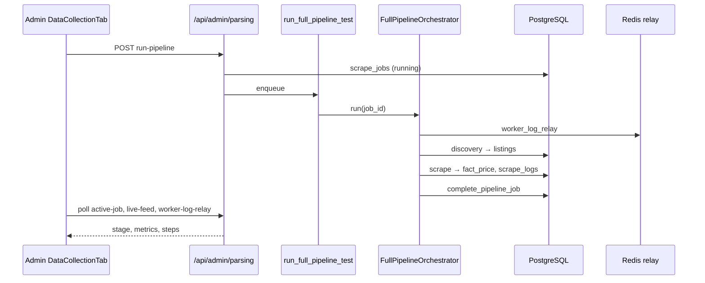

# Imperecta — общее описание проекта и архитектура

**Актуально на:** 2026-05-28  
**Назначение:** единый контекстный документ для разработки, онбординга и Cursor. Описывает продукт, топологию, потоки данных и связи между подсистемами.

---

## 1. Продукт

**Imperecta** — SaaS-платформа мониторинга и аналитики для e-commerce. Пользователи отслеживают свои товары и конкурентов на маркетплейсах, получают рыночные виджеты, алерты, дайджесты и AI-ассистента.

| Возможность | Реализация (высокий уровень) |
|-------------|------------------------------|
| Сбор данных с маркетплейсов | Discovery URL → scrape → `fact_listing` / `fact_price` |
| Пользовательский каталог | `user_products`, импорт CSV/XLS, связь с пулом |
| Глобальный пул | `product_pool`, поиск и статистика по `dim_product` / `fact_listing` |
| Рыночные данные | Forex, crypto, commodities, fuel → отдельные fact-таблицы |
| Дашборд и аналитика | KPI, сравнения, прогнозы |
| Алерты и дайджесты | Правила + Celery (часть задач — stubs) |
| AI-аналитик | Claude API, сессии чата, entitlement по плану |
| Админ-панель | Суперюзер: обзор рынка, **Data Collection** (pipeline), пользователи |

**Принцип данных:** отсутствие критических полей не маскируется подставными значениями (нет fallback `USD`, `price=0`, `in_stock=True` в скрапере).

---

## 2. Топология развёртывания

Проект **не запускается локально** как production-like стек: проверка — через push в Git → Railway / Cloudflare.

```
┌─────────────────────┐     HTTPS      ┌──────────────────────────┐
│ Cloudflare Pages    │ ──────────────► │ Railway: FastAPI (backend)│
│ frontend/ (Vite SPA)│   /api/*        │ + Celery worker + beat    │
└─────────────────────┘                 └───────────┬──────────────┘
                                                    │
                    ┌───────────────────────────────┼───────────────────────────────┐
                    ▼                               ▼                               ▼
           ┌────────────────┐              ┌────────────────┐              ┌────────────────┐
           │ Supabase       │              │ Upstash Redis  │              │ Внешние API    │
           │ PostgreSQL     │              │ Celery broker  │              │ Decodo, Claude,│
           │ (star schema)  │              │ + log relay    │              │ market data…   │
           └────────────────┘              └────────────────┘              └────────────────┘
```

| Компонент | Путь / сервис | Роль |
|-----------|---------------|------|
| Frontend | `frontend/` → Cloudflare Pages | React 19 SPA, `VITE_API_URL` → backend |
| API | `backend/app/main.py` → Railway | FastAPI, префикс `/api` |
| Workers | `backend/app/workers/` → Railway | Celery: scraper, market_data, cleanup, maintenance |
| БД | Supabase Postgres | Схема `public` + `alembic_meta` |
| Очередь | Upstash Redis | Broker; result backend отключён |
| Конфиг | Корневой `.env` | `DATABASE_URL`, `REDIS_URL`, JWT, ключи API |

---

## 3. Структура репозитория

```
imperecta/
├── frontend/                 # React + TypeScript + Vite
├── backend/
│   ├── app/
│   │   ├── main.py           # lifespan, роутеры
│   │   ├── config.py         # Settings (pydantic-settings)
│   │   ├── database.py       # async engine + sync_session_factory
│   │   ├── models/           # ORM: core, dimensions, facts, app_tables
│   │   ├── modules/          # доменная логика (источник истины)
│   │   ├── workers/          # celery_app, scheduler, cleanup, maintenance
│   │   └── entitlements/     # планы и лимиты
│   └── alembic/versions/     # миграции 001…012
├── Imperecta_Architecture.md # этот файл
├── Imperecta_Backend.md
├── Imperecta_Frontend.md
├── Imperecta_Database.md
└── Imperecta_Parsing.md
```

Детали по слоям — в отдельных файлах. Legacy-плоские каталоги `app/api/`, `app/services/` **удалены**; поведение задаётся только `app/modules/*`.

---

## 4. Backend: модульная карта

Все домены — `backend/app/modules/<domain>/` с типичным набором `api.py`, `service.py`, `schemas.py`, `tasks.py`.

| Модуль | Ответственность |
|--------|-----------------|
| `core` | JWT auth, bootstrap superuser, admin stats, Telegram webhook, очистка пула |
| `admin` | Parsing control plane: pipeline runs, users CRUD, live feed, worker log relay |
| `marketplaces` | CRUD `dim_marketplace`, квоты |
| `scraper` | Discovery, scrape, extractors, Celery, `pipeline/` orchestrator |
| `product_pool` | Публичный пул: поиск, категории, stats |
| `user_products` | Товары пользователя, импорт |
| `market_data` | Ingestion forex/crypto/commodities/fuel |
| `dashboard` | KPI, markets overview |
| `analytics` | История, сравнения, прогнозы |
| `alerts` | Правила и события (API есть, роутер в `main.py` не подключён) |
| `digests` | Дайджесты (генерация частично stub) |
| `ai_analyst` | AI chat, Claude, api_logs |

**Подключённые роутеры** (`main.py`, prefix `/api`): admin, admin/parsing, auth, telegram, admin/marketplaces, pool, markets, dashboard, products, import, analytics, digests, ai.

**Не подключены в `main.py` (код есть):** `alerts/api.py`, `scraper/api.py` (legacy admin scrape), `user_products/api_competitors.py`.

---

## 5. Жизненный цикл приложения (backend startup)

`backend/app/main.py` → `lifespan`:

1. **`alembic upgrade head`** — subprocess, timeout 600s, ошибки в лог.
2. **`ensure_superuser`** — bootstrap admin из `Settings` (до 10 попыток).
3. **`Base.metadata.create_all`** — safety net после миграций.
4. **Telegram webhook** — фоновая задача `setWebhook` на `{app_url}/api/telegram/webhook`.

Дополнительно при импорте: **Sentry** если задан `sentry_dsn`.

Health: `GET /health`, `GET /api/health` (DB + Redis + pool stats).

---

## 6. Потоки данных (сквозные сценарии)

### 6.1 Обычный пользователь

1. Frontend → `POST /api/auth/login` → JWT access + refresh.
2. Защищённые маршруты: `Authorization: Bearer`, React Query к `/api/products`, `/api/dashboard`, …
3. Добавление товара → `user_products` + при необходимости привязка к `dim_product` / listing в пуле.

### 6.2 Admin Data Collection (full pipeline test)

1. Superuser → `POST /api/admin/parsing/run-pipeline` → создаётся `scrape_jobs` (type `full_pipeline_test`).
2. Celery `run_full_pipeline_test` → `FullPipelineOrchestrator`:
   - **discovery** — `discovery_phase.run_discovery_phase`
   - **scrape** — batch по `fact_listing`
   - **completion** — `job_completion.complete_pipeline_job`
3. Метаданные job в JSONB (`PipelineMetadataStore`): stage, heartbeat, counters, celery_task_id.
4. UI polling: `active-job`, `job-status/{id}`, `job-live-feed/{id}`, `worker-log-relay`.
5. Worker logs → Redis key `pipeline:worker_deploy_log` → admin terminal panel.

### 6.3 Market data ingestion

- Задача `ingest_market_data` (Celery) → providers в `market_data/providers/` → `fact_currency_rate`, `fact_crypto_price`, и т.д.
- Ручной trigger с фронта: admin overview → ingest markets.

---

## 7. Workers и расписание

**Celery app:** `backend/app/workers/celery_app.py`  
**Include:** scraper, alerts, digests, market_data, cleanup, maintenance.

**Beat schedule:** `scheduler.py` → `celery_app.conf.beat_schedule = {}` — автоматические cron-задачи **намеренно отключены**. Pipeline и scrape запускаются вручную (admin API) или явным enqueue.

Основные задачи: см. `Imperecta_Backend.md` и `Imperecta_Parsing.md`.

---

## 8. База данных (кратко)

- **Паттерн:** star schema (`dim_*`, `fact_*`) + операционные таблицы (users, alerts, scrape_jobs, …).
- **Ключ идентичности листинга:** `fact_listing.url_hash` (SHA256 нормализованного URL).
- **История цен:** `fact_price`, партиционирование по `date_id` (YYYYMMDD).
- **Диагностика скрапа:** `scrape_logs` на каждую попытку; статусы включая `no_change`, `technical_error`.
- **Миграции:** цепочка `001` … `012` (head: `012_enable_rls_public_tables`).
- **Alembic version:** схема `alembic_meta.alembic_version`.

Подробно: `Imperecta_Database.md`.

---

## 9. Frontend (кратко)

- **Stack:** React 19, TypeScript, Vite 6, React Router 7, TanStack Query 5, Tailwind 4, shadcn/ui, Zustand (только auth).
- **Маршруты:** публичный лендинг `/ai.market.intelligence.agent`, auth, dashboard shell с `/dashboard`, `/products`, `/analytics`, `/ai`, `/admin` (superuser).
- **Admin tabs:** Market Overview | Data Collection | Users Management.
- **i18n:** 8 языков; русский только для superuser.

Подробно: `Imperecta_Frontend.md`.

---

## 10. Безопасность и доступ

| Слой | Механизм |
|------|----------|
| API | JWT (access/refresh), `get_current_user` / `get_current_superuser` |
| Admin parsing | Все `/api/admin/parsing/*` — только superuser |
| Supabase RLS | Migration `012` — RLS на public-таблицах (defense in depth); backend подключается как owner и обходит RLS |
| CORS | `allowed_origins` из Settings |
| Frontend | DOMPurify для markdown; HTTPS upgrade API URL на HTTPS-странице |

---

## 11. Конфигурация окружения

Источник: `backend/app/config.py` (класс `Settings`, корневой `.env`).

**Обязательно:** `DATABASE_URL`, `REDIS_URL`, JWT secret/algorithm, переменные приложения.

**Нормализация:** `postgresql://` (Supabase) → `postgresql+asyncpg://` для async SQLAlchemy.

**Scraper tuning:** `discovery_max_pages_per_run`, `scrape_pool_batch_size`, `scrape_pool_max_listings_per_run`, Decodo/proxy keys.

**Bootstrap admin:** пара `bootstrap_admin_email` + `bootstrap_admin_password` (оба или ни одного).

---

## 12. CI/CD и эксплуатация

- Изменения → commit → push → Railway деплоит backend/workers, Cloudflare — frontend.
- E2E: Playwright (`frontend/`).
- Локальный `docker-compose.yml` существует, но **не** является основным способом проверки по правилам проекта.

---

## 13. Диаграмма: full pipeline (admin)



---

## 14. Карта документации

| Файл | Содержание |
|------|------------|
| `Imperecta_Architecture.md` | Продукт, топология, потоки, связи (этот файл) |
| `Imperecta_Backend.md` | FastAPI, модули, Celery, config, API |
| `Imperecta_Frontend.md` | React, маршруты, admin UI, hooks |
| `Imperecta_Database.md` | Схема, миграции, RLS, integrity rules |
| `Imperecta_Parsing.md` | Discovery, scrape, extractors, pipeline |

**Cursor rules:** `.cursor/rules/backend.mdc`, `frontend.mdc`, `database.mdc`, `scraper.mdc`, `git-ci-deploy.mdc`.

---

## 15. Текущий фокус разработки (2026-05-28)

- Production orchestrator: `scraper/pipeline/orchestrator.py` вместо ad-hoc цепочек в tasks.
- Observability: `activity_pulse.py` (heartbeat в metadata), `worker_log_relay.py` (Redis → admin UI).
- Listing lifecycle: `is_active`, `last_price_changed_at`, статус `no_change` в `scrape_logs`.
- Universal discovery columns на `dim_marketplace` (migration `010`).
- Admin UI: live monitor с Discovery / Scrape / Summary tabs и `WorkerLogRelayPanel`.
