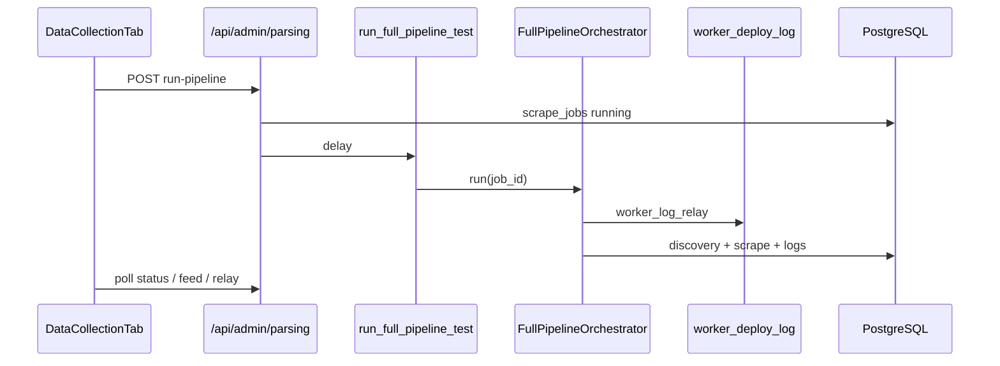
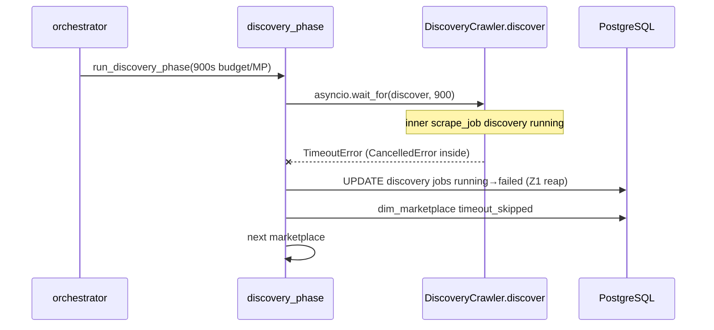

# Imperecta — общее описание проекта и архитектура

**Актуально на:** 2026-06-07 (ветка `main`, head `e2369b8`)  
**Назначение:** единый контекст для разработки, онбординга и Cursor.

---

## 1. Продукт

**Imperecta** — SaaS-платформа мониторинга и аналитики e-commerce.

| Возможность | Реализация |
|-------------|------------|
| Сбор с маркетплейсов | Discovery → scrape → `fact_listing` / `fact_price` |
| Каталог пользователя | `user_products`, импорт CSV/XLS |
| Глобальный пул | `product_pool`, поиск по `dim_product` / `fact_listing` |
| Рыночные виджеты | Forex, crypto, commodities, fuel |
| Display currency | `local` / `EUR` / `USD` — `fact_currency_rate` + live forex; **local** = TLD→country→currency (`marketplace_locale.py`) |
| Дашборд и аналитика | KPI, **Markets product catalog** (`/dashboard`), сравнения, прогнозы |
| Алерты и дайджесты | Celery (часть задач — stubs) |
| AI-аналитик | Claude; entitlement по плану (`business` / `pro` / `enterprise`) |
| Админка | Superuser: Market Overview, **Data Collection**, **Users Management** |

**Принципы:**

- **Данные:** критические поля не подменяются фейковыми значениями; `fact_price` — через **persistence gate** (имя, цена, валюта, whitelist, sanity `currency_raw`).
- **Универсальность:** парсинг и discovery **без привязки к конкретным магазинам**. Классификация PDP — **`classify_page_role_for_discovery`** (og:type → JSON-LD → structural fallback) в discovery **и** в `merge_and_finalize` при scrape. `classify_page_role` — только Layer 3 fallback. Без URL-regex по языку/домену.

---

## 2. Топология развёртывания

Локальный production-like стек **не используется** для проверки: push → Git → Railway / Cloudflare.

```
Cloudflare Pages (frontend)
        │  HTTPS  /api/*
        ▼
Railway: FastAPI + Celery worker + Celery beat
        │
        ├── Supabase PostgreSQL
        ├── Upstash Redis (broker, worker log relay; result backend OFF)
        └── Внешние API (Decodo, Claude, market data, Telegram)
```

| Сервис | Путь / хостинг |
|--------|----------------|
| Frontend | `frontend/` → Cloudflare Pages, `VITE_API_URL` |
| API | `backend/app/main.py` → Railway |
| Workers | `backend/app/workers/` → Railway |
| БД | Supabase Postgres |
| Broker | Upstash `rediss://` (SSL options в `celery_app.py`) |

Конфигурация: корневой `.env` (`DATABASE_URL`, `REDIS_URL`, JWT, ключи API).

---

## 3. Структура репозитория

```
imperecta/
├── frontend/                 # React 19 + Vite 6
├── backend/
│   ├── app/main.py
│   ├── app/config.py
│   ├── app/database.py
│   ├── app/models/
│   ├── app/modules/          # доменная логика
│   ├── app/workers/
│   └── alembic/versions/     # 001 … 019 (head tracked); 020 WIP
├── Imperecta_Architecture.md
├── Imperecta_Backend.md
├── Imperecta_Frontend.md
├── Imperecta_Database.md
├── Imperecta_Parsing.md
└── Imperecta_File_Structure.md
```

Legacy `app/api/`, `app/services/` удалены.

---

## 4. Backend — карта модулей

| Модуль | Роль |
|--------|------|
| `core` | Auth, bootstrap superuser, admin stats, Telegram webhook |
| `admin` | Parsing control plane + admin user CRUD |
| `marketplaces` | `dim_marketplace` |
| `scraper` | Discovery, scrape, `pipeline/` orchestrator |
| `product_pool` | Публичный пул |
| `user_products` | Товары, импорт |
| `market_data` | Ingestion + API рынков |
| `dashboard`, `analytics` | Агрегаты |
| `alerts`, `digests` | Частично stubs |
| `ai_analyst` | Claude chat |

**Роутеры в `main.py`:** admin, admin/parsing, auth, telegram, admin/marketplaces, pool, markets, dashboard, products, import, analytics, digests, ai.

**Не в `main.py`:** `alerts/api`, `scraper/api`, `user_products/api_competitors`.

---

## 5. Startup (lifespan)

1. `alembic upgrade head` (subprocess, 600s, warn on fail)  
2. `ensure_superuser` (до 10 retry)  
3. `Base.metadata.create_all` (safety net)  
4. Telegram `setWebhook` в фоне  

Health: `GET /health`, `GET /api/health` (DB, Redis, pool stats).

---

## 6. Планы и entitlements

**UserPlan (DB):** `trial`, `starter`, `business`, `pro`, `enterprise`.

| Plan | Service tier | AI Analyst | Лимит products (код) |
|------|--------------|------------|----------------------|
| trial | TRIAL | нет | 999 (14 дней trial) |
| starter | FREE | нет | 50 |
| business, pro, enterprise | PAID_FULL | да | 999 |

Источник: `backend/app/entitlements/plan.py`. Admin UI создаёт пользователей с любым из планов.

---

## 7. Сквозные потоки

### 7.1 Пользователь

Login → JWT → React Query → `/api/products`, `/api/dashboard`, …

### 7.2 Admin full pipeline

1. `POST /api/admin/parsing/run-pipeline` → `scrape_jobs` (`full_pipeline_test`); опционально `{ marketplace_codes: [...] }`.  
2. Celery `run_full_pipeline_test` → `FullPipelineOrchestrator`.  
3. **Discovery** — `run_discovery_phase(..., marketplace_codes)` из metadata.  
4. **Scrape** — `_run_scrape_all_pool(..., marketplace_codes)`; при scoped run SELECT только listings с `dim_marketplace.marketplace_code IN (...)`. Без scope — весь active pool (standalone task `scrape_all_pool_products`).  
5. `complete_pipeline_job` → UI polling (`active-job`, `job-status`, `job-live-feed`, `worker-log-relay`).  
6. Stale jobs: auto-fail при idle >30 min (`ParsingAdminService`).

### 7.3 Discovery (content-aware sitemap + cooperative budget)

`DiscoveryCrawler` (`discovery.py`) — три фазы + **cooperative deadline** (`4bad080`, `4d42623`):

| Фаза | Метод | Суть |
|------|-------|------|
| 0 | `_phase0_sitemap_harvest` | XML sitemap → `classify_page_role_for_discovery` → только PDP URLs |
| 1 | `_phase1_category_recon` | BFS по hub/listing, кэш `discovered_category_urls` |
| 2 | `_phase2_product_harvest` | Обход category pages, pagination, save listings |

Если sitemap дал ≥10 product URLs — **sitemap path** (resumable offset, `016`); иначе category crawl с Phase 2 budget (`017`/`018` resume).  
При нехватке 15 min budget — `partial_budget` / inner job `partial` (`019`); следующий run продолжает.  
Sitemap: sample/trust/reject thresholds (80% / 20%), concurrency 8, bad harvest retry через 1h.

Подробно: `Imperecta_Parsing.md`.

### 7.4 Tiered scrape strategy (foundation)

На `dim_marketplace` поле **`scrape_tier`** (1 | 2 | 3, default **1**):

| Tier | Назначение (план) | Статус в коде |
|------|-------------------|---------------|
| 1 | Server-rendered: **httpx → Decodo → Playwright** (httpx-first) | **Реализован** (`_layer_order`) |
| 2 | SPA: network interception + basic stealth | `NotImplementedError` |
| 3 | Hostile: full stealth + residential sticky + LLM | `NotImplementedError` |

`GlobalScrapeService` передаёт `marketplace.scrape_tier` в `ScraperPool.scrape_product`. Tier 2/3 в БД допустимы, но вызов упадёт явно — без silent fallback на tier 1.

Подробно: `Imperecta_Parsing.md`, `Imperecta_Database.md`.

### 7.5 Display currency (EUR/USD)

1. Frontend: `display_currency` в query (`local` \| `EUR` \| `USD`).  
2. Backend: `CurrencyConverter.load_latest` — `fact_currency_rate` → fallback live forex.  
3. Ответ: `display_price`, `display_currency`, `conversion_available`; без rate — local + `conversion_available=false`.

Модули: `app/common/currency.py`, products/pool/dashboard API.

### 7.6 Качество scrape (P0)

`GlobalScrapeService` перед `fact_price`:

- product name / title  
- price > 0  
- currency non-empty  
- `len(currency_raw) < 50`  
- валюта в whitelist маркетплейса (страна + EUR/USD + `scraper_config.allowed_currencies`)  
- `no_change` если цена/валюта/stock не изменились  
- после **15** подряд ошибок → `fact_listing.is_active = false`

Подробно: `Imperecta_Parsing.md`.

---

## 8. Workers

- **Beat:** `orphan-job-reaper` (300s), `ensure_fact_price_partitions` (daily), `refresh_materialized_views` (hourly), `cleanup_old_data` (03:00). Discovery/scrape cron **выключен** — только manual API.  
- **Result backend:** `None` (экономия Upstash).  
- Задачи: scraper, `reap_orphan_jobs`, market_data, cleanup, maintenance, stubs (alerts/digests).

---

## 9. База данных (кратко)

- Star schema + app tables.  
- Head migration (tracked): `019_scrape_jobs_status_allow_partial`; WIP `020` `parent_job_id`. Resumable discovery: `016`–`018` on `dim_marketplace`.
- `fact_price` partitioned by `date_id` (`fact_price_YYYYMM` + **`fact_price_default`** safety partition).
- Без партиции на текущий месяц INSERT в `fact_price` падает (`no partition found for row`).
- `url_hash` unique на `fact_listing`.

Подробно: `Imperecta_Database.md`.

---

## 10. Frontend (кратко)

- React 19, Router 7, TanStack Query, Zustand (`authStore`, **`displayCurrencyStore`**).  
- **Dashboard:** `MarketsOverviewSection` — каталог товаров пула (поиск, сортировка, `DisplayCurrencySelector`, `PriceDisplay`).  
- **Admin:** три таба; Data Collection с live monitor; `PipelineStatusPanel` + `usePipelineStatus` (5s poll); Users Management CRUD.  
- i18n: 8 языков; русский только superuser.

Подробно: `Imperecta_Frontend.md`.

---

## 11. Безопасность

| Слой | Механизм |
|------|----------|
| API | JWT, superuser для admin |
| Telegram | Обязателен `TELEGRAM_WEBHOOK_SECRET` при bot token |
| Supabase | RLS на public (012); backend bypass как owner |
| Frontend | DOMPurify, HTTPS upgrade API URL |

---

## 12. Диаграмма: admin pipeline



---

## 13. Недавние изменения (ориентир для контекста)

| Коммит / область | Суть |
|------------------|------|
| `4d42623` Phase2 cooperative deadline | `_headroom_deadline` + budget checks в category crawl; `partial_budget` на category path |
| `4bad080` Resumable sitemap | Cooperative deadline + `sitemap_resume_offset`; `partial_budget` на sitemap path |
| `4430907` Batch save URLs | `_save_product_urls` commit every 500 |
| `5d6d4fa` Microdata classifier | Layer 2.5 `itemscope`/`itemtype` в `classify_page_role_for_discovery` |
| `3309259` Harvest convergence | `CATEGORY_CONVERGENCE_STREAK=3` early exit Phase 2 |
| `e25dbac` Z1 reap | Zombie inner discovery jobs on hard cancel |
| `d221ae7` Discovery timeouts | 300s sitemap / 900s per-MP / 24h sitemap cooldown |
| `4338e5c` discount_pct | `_calculate_discount_pct` at `fact_price` insert |
| `0fb6ac2` Local currency | `marketplace_locale.py` + `local_currency_resolution` in API |
| `c8f464b` Price formatting | `formatPrice` always 2 fraction digits |
| `3d1eb66` Live forex fallback | `CurrencyConverter`: `fact_currency_rate` → live `fetch_forex_rates` |
| `fced191` Display currency API | `display_currency` query на products/pool/dashboard; `app/common/currency.py` |
| `7f16333` Markets catalog UI | Redesign `MarketsOverviewSection` — product catalog на dashboard |
| `b6610ea` Display currency UI + httpx-first | `PriceDisplay`, Zustand store; Tier 1 httpx → decodo → playwright |
| `a3100e5` Scoped scrape + classifier | `marketplace_codes` в scrape; `merge_and_finalize` → schema-aware classifier |
| `6701bba` fact_price partitions | `015`: Jun–Dec 2026 monthly + `fact_price_default` |
| `e286053` Tiered scrape | `dim_marketplace.scrape_tier`; `ScraperPool._layer_order`; tier 1 only |
| `5c1324b` Schema-aware classifier | `classify_page_role_for_discovery`: og:type + JSON-LD layers, DOM fallback |
| `7fa0d0b` Sitemap filter | Content-aware sample/trust/reject для sitemap URLs |
| `1f024b1` Generic platform | Удалены store-specific refs; migration `013`; scoped pipeline tests |
| `cab086f` P0 scrape guards | Persistence gate, currency whitelist, deactivate after 15 errors |
| `98e2e89` Admin CRUD | Users Management: create/edit/role/password/delete |
| `4cd33d3` Worker log relay | Redis `pipeline:worker_deploy_log` → admin terminal |
| `e2369b8` Orphan reaper + pipeline status | `reap_orphan_jobs` Beat 300s; `GET /pipeline-status`; `PipelineStatusPanel` |
| `019` partial job status | Inner discovery `status=partial` when budget exhausted with progress |
| `017`–`018` resumable Phase 1/2 | `recon_frontier_state`, `category_resume_index` on `dim_marketplace` |
| WIP γ-orchestrator | `020` `parent_job_id`; `discover_one_marketplace`; `child_aggregation` |

---

## 15. Детальная логика элементов (сквозной индекс)

Каждый элемент: **где живёт** → **что делает** → **с кем связан**. Полные алгоритмы — в профильных документах.

### 15.1 Pipeline & parsing (см. `Imperecta_Parsing.md` §18)

| Элемент | Где живёт | Суть |
|---------|-----------|------|
| **Z1 reap** | `pipeline/discovery_phase.py` | Defense-in-depth: inner `discovery` jobs `running→failed` при внешней отмене; **не** в cancellation/job_completion |
| **Resumable sitemap** | `discovery.py` + `016` | `sitemap_resume_offset` + cooperative deadline; `partial_budget` |
| **Phase2 cooperative deadline** | `discovery.py` `_phase2_product_harvest` | `_headroom_deadline`; `exhausted_budget` → `partial_budget` |
| **Batch save** | `discovery.py` `_save_product_urls` | Commit каждые 500 URL + resume index |
| **Parent cancel check** | `pipeline/cancellation.py` | `is_pipeline_job_cancelled` между MP |
| **Job finalize** | `pipeline/job_completion.py` | Merge discovery seed + `scrape_logs` → parent metadata |
| **Orchestrator** | `pipeline/orchestrator.py` | discovery → scrape → complete; relay context |
| **Metadata heartbeat** | `pipeline/metadata_store.py`, `activity_pulse.py` | JSONB progress + anti-stale pulses |
| **Worker logs** | `pipeline/worker_log_relay.py` | Redis 500 lines → admin terminal |
| **Stale parent jobs** | `admin/parsing_admin.py` | Auto-fail idle 5/10/30 min on API read |
| **Orphan reaper** | `workers/reaper_tasks.py` | Beat: fail stuck `running` after deploy/SIGTERM |
| **Pipeline status API** | `parsing_admin.get_pipeline_status` | running → latest terminal → idle; `partial`→`completed` for UI |
| **γ-orchestrator (WIP)** | `child_aggregation`, `discover_one_marketplace` | Child jobs per MP; aggregate for `complete_pipeline_job` |
| **Admin cancel** | `parsing_admin.py` + `cancellation.revoke_celery_task` | Revoke Celery + mark parent failed |

### 15.2 Backend runtime (см. `Imperecta_Backend.md` §14)

| Элемент | Где живёт | Суть |
|---------|-----------|------|
| **Lifespan** | `main.py` | Alembic → superuser → create_all → Telegram webhook |
| **Auth JWT** | `core/api_auth.py`, `core/service` | Register/login/refresh; Bearer middleware |
| **Display currency** | `common/currency.py`, `marketplace_locale.py` | `fact_currency_rate` → live forex; local = TLD resolution |
| **Tiered fetch** | `scraper_pool.py` `_layer_order` | Tier 1 only: httpx → decodo/playwright |
| **Persistence gate** | `scraper/service.py` | P0 guards before `fact_price` |
| **Celery broker** | `workers/celery_app.py` | Redis, no result backend |
| **Partitions** | `workers/maintenance_tasks.py` | Rolling `fact_price_YYYYMM` +3 months |

### 15.3 Database (см. `Imperecta_Database.md` §13)

| Элемент | Таблица / объект | Суть |
|---------|------------------|------|
| **Listing identity** | `fact_listing.url_hash` | SHA256 dedup |
| **Price snapshots** | `fact_price` partitions | One row/listing/day; monthly RANGE + DEFAULT |
| **Job metadata** | `scrape_jobs.config.metadata` | Pipeline stage, timings, per_marketplace |
| **Scrape audit** | `scrape_logs` | Per-listing outcome + status taxonomy |
| **MP scrape config** | `dim_marketplace` | `scrape_tier`, `scraper_config`, `sitemap_resume_offset`, discovery columns |
| **RLS** | migration 012 | PostgREST guard; backend owner bypass |

### 15.4 Frontend (см. `Imperecta_Frontend.md` §20)

| Элемент | Где живёт | Суть |
|---------|-----------|------|
| **Session/auth** | `authStore`, `setupAuth.ts` | JWT + refresh on 401 |
| **Display currency UI** | `displayCurrencyStore`, `PriceDisplay` | Query param → backend conversion |
| **Data Collection** | `DataCollectionTab.tsx` | Pipeline run/monitor/history; stale badge 300s |
| **Pipeline status** | `PipelineStatusPanel.tsx`, `usePipelineStatus` | Poll `/pipeline-status` 5s; progress badge |
| **Worker terminal** | `WorkerLogRelayPanel.tsx` | Poll relay 2s, buffer 120 lines |
| **Markets catalog** | `MarketsOverviewSection.tsx` | Pool browse + currency + `formatMarketplaceLabel` |
| **Marketplace labels** | `lib/marketplaceLabel.ts` | Country suffix for local TLD stores; intl .com without suffix |
| **Admin users** | `AdminPage` Users tab | CRUD via `useAdmin` hooks |

### 15.5 Диаграмма: Z1 reap в контексте discovery



---

## 16. Карта документации

| Файл | Содержание |
|------|------------|
| `Imperecta_Architecture.md` | Продукт, топология, потоки (этот файл) |
| `Imperecta_Backend.md` | FastAPI, Celery, модули, API |
| `Imperecta_Frontend.md` | React, admin UI, hooks |
| `Imperecta_Database.md` | Схема, миграции, RLS |
| `Imperecta_Parsing.md` | Discovery, scrape, pipeline, quality gates |
| `Imperecta_File_Structure.md` | Полная карта файлов репозитория (472 tracked) |

**Cursor rules:** `.cursor/rules/*.mdc` (backend, frontend, database, scraper, git-ci-deploy).
