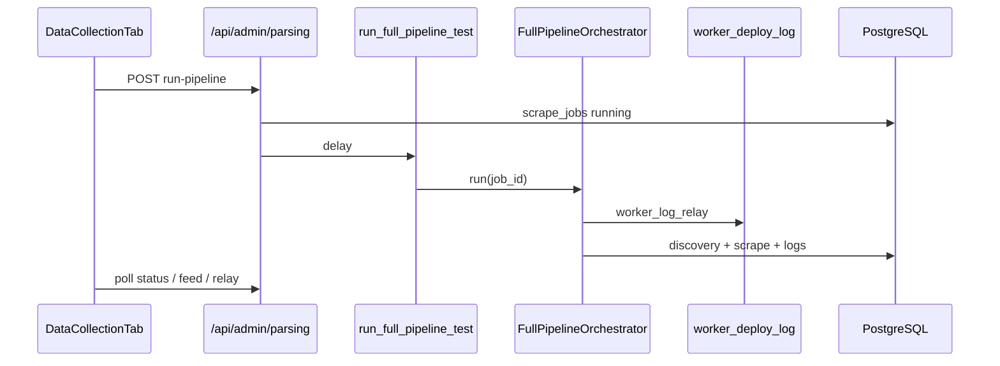

# Imperecta — общее описание проекта и архитектура

**Актуально на:** 2026-06-03 (ветка `main`, head `6701bba` + рабочие правки scraper/orchestrator)  
**Назначение:** единый контекст для разработки, онбординга и Cursor.

---

## 1. Продукт

**Imperecta** — SaaS-платформа мониторинга и аналитики e-commerce.

| Возможность | Реализация |
|-------------|------------|
| Сбор с маркетплейсов | Discovery → scrape → `fact_listing` / `fact_price` |
| Каталог пользователя | `user_products`, импорт CSV/XLS |
| Глобальный пул | `product_pool`, поиск по `dim_product` / `fact_listing` |
| Рыночные виджеты | Forex, crypto, commodities, fuel |
| Дашборд и аналитика | KPI, сравнения, прогнозы |
| Алерты и дайджесты | Celery (часть задач — stubs) |
| AI-аналитик | Claude; entitlement по плану (`business` / `pro` / `enterprise`) |
| Админка | Superuser: Market Overview, **Data Collection**, **Users Management** |

**Принципы:**

- **Данные:** критические поля не подменяются фейковыми значениями; `fact_price` — через **persistence gate** (имя, цена, валюта, whitelist, sanity `currency_raw`).
- **Универсальность:** парсинг и discovery **без привязки к конкретным магазинам**. Классификация PDP — **`classify_page_role_for_discovery`** (og:type → JSON-LD → structural fallback) в discovery **и** в `merge_and_finalize` при scrape. `classify_page_role` — только Layer 3 fallback. Без URL-regex по языку/домену.

---

## 2. Топология развёртывания

Локальный production-like стек **не используется** для проверки: push → Git → Railway / Cloudflare.

```
Cloudflare Pages (frontend)
        │  HTTPS  /api/*
        ▼
Railway: FastAPI + Celery worker + Celery beat
        │
        ├── Supabase PostgreSQL
        ├── Upstash Redis (broker, worker log relay; result backend OFF)
        └── Внешние API (Decodo, Claude, market data, Telegram)
```

| Сервис | Путь / хостинг |
|--------|----------------|
| Frontend | `frontend/` → Cloudflare Pages, `VITE_API_URL` |
| API | `backend/app/main.py` → Railway |
| Workers | `backend/app/workers/` → Railway |
| БД | Supabase Postgres |
| Broker | Upstash `rediss://` (SSL options в `celery_app.py`) |

Конфигурация: корневой `.env` (`DATABASE_URL`, `REDIS_URL`, JWT, ключи API).

---

## 3. Структура репозитория

```
imperecta/
├── frontend/                 # React 19 + Vite 6
├── backend/
│   ├── app/main.py
│   ├── app/config.py
│   ├── app/database.py
│   ├── app/models/
│   ├── app/modules/          # доменная логика
│   ├── app/workers/
│   └── alembic/versions/     # 001 … 015 (head: fact_price partitions)
├── Imperecta_Architecture.md
├── Imperecta_Backend.md
├── Imperecta_Frontend.md
├── Imperecta_Database.md
└── Imperecta_Parsing.md
```

Legacy `app/api/`, `app/services/` удалены.

---

## 4. Backend — карта модулей

| Модуль | Роль |
|--------|------|
| `core` | Auth, bootstrap superuser, admin stats, Telegram webhook |
| `admin` | Parsing control plane + admin user CRUD |
| `marketplaces` | `dim_marketplace` |
| `scraper` | Discovery, scrape, `pipeline/` orchestrator |
| `product_pool` | Публичный пул |
| `user_products` | Товары, импорт |
| `market_data` | Ingestion + API рынков |
| `dashboard`, `analytics` | Агрегаты |
| `alerts`, `digests` | Частично stubs |
| `ai_analyst` | Claude chat |

**Роутеры в `main.py`:** admin, admin/parsing, auth, telegram, admin/marketplaces, pool, markets, dashboard, products, import, analytics, digests, ai.

**Не в `main.py`:** `alerts/api`, `scraper/api`, `user_products/api_competitors`.

---

## 5. Startup (lifespan)

1. `alembic upgrade head` (subprocess, 600s, warn on fail)  
2. `ensure_superuser` (до 10 retry)  
3. `Base.metadata.create_all` (safety net)  
4. Telegram `setWebhook` в фоне  

Health: `GET /health`, `GET /api/health` (DB, Redis, pool stats).

---

## 6. Планы и entitlements

**UserPlan (DB):** `trial`, `starter`, `business`, `pro`, `enterprise`.

| Plan | Service tier | AI Analyst | Лимит products (код) |
|------|--------------|------------|----------------------|
| trial | TRIAL | нет | 999 (14 дней trial) |
| starter | FREE | нет | 50 |
| business, pro, enterprise | PAID_FULL | да | 999 |

Источник: `backend/app/entitlements/plan.py`. Admin UI создаёт пользователей с любым из планов.

---

## 7. Сквозные потоки

### 7.1 Пользователь

Login → JWT → React Query → `/api/products`, `/api/dashboard`, …

### 7.2 Admin full pipeline

1. `POST /api/admin/parsing/run-pipeline` → `scrape_jobs` (`full_pipeline_test`); опционально `{ marketplace_codes: [...] }`.  
2. Celery `run_full_pipeline_test` → `FullPipelineOrchestrator`.  
3. **Discovery** — `run_discovery_phase(..., marketplace_codes)` из metadata.  
4. **Scrape** — `_run_scrape_all_pool(..., marketplace_codes)`; при scoped run SELECT только listings с `dim_marketplace.marketplace_code IN (...)`. Без scope — весь active pool (standalone task `scrape_all_pool_products`).  
5. `complete_pipeline_job` → UI polling (`active-job`, `job-status`, `job-live-feed`, `worker-log-relay`).  
6. Stale jobs: auto-fail при idle >30 min (`ParsingAdminService`).

### 7.3 Discovery (content-aware sitemap)

`DiscoveryCrawler` (`discovery.py`) — три фазы:

| Фаза | Метод | Суть |
|------|-------|------|
| 0 | `_phase0_sitemap_harvest` | XML sitemap → `classify_page_role_for_discovery` → только PDP URLs |
| 1 | `_phase1_category_recon` | BFS по hub/listing, кэш `discovered_category_urls` |
| 2 | `_phase2_product_harvest` | Обход category pages, pagination, save listings |

Если sitemap дал ≥10 product URLs — **sitemap path**; иначе category crawl.  
Sitemap: sample/trust/reject thresholds (80% / 20%), concurrency 8, bad harvest retry через 1h.

Подробно: `Imperecta_Parsing.md`.

### 7.4 Tiered scrape strategy (foundation)

На `dim_marketplace` поле **`scrape_tier`** (1 | 2 | 3, default **1**):

| Tier | Назначение (план) | Статус в коде |
|------|-------------------|---------------|
| 1 | Server-rendered: Decodo → httpx → Playwright | **Реализован** (`_layer_order`) |
| 2 | SPA: network interception + basic stealth | `NotImplementedError` |
| 3 | Hostile: full stealth + residential sticky + LLM | `NotImplementedError` |

`GlobalScrapeService` передаёт `marketplace.scrape_tier` в `ScraperPool.scrape_product`. Tier 2/3 в БД допустимы, но вызов упадёт явно — без silent fallback на tier 1.

Подробно: `Imperecta_Parsing.md`, `Imperecta_Database.md`.

### 7.5 Качество scrape (P0)

`GlobalScrapeService` перед `fact_price`:

- product name / title  
- price > 0  
- currency non-empty  
- `len(currency_raw) < 50`  
- валюта в whitelist маркетплейса (страна + EUR/USD + `scraper_config.allowed_currencies`)  
- `no_change` если цена/валюта/stock не изменились  
- после **15** подряд ошибок → `fact_listing.is_active = false`

Подробно: `Imperecta_Parsing.md`.

---

## 8. Workers

- **Beat:** `beat_schedule = {}` — cron отключён.  
- **Result backend:** `None` (экономия Upstash).  
- Задачи: scraper, market_data, cleanup, maintenance, stubs (alerts/digests).

---

## 9. База данных (кратко)

- Star schema + app tables.  
- Head migration: `015_fact_price_default_partition` (после `014` scrape_tier, `013` search_trend, `012` RLS).
- `fact_price` partitioned by `date_id` (`fact_price_YYYYMM` + **`fact_price_default`** safety partition).
- Без партиции на текущий месяц INSERT в `fact_price` падает (`no partition found for row`).
- `url_hash` unique на `fact_listing`.

Подробно: `Imperecta_Database.md`.

---

## 10. Frontend (кратко)

- React 19, Router 7, TanStack Query, Zustand (только auth).  
- Admin: три таба; Data Collection с live monitor и worker log terminal.  
- Users Management: полный CRUD (create/edit/role/status/password/delete).  
- i18n: 8 языков; русский только superuser.

Подробно: `Imperecta_Frontend.md`.

---

## 11. Безопасность

| Слой | Механизм |
|------|----------|
| API | JWT, superuser для admin |
| Telegram | Обязателен `TELEGRAM_WEBHOOK_SECRET` при bot token |
| Supabase | RLS на public (012); backend bypass как owner |
| Frontend | DOMPurify, HTTPS upgrade API URL |

---

## 12. Диаграмма: admin pipeline



---

## 13. Недавние изменения (ориентир для контекста)

| Коммит / область | Суть |
|------------------|------|
| *(рабочее дерево)* Scoped scrape + classifier | `marketplace_codes` в orchestrator → scrape SELECT; `merge_and_finalize` → `classify_page_role_for_discovery` |
| `6701bba` fact_price partitions | `015`: Jun–Dec 2026 monthly + `fact_price_default` (fix prod INSERT failures) |
| `e286053` Tiered scrape | `dim_marketplace.scrape_tier`; `ScraperPool._layer_order`; tier 1 only |
| `5c1324b` Schema-aware classifier | `classify_page_role_for_discovery`: og:type + JSON-LD layers, DOM fallback |
| `7fa0d0b` Sitemap filter | Content-aware sample/trust/reject для sitemap URLs |
| `1f024b1` Generic platform | Удалены store-specific refs; migration `013`; scoped pipeline tests |
| `cab086f` P0 scrape guards | Persistence gate, currency whitelist, deactivate after 15 errors |
| `98e2e89` Admin CRUD | Users Management: create/edit/role/password/delete |
| `4cd33d3` Worker log relay | Redis `pipeline:worker_deploy_log` → admin terminal |
| `a8295ad` Data Collection UI | Redesign monitor, history table, scoped marketplace run |

---

## 14. Карта документации

| Файл | Содержание |
|------|------------|
| `Imperecta_Architecture.md` | Продукт, топология, потоки (этот файл) |
| `Imperecta_Backend.md` | FastAPI, Celery, модули, API |
| `Imperecta_Frontend.md` | React, admin UI, hooks |
| `Imperecta_Database.md` | Схема, миграции, RLS |
| `Imperecta_Parsing.md` | Discovery, scrape, pipeline, quality gates |

**Cursor rules:** `.cursor/rules/*.mdc` (backend, frontend, database, scraper, git-ci-deploy).
