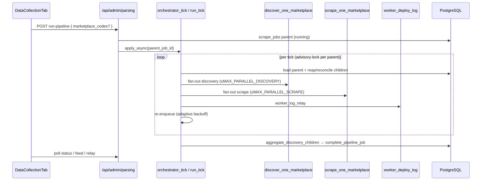
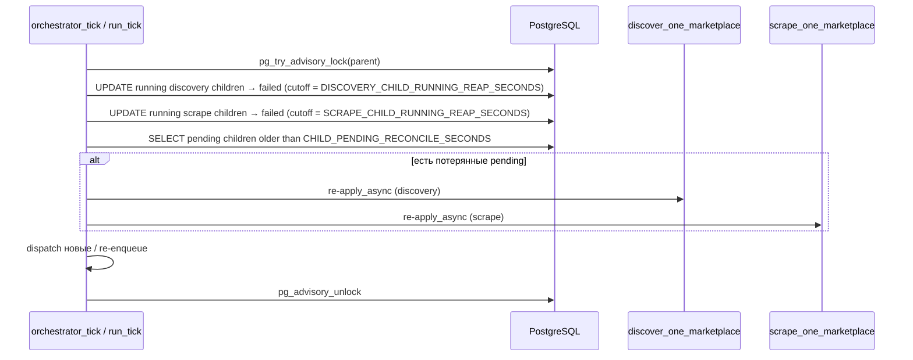

# Imperecta — общее описание проекта и архитектура

**Актуально на:** 2026-06-14 (ветка `main`, head `ff781a9`)  
**Назначение:** единый контекст для разработки, онбординга и Cursor.

> Архитектурные принципы — см. `ARCHITECTURE_PRINCIPLES.md` (immutable, не редактировать). Этот документ описывает реализацию; принципы не дублирует. Правило immutable: `.cursor/rules/architecture-principles-immutable.mdc` + `AGENTS.md`.

---

## 1. Продукт

**Imperecta** — SaaS-платформа мониторинга и аналитики e-commerce.

| Возможность | Реализация |
|-------------|------------|
| Сбор с маркетплейсов | Discovery → scrape → `fact_listing` / `fact_price` |
| Каталог пользователя | `user_products`, импорт CSV/XLS |
| Глобальный пул | `product_pool`, поиск по `dim_product` / `fact_listing` |
| Рыночные виджеты | Forex, crypto, commodities, fuel |
| Display currency | `local` / `EUR` / `USD` — `fact_currency_rate` + live forex; **local** = TLD→country→currency (`marketplace_locale.py`) |
| Дашборд и аналитика | KPI, **Markets product catalog** (`/dashboard`), сравнения, прогнозы |
| Алерты и дайджесты | Celery (часть задач — stubs) |
| AI-аналитик | Claude; entitlement по плану (`business` / `pro` / `enterprise`) |
| Админка | Superuser: Market Overview, **Data Collection**, **Users Management** |

**Принципы:**

- **Данные:** критические поля не подменяются фейковыми значениями; `fact_price` — через **persistence gate** (имя, цена, валюта, whitelist, sanity `currency_raw`).
- **Универсальность:** парсинг и discovery **без привязки к конкретным магазинам**. Классификация PDP — **`classify_page_role_for_discovery`** (og:type → JSON-LD → structural fallback) в discovery **и** в `merge_and_finalize` при scrape. `classify_page_role` — только Layer 3 fallback. Без URL-regex по языку/домену.

---

## 2. Топология развёртывания

Локальный production-like стек **не используется** для проверки: push → Git → Railway / Cloudflare.

```
Cloudflare Pages (frontend)
        │  HTTPS  /api/*
        ▼
Railway: FastAPI + Celery worker + Celery beat
        │
        ├── Supabase PostgreSQL
        ├── Upstash Redis (broker, worker log relay; result backend OFF)
        └── Внешние API (Decodo, Claude, market data, Telegram)
```

| Сервис | Путь / хостинг |
|--------|----------------|
| Frontend | `frontend/` → Cloudflare Pages, `VITE_API_URL` |
| API | `backend/app/main.py` → Railway |
| Workers | `backend/app/workers/` → Railway |
| БД | Supabase Postgres |
| Broker | Upstash `rediss://` (SSL options в `celery_app.py`) |

Конфигурация: корневой `.env` (`DATABASE_URL`, `REDIS_URL`, JWT, ключи API).

---

## 3. Структура репозитория

```
imperecta/
├── frontend/                 # React 19 + Vite 6
├── backend/
│   ├── app/main.py
│   ├── app/config.py
│   ├── app/database.py
│   ├── app/models/
│   ├── app/modules/          # доменная логика
│   ├── app/workers/
│   └── alembic/versions/     # 001 … 022 (head: scrape_jobs job_type allow scrape)
├── Imperecta_Architecture.md   # продукт, топология, карта файлов (Часть II)
├── Imperecta_Backend.md        # API, Celery, parsing (Часть II)
├── Imperecta_Frontend.md
├── Imperecta_Database.md       # миграции, RLS, полная схема (Часть II)
└── ARCHITECTURE_PRINCIPLES.md    # принципы (отдельный файл)
```

Legacy `app/api/`, `app/services/` удалены.

---

## 4. Backend — карта модулей

| Модуль (Tier-1) | Роль |
|--------|------|
| `core` | `api_admin` (`/admin/stats`, claude-status, clear-pool), `admin_service`, `pool_maintenance` — что осталось после выноса auth/users/telegram |
| `auth` | JWT issuance, register/login/refresh/me, password hashing; `decode_token` в Tier-0 `common/security.py` |
| `users` | Self-service `/users/me` + admin user CRUD `/admin/users/*`; plans (trial→enterprise), language, role |
| `telegram` | Webhook handler `/telegram/webhook`; secret-token verification |
| `entitlements` | `/entitlements` API surface — runtime feature flags по `UserPlan` (Tier-1); правила тарифов в `app/entitlements/plan.py` (Tier-0 enum) |
| `admin` | Parsing control plane (`/admin/parsing/*`) — `parsing_admin.py`, `api_parsing.py` |
| `marketplaces` | `dim_marketplace` CRUD, pool quotas |
| `scraper` | Discovery, scrape, `pipeline/` orchestrator (см. `Imperecta_Backend.md` §4.3) |
| `classifier` | Tier-1: PageRole классификация (`classify_page_role_for_discovery` использует слои JSON-LD/og/microdata/structural) — выделено как самостоятельный модуль (ARCHITECTURE_PRINCIPLES §10) |
| `ingestion` | Tier-1: persistence gate + write decision (`gate.py`, `service.py`, `dto.py`) — единственный владелец `fact_listing` / `fact_price` writes |
| `product_pool` | Публичный пул товаров; `/pool/*`, `/markets/overview` |
| `market_data` | Forex/crypto/commodities/fuel ingestion + `/markets/*` API |
| `ai_analyst` | Claude chat sessions; entitlement-gated |

**Роутеры в `main.py`:** `core.api_admin`, `admin.api_parsing`, `auth.api`, `users.self_router`, `users.admin_router`, `telegram.api`, `marketplaces.api`, `product_pool.api` (pool + markets_overview), `market_data.api`, `entitlements.api`, `ai_analyst.api` — всего 11 объединённых роутеров под единым `prefix="/api"` (`main.py:147-161`).

**Не в `main.py` (модули без HTTP-surface или с прямым background usage):** `scraper.api` (admin-internal/diagnostics), `classifier`, `ingestion` (внутренние Tier-1 контракты, вызываются из `scraper`).

**Удалены / в перестройке:** `analytics/`, `dashboard/`, `digests/`, `alerts/` модули — отсутствуют либо как пустые namespace; их API не зарегистрирован. Frontend pages-обёртки (`AlertsPage.tsx`, `CompetitorsPage.tsx`) сохранены без backend support — см. `Imperecta_Frontend.md` §18. `user_products/` — каталог пустой (`__init__.py` only); функциональность не активна.

---

## 5. Startup (lifespan)

1. `alembic upgrade head` (subprocess, 600s, warn on fail)  
2. `ensure_superuser` (до 10 retry)  
3. `Base.metadata.create_all` (safety net)  
4. Telegram `setWebhook` в фоне  

Health: `GET /health`, `GET /api/health` (DB, Redis, pool stats).

---

## 6. Планы и entitlements

**UserPlan (DB):** `trial`, `starter`, `business`, `pro`, `enterprise`.

| Plan | Service tier | AI Analyst | Лимит products (код) |
|------|--------------|------------|----------------------|
| trial | TRIAL | нет | 999 (14 дней trial) |
| starter | FREE | нет | 50 |
| business, pro, enterprise | PAID_FULL | да | 999 |

Источник: `backend/app/entitlements/plan.py`. Admin UI создаёт пользователей с любым из планов.

---

## 7. Сквозные потоки

### 7.1 Пользователь

Login → JWT → React Query → `/api/products`, `/api/dashboard`, …

### 7.2 Admin full pipeline

1. `POST /api/admin/parsing/run-pipeline` → parent `scrape_jobs` (`full_pipeline_test`, `parent_job_id IS NULL`); опционально `{ marketplace_codes: [...] }`.  
2. **Dispatch:** `orchestrator_tick` → `run_tick` (единственный путь после O4c, `868251a`); per-parent serialization через session-level `pg_advisory_lock` (O5b, `a82fa48`/`ff781a9`).  
3. **Discovery phase:** fan-out `discover_one_marketplace` (до `MAX_PARALLEL_DISCOVERY=2`).  
4. **Scrape phase:** fan-out `scrape_one_marketplace` (до `MAX_PARALLEL_SCRAPE=2`, `job_type='scrape'`, миграция `022`); O4a/O4b (`82a92d4`, `a003d60`).  
5. **Complete phase:** `aggregate_discovery_children` → `complete_pipeline_job`; rollup учитывает `partial` (O5a, `09f1dc2`).  
6. UI: `active-job`, `pipeline-status`, `worker-log-relay`; stale parent — auto-fail idle >30 min.

### 7.3 Discovery (content-aware sitemap + cooperative budget)

`DiscoveryCrawler` (`discovery.py`) — три фазы + **cooperative deadline** (`4bad080`, `4d42623`):

| Фаза | Метод | Суть |
|------|-------|------|
| 0 | `_phase0_sitemap_harvest` | XML sitemap → `classify_page_role_for_discovery` → только PDP URLs |
| 1 | `_phase1_category_recon` | BFS по hub/listing, кэш `discovered_category_urls` |
| 2 | `_phase2_product_harvest` | Обход category pages, pagination, save listings |

Если sitemap дал ≥10 product URLs — **sitemap path** (resumable offset, `016`); иначе category crawl с Phase 2 budget (`017`/`018` resume).  
При нехватке 15 min budget — `partial_budget` / inner job `partial` (`019`); следующий run продолжает.  
Sitemap: sample/trust/reject thresholds (80% / 20%), concurrency 8, bad harvest retry через 1h.

Подробно: `Imperecta_Backend.md`.

### 7.4 Tiered scrape strategy (foundation)

На `dim_marketplace` поле **`scrape_tier`** (1 | 2 | 3, default **1**):

| Tier | Назначение (план) | Статус в коде |
|------|-------------------|---------------|
| 1 | SSR: **httpx → Decodo → Playwright** (httpx-first) · JS-only: **Decodo → Playwright → httpx** (policy B, `1de44f1`) | **Реализован** (`_layer_order`) |
| 2 | SPA: network interception + basic stealth | `NotImplementedError` |
| 3 | Hostile: full stealth + residential sticky + LLM | `NotImplementedError` |

`GlobalScrapeService` передаёт `marketplace.scrape_tier` в `ScraperPool.scrape_product`. Tier 2/3 в БД допустимы, но вызов упадёт явно — без silent fallback на tier 1.

Подробно: `Imperecta_Backend.md`, `Imperecta_Database.md`.

### 7.5 Display currency (EUR/USD)

1. Frontend: `display_currency` в query (`local` \| `EUR` \| `USD`).  
2. Backend: `CurrencyConverter.load_latest` — `fact_currency_rate` → fallback live forex.  
3. Ответ: `display_price`, `display_currency`, `conversion_available`; без rate — local + `conversion_available=false`.

Модули: `app/common/currency.py`, products/pool/dashboard API.

### 7.6 Качество scrape (P0)

`GlobalScrapeService` перед `fact_price`:

- product name / title  
- price > 0  
- currency non-empty  
- `len(currency_raw) < 50`  
- валюта в whitelist маркетплейса (страна + EUR/USD + `scraper_config.allowed_currencies`)  
- `no_change` если цена/валюта/stock не изменились  
- после **15** подряд ошибок → `fact_listing.is_active = false`

Подробно: `Imperecta_Backend.md`.

---

## 8. Workers

- **Beat:** `orphan-job-reaper` (300s), `ensure_fact_price_partitions` (daily), `refresh_materialized_views` (hourly), `cleanup_old_data` (03:00). Discovery/scrape cron **выключен** — только manual API.  
- **Result backend:** `None` (экономия Upstash).  
- Задачи: scraper, `reap_orphan_jobs`, market_data, cleanup, maintenance, stubs (alerts/digests).

---

## 9. База данных (кратко)

- Star schema + app tables.
- **Head migration:** `022_scrape_jobs_job_type_allow_scrape` (CHECK расширен на `'scrape'` для per-MP scrape children); `021_fact_listing_failure_streak` (persistent deactivation counter); resumable discovery — `016`–`018`; `partial` job status — `019`; child parent_job_id — `020`.
- `fact_price` partitioned by `date_id` (`fact_price_YYYYMM` + **`fact_price_default`** safety partition).
- Без партиции на текущий месяц INSERT в `fact_price` падает (`no partition found for row`).
- `url_hash` unique на `fact_listing`.

Подробно: `Imperecta_Database.md`.

---

## 10. Frontend (кратко)

- React 19, Router 7, TanStack Query, Zustand (`authStore`, **`displayCurrencyStore`**).  
- **Dashboard:** `MarketsOverviewSection` — каталог товаров пула (поиск, сортировка, `DisplayCurrencySelector`, `PriceDisplay`).  
- **Admin:** три таба; Data Collection с live monitor; `PipelineStatusPanel` + `usePipelineStatus` (5s poll); Users Management CRUD.  
- i18n: 8 языков; русский только superuser.

Подробно: `Imperecta_Frontend.md`.

---

## 11. Безопасность

| Слой | Механизм |
|------|----------|
| API | JWT, superuser для admin |
| Telegram | Обязателен `TELEGRAM_WEBHOOK_SECRET` при bot token |
| Supabase | RLS на public (012); backend bypass как owner |
| Frontend | DOMPurify, HTTPS upgrade API URL |

---

## 12. Диаграмма: admin pipeline



---

## 13. Недавние изменения (ориентир для контекста)

| Коммит / область | Суть |
|------------------|------|
| `4d42623` Phase2 cooperative deadline | `_headroom_deadline` + budget checks в category crawl; `partial_budget` на category path |
| `4bad080` Resumable sitemap | Cooperative deadline + `sitemap_resume_offset`; `partial_budget` на sitemap path |
| `4430907` Batch save URLs | `_save_product_urls` commit every 500 |
| `5d6d4fa` Microdata classifier | Layer 2.5 `itemscope`/`itemtype` в `classify_page_role_for_discovery` |
| `3309259` Harvest convergence | `CATEGORY_CONVERGENCE_STREAK=3` early exit Phase 2 |
| `e25dbac` Z1 reap | Zombie inner discovery jobs on hard cancel |
| `d221ae7` Discovery timeouts | 300s sitemap / 900s per-MP / 24h sitemap cooldown |
| `4338e5c` discount_pct | `_calculate_discount_pct` at `fact_price` insert |
| `0fb6ac2` Local currency | `marketplace_locale.py` + `local_currency_resolution` in API |
| `c8f464b` Price formatting | `formatPrice` always 2 fraction digits |
| `3d1eb66` Live forex fallback | `CurrencyConverter`: `fact_currency_rate` → live `fetch_forex_rates` |
| `fced191` Display currency API | `display_currency` query на products/pool/dashboard; `app/common/currency.py` |
| `7f16333` Markets catalog UI | Redesign `MarketsOverviewSection` — product catalog на dashboard |
| `b6610ea` Display currency UI + httpx-first | `PriceDisplay`, Zustand store; Tier 1 httpx → decodo → playwright |
| `a3100e5` Scoped scrape + classifier | `marketplace_codes` в scrape; `merge_and_finalize` → schema-aware classifier |
| `6701bba` fact_price partitions | `015`: Jun–Dec 2026 monthly + `fact_price_default` |
| `e286053` Tiered scrape | `dim_marketplace.scrape_tier`; `ScraperPool._layer_order`; tier 1 only |
| `5c1324b` Schema-aware classifier | `classify_page_role_for_discovery`: og:type + JSON-LD layers, DOM fallback |
| `7fa0d0b` Sitemap filter | Content-aware sample/trust/reject для sitemap URLs |
| `1f024b1` Generic platform | Удалены store-specific refs; migration `013`; scoped pipeline tests |
| `cab086f` P0 scrape guards | Persistence gate, currency whitelist, deactivate after 15 errors |
| `98e2e89` Admin CRUD | Users Management: create/edit/role/password/delete |
| `4cd33d3` Worker log relay | Redis `pipeline:worker_deploy_log` → admin terminal |
| `e2369b8` Orphan reaper + pipeline status | `reap_orphan_jobs` Beat 300s; `GET /pipeline-status`; `PipelineStatusPanel` |
| `019` partial job status | Inner discovery `status=partial` when budget exhausted with progress |
| `017`–`018` resumable Phase 1/2 | `recon_frontier_state`, `category_resume_index` on `dim_marketplace` |
| `577a97d` Tick orchestrator | `orchestrator_tick`, `tick_orchestrator`, `ORCHESTRATOR_MODE` |
| `020` parent_job_id | Child discovery jobs linked to pipeline parent |
| `9b7d012` Scrape tier coalesce | `int(mp.scrape_tier) if mp and mp.scrape_tier is not None else 1` — защита от транзиентного None |
| `4bdecec` Pre-flight reset | `consecutive_errors`/`last_error` обнуляются перед сетевым attempt; новый persistent счётчик `failure_streak` (миграция `021`) — circuit breaker для деактивации |
| `1de44f1` Layer order policy B | SSR — httpx-first; JS-only — decodo-first → playwright → httpx; httpx демоутирован до fallback на JS-страницах |
| `1acd749` `scrape_job_id` → `fact_price` | Pipeline-вызов теперь стэмпит `fact_price.scrape_job_id` через `IngestionService.persist_extracted(scrape_job_id=...)`; API ad-hoc путь — NULL |
| `021` failure_streak column | `fact_listing.failure_streak INTEGER NOT NULL DEFAULT 0`; backfill `= consecutive_errors` |
| `c199837` Marketplace health | Дополнительное поле `health` (healthy/degraded/failing) на admin marketplace API; status последнего запуска без изменений |
| `82a92d4` O4a + migration `022` | `scrape_one_marketplace` task + `ck_scrape_jobs_job_type` расширен на `'scrape'`; child rows ещё не разводятся тиком |
| `a003d60` O4b | Tick fan-out фазы scrape: per-MP children (`MAX_PARALLEL_SCRAPE=2`), мониторинг live в админке |
| `868251a` O4c | Удалён monolith pipeline path (`FullPipelineOrchestrator`, `run_full_pipeline_test`, `_run_scrape_all_pool`, `Settings.orchestrator_mode`); tick — единственный dispatch |
| `09f1dc2` O5a | Parent status rollup из children с учётом `partial`: parent → `partial` если есть child `failed`/`partial` среди успехов |
| `a82fa48` O5b | `run_tick` сериализован per-parent через session-level `pg_advisory_lock`; конкурентный tick → `{"status":"locked"}`, без re-enqueue |
| `a52499e` Microdata extractor | HTML5 Microdata (`itemscope`/`itemtype` Product/Offer) — структурная extraction между JSON-LD и OG/meta |
| `731d789` JS-shell детектор | Observe-only эвристика «SSR вернул shell без контента»; только логирование, без эскалации транспорта |
| `36fb81a` Drop `price_overflow` | Удалены мёртвая ветка и константа `MAX_VALID_PRICE`; защита от мусорных цен — через `Decimal(12,2)` coercion + `_MAX_ABS_PRICE_CHANGE_PCT` |
| `a13af46` Stale unit tests | Починены четыре устаревших scraper-unit теста (drift после O4/O5/extractor рефакторинга) |
| `ff781a9` Advisory-lock SQL fix | `pg_try_advisory_lock(:ns, hashtextextended(:pid, 0))` падал с `function … (unknown, bigint) does not exist`. Перешли на single-key bigint форму `pg_try_advisory_lock(hashtextextended('orchestrator_tick:'||uuid, 0))`; lock-acquire обёрнут в `try/except` с `_reenqueue` (recovery вместо тихой смерти тика) |
| migration `022` | `ck_scrape_jobs_job_type` расширен на `'scrape'` |

---

## 15. Детальная логика элементов (сквозной индекс)

Каждый элемент: **где живёт** → **что делает** → **с кем связан**. Полные алгоритмы — в профильных документах.

### 15.1 Pipeline & parsing (см. `Imperecta_Backend.md` §18)

| Элемент | Где живёт | Суть |
|---------|-----------|------|
| **Tick orchestrator** | `pipeline/tick_orchestrator.run_tick` | Единственный pipeline-dispatch (после O4c, `868251a`); fan-out discovery+scrape; adaptive re-enqueue; per-parent session advisory-lock (O5b, `a82fa48`/`ff781a9`) |
| **Discovery child task** | `scraper/tasks.py:discover_one_marketplace` + `scraper/discovery.py` | Один child `ScrapeJob` (`job_type='discovery'`) на MP; вызывает `DiscoveryCrawler.discover` со scoped session |
| **Scrape child task** | `scraper/tasks.py:scrape_one_marketplace` + `_run_scrape_all_pool` | Один child `ScrapeJob` (`job_type='scrape'`, миграция `022`) на MP; идемпотентен под `acks_late` |
| **Resumable sitemap** | `discovery.py` + `016` | `sitemap_resume_offset` + cooperative deadline; `partial_budget` |
| **Phase2 cooperative deadline** | `discovery.py` `_phase2_product_harvest` | `_headroom_deadline`; `exhausted_budget` → `partial_budget` |
| **Batch save** | `discovery.py` `_save_product_urls` | Commit каждые 500 URL + resume index |
| **Parent cancel check** | `pipeline/cancellation.py` | `is_pipeline_job_cancelled` между MP |
| **Job finalize** | `pipeline/job_completion.py` | Merge children + `scrape_logs` → parent metadata; `partial`-aware rollup (O5a, `09f1dc2`) |
| **Metadata heartbeat** | `pipeline/metadata_store.py`, `activity_pulse.py` | JSONB progress + anti-stale pulses |
| **Worker logs** | `pipeline/worker_log_relay.py` | Redis 500-line buffer (single key `pipeline:worker_deploy_log`); CM `pipeline_worker_log_relay` после O4c — orphan (zero callers); push идёт только из `pulse_job_activity_*` на scrape phase |
| **Stale parent jobs** | `admin/parsing_admin.py` | Auto-fail idle 5/10/30 min on API read |
| **Orphan reaper** | `workers/reaper_tasks.py` | Beat: fail stuck `running` after deploy/SIGTERM |
| **Pipeline status API** | `parsing_admin.get_pipeline_status` | running → latest terminal → idle; `partial`→`completed` for UI |
| **Child aggregation** | `pipeline/child_aggregation.py` | Merge child rows for `complete_pipeline_job` complete-фазы тика |
| **Admin cancel** | `parsing_admin.py` + `cancellation.revoke_celery_task` | Revoke Celery + mark parent failed |
| **JS-shell детектор** | `scraper_pool.py` `_would_escalate_shell` | Observe-only эвристика «SSR вернул shell без контента» (`731d789`); только log, без эскалации |
| **Z1 reap (legacy concept)** | удалён вместе с `pipeline/discovery_phase.py` в O4c | Защита zombie inner discovery теперь покрывается per-tick `_reap_stale_discovery_children` в `tick_orchestrator.py` (cutoff = `DISCOVERY_CHILD_RUNNING_REAP_SECONDS`) |

### 15.2 Backend runtime (см. `Imperecta_Backend.md` §14)

| Элемент | Где живёт | Суть |
|---------|-----------|------|
| **Lifespan** | `main.py` | Alembic → superuser → create_all → Telegram webhook |
| **Auth JWT** | `core/api_auth.py`, `core/service` | Register/login/refresh; Bearer middleware |
| **Display currency** | `common/currency.py`, `marketplace_locale.py` | `fact_currency_rate` → live forex; local = TLD resolution |
| **Tiered fetch** | `scraper_pool.py` `_layer_order` | Tier 1 only, policy B: SSR httpx-first / JS-only decodo-first |
| **Persistence gate** | `scraper/service.py` | P0 guards before `fact_price` |
| **Celery broker** | `workers/celery_app.py` | Redis, no result backend |
| **Partitions** | `workers/maintenance_tasks.py` | Rolling `fact_price_YYYYMM` +3 months |

### 15.3 Database (см. `Imperecta_Database.md` §13)

| Элемент | Таблица / объект | Суть |
|---------|------------------|------|
| **Listing identity** | `fact_listing.url_hash` | SHA256 dedup |
| **Price snapshots** | `fact_price` partitions | One row/listing/day; monthly RANGE + DEFAULT |
| **Job metadata** | `scrape_jobs.config.metadata` | Pipeline stage, timings, per_marketplace |
| **Scrape audit** | `scrape_logs` | Per-listing outcome + status taxonomy |
| **MP scrape config** | `dim_marketplace` | `scrape_tier`, `scraper_config`, `sitemap_resume_offset`, discovery columns |
| **RLS** | migration 012 | PostgREST guard; backend owner bypass |

### 15.4 Frontend (см. `Imperecta_Frontend.md` §20)

| Элемент | Где живёт | Суть |
|---------|-----------|------|
| **Session/auth** | `authStore`, `setupAuth.ts` | JWT + refresh on 401 |
| **Display currency UI** | `displayCurrencyStore`, `PriceDisplay` | Query param → backend conversion |
| **Data Collection** | `DataCollectionTab.tsx` | Pipeline run/monitor/history; stale badge 300s |
| **Pipeline status** | `PipelineStatusPanel.tsx`, `usePipelineStatus` | Poll `/pipeline-status` 5s; progress badge |
| **Worker terminal** | `WorkerLogRelayPanel.tsx` | Poll relay 2s, buffer 120 lines |
| **Markets catalog** | `MarketsOverviewSection.tsx` | Pool browse + currency + `formatMarketplaceLabel` |
| **Marketplace labels** | `lib/marketplaceLabel.ts` | Country suffix for local TLD stores; intl .com without suffix |
| **Admin users** | `AdminPage` Users tab | CRUD via `useAdmin` hooks |

### 15.5 Диаграмма: per-tick reap stale children (после O4c)



Ранее zombie inner discovery jobs закрывались блоком Z1 reap внутри удалённого `pipeline/discovery_phase.py` (`asyncio.TimeoutError` ветка). После O4c (`868251a`) discovery_phase.py удалён, и эту функцию полностью забрали reaper-секции `tick_orchestrator.run_tick` + Beat-задача `reap_orphan_jobs`.

---

## 16. Карта документации

| Файл | Содержание |
|------|------------|
| `Imperecta_Architecture.md` | Продукт, топология, потоки, **карта файлов** (этот файл) |
| `Imperecta_Backend.md` | FastAPI, Celery, модули, API, **parsing** |
| `Imperecta_Frontend.md` | React, admin UI, hooks |
| `Imperecta_Database.md` | Миграции, RLS, **полная схема таблиц** |
| `ARCHITECTURE_PRINCIPLES.md` | Принципы архитектуры (отдельно, не дублировать) |

**Cursor rules:** `.cursor/rules/*.mdc` (backend, frontend, database, scraper, git-ci-deploy).

---

# Часть II. Полная структура файлов репозитория

**Актуально на:** 2026-06-14 (head `ff781a9`) · **Tracked файлов:** 456 (`git ls-files`)

Список всех tracked файлов приложения (исключая кэши, секреты, build-артефакты). Источник истины — `git ls-files`.

> **Распределение:** root 10, backend non-test 140, backend tests 81, frontend 156, e2e 9, scripts 8, db 4, .github 2, .cursor/rules 8, .agents/skills 38 = **456**.

---

## 1. Корневые файлы

| Файл | Назначение |
|---|---|
| `docker-compose.yml` | Локальный compose: Postgres 16, Redis 7, backend (uvicorn), celery-worker, celery-beat, frontend (Vite dev). |
| `.gitignore` | Игнорируемые Git пути. |
| `.gitleaks.toml` | Конфигурация gitleaks для проверки секретов. |
| `.snyk` | Конфигурация Snyk security scanner. |
| `skills-lock.json` | Lock-файл версий cursor-skills. |
| `Imperecta_Architecture.md` | Продукт, топология, потоки + **Часть II** — карта файлов |
| `Imperecta_Backend.md` | FastAPI, Celery, модули + **Часть II** — parsing |
| `Imperecta_Database.md` | Миграции, RLS + **Часть II** — все таблицы/поля |
| `Imperecta_Frontend.md` | React, admin UI, hooks |
| `Imperecta_Parsing.md` | (deprecated, помечен `D` — содержимое слито в `Imperecta_Backend.md` Часть II) |
| `ARCHITECTURE_PRINCIPLES.md` | Архитектурные принципы (не дублировать здесь) |

---

## 2. Backend (`backend/`)

FastAPI + SQLAlchemy 2.0 (async) + Celery + asyncpg + Playwright.

### 2.1 Конфигурация и сборка

| Файл | Назначение |
|---|---|
| `backend/Dockerfile` | Образ backend (Railway / docker-compose). |
| `backend/.dockerignore` | Исключения для Docker build context. |
| `backend/pyproject.toml` | Метаданные пакета, ruff/pytest конфиг. |
| `backend/requirements.txt` | Закреплённые зависимости (asyncpg, FastAPI, Celery, Playwright, structlog, ...). |
| `backend/security.cfg` | Security-настройки. |
| `backend/.snyk` | Локальный snyk policy. |

### 2.2 Alembic — миграции

| Файл | Назначение |
|---|---|
| `backend/alembic.ini` | Конфигурация Alembic. |
| `backend/alembic/env.py` | Точка входа Alembic (async engine). |
| `backend/alembic/versions/.gitkeep` | Маркер директории. |
| `backend/alembic/versions/001_v2_schema.py` | Базовая схема v2 (dim_/fact_/users/...). |
| `backend/alembic/versions/002_v2_additions.py` | Дополнения к v2. |
| `backend/alembic/versions/003_fix_users_columns.py` | Правка колонок `users`. |
| `backend/alembic/versions/004_fix_real_state.py` | Синхронизация с реальным состоянием БД. |
| `backend/alembic/versions/005_scrape_logs_technical_error.py` | Расширение CHECK `scrape_logs.status` для `technical_error`. |
| `backend/alembic/versions/006_scrape_logs_status_length.py` | Длина колонки `status`. |
| `backend/alembic/versions/007_fix_migration_deadlock_and_meta.py` | Фикс взаимоблокировок миграции + alembic_meta. |
| `backend/alembic/versions/008_fix_alembic_version_length.py` | Длина alembic_version. |
| `backend/alembic/versions/009_full_v2_schema_rebuild.py` | Полная пересборка схемы v2. |
| `backend/alembic/versions/010_discovery_universal_columns.py` | Универсальные колонки discovery в `dim_marketplace`. |
| `backend/alembic/versions/011_dedup_and_listing_lifecycle.py` | Дедуп + lifecycle для `fact_listing`. |
| `backend/alembic/versions/012_enable_rls_public_tables.py` | Включение RLS на public-таблицах. |
| `backend/alembic/versions/013_search_trend_source_generic.py` | Generic source для search trends. |
| `backend/alembic/versions/014_marketplace_scrape_tier.py` | Колонка `scrape_tier` в `dim_marketplace`. |
| `backend/alembic/versions/015_fact_price_default_partition.py` | Default-партиция для `fact_price`. |
| `backend/alembic/versions/016_dim_marketplace_sitemap_resume_offset.py` | `sitemap_resume_offset` — resumable sitemap discovery. |
| `backend/alembic/versions/017_dim_marketplace_recon_frontier_state.py` | JSONB `recon_frontier_state` — resumable Phase 1 BFS (queue/visited/listing_urls). |
| `backend/alembic/versions/018_dim_marketplace_category_resume_index.py` | `category_resume_index` — resumable Phase 2 category loop. |
| `backend/alembic/versions/019_scrape_jobs_status_allow_partial.py` | `'partial'` в CHECK `ck_scrape_jobs_status` для inner discovery jobs. |
| `backend/alembic/versions/020_scrape_jobs_parent_job_id.py` | `parent_job_id` self-FK + index `(parent_job_id, status)` — tick child discovery jobs. |
| `backend/alembic/versions/021_fact_listing_failure_streak.py` | `fact_listing.failure_streak INTEGER NOT NULL DEFAULT 0`; backfill `= consecutive_errors`; persistent circuit-breaker для деактивации после 15 подряд ошибок. |
| `backend/alembic/versions/022_scrape_jobs_job_type_allow_scrape.py` | `ck_scrape_jobs_job_type` расширен на `'scrape'` — per-MP scrape-children задачи `scrape_one_marketplace` (**head**). |

### 2.3 Корневые пакеты приложения (`backend/app/`)

| Файл | Назначение |
|---|---|
| `backend/app/__init__.py` | Пакет приложения. |
| `backend/app/main.py` | FastAPI entrypoint, монтирование роутеров, middleware, lifespan. |
| `backend/app/config.py` | `Settings` (pydantic-settings). |
| `backend/app/database.py` | Async/sync engines, sessionmaker'ы, `Base`. |

### 2.4 Общие модули (`backend/app/common/`)

| Файл | Назначение |
|---|---|
| `backend/app/common/__init__.py` | Пакет. |
| `backend/app/common/currency.py` | Конвертация/нормализация валют. |
| `backend/app/common/deps.py` | FastAPI dependencies (текущий пользователь, БД); импортирует `decode_token` из `common/security.py` (Tier-0). |
| `backend/app/common/exceptions.py` | Кастомные исключения и обработчики. |
| `backend/app/common/html_parsing.py` | Общие HTML-утилиты (BeautifulSoup helpers, dedup). |
| `backend/app/common/marketplace_locale.py` | Локали маркетплейсов. |
| `backend/app/common/security.py` | Tier-0 JWT decode (`decode_token`); commit `50a93e3` — отделено от `modules/auth/service.py`, чтобы Tier-0 deps не зависели от Tier-1. |
| `backend/app/common/validation.py` | Общие валидаторы (input sanity checks). |

### 2.5 Entitlements (`backend/app/entitlements/`)

| Файл | Назначение |
|---|---|
| `backend/app/entitlements/__init__.py` | Пакет. |
| `backend/app/entitlements/plan.py` | Лимиты тарифных планов. |

### 2.6 Модели данных (`backend/app/models/`)

| Файл | Назначение |
|---|---|
| `backend/app/models/__init__.py` | Реэкспорт моделей. |
| `backend/app/models/app_tables.py` | Прикладные таблицы: `ScrapeJob`, `ScrapeLog`, `AlertEvent`, `AIChatMessage`, `ApiLog`, ... |
| `backend/app/models/core.py` | `User`, `UserProduct`, `UserSubscription`. |
| `backend/app/models/dimensions.py` | `dim_*`: `DimMarketplace` (+ `sitemap_resume_offset`, `recon_frontier_state`, `category_resume_index`), `DimProduct`, `DimDate`, ... |
| `backend/app/models/facts.py` | `fact_*`: `FactListing`, `FactPrice`, `FactCurrencyRate`, `FactCryptoPrice`, `FactCommodityPrice`, `FactFuelPrice`. |

### 2.7 Модули приложения (`backend/app/modules/`)

`backend/app/modules/__init__.py` — пакет.

#### 2.7.1 Admin (`admin/`)

| Файл | Назначение |
|---|---|
| `backend/app/modules/admin/api_parsing.py` | REST endpoints для админ-парсинга. |
| `backend/app/modules/admin/parsing_admin.py` | `ParsingAdminService` — запуск/мониторинг тестовых pipeline-job'ов. |

#### 2.7.2 AI Analyst (`ai_analyst/`)

| Файл | Назначение |
|---|---|
| `backend/app/modules/ai_analyst/__init__.py` | Пакет. |
| `backend/app/modules/ai_analyst/api.py` | REST endpoints AI-аналитика. |
| `backend/app/modules/ai_analyst/claude_client.py` | Клиент Anthropic Claude API. |
| `backend/app/modules/ai_analyst/schemas.py` | Pydantic-схемы. |
| `backend/app/modules/ai_analyst/service.py` | Бизнес-логика чата (entitlement-gated). |

> Удалены в AI1-рефакторинге: `models.py`, `monitor.py` (quota tracking перенесён в `service.py`), `init.py` (без подчёркиваний — мусор после rename).

#### 2.7.3 Alerts (`alerts/`) — урезан до notifications subpackage

| Файл | Назначение |
|---|---|
| `backend/app/modules/alerts/__init__.py` | Пакет (namespace). |
| `backend/app/modules/alerts/notifications/__init__.py` | Пакет адаптеров доставки. |
| `backend/app/modules/alerts/notifications/base.py` | Базовый интерфейс канала. |
| `backend/app/modules/alerts/notifications/email.py` | Email-канал. |
| `backend/app/modules/alerts/notifications/telegram.py` | Telegram-канал. |

> DA1 dissolution: `api.py`, `models.py`, `schemas.py`, `service.py`, `tasks.py` удалены вместе с `digests/` модулем; backend-API алертов больше не зарегистрирован. Frontend `AlertsPage.tsx` сохранён как пустая страница без endpoints.

#### 2.7.4 Analytics (`analytics/`) — удалён

> Модуль удалён в рамках Tier-1 рефакторинга. Аналитические агрегаты теперь в `product_pool` (markets overview) и `dashboard` (был, тоже удалён). Файлы ниже **не существуют** в текущем head, оставлены здесь для исторической справки:
>
> - `backend/app/modules/analytics/api.py`
> - `backend/app/modules/analytics/service.py`
> - `backend/app/modules/analytics/schemas.py`

#### 2.7.5 Core (`core/`) — сокращён

После Tier-1 разделения в `core/` остались только admin-stats, bootstrap, pool maintenance:

| Файл | Назначение |
|---|---|
| `backend/app/modules/core/__init__.py` | Пакет. |
| `backend/app/modules/core/admin_service.py` | Сервис админ-операций (bootstrap superuser). |
| `backend/app/modules/core/api_admin.py` | REST endpoints `/api/admin/*` (stats, claude-status, clear-pool). |
| `backend/app/modules/core/pool_maintenance.py` | Обслуживание product pool. |

> Вынесено в отдельные Tier-1 модули: `auth/` (бывш. `core/auth/`, `core/api_auth.py`), `users/` (бывш. `core/users/`), `telegram/` (бывш. `core/api_telegram.py`), `entitlements/` API (бывш. `core/plans/`).

#### 2.7.5a Auth (`auth/`) — Tier-1

| Файл | Назначение |
|---|---|
| `backend/app/modules/auth/__init__.py` | Пакет. |
| `backend/app/modules/auth/api.py` | REST `/api/auth/*` (register, login, refresh, me, change-password). |
| `backend/app/modules/auth/schemas.py` | Pydantic-схемы. |
| `backend/app/modules/auth/service.py` | Issue access/refresh JWT, password hashing; reexport `decode_token` из `common/security.py`. |

#### 2.7.5b Users (`users/`) — Tier-1

| Файл | Назначение |
|---|---|
| `backend/app/modules/users/__init__.py` | Пакет. |
| `backend/app/modules/users/api.py` | `self_router` (`/users/me`) + `admin_router` (`/admin/users/*` CRUD). |
| `backend/app/modules/users/schemas.py` | Pydantic. |
| `backend/app/modules/users/service.py` | User CRUD, plan/role/language updates. |

#### 2.7.5c Telegram (`telegram/`) — Tier-1

| Файл | Назначение |
|---|---|
| `backend/app/modules/telegram/__init__.py` | Пакет. |
| `backend/app/modules/telegram/api.py` | Webhook `/telegram/webhook` + secret verification. |
| `backend/app/modules/telegram/schemas.py` | Pydantic. |

#### 2.7.5d Entitlements (`entitlements/`) — Tier-1 (плюс Tier-0 enum в `app/entitlements/plan.py`)

| Файл | Назначение |
|---|---|
| `backend/app/modules/entitlements/api.py` | REST `/api/entitlements/*`. |
| `backend/app/modules/entitlements/service.py` | Resolve plan → service tier → feature flags. |
| `backend/app/modules/entitlements/init.py` | Инициализация. |

#### 2.7.5e Classifier (`classifier/`) — Tier-1 (ARCHITECTURE_PRINCIPLES §10)

| Файл | Назначение |
|---|---|
| `backend/app/modules/classifier/__init__.py` | Пакет. |
| `backend/app/modules/classifier/constants.py` | Layer constants (og:type, JSON-LD types, microdata). |
| `backend/app/modules/classifier/service.py` | `classify_page_role_for_discovery` (Layer 1–3), `classify_page_role` fallback. |

#### 2.7.5f Ingestion (`ingestion/`) — Tier-1 (ARCHITECTURE_PRINCIPLES §10, sole owner of write decision)

| Файл | Назначение |
|---|---|
| `backend/app/modules/ingestion/__init__.py` | Пакет. |
| `backend/app/modules/ingestion/dto.py` | `IngestionResult` DTO + sibling. |
| `backend/app/modules/ingestion/gate.py` | `PERSISTENCE_GATE`: name + price>0 + currency + whitelist + currency_raw len. |
| `backend/app/modules/ingestion/service.py` | Apply policy, write `fact_listing` / `fact_price`. |

#### 2.7.6 Dashboard (`dashboard/`) — удалён

> Модуль удалён. Markets-overview агрегаты обслуживает `product_pool/api.py:markets_overview_router`. Файлы `backend/app/modules/dashboard/*` отсутствуют в текущем head.

#### 2.7.7 Digests (`digests/`) — namespace-only

| Файл | Назначение |
|---|---|
| `backend/app/modules/digests/__init__.py` | Пустой namespace package (DA1 dissolution). |

> Модуль фактически распущен. Файлы `api.py`, `models.py`, `schemas.py`, `service.py`, `tasks.py` удалены. Frontend `DigestsPage.tsx` живёт без backend-API.

#### 2.7.8 Market Data (`market_data/`) — реструктурирован

| Файл | Назначение |
|---|---|
| `backend/app/modules/market_data/api.py` | REST endpoints `/api/markets/*` (overview, ticker, history). |
| `backend/app/modules/market_data/dto.py` | DTO-объекты. |
| `backend/app/modules/market_data/facade.py` | Главный фасад: assembled overview/ticker/history. |
| `backend/app/modules/market_data/fetching.py` | Координатор провайдеров (forex/crypto/commodities/fuel). |
| `backend/app/modules/market_data/fuel.py` | Логика fuel prices (отдельная по контракту). |
| `backend/app/modules/market_data/ingestion.py` | Запись в `fact_currency_rate` / `fact_crypto_price` / `fact_commodity_price` / `fact_fuel_price`. |
| `backend/app/modules/market_data/reader.py` | Чтение last-known котировок из БД. |
| `backend/app/modules/market_data/schemas.py` | Pydantic-схемы. |
| `backend/app/modules/market_data/ticker.py` | Tickerbar payload. |
| `backend/app/modules/market_data/providers/__init__.py` | Пакет провайдеров. |
| `backend/app/modules/market_data/providers/base.py` | Базовый адаптер. |
| `backend/app/modules/market_data/providers/binance_adapter.py` | Binance crypto adapter. |
| `backend/app/modules/market_data/providers/commodities_adapter.py` | Commodities adapter. |
| `backend/app/modules/market_data/providers/crypto_adapter.py` | Crypto adapter. |
| `backend/app/modules/market_data/providers/forex_adapter.py` | Forex adapter. |
| `backend/app/modules/market_data/providers/fuel_adapter.py` | Fuel prices adapter. |

> Celery-таски market_data вынесены в `backend/app/workers/market_data_tasks.py` (см. §2.8). Удалены `aggregation.py`, `service.py`, `models.py`, `tasks.py`, `commodities_goldapi_alphavantage.py`, `init.py`.

#### 2.7.9 Marketplaces (`marketplaces/`)

| Файл | Назначение |
|---|---|
| `backend/app/modules/marketplaces/__init__.py` | Пакет. |
| `backend/app/modules/marketplaces/api.py` | REST endpoints `/api/marketplaces/*`; admin marketplace `health` (`c199837`). |
| `backend/app/modules/marketplaces/schemas.py` | Pydantic-схемы. |
| `backend/app/modules/marketplaces/service.py` | `MarketplacePoolService` — пересчёт квот, добавление маркетплейсов. |

#### 2.7.10 Product Pool (`product_pool/`)

| Файл | Назначение |
|---|---|
| `backend/app/modules/product_pool/__init__.py` | Пакет. |
| `backend/app/modules/product_pool/api.py` | REST endpoints `/api/products/pool/*` + `/api/markets/overview`. |
| `backend/app/modules/product_pool/schemas.py` | Pydantic-схемы. |
| `backend/app/modules/product_pool/service.py` | Бизнес-логика глобального пула товаров. |

#### 2.7.11 Scraper (`scraper/`)

| Файл | Назначение |
|---|---|
| `backend/app/modules/scraper/api.py` | REST endpoints скрапера (admin/diagnostics). |
| `backend/app/modules/scraper/db_diagnostics.py` | Диагностика БД (constraint repair, проверки целостности). |
| `backend/app/modules/scraper/discovery.py` | `DiscoveryCrawler` — Phase 0 sitemap, Phase 1 BFS (`recon_frontier_state`), Phase 2 harvest (`category_resume_index`); cooperative deadline; `partial_budget` / `partial` inner job status. |
| `backend/app/modules/scraper/errors.py` | Кастомные ошибки скрапера. |
| `backend/app/modules/scraper/extractors.py` | Извлечение данных из HTML: JSON-LD → Microdata (`a52499e`) → OpenGraph/meta → custom selectors → auto + `merge_and_finalize` + `classify_page_role_for_discovery` (Layer 1–3 в `modules/classifier/`). |
| `backend/app/modules/scraper/init.py` | Не-валидный init (sic, без подчёркиваний — оставшийся артефакт rename'а; namespace package работает через implicit namespace). |
| `backend/app/modules/scraper/models.py` | Доменные модели/типы скрапера. |
| `backend/app/modules/scraper/pipeline/__init__.py` | Пакет pipeline. |
| `backend/app/modules/scraper/pipeline/activity_pulse.py` | `pulse_job_activity_sync` / `pulse_job_activity_async` — heartbeat parent pipeline job + push в Redis relay. |
| `backend/app/modules/scraper/pipeline/cancellation.py` | `is_pipeline_job_cancelled`, `revoke_celery_task` (SIGTERM). |
| `backend/app/modules/scraper/pipeline/job_completion.py` | Финализация parent pipeline job; `partial`-aware rollup (O5a, `09f1dc2`). |
| `backend/app/modules/scraper/pipeline/metadata_store.py` | Чтение/запись `job.config.metadata`; `marketplace_codes_filter`. |
| `backend/app/modules/scraper/pipeline/worker_log_relay.py` | Redis relay `pipeline:worker_deploy_log` (500-строчный кольцевой буфер) + `PipelineWorkerLogHandler`; CM `pipeline_worker_log_relay` после O4c — orphan (zero callers). |
| `backend/app/modules/scraper/pipeline/child_aggregation.py` | `aggregate_discovery_children(parent_job_id)` + scrape children — seed для `complete_pipeline_job` на complete-фазе тика. |
| `backend/app/modules/scraper/pipeline/tick_orchestrator.py` | `run_tick` — единственная state-machine pipeline-а (после O4c); per-parent session advisory-lock (O5b/`a82fa48`/`ff781a9`); reap stale children + reconcile pending. |
| `backend/app/modules/scraper/proxy_manager.py` | Управление прокси (Decodo, ротация). |
| `backend/app/modules/scraper/scraper_pool.py` | `ScraperPool` — пул Playwright/HTTP-клиентов; layer order policy B (`1de44f1`); observe-only JS-shell детектор (`731d789`). |
| `backend/app/modules/scraper/service.py` | `GlobalScrapeService` — индивидуальный scrape листинга; `_run_scrape_all_pool` (per-MP scoped, вызывается из `scrape_one_marketplace`). |
| `backend/app/modules/scraper/tasks.py` | Celery: `orchestrator_tick`, `discover_one_marketplace`, `scrape_one_marketplace`, `discover_single_marketplace`, `discover_all_marketplaces`, `scrape_all_pool_products`, `scrape_pool_product`, `check_pool_completeness`. |

> Удалён в O4c (`868251a`): `pipeline/orchestrator.py` (`FullPipelineOrchestrator`), `pipeline/discovery_phase.py` (`run_discovery_phase` + Z1 reap). Их функции забрали `tick_orchestrator.run_tick` (dispatch + reap), `discover_one_marketplace` (single-MP discovery body) и `scrape_one_marketplace` (single-MP scrape body).

#### 2.7.12 User Products (`user_products/`) — пустой

> Каталог `backend/app/modules/user_products/` существует только как `__init__.py`. Все API-файлы и сервис удалены. Frontend `MyProductsTab.tsx` остаётся видимым, но без backend-эндпоинтов.

### 2.8 Воркеры (`backend/app/workers/`)

| Файл | Назначение |
|---|---|
| `backend/app/workers/__init__.py` | Пакет. |
| `backend/app/workers/celery_app.py` | Celery application, `conf.include`, broker (Upstash Redis). |
| `backend/app/workers/cleanup_tasks.py` | `cleanup_old_data` — retention scrape_logs/api_logs/chat/alerts. |
| `backend/app/workers/maintenance_tasks.py` | `refresh_materialized_views`, `ensure_fact_price_partitions`. |
| `backend/app/workers/market_data_tasks.py` | Celery: `ingest_forex_rates`, `ingest_crypto_prices`, `ingest_commodities`, `ingest_fuel_prices` (вынесено из `modules/market_data/tasks.py`). |
| `backend/app/workers/reaper_tasks.py` | `reap_orphan_jobs` — внешний reaper зависших `status='running'` job'ов; `REAPER_PIPELINE_HEARTBEAT_STALE_SECONDS=600`. |
| `backend/app/workers/scheduler.py` | Celery Beat: `orphan-job-reaper` (300s), `ensure_fact_price_partitions` (daily), `refresh_materialized_views` (hourly), `cleanup_old_data` (03:00). Discovery/scrape — **manual** via API. |

### 2.9 Тесты backend (`backend/tests/`) — 81 файл

#### 2.9.1 Корневые тесты и фикстуры

| Файл | Назначение |
|---|---|
| `backend/tests/__init__.py` | Пакет тестов. |
| `backend/tests/conftest.py` | pytest fixtures + env defaults. |
| `backend/tests/fixtures/__init__.py` | Пакет fixtures. |
| `backend/tests/fixtures/scraper_fixtures.py` | Фикстуры для тестов скрапера. |
| `backend/tests/test_admin_contract.py` | Контракт админ-API. |
| `backend/tests/test_ai_contract.py` | Контракт AI-API. |
| `backend/tests/test_auth_contract.py` | Контракт auth. |
| `backend/tests/test_health.py` | Healthcheck `/health`, `/api/health`. |
| `backend/tests/test_marketplace_pool.py` | Логика пула маркетплейсов. |
| `backend/tests/test_markets_contract.py` | Контракт markets API. |
| `backend/tests/test_parsing_admin_api.py` | Контракт parsing-admin API. |
| `backend/tests/test_parsing_admin_service.py` | `ParsingAdminService` + normalize-staticmethods. |
| `backend/tests/test_pipeline_scoped_marketplaces.py` | Scoped pipeline marketplaces (`marketplace_codes` filter). |
| `backend/tests/test_product_pool_api.py` | Product pool API. |
| `backend/tests/test_reaper.py` | Reaper task: `_should_reap_job` + async impl с mock session. |
| `backend/tests/test_security.py` | Security-инварианты. |
| `backend/tests/test_telegram_webhook.py` | Telegram webhook. |

##### Тесты дисcолюций / рефакторингов (Tier-1 split)

| Файл | Назначение |
|---|---|
| `backend/tests/test_a1_analytics_dissolution.py` | A1: `analytics/` модуль удалён. |
| `backend/tests/test_ai1_ai_analyst_refactor.py` | AI1: AI Analyst упрощён. |
| `backend/tests/test_cls1_classifier_module.py` | CLS1: `modules/classifier/` Tier-1 контракт. |
| `backend/tests/test_core_auth1_module_split.py` | CoreAuth1: `auth/` отделён от `core/`. |
| `backend/tests/test_core_tg1_telegram_module.py` | CoreTG1: `telegram/` отделён. |
| `backend/tests/test_core_users1_module_assembly.py` | CoreUsers1: `users/` собран. |
| `backend/tests/test_d1_dashboard_dissolution.py` | D1: `dashboard/` модуль удалён. |
| `backend/tests/test_da1_alerts_digests_dissolution.py` | DA1: `alerts/`+`digests/` распущены. |
| `backend/tests/test_ing1_ingestion_module.py` | ING1: `ingestion/` Tier-1 sole writer. |
| `backend/tests/test_market_data_fetch_consolidation.py` | Market Data: консолидация fetch. |
| `backend/tests/test_market_data_module_baseline.py` | Market Data: baseline contract. |
| `backend/tests/test_market_data_structure.py` | Market Data: структура facade/fetching/reader. |
| `backend/tests/test_market_data_tasks_workers.py` | Market Data: `workers/market_data_tasks.py`. |
| `backend/tests/test_mp1_marketplaces_refactor.py` | MP1: `marketplaces/` модуль refactor. |
| `backend/tests/test_pp1_product_pool_refactor.py` | PP1: `product_pool/` refactor. |
| `backend/tests/test_up1_user_products_dissolution.py` | UP1: `user_products/` распущен. |

#### 2.9.2 Pipeline (`backend/tests/pipeline/`)

| Файл | Назначение |
|---|---|
| `backend/tests/pipeline/__init__.py` | Пакет. |
| `backend/tests/pipeline/test_job_completion.py` | Финализация parent pipeline job + `partial` rollup. |
| `backend/tests/pipeline/test_pipeline_metadata.py` | Структура `job.config.metadata`. |
| `backend/tests/pipeline/test_worker_log_relay.py` | Релей логов воркеров (Redis buffer). |

#### 2.9.3 Scraper integration (`backend/tests/test_scraper_integration/`)

| Файл | Назначение |
|---|---|
| `backend/tests/test_scraper_integration/test_discovery_integration.py` | Discovery с реальной БД. |
| `backend/tests/test_scraper_integration/test_end_to_end_scrape.py` | E2E скрапа. |
| `backend/tests/test_scraper_integration/test_full_scrape_pipeline.py` | Полный pipeline. |
| `backend/tests/test_scraper_integration/test_migrations_upgrade.py` | `alembic upgrade head` на чистой БД. |
| `backend/tests/test_scraper_integration/test_network.py` | Сетевые вызовы. |
| `backend/tests/test_scraper_integration/test_real_listings_pipeline.py` | Pipeline на реальных листингах. |

#### 2.9.4 Scraper unit (`backend/tests/test_scraper_unit/`)

| Файл | Назначение |
|---|---|
| `backend/tests/test_scraper_unit/test_api_admin.py` | API админа скрапера. |
| `backend/tests/test_scraper_unit/test_api_helpers_direct.py` | API-хелперы. |
| `backend/tests/test_scraper_unit/test_api_scrape_diagnostics_async.py` | Async-диагностика. |
| `backend/tests/test_scraper_unit/test_discover_one_marketplace.py` | Unit Celery `discover_one_marketplace` child task. |
| `backend/tests/test_scraper_unit/test_discovery_unit.py` | Unit `DiscoveryCrawler`, resumable sitemap/phase1/phase2. |
| `backend/tests/test_scraper_unit/test_errors.py` | Ошибки скрапера. |
| `backend/tests/test_scraper_unit/test_extractors.py` | Базовые экстракторы. |
| `backend/tests/test_scraper_unit/test_extractors_coverage.py` | Покрытие экстракторов. |
| `backend/tests/test_scraper_unit/test_extractors_fine_tuning.py` | Тонкая настройка экстракторов. |
| `backend/tests/test_scraper_unit/test_extractors_microdata.py` | Microdata extractor (Layer 2.5, `a52499e`). |
| `backend/tests/test_scraper_unit/test_extractors_tail_coverage.py` | Хвост покрытия экстракторов. |
| `backend/tests/test_scraper_unit/test_js_shell_detector.py` | JS-shell observe-only детектор (`731d789`). |
| `backend/tests/test_scraper_unit/test_observability_wiring.py` | Wiring структурного логирования. |
| `backend/tests/test_scraper_unit/test_p0_data_quality.py` | P0 data quality (persistence gate). |
| `backend/tests/test_scraper_unit/test_persistence.py` | Persistence-слой скрапера. |
| `backend/tests/test_scraper_unit/test_pipeline_metadata_store.py` | `metadata_store`. |
| `backend/tests/test_scraper_unit/test_pool_unit.py` | Pool unit. |
| `backend/tests/test_scraper_unit/test_schema_aware_discovery.py` | Schema-aware discovery (classifier integration). |
| `backend/tests/test_scraper_unit/test_scrape_one_marketplace.py` | Unit Celery `scrape_one_marketplace` (O4a/O4b). |
| `backend/tests/test_scraper_unit/test_scrape_rollup.py` | Parent rollup из children с учётом `partial` (O5a). |
| `backend/tests/test_scraper_unit/test_scraper_pipeline_unit.py` | Pipeline unit. |
| `backend/tests/test_scraper_unit/test_scraper_pool.py` | ScraperPool. |
| `backend/tests/test_scraper_unit/test_scraper_pool_exhaustive.py` | Exhaustive ScraperPool. |
| `backend/tests/test_scraper_unit/test_scraper_pool_more_branches.py` | Доп. ветки ScraperPool. |
| `backend/tests/test_scraper_unit/test_service_edge_cases.py` | Edge cases сервиса. |
| `backend/tests/test_scraper_unit/test_service_log_status.py` | Статусы логов. |
| `backend/tests/test_scraper_unit/test_service_persistence.py` | Persistence сервиса. |
| `backend/tests/test_scraper_unit/test_service_scrape_exception_and_names.py` | Исключения скрапа + имена. |
| `backend/tests/test_scraper_unit/test_service_small_helpers.py` | Small helpers сервиса. |
| `backend/tests/test_scraper_unit/test_service_today_date_id.py` | Расчёт `date_id`. |
| `backend/tests/test_scraper_unit/test_tasks_coverage.py` | Покрытие Celery-тасков. |
| `backend/tests/test_scraper_unit/test_tasks_deep_coverage.py` | Глубокое покрытие тасков. |
| `backend/tests/test_scraper_unit/test_tasks_persist_and_factory.py` | Persist + `_make_session_factory`. |
| `backend/tests/test_scraper_unit/test_tasks_remaining_branches.py` | Оставшиеся ветки тасков. |
| `backend/tests/test_scraper_unit/test_tasks_technical_error.py` | `technical_error` handling. |
| `backend/tests/test_scraper_unit/test_tick_orchestrator.py` | Unit `run_tick` state machine, dispatch, reap, reconcile, advisory-lock. |
| `backend/tests/test_scraper_unit/test_tiered_scrape_strategy.py` | Tiered scrape strategy. |
| `backend/tests/test_scraper_unit/test_worker_log_handler.py` | `PipelineWorkerLogHandler` поведение. |

---

## 3. Frontend (`frontend/`)

React 19 + TypeScript + Vite + Tailwind v4 + shadcn/ui + TanStack Query + Zustand + React Router 7 + i18next.

### 3.1 Конфигурация и сборка

| Файл | Назначение |
|---|---|
| `frontend/components.json` | shadcn/ui конфиг. |
| `frontend/Dockerfile` | Dev-образ. |
| `frontend/Dockerfile.prod` | Prod-образ (Cloudflare Pages build). |
| `frontend/eslint.config.js` | ESLint flat config. |
| `frontend/index.html` | HTML-шаблон Vite. |
| `frontend/package.json` | Зависимости и скрипты. |
| `frontend/package-lock.json` | Lock-файл npm. |
| `frontend/tsconfig.json` | TS-конфиг. |
| `frontend/tsconfig.tsbuildinfo` | Кэш инкрементальной сборки TS. |
| `frontend/vite.config.ts` | Vite config (alias `@/...`, plugins). |
| `frontend/functions/_middleware.js` | Cloudflare Pages middleware. |

### 3.2 Public-ассеты (`frontend/public/`)

| Файл | Назначение |
|---|---|
| `frontend/public/_routes.json` | Cloudflare Pages routes. |
| `frontend/public/site.webmanifest` | PWA manifest. |
| `frontend/public/favicon.ico` | Favicon. |
| `frontend/public/favicon-16x16.png`, `favicon-32x32.png` | Favicon PNG. |
| `frontend/public/apple-touch-icon.png` | iOS icon. |
| `frontend/public/android-chrome-192x192.png`, `android-chrome-512x512.png` | Android icons. |
| `frontend/public/images/Contact.png` | Landing — Contact. |
| `frontend/public/images/FAQs.png` | Landing — FAQs. |
| `frontend/public/images/Home.png` | Landing — Home. |
| `frontend/public/images/Services.png` | Landing — Services. |
| `frontend/public/images/logo_dark.png` | Логотип (dark). |
| `frontend/public/images/logo_light.png` | Логотип (light). |
| `frontend/public/locales/ar/translation.json` | i18n арабский. |
| `frontend/public/locales/en/translation.json` | i18n английский. |
| `frontend/public/locales/es/translation.json` | i18n испанский. |
| `frontend/public/locales/fr/translation.json` | i18n французский. |
| `frontend/public/locales/ro/translation.json` | i18n румынский. |
| `frontend/public/locales/ru/translation.json` | i18n русский. |
| `frontend/public/locales/uk/translation.json` | i18n украинский. |
| `frontend/public/locales/zh/translation.json` | i18n китайский. |

### 3.3 Source root (`frontend/src/`)

| Файл | Назначение |
|---|---|
| `frontend/src/App.tsx` | Корневой компонент с роутером. |
| `frontend/src/AppWithInit.tsx` | Обёртка с инициализацией i18n/auth. |
| `frontend/src/main.tsx` | Точка входа React. |
| `frontend/src/index.css` | Глобальные стили / Tailwind layers. |
| `frontend/src/vite-env.d.ts` | Vite типы. |

### 3.4 API-клиенты (`frontend/src/api/`)

| Файл | Назначение |
|---|---|
| `frontend/src/api/admin.ts` | Admin endpoints (parsing run/status/cancel, marketplaces, users CRUD). |
| `frontend/src/api/ai.ts` | AI endpoints. |
| `frontend/src/api/auth.ts` | Auth endpoints. |
| `frontend/src/api/client.ts` | axios/fetch-клиент с interceptor'ами. |
| `frontend/src/api/entitlements.ts` | `/api/entitlements/*` (план → feature flags). |
| `frontend/src/api/markets.ts` | Market data endpoints. |
| `frontend/src/api/pipeline.ts` | Pipeline status API (`/api/admin/parsing/...`) для `PipelineStatusPanel`. |
| `frontend/src/api/products.ts` | Products endpoints. |
| `frontend/src/api/setupAuth.ts` | Настройка auth headers/refresh. |

> Удалены вместе с backend-модулями: `alerts.ts`, `analytics.ts`, `competitors.ts`, `digests.ts`, `import.ts` (DA1/D1/A1 dissolutions + UI cleanup).

### 3.5 Компоненты (`frontend/src/components/`)

#### 3.5.1 Корневые

| Файл | Назначение |
|---|---|
| `frontend/src/components/AIAnalystRoute.tsx` | Защищённый роут AI-аналитика. |
| `frontend/src/components/ChangePasswordRoute.tsx` | Роут смены пароля. |
| `frontend/src/components/LoadingScreen.tsx` | Loading-оверлей. |
| `frontend/src/components/ProtectedRoute.tsx` | Auth-guarded роут. |
| `frontend/src/components/PublicAuthRoute.tsx` | Публичный роут (login/register). |
| `frontend/src/components/SessionExpiryWarning.tsx` | Предупреждение об истечении сессии. |
| `frontend/src/components/SuperuserRoute.tsx` | Superuser-guarded роут. |

#### 3.5.2 Admin

| Файл | Назначение |
|---|---|
| `frontend/src/components/admin/DataCollectionTab.tsx` | Вкладка сбора данных. |
| `frontend/src/components/admin/PipelineStatusPanel.tsx` | Панель статуса parent pipeline job (`usePipelineStatus`). |
| `frontend/src/components/admin/WorkerLogRelayPanel.tsx` | Панель логов воркеров. |

#### 3.5.3 AI

| Файл | Назначение |
|---|---|
| `frontend/src/components/ai/ChatInput.tsx` | Поле ввода чата. |
| `frontend/src/components/ai/ChatMessage.tsx` | Сообщение чата. |
| `frontend/src/components/ai/PresetQuestions.tsx` | Пресет-вопросы. |
| `frontend/src/components/ai/TypingIndicator.tsx` | Индикатор печати. |

#### 3.5.4 Analytics — удалён

> Каталог `frontend/src/components/analytics/` удалён вместе с backend `modules/analytics/`. `MarketComparisonSection.tsx`, `TrendsChart.tsx` отсутствуют в текущем head.

#### 3.5.5 Auth

| Файл | Назначение |
|---|---|
| `frontend/src/components/auth/AuthLayout.tsx` | Layout auth-страниц. |

> Удалены ранее: `auth/AuthProvider.tsx`, `auth/authContext.ts` — dead React-context, заменён прямым `useAuthStore`.

#### 3.5.6 Competitors — удалён

> Каталог `frontend/src/components/competitors/` удалён. `ComparisonMatrix.tsx`, `PriceSparkline.tsx` отсутствуют в текущем head.

#### 3.5.7 Dashboard

| Файл | Назначение |
|---|---|
| `frontend/src/components/dashboard/MarketsAnalyticsSection.tsx` | Секция Markets Analytics. |
| `frontend/src/components/dashboard/MarketsOverviewSection.tsx` | Секция Markets Overview. |
| `frontend/src/components/dashboard/MarketsOverviewSection.test.tsx` | Тест секции. |
| `frontend/src/components/dashboard/MarketsTickerBar.tsx` | Тикер-бар маркетов. |

#### 3.5.8 Layout

| Файл | Назначение |
|---|---|
| `frontend/src/components/layout/BottomNavigation.tsx` | Нижнее меню (mobile). |
| `frontend/src/components/layout/DashboardLayout.tsx` | Layout дашборда. |
| `frontend/src/components/layout/Header.tsx` | Шапка. |
| `frontend/src/components/layout/MobileSidebar.tsx` | Mobile sidebar. |
| `frontend/src/components/layout/Sidebar.tsx` | Sidebar. |

#### 3.5.9 Products

| Файл | Назначение |
|---|---|
| `frontend/src/components/products/MyProductsTab.tsx` | Вкладка моих товаров. |
| `frontend/src/components/products/PoolProductsTab.tsx` | Вкладка пула товаров. |

> Удалены в `cbe9f71` / `d92d604` (bulk-delete UI выпилен): `products/DeleteConfirmDialog.tsx`, `products/SelectionActionBar.tsx`.

#### 3.5.10 UI (shadcn/ui)

| Файл | Назначение |
|---|---|
| `frontend/src/components/ui/.gitkeep` | Маркер. |
| `frontend/src/components/ui/avatar.tsx` | Avatar. |
| `frontend/src/components/ui/badge.tsx` | Badge. |
| `frontend/src/components/ui/badge-variants.ts` | Варианты badge. |
| `frontend/src/components/ui/button.tsx` | Button. |
| `frontend/src/components/ui/button-variants.ts` | Варианты button. |
| `frontend/src/components/ui/card.tsx` | Card. |
| `frontend/src/components/ui/checkbox.tsx` | Checkbox. |
| `frontend/src/components/ui/collapsible.tsx` | Collapsible. |
| `frontend/src/components/ui/dialog.tsx` | Dialog. |
| `frontend/src/components/ui/DisplayCurrencySelector.tsx` | Селектор валюты отображения. |
| `frontend/src/components/ui/dropdown-menu.tsx` | DropdownMenu. |
| `frontend/src/components/ui/input.tsx` | Input. |
| `frontend/src/components/ui/LanguageSelector.tsx` | Селектор языка. |
| `frontend/src/components/ui/progress.tsx` | Progress. |
| `frontend/src/components/ui/radio-group.tsx` | RadioGroup. |
| `frontend/src/components/ui/select.tsx` | Select. |
| `frontend/src/components/ui/separator.tsx` | Separator. |
| `frontend/src/components/ui/sheet.tsx` | Sheet. |
| `frontend/src/components/ui/skeleton.tsx` | Skeleton. |
| `frontend/src/components/ui/slider.tsx` | Slider. |
| `frontend/src/components/ui/switch.tsx` | Switch. |
| `frontend/src/components/ui/table.tsx` | Table. |
| `frontend/src/components/ui/tabs.tsx` | Tabs. |
| `frontend/src/components/ui/tooltip.tsx` | Tooltip. |

#### 3.5.11 UI-custom

| Файл | Назначение |
|---|---|
| `frontend/src/components/ui-custom/CircularScore.tsx` | Круговой score. |
| `frontend/src/components/ui-custom/EmptyState.tsx` | Empty-state. |
| `frontend/src/components/ui-custom/MarketplaceBadge.tsx` | Badge маркетплейса. |
| `frontend/src/components/ui-custom/PageHeader.tsx` | Заголовок страницы. |
| `frontend/src/components/ui-custom/PlanLimitBanner.tsx` | Banner лимита плана. |
| `frontend/src/components/ui-custom/PriceChangeCell.tsx` | Ячейка изменения цены. |
| `frontend/src/components/ui-custom/PriceDisplay.tsx` | Отображение цены. |
| `frontend/src/components/ui-custom/PromoBadge.tsx` | Promo badge. |
| `frontend/src/components/ui-custom/SearchableMarketplaceSelect.tsx` | Поиск+select маркетплейса. |
| `frontend/src/components/ui-custom/StatCard.tsx` | Stat card. |
| `frontend/src/components/ui-custom/TrendBadge.tsx` | Trend badge. |

### 3.6 Данные и типы

| Файл | Назначение |
|---|---|
| `frontend/src/data/filters.ts` | Конфиг фильтров. |
| `frontend/src/types/filters.ts` | TS-типы фильтров. |

### 3.7 Хуки (`frontend/src/hooks/`)

| Файл | Назначение |
|---|---|
| `frontend/src/hooks/useAdmin.ts` | Admin-хук (parsing run/status/users CRUD). |
| `frontend/src/hooks/useAdmin.parsing.test.tsx` | Тест админ-парсинга. |
| `frontend/src/hooks/useDebounce.ts` | Debounce. |
| `frontend/src/hooks/useDisplayCurrency.ts` | Валюта отображения. |
| `frontend/src/hooks/useEntitlements.ts` | Entitlement flags (план → feature). |
| `frontend/src/hooks/useMarketplaceLabel.ts` | Лейблы маркетплейсов. |
| `frontend/src/hooks/usePipelineStatus.ts` | Pipeline status (polling 5s). |
| `frontend/src/hooks/usePipelineStatus.test.tsx` | Тест pipeline status. |
| `frontend/src/hooks/usePlanLimits.ts` | Лимиты плана. |
| `frontend/src/hooks/usePoolProducts.ts` | Pool products. |
| `frontend/src/hooks/useSidebar.ts` | Sidebar state. |

> Удалены вместе с backend-модулями: `useAlerts.ts`, `useAnalytics.ts`, `useCompetitors.ts`, `useProducts.ts`, `useAuth.ts` (последний — dead context, заменён прямым `useAuthStore`), `useRowSelection.ts` (bulk-delete UI).

### 3.8 i18n (`frontend/src/i18n/`)

| Файл | Назначение |
|---|---|
| `frontend/src/i18n/index.ts` | i18next setup. |
| `frontend/src/i18n/translationGuard.ts` | Guard переводов. |
| `frontend/src/i18n/__tests__/guard.test.ts` | Тест guard. |
| `frontend/src/i18n/__tests__/language-access.test.tsx` | Тест доступа по языку. |
| `frontend/src/i18n/__tests__/translation-coverage.test.ts` | Полнота переводов. |

### 3.9 Lib (`frontend/src/lib/`)

| Файл | Назначение |
|---|---|
| `frontend/src/lib/authCookie.ts` | Cookie auth. |
| `frontend/src/lib/authStorage.ts` | Storage auth. |
| `frontend/src/lib/countries.ts` | Список стран. |
| `frontend/src/lib/design-tokens.ts` | Design tokens. |
| `frontend/src/lib/displayCurrency.ts` | Конвертация валют. |
| `frontend/src/lib/formatters.ts` | Форматтеры (числа/даты, `formatPrice` 2 fraction digits). |
| `frontend/src/lib/marketplaceLabel.ts` | Лейблы маркетплейсов (TLD-aware suffixing). |
| `frontend/src/lib/marketplaceLabel.test.ts` | Тест лейблов. |
| `frontend/src/lib/routes.ts` | Карта роутов. |
| `frontend/src/lib/safeNumber.ts` | Safe number. |
| `frontend/src/lib/sanitize.ts` | DOMPurify wrapper. |
| `frontend/src/lib/sanitize.test.ts` | Тест sanitize. |
| `frontend/src/lib/utils.ts` | `cn()`-хелпер и пр. |

> Удалены: `tickerBarData.ts`, `tickerBarData.test.ts` (логика тикер-бара мигрировала в backend `market_data/ticker.py`).

### 3.10 Страницы (`frontend/src/pages/`)

| Файл | Назначение |
|---|---|
| `frontend/src/pages/AdminPage.tsx` | Страница админа (3 таба: Market Overview, Data Collection, Users Management). |
| `frontend/src/pages/AdminPage.parsing.test.tsx` | Тест парсинг-секции. |
| `frontend/src/pages/AIAnalystPage.tsx` | AI-аналитик. |
| `frontend/src/pages/DashboardPage.tsx` | Dashboard (Markets Overview catalog + Markets Analytics + Markets Ticker). |
| `frontend/src/pages/DigestsPage.tsx` | Digests (страница без backend-API — DA1). |
| `frontend/src/pages/ForcePasswordChangePage.tsx` | Принудительная смена пароля. |
| `frontend/src/pages/NotFoundPage.tsx` | 404. |
| `frontend/src/pages/ProductsPage.tsx` | Список товаров (My products + Pool tabs). |
| `frontend/src/pages/SettingsPage.tsx` | Настройки. |
| `frontend/src/pages/auth/ForgotPasswordPage.tsx` | Восстановление пароля. |
| `frontend/src/pages/auth/LoginPage.tsx` | Login. |
| `frontend/src/pages/auth/RegisterPage.tsx` | Регистрация. |
| `frontend/src/pages/landing/LandingPage.tsx` | Лэндинг. |

> Удалены вместе с backend-модулями: `AiPage.tsx` (legacy redirect), `AlertsPage.tsx`, `AnalyticsPage.tsx`, `CompetitorsPage.tsx`, `ImportPage.tsx`, `ProductDetailPage.tsx`.

### 3.11 Stores и стили

| Файл | Назначение |
|---|---|
| `frontend/src/stores/authStore.ts` | Zustand auth store. |
| `frontend/src/stores/displayCurrencyStore.ts` | Store валюты. |
| `frontend/src/styles/components.css` | Компонентные стили. |
| `frontend/src/styles/glass.css` | Glass-эффекты. |

---

## 4. E2E (`e2e/`)

Playwright-тесты браузера.

| Файл | Назначение |
|---|---|
| `e2e/.env.example` | Шаблон env для e2e. |
| `e2e/package.json` | Зависимости e2e. |
| `e2e/package-lock.json` | Lock-файл. |
| `e2e/playwright.config.ts` | Playwright config. |
| `e2e/tests/auth.spec.ts` | Auth flows. |
| `e2e/tests/dashboard.spec.ts` | Dashboard. |
| `e2e/tests/products.spec.ts` | Products. |
| `e2e/tests/security.spec.ts` | Security. |
| `e2e/tests/smoke.spec.ts` | Smoke. |

---

## 5. Скрипты (`scripts/`)

Хелперы для Git-хуков и установки.

| Файл | Назначение |
|---|---|
| `scripts/git-hooks/commit-msg` | Хук commit-msg. |
| `scripts/git-hooks/msg-filter-strip-cursor.sh` | Фильтр сообщения. |
| `scripts/git-hooks/prepare-commit-msg` | Хук prepare-commit-msg. |
| `scripts/git-hooks/strip-cursor-trailers.sh` | Стрип Cursor trailers (commit). |
| `scripts/install-global-git-hooks.sh` | Установка глобальных хуков. |
| `scripts/install-hooks.sh` | Установка локальных хуков. |
| `scripts/prepare-commit-msg` | Альт. prepare-commit-msg. |
| `scripts/strip-cursor-trailers.sh` | Стрип Cursor trailers. |

---

## 6. БД-бэкапы (`db/`)

| Файл | Назначение |
|---|---|
| `db/backups/.gitkeep` | Маркер директории. |
| `db/backups/imperecta_20260406_2233.sql.gz` | Snapshot. |
| `db/backups/imperecta_20260406_2236.sql.gz` | Snapshot. |
| `db/backups/imperecta_20260414_2040.sql.gz` | Snapshot. |

---

## 7. CI/CD и DevOps

| Файл | Назначение |
|---|---|
| `.github/workflows/ci.yml` | GitHub Actions: lint/test. |
| `.github/workflows/test.yml` | GitHub Actions: тесты. |

---

## 8. Cursor IDE правила (`.cursor/rules/`)

Tracked правила для агента Cursor (живут в репо, чтобы синхронизироваться между разработчиками).

| Файл | Назначение |
|---|---|
| `.cursor/rules/backend.mdc` | Backend-правила. |
| `.cursor/rules/database.mdc` | Database-правила. |
| `.cursor/rules/frontend.mdc` | Frontend-правила. |
| `.cursor/rules/git-ci-deploy.mdc` | Git/CI/deploy-правила. |
| `.cursor/rules/git-no-cursor-attribution.mdc` | Запрет Cursor-trailers. |
| `.cursor/rules/main rule.mdc` | Главное правило (Supabase + Railway, без local run). |
| `.cursor/rules/scraper.mdc` | Scraper-правила. |
| `.cursor/rules/testing.mdc` | Testing-правила. |

---

## 9. Agent Skills (`.agents/`)

Skill-документы для специализированных AI-агентов (read-only reference).

### 9.1 Supabase (`.agents/skills/supabase/`)

| Файл | Назначение |
|---|---|
| `.agents/skills/supabase/SKILL.md` | Основной skill Supabase. |
| `.agents/skills/supabase/assets/feedback-issue-template.md` | Шаблон фидбека. |
| `.agents/skills/supabase/references/skill-feedback.md` | Reference: feedback. |

### 9.2 Supabase Postgres best practices (`.agents/skills/supabase-postgres-best-practices/`)

| Файл | Назначение |
|---|---|
| `.agents/skills/supabase-postgres-best-practices/SKILL.md` | Основной skill. |
| `.agents/skills/supabase-postgres-best-practices/references/_contributing.md` | Гайд по вкладу. |
| `.agents/skills/supabase-postgres-best-practices/references/_sections.md` | Список разделов. |
| `.agents/skills/supabase-postgres-best-practices/references/_template.md` | Шаблон reference. |
| `.agents/skills/supabase-postgres-best-practices/references/advanced-full-text-search.md` | Full-text search. |
| `.agents/skills/supabase-postgres-best-practices/references/advanced-jsonb-indexing.md` | JSONB-индексы. |
| `.agents/skills/supabase-postgres-best-practices/references/conn-idle-timeout.md` | Idle timeout. |
| `.agents/skills/supabase-postgres-best-practices/references/conn-limits.md` | Лимиты подключений. |
| `.agents/skills/supabase-postgres-best-practices/references/conn-pooling.md` | Pooling. |
| `.agents/skills/supabase-postgres-best-practices/references/conn-prepared-statements.md` | Prepared statements. |
| `.agents/skills/supabase-postgres-best-practices/references/data-batch-inserts.md` | Batch inserts. |
| `.agents/skills/supabase-postgres-best-practices/references/data-n-plus-one.md` | N+1. |
| `.agents/skills/supabase-postgres-best-practices/references/data-pagination.md` | Pagination. |
| `.agents/skills/supabase-postgres-best-practices/references/data-upsert.md` | Upsert. |
| `.agents/skills/supabase-postgres-best-practices/references/lock-advisory.md` | Advisory locks. |
| `.agents/skills/supabase-postgres-best-practices/references/lock-deadlock-prevention.md` | Предотвращение deadlock. |
| `.agents/skills/supabase-postgres-best-practices/references/lock-short-transactions.md` | Короткие транзакции. |
| `.agents/skills/supabase-postgres-best-practices/references/lock-skip-locked.md` | SKIP LOCKED. |
| `.agents/skills/supabase-postgres-best-practices/references/monitor-explain-analyze.md` | EXPLAIN ANALYZE. |
| `.agents/skills/supabase-postgres-best-practices/references/monitor-pg-stat-statements.md` | pg_stat_statements. |
| `.agents/skills/supabase-postgres-best-practices/references/monitor-vacuum-analyze.md` | VACUUM/ANALYZE. |
| `.agents/skills/supabase-postgres-best-practices/references/query-composite-indexes.md` | Composite indexes. |
| `.agents/skills/supabase-postgres-best-practices/references/query-covering-indexes.md` | Covering indexes. |
| `.agents/skills/supabase-postgres-best-practices/references/query-index-types.md` | Типы индексов. |
| `.agents/skills/supabase-postgres-best-practices/references/query-missing-indexes.md` | Отсутствующие индексы. |
| `.agents/skills/supabase-postgres-best-practices/references/query-partial-indexes.md` | Partial indexes. |
| `.agents/skills/supabase-postgres-best-practices/references/schema-constraints.md` | Constraints. |
| `.agents/skills/supabase-postgres-best-practices/references/schema-data-types.md` | Типы данных. |
| `.agents/skills/supabase-postgres-best-practices/references/schema-foreign-key-indexes.md` | FK-индексы. |
| `.agents/skills/supabase-postgres-best-practices/references/schema-lowercase-identifiers.md` | Lowercase identifiers. |
| `.agents/skills/supabase-postgres-best-practices/references/schema-partitioning.md` | Партиционирование. |
| `.agents/skills/supabase-postgres-best-practices/references/schema-primary-keys.md` | Primary keys. |
| `.agents/skills/supabase-postgres-best-practices/references/security-privileges.md` | Привилегии. |
| `.agents/skills/supabase-postgres-best-practices/references/security-rls-basics.md` | RLS basics. |
| `.agents/skills/supabase-postgres-best-practices/references/security-rls-performance.md` | RLS performance. |

---

## 10. Вне индекса Git

Документы `Imperecta_*.md` (этот файл) и backups в `db/backups/` присутствуют в индексе Git, но генерируемых артефактов вне индекса нет (build-output фронтенда, `__pycache__`, `node_modules` — все игнорируются `.gitignore`).

---

## Итог

| Раздел | Файлов |
|---|---:|
| Корень (tracked) | 10 |
| Backend non-test (`app/` + `alembic/` + корневые) | 140 |
| Backend tests | 81 |
| Frontend | 156 |
| E2E | 9 |
| Scripts | 8 |
| DB-бэкапы | 4 |
| CI/CD (`.github/workflows`) | 2 |
| `.cursor/rules` | 8 |
| `.agents/skills` | 38 |
| **Всего (tracked, `git ls-files`)** | **456** |

### Ключевые подсистемы (где искать логику)

| Область | Точки входа |
|---|---|
| API | `backend/app/main.py` (11 объединённых роутеров под `/api`) |
| Discovery | `scraper/discovery.py` (`DiscoveryCrawler`), `scraper/tasks.py:discover_one_marketplace` |
| Scrape (pipeline) | `scraper/service.py:_run_scrape_all_pool` (per-MP), `scraper/tasks.py:scrape_one_marketplace` |
| Pipeline dispatch | `scraper/pipeline/tick_orchestrator.py:run_tick` (advisory-locked, single dispatch после O4c), `admin/api_parsing.py:_enqueue_pipeline_run` |
| Persistence gate | `modules/ingestion/gate.py` + `service.py` (sole owner of `fact_listing` / `fact_price` writes) |
| Classification | `modules/classifier/service.py:classify_page_role_for_discovery` (Layer 1–3) |
| Orphan job reaper | `backend/app/workers/reaper_tasks.py:reap_orphan_jobs`, Beat в `scheduler.py` |
| Admin pipeline UI | `frontend/src/components/admin/DataCollectionTab.tsx`, `PipelineStatusPanel.tsx`, `WorkerLogRelayPanel.tsx` |
| Display currency | `backend/app/common/currency.py`, `frontend/src/stores/displayCurrencyStore.ts` + `lib/displayCurrency.ts` |
| Market data | `modules/market_data/{facade,fetching,ingestion,reader,ticker}.py` + `workers/market_data_tasks.py` |
| Миграции | `backend/alembic/versions/001` … `022` (head: `022_scrape_jobs_job_type_allow_scrape`) |


### Полное дерево `backend/app/` на head `ff781a9` (2026-06-14)

```
backend/app/
├── __init__.py
├── main.py                                  FastAPI entrypoint; 11 объединённых роутеров под /api
├── config.py                                Settings (pydantic-settings), все env-переменные
├── database.py                              async/sync engine + session factories
│
├── common/
│   ├── __init__.py
│   ├── currency.py                          fact_currency_rate → live forex; display currency conversion
│   ├── deps.py                              FastAPI Depends: DbSession, CurrentUser, CurrentSuperuser
│   ├── exceptions.py                        Общие HTTPException-обёртки
│   ├── html_parsing.py                      BeautifulSoup helpers
│   ├── marketplace_locale.py                Маппинги TLD → country → currency (local resolution)
│   ├── security.py                          Tier-0 JWT decode (decode_token)
│   └── validation.py                        Общие валидаторы
│
├── entitlements/                            Tier-0 enum
│   ├── __init__.py
│   └── plan.py                              UserPlan enum + service-tier checks
│
├── models/
│   ├── __init__.py
│   ├── app_tables.py                        ScrapeJob, ScrapeLog, AlertEvent, AIChatMessage, ApiLog
│   ├── core.py                              User, UserProduct, UserSubscription
│   ├── dimensions.py                        DimMarketplace, DimProduct, DimDate, DimCategory, …
│   └── facts.py                             FactListing, FactPrice (partitioned), FactCurrencyRate, …
│
├── modules/
│   ├── __init__.py
│   │
│   ├── admin/                               (implicit namespace)
│   │   ├── api_parsing.py                   /api/admin/parsing/* (run-pipeline, active-job, status, …)
│   │   └── parsing_admin.py                 ParsingAdminService
│   │
│   ├── ai_analyst/
│   │   ├── __init__.py
│   │   ├── api.py                           /api/ai-analyst/*
│   │   ├── claude_client.py                 Anthropic SDK wrapper
│   │   ├── schemas.py
│   │   └── service.py
│   │
│   ├── alerts/                              ── урезан до notifications/ ──
│   │   ├── __init__.py
│   │   └── notifications/
│   │       ├── __init__.py
│   │       ├── base.py                      Базовый адаптер канала
│   │       ├── email.py                     Email-канал
│   │       └── telegram.py                  Telegram-канал
│   │
│   ├── auth/                                Tier-1
│   │   ├── __init__.py
│   │   ├── api.py                           /api/auth/* (register, login, refresh, me, change-password)
│   │   ├── schemas.py
│   │   └── service.py                       JWT issue, password hashing; reexport decode_token
│   │
│   ├── classifier/                          Tier-1 (PRINCIPLES §10)
│   │   ├── __init__.py
│   │   ├── constants.py                     Layer constants (og:type, JSON-LD, microdata)
│   │   └── service.py                       classify_page_role_for_discovery (Layer 1–3)
│   │
│   ├── core/                                Tier-1 admin/bootstrap (без auth/users/telegram/plans)
│   │   ├── __init__.py
│   │   ├── admin_service.py                 ensure_superuser bootstrap
│   │   ├── api_admin.py                     /api/admin/* (stats, claude-status, clear-pool)
│   │   └── pool_maintenance.py              Product pool инварианты
│   │
│   ├── digests/                             ── namespace-only (DA1) ──
│   │   └── __init__.py
│   │
│   ├── entitlements/                        Tier-1 (HTTP surface)
│   │   ├── api.py                           /api/entitlements/*
│   │   ├── init.py                          (sic — мусорный artefact rename'а)
│   │   └── service.py
│   │
│   ├── ingestion/                           Tier-1 (sole writer fact_listing/fact_price)
│   │   ├── __init__.py
│   │   ├── dto.py                           IngestionResult DTO
│   │   ├── gate.py                          PERSISTENCE_GATE: name + price>0 + currency + whitelist
│   │   └── service.py                       Apply policy, write fact_listing/fact_price
│   │
│   ├── market_data/                         Forex / crypto / commodities / fuel
│   │   ├── api.py                           /api/markets/*
│   │   ├── dto.py
│   │   ├── facade.py                        Главный фасад: overview/ticker/history
│   │   ├── fetching.py                      Координатор провайдеров
│   │   ├── fuel.py                          Fuel-специфика
│   │   ├── ingestion.py                     Запись в fact_*
│   │   ├── reader.py                        Last-known котировки из БД
│   │   ├── schemas.py
│   │   ├── ticker.py                        Tickerbar payload
│   │   └── providers/
│   │       ├── __init__.py
│   │       ├── base.py
│   │       ├── binance_adapter.py
│   │       ├── commodities_adapter.py
│   │       ├── crypto_adapter.py
│   │       ├── forex_adapter.py
│   │       └── fuel_adapter.py
│   │
│   ├── marketplaces/
│   │   ├── __init__.py
│   │   ├── api.py                           /api/marketplaces/* + admin marketplace health
│   │   ├── schemas.py
│   │   └── service.py                       MarketplacePoolService (квоты)
│   │
│   ├── product_pool/
│   │   ├── __init__.py
│   │   ├── api.py                           /api/products/pool/* + /api/markets/overview
│   │   ├── schemas.py
│   │   └── service.py
│   │
│   ├── scraper/                             ── ЯДРО СКРЕЙПЕРА (implicit namespace) ──
│   │   ├── api.py                           /api/scraper/* (admin/diagnostics)
│   │   ├── db_diagnostics.py                Диагностика constraint'ов
│   │   ├── discovery.py                     DiscoveryCrawler: phase0 sitemap / phase1 BFS / phase2 harvest
│   │   ├── errors.py
│   │   ├── extractors.py                    JSON-LD → Microdata → OG-meta → custom → auto + classify
│   │   ├── init.py                          (sic — мусорный artefact)
│   │   ├── models.py                        Доменные типы скрапера
│   │   ├── proxy_manager.py                 Sticky proxies, country routing
│   │   ├── scraper_pool.py                  Layered fetch (policy B); observe-only JS-shell детектор
│   │   ├── service.py                       GlobalScrapeService → IngestionService
│   │   ├── tasks.py                         Celery: orchestrator_tick, discover_one_marketplace,
│   │   │                                    scrape_one_marketplace, discover_*, scrape_*_pool
│   │   └── pipeline/
│   │       ├── __init__.py
│   │       ├── activity_pulse.py            pulse_job_activity_sync/_async — heartbeat + Redis push
│   │       ├── cancellation.py              is_pipeline_job_cancelled, revoke_celery_task
│   │       ├── child_aggregation.py         aggregate_discovery_children + scrape children seed
│   │       ├── job_completion.py            complete_pipeline_job; partial-aware rollup (O5a)
│   │       ├── metadata_store.py            PipelineMetadataStore; marketplace_codes_filter
│   │       ├── tick_orchestrator.py         run_tick — единственный dispatch (O4c); advisory-lock O5b/ff781a9
│   │       └── worker_log_relay.py          Redis 500-line buffer; CM orphan после O4c
│   │
│   ├── telegram/                            Tier-1
│   │   ├── __init__.py
│   │   ├── api.py                           /telegram/webhook + secret-token verification
│   │   └── schemas.py
│   │
│   ├── user_products/                       ── пустой (UP1 dissolution) ──
│   │   └── __init__.py
│   │
│   └── users/                               Tier-1
│       ├── __init__.py
│       ├── api.py                           self_router (/users/me) + admin_router (/admin/users/*)
│       ├── schemas.py
│       └── service.py                       User CRUD, plan/role/language updates
│
└── workers/
    ├── __init__.py
    ├── celery_app.py                        Celery application + conf.include
    ├── cleanup_tasks.py                     cleanup_old_data (retention)
    ├── maintenance_tasks.py                 ensure_fact_price_partitions, refresh_materialized_views
    ├── market_data_tasks.py                 ingest_forex/crypto/commodities/fuel
    ├── reaper_tasks.py                      reap_orphan_jobs (heartbeat-aware)
    └── scheduler.py                         beat_schedule (reaper + infra periodics)
```

#### Удалено в O4c (`868251a`)

- `modules/scraper/pipeline/orchestrator.py` (`FullPipelineOrchestrator`)
- `modules/scraper/pipeline/discovery_phase.py` (`run_discovery_phase` + Z1 reap внутри `asyncio.TimeoutError`)
- `modules/scraper/tasks.py:run_full_pipeline_test`
- `GlobalScrapeService._run_scrape_all_pool` (старый монолитный путь; новый per-MP scoped вариант остаётся под другим именем)
- `Settings.orchestrator_mode`

#### Карты по слоям

- **HTTP-роуты (FastAPI):** `api*.py` внутри `app/modules/*/`; регистрируются в `app/main.py`; глобальный prefix `/api`; внутри роутера — `prefix="/<area>"`. 11 объединённых роутеров.
- **Celery worker** (`app/workers/celery_app.py` `conf.include`): `app.modules.scraper.tasks`, `app.workers.market_data_tasks`, `app.workers.cleanup_tasks`, `app.workers.maintenance_tasks`, `app.workers.reaper_tasks`. (Старые `modules.alerts.tasks`, `modules.digests.tasks`, `modules.market_data.tasks` — удалены.)
- **Celery beat** (`app/workers/scheduler.py`): `orphan-job-reaper` (300s), `ensure_fact_price_partitions` (daily 00:00), `refresh_materialized_views` (hourly), `cleanup_old_data` (daily 03:00). Discovery/scrape по расписанию **не запускаются**.
- **SQLAlchemy модели:** `app/models/{core,dimensions,facts,app_tables}.py`.
- **Скрейп-пайплайн (актуальный, O5b + `ff781a9`):**
  - `extractors.py` → 5 уровней (JSON-LD / Microdata / OG-meta / custom / auto) + `merge_and_finalize` + classify (через `modules/classifier/`).
  - `scraper_pool.py` → policy B layer order (SSR: `httpx`→`decodo_static`→`playwright`; JS-only: `decodo_static`→`playwright`→`httpx`); observe-only JS-shell детектор.
  - `service.py` → `_run_scrape_all_pool` (scoped per-MP), запись через `IngestionService` со `scrape_job_id` контекста pipeline.
  - `discovery.py` → `DiscoveryCrawler.discover(inner_job=...)` — single-MP discovery, выполняется внутри `discover_one_marketplace`.
  - `tasks.py` → `orchestrator_tick`, `discover_one_marketplace`, `scrape_one_marketplace`, `discover_single_marketplace`, `discover_all_marketplaces`, `scrape_all_pool_products`, `scrape_pool_product`, `check_pool_completeness`.
  - `pipeline/tick_orchestrator.py` → state machine (единственный dispatch); per-parent session-level `pg_advisory_lock(hashtextextended('orchestrator_tick:'||uuid, 0))`; recovery on acquire failure через `_reenqueue`.
- **Admin parsing:** `app/modules/admin/api_parsing.py` + `parsing_admin.py` (всё, что под `/api/admin/parsing/*`).

#### `__init__.py` vs `init.py`

В нескольких пакетах живёт `init.py` без двойных подчёркиваний — это **мусорный артефакт** прошлых rename'ов, не имеющий силы Python package init. Сейчас файлы остались в:

- `modules/entitlements/init.py`
- `modules/scraper/init.py`

Все остальные модули — либо валидный `__init__.py`, либо implicit namespace packages (Python 3.3+). К чистке (отдельной micro-задачей).