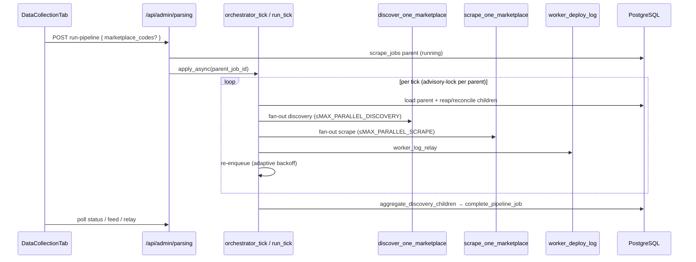
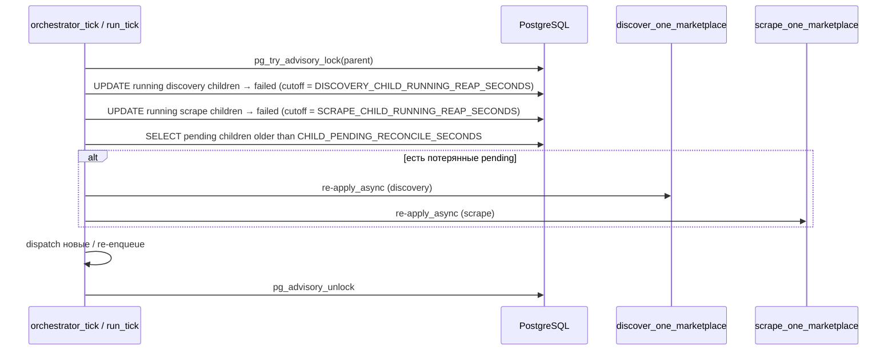

# Imperecta — общее описание проекта и архитектура

**Актуально на:** 2026-06-25 (ветка `main`, head `5b55a9d`)  
**Назначение:** единый контекст для разработки, онбординга и Cursor.

> Архитектурные принципы — см. `ARCHITECTURE_PRINCIPLES.md` (immutable, не редактировать). Этот документ описывает реализацию; принципы не дублирует. Правило immutable: `.cursor/rules/architecture-principles-immutable.mdc` + `AGENTS.md`.

---

## 1. Продукт

**Imperecta** — SaaS-платформа мониторинга и аналитики e-commerce.

| Возможность | Реализация |
|-------------|------------|
| Сбор с маркетплейсов | Discovery → scrape → `fact_listing` / `fact_price` |
| Каталог пользователя | `user_products`, импорт CSV/XLS |
| Глобальный пул | `product_pool`, поиск по `dim_product` / `fact_listing` |
| Рыночные виджеты | Forex, crypto, commodities; dashboard widget math → **`visualisation_calc`** (scaffold); `fact_fuel_price` — таблица сохранена, ingest/read pipeline удалён |
| Display currency | `local` / `EUR` / `USD` — `fact_currency_rate` + live forex; **local** = TLD→country→currency (`marketplace_locale.py`) |
| Дашборд и аналитика | KPI, **Markets product catalog** (`/dashboard`); `visualisation_calc/movements` built — client-side KPI в `MarketsOverviewSection` до `api.py` wiring |
| Алерты и дайджесты | Celery (часть задач — stubs) |
| AI-аналитик | Claude; entitlement по плану (`business` / `pro` / `enterprise`) |
| Админка | Superuser: Market Overview, **Data Collection**, **Users Management** |

**Принципы:**

- **Данные:** критические поля не подменяются фейковыми значениями; `fact_price` — через **data_firewall** (имя, цена, валюта, whitelist, sanity `currency_raw`) + HMAC-signed **persist**; stock/availability не отслеживается (migration `027`).
- **Универсальность:** парсинг и discovery **без привязки к конкретным магазинам**. Классификация PDP — **`classify_page_role_for_discovery`** (`modules/classifier/`: og:type с override для `website`, JSON-LD, microdata, structural fallback) в discovery **и** в `merge_and_finalize` при scrape. `classify_page_role` — только Layer 3 fallback. Без URL-regex по языку/домену. **Discovery gate (`4f961a9`):** каждый кандидат классифицируется индивидуально; в пул попадают только `page_role=product` (blind `trust_sample` удалён); canonical URL + `locale_selection` для hreflang. **Scrape L2 prune:** hub/listing → `not_a_product` + DELETE listing и 1:1 `dim_product`.

---

## 2. Топология развёртывания

Локальный production-like стек **не используется** для проверки: push → Git → Railway / Cloudflare.

```
Cloudflare Pages (frontend)
        │  HTTPS  /api/*
        ▼
Railway: FastAPI + Celery worker + Celery beat
        │
        ├── Supabase PostgreSQL
        ├── Upstash Redis (broker, worker log relay; result backend OFF)
        └── Внешние API (Decodo, Claude, market data, Telegram)
```

| Сервис | Путь / хостинг |
|--------|----------------|
| Frontend | `frontend/` → Cloudflare Pages, `VITE_API_URL` |
| API | `backend/app/main.py` → Railway |
| Workers | `backend/app/workers/` → Railway |
| БД | Supabase Postgres |
| Broker | Upstash `rediss://` (SSL options в `celery_app.py`) |

Конфигурация: корневой `.env` (`DATABASE_URL`, `REDIS_URL`, JWT, ключи API).

---

## 3. Структура репозитория

```
imperecta/
├── frontend/                 # React 19 + Vite 6
├── backend/
│   ├── app/main.py
│   ├── app/config.py
│   ├── app/database.py
│   ├── app/models/
│   ├── app/modules/          # доменная логика
│   │   └── visualisation_calc/   # Tier-1: dashboard widget calculations (scaffold)
│   ├── app/workers/
│   └── alembic/versions/     # 001 … 031 (head: movers window index)
├── Imperecta_Architecture.md   # продукт, топология, карта файлов (Часть II)
├── Imperecta_Backend.md        # API, Celery, parsing (Часть II)
├── Imperecta_Frontend.md
├── Imperecta_Database.md       # миграции, RLS, полная схема (Часть II)
└── ARCHITECTURE_PRINCIPLES.md    # принципы (отдельный файл)
```

Legacy `app/api/`, `app/services/` удалены.

---

## 4. Backend — карта модулей

| Модуль (Tier-1) | Роль |
|--------|------|
| `core` | `api_admin` (`/admin/stats`, claude-status), `admin_service`, `supabase_security` — что осталось после выноса auth/users/telegram |
| `auth` | JWT issuance, register/login/refresh/me, password hashing; `decode_token` в Tier-0 `common/security.py` |
| `users` | Self-service `/users/me` + admin user CRUD `/admin/users/*`; plans (trial→enterprise), language, role |
| `telegram` | Webhook handler `/telegram/webhook`; secret-token verification |
| `entitlements` | `/entitlements` API surface — runtime feature flags по `UserPlan` (Tier-1); правила тарифов в `app/entitlements/plan.py` (Tier-0 enum) |
| `admin` | Parsing control plane (`/admin/parsing/*`) — `parsing_admin.py`, `api_parsing.py` |
| `marketplaces` | `dim_marketplace` CRUD, pool quotas |
| `scraper` | Discovery, scrape, `pipeline/` orchestrator (см. `Imperecta_Backend.md` §4.3) |
| `classifier` | Tier-1: PageRole классификация (`classify_page_role_for_discovery` использует слои JSON-LD/og/microdata/structural) — выделено как самостоятельный модуль (ARCHITECTURE_PRINCIPLES §10) |
| `data_firewall` | Tier-1: контракты колонок, ecommerce/market rules, HMAC signing (`table`+`operation`+`locator`+`fields`), durable reject через `write_reject_data_isolated` (`firewall.py`, `rules.py`, `contracts.py`, `signing.py`, `reject_store.py`) |
| `ingestion` | Tier-1: orchestration scrape→persist (`service.py`, `dto.py`) — вызывает `data_firewall` + `persist`; re-export gate в `gate.py` |
| `persist` | Tier-1: verbatim write после verify HMAC (`writer.py`, `meta_write.py` META bridge) |
| `visualisation_calc` | Tier-1: расчёты виджетов дашборда (KPI, movements, volatility, coverage, trend, categories). **`movements/` — первый live submodule** (operational sync read как `price_eur_resolver`, см. §2.7.6); остальные submodules — scaffold. Planned **data_export** read-OUT door (Phase 7/8) — для user-data export, не для movements. `api.py` / `main.py` — wiring pending. Преемник dissolved `dashboard/` + `analytics/`. |
| `product_pool` | Публичный пул товаров; `/pool/*`, `/markets/overview` |
| `currency` | Единый fiat-home: `price_eur_resolver` (scrape-path EUR), `display_converter` (UI display FX, бывший `common/currency.py`), `forex_fetch` (thin delegate → `market_data.fetching`; `TODO(boundary)` Tier-0→Tier-1 — см. §7.5) |
| `market_data` | Provider-agnostic triad (forex/crypto/commodities) + общий `provider_queue.gap_fill_fetch`; ingest + read API `/markets/{preferences,instruments,ticker,ingest}`; adapters в `providers/`; Celery — `workers/market_data_tasks.py` |
| `ai_analyst` | Claude chat sessions; entitlement-gated |

**Роутеры в `main.py`:** `core.api_admin`, `admin.api_parsing`, `auth.api`, `users.self_router`, `users.admin_router`, `telegram.api`, `marketplaces.api`, `product_pool.api` (pool + markets_overview), `market_data.api`, `entitlements.api`, `ai_analyst.api` — всего **12** роутеров под единым `prefix="/api"` (`main.py:146-160`).

**Не в `main.py` (модули без HTTP-surface или с прямым background usage):** `classifier`, `ingestion`, `data_firewall`, `persist`, **`visualisation_calc`** (`movements/` built; `api.py` route — следующий шаг), `meta_write` (внутренний META bridge в `persist/`). **`scraper/api.py` router удалён** (ранее не смонтирован; `/pool/search`, orphan FE `pipeline-status`, 3 dead `/admin/parsing/*`, `recalculate-quotas` — удалены).

**Удалены / заменены:** `analytics/`, `dashboard/` — dissolved; расчёты виджетов переезжают в **`visualisation_calc/`**. `digests/`, `alerts/` — отсутствуют; API не зарегистрирован. Frontend pages-обёртки (`AlertsPage.tsx`, `CompetitorsPage.tsx`) сохранены без backend support — см. `Imperecta_Frontend.md` §18. `user_products/` — каталог пустой (`__init__.py` only); функциональность не активна.

---

## 5. Startup (lifespan)

1. `alembic upgrade head` (subprocess, 600s, warn on fail)  
2. `ensure_superuser` (до 10 retry)  
3. `Base.metadata.create_all` (safety net)  
4. Telegram `setWebhook` в фоне  

Health: `GET /health`, `GET /api/health` (DB, Redis, pool stats).

---

## 6. Планы и entitlements

**UserPlan (DB):** `trial`, `starter`, `business`, `pro`, `enterprise`.

| Plan | Service tier | AI Analyst | Лимит products (код) |
|------|--------------|------------|----------------------|
| trial | TRIAL | нет | 999 (14 дней trial) |
| starter | FREE | нет | 50 |
| business, pro, enterprise | PAID_FULL | да | 999 |

Источник: `backend/app/entitlements/plan.py`. Admin UI создаёт пользователей с любым из планов.

---

## 7. Сквозные потоки

### 7.1 Пользователь

Login → JWT → React Query → `/api/products`, `/api/dashboard`, …

### 7.2 Admin full pipeline

1. `POST /api/admin/parsing/run-pipeline` → parent `scrape_jobs` (`full_pipeline_test`, `parent_job_id IS NULL`); опционально `{ marketplace_codes: [...] }`.  
2. **Dispatch:** `orchestrator_tick` → `run_tick` (единственный путь после O4c, `868251a`); per-parent serialization через session-level `pg_advisory_lock` (O5b, `a82fa48`/`ff781a9`).  
3. **Discovery phase:** fan-out `discover_one_marketplace` (до `MAX_PARALLEL_DISCOVERY=2`).  
4. **Scrape phase:** fan-out `scrape_one_marketplace` (до `MAX_PARALLEL_SCRAPE=2`, `job_type='scrape'`, миграция `022`); O4a/O4b (`82a92d4`, `a003d60`).  
5. **Complete phase:** `aggregate_discovery_children` → `complete_pipeline_job`; rollup учитывает `partial` (O5a, `09f1dc2`).  
6. UI: `active-job`, `pipeline-status`, `worker-log-relay`; stale parent — auto-fail idle >30 min.

### 7.3 Discovery (content-aware sitemap + cooperative budget)

`DiscoveryCrawler` (`discovery.py`) — три фазы + **cooperative deadline** (`4bad080`, `4d42623`):

| Фаза | Метод | Суть |
|------|-------|------|
| 0 | `_phase0_sitemap_harvest` | XML sitemap → `classify_page_role_for_discovery` → только PDP URLs |
| 1 | `_phase1_category_recon` | BFS по hub/listing; **batch publish** (`CATEGORY_PUBLISH_BATCH=60`) в `discovered_category_urls` — Phase 2 в том же tick; frontier сохраняется для продолжения BFS |
| 2 | `_phase2_product_harvest` | Обход category pages, pagination, save listings; convergence streak (per-run, не persisted) |

Если sitemap дал ≥10 product URLs — **sitemap path** (resumable offset, `016`); иначе category crawl с Phase 2 budget (`017`/`018` resume).  
При нехватке 15 min budget — `partial_budget` / inner job `partial` (`019`); следующий run продолжает.  
Sitemap: per-URL structural classify (sample только для early `reject_sample` при <20% product); **trust_sample blind-accept удалён** (`4f961a9`); concurrency 8; bad harvest retry через 1h. Locale: `locale_selection.select_locale_url` (en → marketplace locale → x-default) + `Accept-Language` на classify fetch.

Подробно: `Imperecta_Backend.md`.

### 7.4 Tiered scrape strategy (foundation)

На `dim_marketplace` поле **`scrape_tier`** (1 | 2 | 3, default **1**):

| Tier | Назначение (план) | Статус в коде |
|------|-------------------|---------------|
| 1 | SSR: **httpx → Decodo → Playwright** (httpx-first) · JS-only: **Decodo → Playwright → httpx** (policy B, `1de44f1`) | **Реализован** (`_layer_order`) |
| 2 | SPA: network interception + basic stealth | `NotImplementedError` |
| 3 | Hostile: full stealth + residential sticky + LLM | `NotImplementedError` |

`GlobalScrapeService` передаёт `marketplace.scrape_tier` в `ScraperPool.scrape_product`. Tier 2/3 в БД допустимы, но вызов упадёт явно — без silent fallback на tier 1.

Подробно: `Imperecta_Backend.md`, `Imperecta_Database.md`.

### 7.5 Display currency (EUR/USD) и fiat-модули

**Два контура fiat (не смешивать):**

| Контур | Модуль | Session | Назначение |
|--------|--------|---------|------------|
| Scrape-path EUR | `modules/currency/price_eur_resolver.py` | sync `Session` | `resolve_price_eur` → `fact_price.price_eur`, `fact_listing.last_price_eur`; operational SELECT `fact_currency_rate` по **scrape-day `date_id`**; source priority `ecb` → … → `custom` |
| UI display FX | `modules/currency/display_converter.py` | async `AsyncSession` | `CurrencyConverter.load_latest` — max `date_id` из `fact_currency_rate`, fallback live через `forex_fetch.fetch_eur_base_pairs` → `market_data.fetching.fetch_forex_rates("EUR")` |

**Display flow (pool/overview):**

1. Frontend: `display_currency` в query (`local` \| `EUR` \| `USD`).  
2. Backend: `product_pool/service.py` → `CurrencyConverter.load_latest` + `compute_display_fields_for_marketplace`.  
3. Ответ: `display_price`, `display_currency`, `conversion_available`, `local_currency_resolution`; без rate — local + `conversion_available=false`.

**Модуль `currency` — единый fiat-home:** `price_eur_resolver` (sync scrape EUR), `display_converter` (перенесён из удалённого `common/currency.py`), `forex_fetch` (thin delegate → `market_data.fetching`; `TODO(boundary)` — полная Tier-0→Tier-1 изоляция отложена).

**Market-data triad — выполнено:** три provider-agnostic source-модуля в `market_data/providers/*` делят **один** примитив очереди `market_data/provider_queue.py` (`gap_fill_fetch` — Q-B gap-filling: провайдеры по порядку, каждый запрашивает только ещё отсутствующие ключи, первый поставивший ключ побеждает, честный `missing` если никто не поставил). Очереди: **forex** — OpenER (`openexchangerates`) → Frankfurter (`ecb`), Binance не применим; **crypto** — Binance (primary, universe по объёму) → CoinGecko (gap-fill), `source` `binance`/`coingecko`; **commodities** — GoldApi (metals) → AlphaVantage (energy) → Yahoo (gap-fill) по каталогу `METAL_ITEMS`+`ENERGY_ITEMS` (главный бенефициар gap-fill; будущие oil/gas/grain = каталог + провайдер). Три отдельных DTO сохранены (DTO-1); `provider_source` на `NormalizedForex` / `NormalizedCrypto` / `NormalizedCommodity`. **FROZEN boundary** без изменений: `*IngestItem` → `persist_*` → `evaluate_market` → `write_sync`; имена Celery-задач `ingest_market_data`, `ingest_commodities`.

**no_change denorm:** `listing_denorm_no_change` пишет `last_currency_code` из нормализованного `persist_fields["currency_code"]` (как success-path), не из raw `data.currency` (`ingestion/service.py`).

**Beat schedule:** `ingest_market_data` каждые 6h (`crontab(minute=5, hour="*/6")`), `ingest_commodities` 4×/день (`crontab(minute=35, hour="2,8,14,20")`) — ранее только manual ingest оставлял `price_eur` NULL в scrape-days без курса.

**Cleanup (удалено):** мёртвый fuel half-pipeline (`FuelHttpAdapter`, `GET /markets/fuel`, `reader.get_fuel`, fuel-ветка ticker, FE fuel-heuristics) — таблица `fact_fuel_price` сохранена; per-class endpoints `/markets/forex`, `/crypto`, `/commodities`, `/refresh-metadata`; `/pool/search`, `/telegram/status`, 3 dead `/admin/parsing/*`, `recalculate-quotas`; orphan FE `pipeline-status`; unmounted `scraper/api.py` router. FE использует `/ticker` + `/instruments` + `/preferences`; shared reader-методы для `/ticker` сохранены.

**`price_change_pct` compute-site (ingestion):** вычисляется при сборке `fact_price` **до** denorm перезаписывает `listing.last_price` — `compute_price_change_pct(new_price, prior_last_price=listing.last_price)` (`persist/writer.py`) вызывается из `ingestion/service.py` перед `build_fact_price_fields`. Формула: `(new − prior) / prior × 100`; clamp к `Numeric(8,4)` через константу `MAX_ABS_PRICE_CHANGE_PCT = Decimal("9999.9999")`, quantize scale 4. Честный `NULL`: prior `last_price` отсутствует (первый scrape) или `== 0` (div-by-zero). `discount_pct` остаётся `NULL` (dead `getattr` на DTO удалён). Gate/allowlist без изменений — `price_change_pct` уже signed-колонка `fact_price`. Закрывает REGISTRY item «price_change_pct always-NULL».

### 7.6 Качество scrape (P0)

`GlobalScrapeService` перед `fact_price`:

- product name / title  
- price > 0  
- currency non-empty  
- `len(currency_raw) < 50`  
- валюта в whitelist маркетплейса (страна + EUR/USD + `scraper_config.allowed_currencies`)  
- `no_change` если цена/валюта не изменились (stock tracking удалён, migration `027`)  
- после **15** подряд ошибок → `fact_listing.is_active = false`

Подробно: `Imperecta_Backend.md`.

---

## Слой 0 — Реестр дверей гейта и контактов с БД (единый вход через data_firewall → persist)

**LAYER 0** перестройки «от БД наружу»: единый живой реестр **дверей** гейта и **контактов** backend ↔ PostgreSQL.

Метафора «дома»: **data_firewall** — единственный шлюз; **PRODUCER-SIDE doors** — публичные входы (`evaluate_*`), через которые продюсеры (scrape, discovery, market_data, admin) подают записи; **DB-SIDE doors** — ветки `persist` (запись в fact/dim) и путь **reject** (`write_reject_data_isolated` на gate-fail, `write_reject_data` / `_reject_persist` in-txn). **persist** — WRITE-ONLY: read-дверей в `persist/writer.py` **нет** (0 подтверждено, NOT FOUND); чтение для замков (например `CurrencyResolver`) выполняет сам гейт. У каждой двери фиксируются имя, назначение, from→to и **замок** (валидация / контракт / подпись) с честной оценкой силы (**FULL** / **PARTIAL** / **WEAK**) и известными **GAP**. Контакты **BYPASS** (0b.2) — записи, миновавшие дверь; backlog **LAYER 2**. Реестр обновляется по мере усиления замков (**LAYER 1**) и закрытия bypass (**LAYER 2**).

**LAYER 1 progress (sub-seams):** sub-seam 1 (`reject_data.operation`, миграция `029`) — **DONE**; sub-seam 1b (`fact_listing.url_hash` NOT NULL locator, миграция `030`) — **DONE**; sub-seam 2 (master-lock: HMAC bind `table` + `operation` + `locator` + `fields`) — **DONE**; sub-seam 3 (reject вне nested savepoint, `write_reject_data_isolated`) — **DONE**; sub-seam 4 (CUD UPDATE/DELETE primitives, `PersistResult`) — **DONE** → **LAYER 1 COMPLETE** (persist — полный CUD dumb primitive; master lock связывает `table`+`operation`+`locator`; reject durable; `reject_data` несёт `operation`). **LAYER 2 progress:** дверь **META** — **DONE**; дверь **LOGS** — **DONE** (+ batch-signing primitive); **DDL/COMMANDS (D-A audit-mark)** — **DONE**; admin destructive whole-pool wipe — **REMOVED**. → **LAYER 2 COMPLETE**. **LAYER 3 — COMPLETE:** scrape→gate→DB полностью маршрутизирован (cat-1 **CLOSED**: enrich/denorm/`dim_date`/housekeeping UPDATE + prune DELETE + `dim_date` INSERT через `update_validator` / `evaluate_ecommerce` / `evaluate_market`); подмодуль **`price_eur_resolver`** — **live**; **`price_change_pct` compute-site** в ingestion (§7.5); prune DELETE — **durable commit**; seam B dead-code — **DONE**; **market-data triad + cleanup** — **COMPLETE** (`0a.6`); **`visualisation_calc/movements`** — **COMPLETE** (`0a.7`; `api.py` wiring pending). **NEXT:** movements wiring (`api.py` + FE client-side calc removal), **затем LAYER 4** — discovery data contract, затем discovery internals. Оставшийся bypass: **cat-5** USER/AUTH — **DEFERRED → Phase 7/8**. Оставшиеся gap в **0a.4** — вне закрытых sub-seams.

**Модель дверей (lock-by-threat):** сила замка подбирается под угрозу домена — **META** и **LOGS** = **LIGHT** (структурный контракт `build_table_contract`: типы + nullable + enum CHECK + HMAC; без семантических rules); **`update_validator`** = **SEMANTIC** (per-kind column allowlist + инвариант `reactivation_forbidden` — строже META, слабее полного `evaluate_ecommerce`); полные двери (`evaluate_ecommerce`, аналитический рельс `evaluate_market`) сохраняют семантические rules поверх контракта. На **каждой** двери HMAC-подпись обязательна при проходе в persist (single-record `SignedRecord` или batch `SignedBatch`).

> **Снимок:** recon `backend/app/**` (gate door catalog + DB-contact inventory). Типы колонок — ORM (`facts.py`, `dimensions.py`, `app_tables.py`, `reject_data.py`, `core.py`). `file:line` — evidence из recon; при дрейфе кода перепривязать grep/read.

---

### 0a. Реестр дверей гейта (Gate Door Registry)

#### 0a.1 Producer-side doors (входы в гейт)

Публичная стена пакета `data_firewall/__init__.py:6–11`: `FirewallOutcome`, `SignedRecord`, `evaluate_ecommerce`, `evaluate_market` (внутренний рельс также `evaluate_logs`, `LogsOutcome` — `firewall.py:218+`, `71–77`; **`update_validator`** — `update_validator.py:87+` / `238+`, импорт продюсерами напрямую). ENTRY-двери — `evaluate_ecommerce`, `evaluate_market` (аналитический + META-мультиплекс), **`evaluate_logs`** (LOGS), **`update_validator`** (scrape cat-1 UPDATE/DELETE); мосты — `persist/meta_write.py` (META), `persist/logs_write.py` (LOGS), `persist/maintenance_audit.py` (D-A audit-mark), `persist/scrape_gate_fields.py` (сборка payload для `update_validator`); остальное — типы или внутренние/legacy рельсы.

**Модуль `currency` (LAYER 3 — fiat):** `backend/app/modules/currency/` — **`price_eur_resolver`** (`resolve_price_eur`, sync scrape-path EUR); **`display_converter`** (`CurrencyConverter`, UI display FX — перенесён из удалённого `common/currency.py`); **`forex_fetch`** (thin delegate → `market_data.fetching.fetch_forex_rates`; `TODO(boundary)` полная Tier-0→Tier-1 изоляция — backlog). `price_eur_resolver` читает `rate_to_eur` из `fact_currency_rate` через **операционный SELECT** на producer sync `Session` по **scrape-day `date_id`**; read-двери persist **нет**. EUR-base: `price_eur = price`; non-EUR: `price × rate_to_eur`, квантование **Numeric(12,2), ROUND_HALF_UP**; отсутствующий курс на scrape-day → честный `NULL`. Приоритет источника: `ecb` → `openexchangerates` → … → `custom` (`_RATE_SOURCE_PRIORITY`). Результат → `build_fact_price_fields` → **`fact_price.price_eur`** и denorm → **`fact_listing.last_price_eur`** (kinds `listing_denorm_success` / `listing_denorm_no_change`; `last_currency_code` в no_change — из нормализованного `currency_code`).

**DDL/COMMANDS (подход D-A):** гейт здесь — **ROUTER**, не executor. Каждая maintenance-операция (MV refresh, partition create, retention DELETE, CHECK repair) выполняется **как есть** на своём connection (`raw conn` / caller `Session`); параллельно best-effort пишется durable audit-mark через `record_maintenance_audit` / `record_maintenance_audit_async` (`persist/maintenance_audit.py:35+`): `service='maintenance'`, `endpoint='{op}:{target}'`, `method` — короткий глагол (`REFRESH`, `DDL`, `DELETE`, `ALTER`), `status` `success`/`error`, `user_id` где доступен иначе `NULL`, `detail`/counts в `error_message`. Хелпер **проглатывает** собственные сбои — никогда не блокирует maintenance op.

| door (function) | file:line | purpose | FROM (who may call) | TO (produces) | lock steps (ordered) | lock strength | known lock-gap |
|-----------------|-----------|---------|---------------------|---------------|----------------------|---------------|----------------|
| `evaluate_ecommerce` | `data_firewall/firewall.py:204+` | E-commerce extract → signed row (default `fact_price`) | Scrape/ingestion: `marketplace_id` + `CurrencyResolver` + optional `persist_fields` (`ingestion/service.py:194–201`) | On pass + `persist_fields`: `SignedRecord`; on fail + `db`: `reject_data` | 1) `evaluate_ecommerce_rules` — 5 checks (`rules.py:108–159`, DB read whitelist `rules.py:65–75`) 2) `page_role in (listing,hub)` → reject (`firewall.py:210–220`) 3) `page_role=unknown` → log only (`221–227`) 4) If `passed and persist_fields`: `_validate_against_contract` (`239–244`) 5) `_sign_fields` (`251`, `165–189`) 6) sign fail → `signing_unavailable` (`252–256`) 7) If `not passed and db`: `write_reject_data_isolated` (`278–291`) | **PARTIAL** | `unknown` page_role not blocked; contract only on keys present (`firewall.py:116–119`); `passed=True` без `signed_record` если `persist_fields is None` (`237–238`) |
| **META door** (`evaluate_market` + `meta_write`) | `firewall.py:411+`; `meta_write.py:56+` | Reentrant multiplex: operational metadata `scrape_jobs` + `dim_marketplace` → signed row по `operation` (`insert` / `update` / `delete`) | Async producers: `write_meta_async` → `asyncio.to_thread` + `sync_session_factory` + `write_meta_sync` (precedent `discovery.py` pool bridge); sync: `write_meta_sync` / `activity_pulse.py` | On pass: `SignedRecord` + `write_sync` + commit; on fail: `write_reject_data_isolated` | 1) `unknown_table` if no contract 2) `_validate_against_contract` (types + nullable + enum CHECK; **без** semantic rules) 3) `_sign_fields` с `operation` + locator `("id",)` (`contracts.py:130`) 4) reject isolated on fail | **LIGHT** | JSONB cols signed but content-blind (inert-data); нет thread pool внутри гейта — один sync session на вызов моста |
| **LOGS door** (`evaluate_logs`) | `firewall.py:218–303` | Append-only audit: `scrape_logs` + `api_logs`, **INSERT-ONLY** | `persist/logs_write.py` (`persist_logs_batch`, `write_logs_sync`, `write_logs_async`); producers: `scraper/service.py` batch flush, `tasks.py`, `market_data/ingestion.py`, `ai_analyst/service.py`; **D-A:** `persist/maintenance_audit.py` (`record_maintenance_audit` / `_async`) | On pass: `SignedBatch` + `write_batch_sync`; partial batch OK | 1) per-row `_validate_against_contract` (LIGHT) 2) invalid rows → `write_reject_data_isolated` **по одной** (`254–264`) 3) valid rows → `sign_batch` + `SignedBatch` (`269–298`) 4) signing fail → isolated reject per valid row (`276–290`) | **LIGHT** | locator `()` (`contracts.py:134–135`); content-blind на `Text` (`url`, `error_message`, `endpoint`); **bad-row-in-batch:** valid → один `SignedBatch`, invalid → isolated reject; честные `inserted_count` / `rejected_count`; batch не отбрасывается целиком |
| **DDL/COMMANDS (D-A audit-mark)** | `persist/maintenance_audit.py:35+` | Audit trail maintenance ops в `api_logs` — **не** исполняет DDL | `maintenance_tasks.py`, `cleanup_tasks.py`, `scraper/service.py` (CHECK repair), `admin/parsing_admin.py` (job_type CHECK) | `write_logs_sync` → `evaluate_logs` → `sign_batch` → `write_batch_sync` → `api_logs` | 1) caller выполняет DDL/DELETE на своём connection 2) `record_maintenance_audit` / `_async` пишет mark рядом 3) swallow failure — op не блокируется | **LIGHT** (audit only) | DDL statements остаются direct; exempt-by-design от routing, но оставляют durable `api_logs` trail |
| **`update_validator` door** (`authorize_scrape_update` / `authorize_scrape_delete`) | `data_firewall/update_validator.py:87+` / `238+` | Scrape-owned UPDATE/DELETE: per-kind **COLUMN ALLOWLIST** + semantic invariant | `scraper/service.py` (housekeeping/deactivate/prune); `ingestion/service.py` (enrich/denorm) | On pass: `SignedRecord` (`operation` `update`/`delete`) + `write_sync` | 1) `SCRAPE_UPDATE_ALLOWLIST` kind lookup (`24–43`) 2) locator keys present (`TABLE_LOCATORS`) 3) changed ⊆ allowed 4) **`is_active` may be False or absent, never True** (`reactivation_forbidden`, `192–207`) 5) `_sign_fields` 6) isolated reject on fail (`_isolated_reject`, `65–84`) | **SEMANTIC** | Locators: `fact_listing` → `url_hash`; `dim_product` → `id`. Reject reasons: `unknown_update_kind`, `column_not_allowed`, `missing_locator`, `reactivation_forbidden`, `nothing_to_update`, `signing_unavailable`, `unknown_delete_table`, `unexpected_delete_field` |
| `evaluate_market` (аналитический рельс) | `data_firewall/firewall.py:411+` | Market/discovery dict → signed dim/fact row | Caller supplies `table` + field dict (`discovery.py:200+`, `market_data/ingestion.py:147+`) | On pass: `SignedRecord`; on fail + `db`: `reject_data` | 1) `unknown_table` if no contract 2) `_validate_against_contract` 3) `_sign_fields` (`operation` default `insert`) 4) If `not passed and db`: `write_reject_data_isolated` | **PARTIAL** | No e-commerce rules; sparse contract; 15 contracted tables (`contracts.py:106–121`) vs 8 `write_sync` + 2 `write_batch_sync` branches; 5 analytical tables still `raise` at persist |
| `evaluate_ecommerce_rules` | `data_firewall/rules.py:108–113` | Rules-only rail (5 checks); **not** package export | Internal from `evaluate_ecommerce` (`firewall.py:197–201`); legacy alias `evaluate_gate` | `GateOutcome` only — no `SignedRecord` | 1) `product_name_ok` 2) `currency_ok` 3) `price_ok` 4) `currency_raw_sane_ok` 5) `currency_country_match_ok` (`115–128`) | **WEAK** | No contract, no signing, no persist ticket |
| `evaluate_gate` | `ingestion/gate.py:16` | Legacy alias → `evaluate_ecommerce_rules`; **outside** package wall | Legacy callers of `ingestion.gate` | `GateOutcome` only | Same 5 rules | **WEAK** | Bypasses full wall (no contract/sign/persist guard) |

#### 0a.2 DB-side doors (гейт → БД, через persist)

**Persist read doors: 0** — grep `select(`, `.scalar`, `.get(` в `persist/writer.py`: **NOT FOUND**.

**Диспетчеризация `write_sync` / `write_async`:** после `_verify_signed_record` — по `signed.operation`:
- **`insert`** — прежние ветки (ORM INSERT; для `fact_price` и трёх market facts — DELETE по replace-key + INSERT, daily replace);
- **`update`** (sync only, U-1) — `_write_sync_update`: локатор `signed.locator` → `update(model).where(locator).values(...)` только по **non-locator** полям из `signed.fields` (partial update);
- **`delete`** — `_write_sync_delete` / `_write_async_delete`: только `signed.locator`, value fields не требуются.

**Возврат:** `PersistResult(ok, rows_affected, no_target)` (`writer.py:78–87`); `__bool__` → `ok` — insert callers без изменений; `rowcount == 0` → `no_target=True` (честное уведомление об отсутствии цели, не ошибка).

| door | file:line | table | op | re-verifies HMAC? | session | notes |
|------|-----------|-------|-----|-------------------|---------|-------|
| `write_sync` (dispatch) | `persist/writer.py:271+` | per `signed.table` | `insert` / `update` / `delete` | **Yes** — master-lock перед exec | caller `Session` | маршрут по `signed.operation` после `_verify_signed_record` |
| `write_sync` (null `signed`) | `persist/writer.py:278–287` | `unknown` (reject) | reject insert | N/A | caller `Session` | `_reject_persist` → `missing_signed_record` |
| `write_sync` (bad signature) | `persist/writer.py:289–299` | `signed.table` | reject insert | **Yes** — `_verify_signed_record` | caller `Session` | `_reject_persist` → `invalid_signature` / `locator_mismatch` / `unsupported_operation` |
| `write_sync` (update, U-1) | `persist/writer.py:229–255` | `dim_product`, `fact_listing`, `scrape_jobs`, `dim_marketplace` | UPDATE by `signed.locator` | Yes | caller `Session` | `_write_sync_update`; SET non-locator fields; `fact_listing` locator **`url_hash`**; `dim_product` locator **`id`**; пустой value set → `nothing_to_update` reject |
| `write_sync` (delete) | `persist/writer.py:258–266` | `dim_product`, `fact_listing`, `scrape_jobs`, `dim_marketplace`, `fact_price`, `fact_currency_rate`, `fact_crypto_price`, `fact_commodity_price` | DELETE by `signed.locator` only | Yes | caller `Session` | `_write_sync_delete`; `PersistResult.rows_affected` / `no_target` |
| `write_sync` → `fact_price` | `persist/writer.py:310–320` | `fact_price` | `insert`: DELETE `(listing_id, date_id)` + INSERT | Yes | caller `Session` | daily replace insert path |
| `write_sync` → `dim_product` | `persist/writer.py:322–324` | `dim_product` | `insert` (+ `update`/`delete` через dispatch) | Yes | caller `Session` | |
| `write_sync` → `fact_listing` | `persist/writer.py:326–328` | `fact_listing` | `insert` (+ `update`/`delete` через dispatch) | Yes | caller `Session` | |
| `write_sync` → `fact_currency_rate` | `persist/writer.py:332–341` | `fact_currency_rate` | `insert`: DELETE replace-key + INSERT | Yes | caller `Session` | daily replace |
| `write_sync` → `fact_crypto_price` | `persist/writer.py:343–352` | `fact_crypto_price` | `insert`: DELETE replace-key + INSERT | Yes | caller `Session` | daily replace |
| `write_sync` → `fact_commodity_price` | `persist/writer.py:354–363` | `fact_commodity_price` | `insert`: DELETE replace-key + INSERT | Yes | caller `Session` | daily replace |
| `write_sync` → `scrape_jobs` | `persist/writer.py:339–341` | `scrape_jobs` | `insert` (+ `update`/`delete` через dispatch) | Yes | caller `Session` | META door; locator `("id",)` |
| `write_sync` → `dim_marketplace` | `persist/writer.py:343–345` | `dim_marketplace` | `insert` (+ `update`/`delete` через dispatch) | Yes | caller `Session` | META door; locator `("id",)` |
| `write_sync` → `dim_date` | `persist/writer.py:376–388` | `dim_date` | `insert`: `pg_insert` + `ON CONFLICT DO NOTHING` по `date_id` | Yes | caller `Session` | idempotent upsert; producer `ingestion/service.py:_today_date_id` через `evaluate_market` |
| `write_sync` (unsupported) | `persist/writer.py:365+` | — | `raise ValueError` | Yes (if reached) | — | `fact_review`, `fact_promo`, `fact_search_trend`, `fact_tariff`, `fact_fuel_price` — contract exists, no branch |
| `write_async` (dispatch) | `persist/writer.py:368+` | per `signed.table` | `insert` / `delete` | **Yes** | `AsyncSession` | **нет async UPDATE** — replace tables only |
| `write_async` (null `signed`) | `persist/writer.py:371–385` | `unknown` | reject insert | N/A | `AsyncSession.sync_session` | direct `write_reject_data`, not `_reject_persist` |
| `write_async` (bad signature) | `persist/writer.py:387–403` | `signed.table` | reject insert | **Yes** `_verify_signed_record` | `db.sync_session` | |
| `write_async` (delete) | `persist/writer.py:405–406` | `fact_currency_rate`, `fact_crypto_price`, `fact_commodity_price` | DELETE by `signed.locator` | Yes | `AsyncSession` | `_write_async_delete` |
| `write_async` → `fact_currency_rate` | `persist/writer.py:411–420` | `fact_currency_rate` | `insert`: DELETE+INSERT | Yes | `AsyncSession` | |
| `write_async` → `fact_crypto_price` | `persist/writer.py:422–431` | `fact_crypto_price` | `insert`: DELETE+INSERT | Yes | `AsyncSession` | |
| `write_async` → `fact_commodity_price` | `persist/writer.py:433–442` | `fact_commodity_price` | `insert`: DELETE+INSERT | Yes | `AsyncSession` | |
| `write_async` (unsupported) | `persist/writer.py:446` | — | `raise ValueError` | — | — | No `fact_price`, `dim_product`, `fact_listing`; **runtime callers в `backend/app/**` — NOT FOUND** |
| `write_batch_sync` | `persist/writer.py:411–458` | `scrape_logs`, `api_logs` | `insert` (batch) | **Yes** — `_verify_signed_batch` (`87–104`) | caller `Session` | `db.add_all`; identity PK server-gen — **без** locator addressing |
| `write_batch_sync` (null `signed`) | `persist/writer.py:418–427` | `unknown` | reject insert | N/A | caller `Session` | `_reject_persist` → `missing_signed_batch` |
| `write_batch_sync` (bad signature) | `persist/writer.py:429–439` | `signed.table` | reject insert | **Yes** `_verify_signed_batch` | caller `Session` | `invalid_signature` / `unsupported_operation` |
| **D-A maintenance audit** | `persist/maintenance_audit.py:35+` → `logs_write.write_logs_sync` | `api_logs` | `insert` (batch of 1) | **Yes** — через LOGS (`evaluate_logs` → `sign_batch`) | отдельная sync-сессия внутри `write_logs_sync` | DDL/COMMANDS trail: `service='maintenance'`, `endpoint='{op}:{target}'`; **DDL statements сами не проходят persist** — остаются direct на raw conn / caller session |
| `write_reject_data` | `data_firewall/reject_store.py:108–150` | `reject_data` | insert + flush | No HMAC | caller `Session` | flush-only; in-txn callers (`writer._reject_persist`, прямой reject в `write_async`) — **не** через `write_sync` |
| `write_reject_data_isolated` | `data_firewall/reject_store.py:153+` | `reject_data` | insert + commit | No HMAC | независимая sync-сессия (`sync_session_factory`) | durable reject-канал гейта (`evaluate_ecommerce`, `evaluate_market`); коммит вне business savepoint продюсера; зеркало `_persist_technical_error_log` |
| `_reject_persist` | `persist/writer.py:140+` | `reject_data` | insert via `write_reject_data` | No (already failed verify) | caller `Session` | Sentry escalate; persist reject in-txn (flush-only) |

**`SUPPORTED_WRITE_OPERATIONS`** (`writer.py:33–43`) — единый источник истины; single-record ops проходят `_verify_signed_record`; batch — `_verify_signed_batch`:

| table | operations | примечание |
|-------|------------|------------|
| `dim_date` | `insert` | locator `("date_id",)`; `FACT_TABLE_CONTRACTS` + `_TABLE_MODELS` (`contracts.py:107`, `writer.py:35,49`) |
| `scrape_logs` | `insert` | LOGS door; batch-only (`write_batch_sync`); locator `()` |
| `api_logs` | `insert` | LOGS door; batch-only; locator `()` |
| `scrape_jobs` | `insert`, `update`, `delete` | META door; full CUD sync |
| `dim_marketplace` | `insert`, `update`, `delete` | META door; full CUD sync |
| `fact_listing` | `insert`, `update`, `delete` | full CUD sync; UPDATE/DELETE producers — scrape cat-1 (`update_validator`) |
| `dim_product` | `insert`, `update`, `delete` | full CUD sync; UPDATE/DELETE producers — scrape enrich/prune (`update_validator`) |
| `fact_price` | `insert`, `delete` | daily replace покрывает «обновление» через insert-path |
| `fact_currency_rate` | `insert`, `delete` | daily replace; async DELETE by locator |
| `fact_crypto_price` | `insert`, `delete` | daily replace; async DELETE by locator |
| `fact_commodity_price` | `insert`, `delete` | daily replace; async DELETE by locator |

**META JSONB (content-blind):** колонки `scrape_jobs.config`, `dim_marketplace.discovered_category_urls`, `dim_marketplace.recon_frontier_state` входят в signed `fields` и HMAC, но контракт не eval'ит содержимое JSONB (inert-data rule); санитизация на read-OUT — planned `data_export`.

**LOGS Text (content-blind):** `scrape_logs.url`, `scrape_logs.error_message`, `api_logs.endpoint`, `api_logs.error_message` — в signed `rows`, контракт не eval'ит содержимое; identity PK (`id` BigInteger autoincrement) server-gen, продюсер не адресует существующую строку.

#### 0a.3 Lock mechanism (замки / ключи)

**Single-record signing** — HMAC-SHA256 (`signing.py:93–114`) над **`canonical_serialize_signed_payload`** (`signing.py:68–82`): подпись связывает **`table` + `operation` + `locator` + `fields`**. API: `sign` / `verify` + `SignedRecord` (`signing.py:202–210`). Producer-side `_sign_fields` (`firewall.py:169–189`) → `extract_locator` + `TABLE_LOCATORS` (`contracts.py:125–136`). DB-side: `_verify_signed_record` (`writer.py:65–84`).

**Batch signing (REUSABLE primitive)** — один HMAC на весь batch; single-record path **без изменений**:

| primitive | file:line | role |
|-----------|-----------|------|
| `canonical_serialize_signed_batch_payload` | `signing.py:139–153` | канонический payload: `__table__`, `__operation__`, `__locator__`, `rows[]` |
| `sign_batch` / `verify_batch` | `signing.py:156–199` | HMAC-SHA256 hex над batch payload |
| `SignedBatch` | `signing.py:213–221` | `table`, `operation`, `locator`, `rows`, `signature` |
| `_verify_signed_batch` | `writer.py:87–104` | persist-side re-verify; пустой `locator` → skip per-row locator match |
| `write_batch_sync` | `writer.py:411–458` | `db.add_all` после verify |

**Потребители batch primitive:** дверь **LOGS** (`evaluate_logs` → `SignedBatch`); planned **DATA_EXPORT** read-OUT и любые high-volume gate paths переиспользуют те же `sign_batch` / `write_batch_sync` mechanics. `scrape_logs` — per-listing буфер → batch flush (до ~200k/run, `tasks.py:500–501`), не per-row gate calls.

Сигнатуры single-record API: `sign` / `verify` (`signing.py:93–136`). Верхний уровень signed payload: `__table__`, `__operation__`, `__locator__`, `fields` — sorted keys, канонические значения (`signing.py:31–56`, `76–81`). `write_sync` / `write_async` маршрутизируют по `signed.table` только после `_verify_signed_record` (`writer.py:185–195`).

При незаданном `data_firewall_signing_secret` — fail-closed: `sign` / `sign_batch` → `None`, `verify` / `verify_batch` → `False` (`signing.py:85–90`, `126–135`, `164–166`).

`SignedRecord` (`signing.py:202–210`) — single-row ticket; `SignedBatch` (`signing.py:213–221`) — batch ticket для LOGS и будущих batch consumers.

#### 0a.4 Lock gaps (пробоины — residual backlog)

> **Sub-seam 4 (CUD primitives):** gap **#1** и **#5** остаются **CLOSED**; новых пробоин sub-seam 4 не открыл.

1. **HMAC не связывает `table` / operation** — **CLOSED** (sub-seam 2 master-lock): HMAC связывает `table`, `operation`, `locator` и `fields` (`signing.py:68–82`, `93–136`); persist — `_verify_signed_record` (`writer.py:60–75`). Tamper-evidence: `test_stage_1_2.py` (`test_data_firewall_signature_tamper_table_operation_locator`, content-binding verify).
2. **11 contracted tables vs 6 `write_sync` insert branches** — 5 таблиц проходят `evaluate_market` signing, но `raise` at persist — `contracts.py:105–117`, `writer.py:365` — **LAYER 1**.
3. **Contract validator:** нет ветки JSONB/ARRAY/text для содержимого; не проверяет отсутствующие NOT NULL — слеп к `dim_product.attributes` / `image_urls` при расширении payload — `firewall.py:110–162`, `dimensions.py:343–349` — hardened under gate-extraction (slice-T); **LAYER 1**.
4. **`page_role="unknown"` не блокируется** в `evaluate_ecommerce` — только log — `firewall.py:221–227` — **LAYER 1**.
5. **`reject_data` внутри nested savepoint продюсера откатывается с парой** — **CLOSED** (sub-seam 3): гейт пишет reject через независимую audit-сессию (`write_reject_data_isolated`, зеркало `_persist_technical_error_log`) — коммит вне business savepoint; reject переживает `nested.rollback()`; атомарность пары (без orphan `dim_product`) сохранена. Tamper/durability — pure-logic тесты. Единообразно для gate rejects (discovery savepoint path + scrape/market); `writer._reject_persist` без изменений (in-txn `write_reject_data`). Колонка `operation` — закрыта sub-seam 1 (`029`, `reject_store.py:93+`).
6. **Legacy `evaluate_gate`** (rules-only) обходит полную стену — `ingestion/gate.py:16` — candidate removal — **LAYER 1 / cleanup**.

#### 0a.5 Planned doors (not built — confirmed absent)

| planned door | status | evidence | target layer/phase |
|--------------|--------|----------|-------------------|
| `update_validator` (scrape UPDATE/DELETE door) | **built** (LAYER 3) | `data_firewall/update_validator.py`; `authorize_scrape_update` / `authorize_scrape_delete`; `SCRAPE_UPDATE_ALLOWLIST` kinds: `listing_scrape_start_reset`, `listing_success_streak_reset`, `listing_housekeeping_failure`, `listing_deactivate`, `listing_checked`, `listing_denorm_success`, `listing_denorm_no_change`, `product_enrich` (denorm kinds включают `last_price_eur`) | **LAYER 3** — DONE |
| `price_eur_resolver` (`resolve_price_eur`) | **built** (LAYER 3) | `modules/currency/price_eur_resolver.py`; operational SELECT `fact_currency_rate` на producer sync session; feeds `fact_price.price_eur` + `fact_listing.last_price_eur` | **LAYER 3** — DONE |
| Market-data provider-queue triad | **built** | `market_data/provider_queue.py` (`gap_fill_fetch`); adapters forex/crypto/commodities; `provider_source` на всех DTO; ingest boundary frozen; beat schedule — см. §8 | **DONE** |
| `visualisation_calc/movements` submodule | **built** | `movements/{read,schemas,service}.py`; migration `031`; `api.py` wiring pending | **DONE** (HTTP pending) |
| `data_export` (read-OUT door) | planned, not built | no symbol in `data_firewall/**` or `persist/**`; model `DataExport` only (`app_tables.py:509–512`) | **Phase 7/8** |
| `user_data` CRUD (scoped owner door) | planned, not built | grep in gate/persist perimeter: **NOT FOUND** | **Phase 7/8** |
| `operation` field on `reject_data` | **built** (sub-seam 1) | миграция `029_reject_data_operation`; `models/reject_data.py:29+`; `reject_store.py:93+` | **LAYER 1** — DONE |
| `fact_listing.url_hash` NOT NULL locator | **built** (sub-seam 1b) | миграция `030_fact_listing_url_hash_not_null`; `TABLE_LOCATORS` `fact_listing` → `("url_hash",)` (`contracts.py:122`) | **LAYER 1** — DONE |
| Standalone DELETE door (delete-by-locator) | **built** (sub-seam 4) | `_write_sync_delete` / `_write_async_delete` (`writer.py:249+`, `260+`); универсальный primitive; **ожидает** per-module signed callers | **LAYER 1** — DONE |
| CUD UPDATE primitive (persist U-1) | **built** (sub-seam 4) | `_write_sync_update` (`writer.py:220+`); `dim_product`, `fact_listing`; async UPDATE — **NOT FOUND** | **LAYER 1** — DONE |

#### 0a.6 Market-data triad (выполнено)

Три asset-class fetch-пути в `market_data/providers/*` используют **один** примитив `market_data/provider_queue.py`:

| Примитив | Семантика |
|----------|-----------|
| `InstrumentProvider` | Провайдер запрашивается только по `requested` ⊆ ещё отсутствующих ключей |
| `gap_fill_fetch` | Q-B gap-filling: очередь провайдеров; первый поставивший ключ побеждает; `GapFillResult.missing` — честное отсутствие |
| `provider_source` | Стабильный id провайдера на каждом результате |

| Класс | Очередь | `provider_source` / ingest `source` | Примечание |
|-------|---------|--------------------------------------|------------|
| Forex | OpenER → Frankfurter | `openexchangerates` / `ecb` | Binance не применим; заменяет hardcode `custom` |
| Crypto | Binance → CoinGecko | `binance` / `coingecko` | Binance задаёт universe по объёму; CoinGecko gap-fill |
| Commodities | GoldApi → AlphaVantage → Yahoo | per-provider | Каталог `METAL_ITEMS`+`ENERGY_ITEMS`; главный бенефициар gap-fill |

DTO-1: три отдельных DTO (`NormalizedForex`, `NormalizedCrypto`, `NormalizedCommodity`); `provider_source` на всех. Ingest boundary **frozen**: `ForexIngestItem` / `CryptoIngestItem` / `CommodityIngestItem` → `persist_*` → `evaluate_market` → `write_sync`; Celery `ingest_market_data`, `ingest_commodities`.

#### 0a.7 Movements submodule (`visualisation_calc/movements/`) — выполнено

Первый **live** submodule `visualisation_calc`. **Не смонтирован** в `main.py` — wiring `api.py` следующий шаг.

| Компонент | Назначение |
|-----------|------------|
| `movements/schemas.py` | `MoverItem` (вкл. `old_price_reconstructed`), `MoversPage`, `MoversSummary`, `MoversCoverageMeta`, `MoversKpi`, `MovementsFilters` |
| `movements/read.py` | **Operational sync SELECT** (как `price_eur_resolver` — рядом с consumer, **не** `data_firewall`; service-data, **без** access-log): JOIN latest `fact_price` (`row_number` latest-per-listing, паттерн `product_pool`) + `rn=2` prior price для честного `old_price` → `fact_listing` (`is_active`, окно по `last_price_changed_at`, semantics A) → `dim_marketplace` → `dim_country` → `dim_product` → optional `dim_category`; строки с `price_change_pct IS NULL` исключены |
| `movements/service.py` | `MovementsCalc`: `get_movers` / `count_movers` / `movement_summary` / `coverage_meta` — pure calc над typed rows, **без** DB; честность: `NULL ≠ 0%`, `data_ready = listings_with_change > 0`, `0.00` = unchanged |
| миграция `031_listing_last_price_changed_idx` | partial index `idx_listing_last_price_changed_active ON fact_listing(last_price_changed_at) WHERE is_active AND last_price_changed_at IS NOT NULL`; asyncpg-safe (one `op.execute`) |

Окно **semantics A:** `last_price_changed_at` обновляется только при реальном изменении цены (`listing_denorm_success`), не на `no_change`.

---

### 0b. Реестр контактов с БД (DB-Contacts Registry)

Инвариант: аналитические **записи** в fact/dim — через гейт; **persist** — тупой исполнитель; cat-1 scrape cluster — **CLOSED** (маршрутизирован через `update_validator` + `evaluate_ecommerce` + `evaluate_market` для `dim_date`); оставшийся bypass в **0b.2:** cat-5 USER/AUTH → Phase 7/8.

#### 0b.1 Gate writes (через двери — эталон)

| module | file:line | table | column(s) + ORM type | gate door | persist primitive | session |
|--------|-----------|-------|----------------------|-----------|-------------------|---------|
| discovery | `scraper/discovery.py:171–176` | `dim_product` | `id` UUID; `name` String(500); `name_normalized` String(500); `is_active` Boolean | `evaluate_market` | — | sync |
| discovery | `scraper/discovery.py:185–188` | `dim_product` | те же (signed fields) | — | `write_sync` | sync |
| discovery | `scraper/discovery.py:198–203` | `fact_listing` | `product_id` UUID; `marketplace_id` UUID; `external_url` Text; `url_hash` String(64); `is_active` Boolean; `page_role` String(16) | `evaluate_market` | — | sync |
| discovery | `scraper/discovery.py:212–215` | `fact_listing` | те же | — | `write_sync` | sync |
| ingestion | `ingestion/service.py:252–292` | `fact_price` | …; **`price_change_pct` Numeric(8,4)** (via `compute_price_change_pct` + `build_fact_price_fields`) | `evaluate_ecommerce` (+ `resolve_price_eur` operational read) | — | sync |
| ingestion | `ingestion/service.py:325–353` | `fact_price` | те же (signed payload) | — | `write_sync` | sync |
| market_data | `market_data/ingestion.py:147–159` | `fact_currency_rate` | `date_id` Integer; `currency_code` String(3); `rate_to_eur` Numeric(18,8); `rate_to_usd` Numeric(18,8); `source` String(30); `fetched_at` DateTime(tz) | `evaluate_market` | `write_sync` | sync |
| market_data | `market_data/ingestion.py:187–199` | `fact_crypto_price` | `date_id` Integer; `symbol` String(20); `name` String(100); `price_usd` Numeric(18,8); `market_cap_usd` Numeric(20,2); `volume_24h_usd` Numeric(20,2); `change_24h_pct` Numeric(8,4); `source` String(30); `rank` SmallInteger; `fetched_at` DateTime(tz) | `evaluate_market` | `write_sync` | sync |
| market_data | `market_data/ingestion.py:228–240` | `fact_commodity_price` | `date_id` Integer; `symbol` String(20); `name` String(100); `commodity_type` String(20); `price_usd` Numeric(12,4); `price_eur` Numeric(12,4); `change_24h_pct` Numeric(8,4); `unit` String(20); `source` String(30); `fetched_at` DateTime(tz) | `evaluate_market` | `write_sync` | sync |
| persist | `persist/writer.py:271+` | `fact_price`, `dim_product`, `fact_listing`, `fact_currency_rate`, `fact_crypto_price`, `fact_commodity_price` | verbatim signed payload → ORM insert/update/delete | (verify HMAC upstream) | `write_sync` → `PersistResult` | sync |
| META bridge | `persist/meta_write.py:56+` / `94+` | `scrape_jobs`, `dim_marketplace` | signed columns per `build_scrape_job_fields` / `build_dim_marketplace_fields` | `evaluate_market` (`operation`) | `write_sync` → `PersistResult` + commit | sync (`to_thread` из async) |
| discovery | `scraper/discovery.py:57+` | `dim_marketplace` | cursor/discovery snapshot cols | META (`write_meta_async`) | — | async→sync bridge |
| discovery / tasks / orchestrator / admin / marketplaces / job_completion / metadata_store / activity_pulse | `meta_write` call-sites | `scrape_jobs`, `dim_marketplace` | lifecycle + cursor fields | META | `write_meta_async` / `write_meta_sync` | per call-site |
| LOGS bridge | `persist/logs_write.py:120+` / `160+` / `183+` | `scrape_logs`, `api_logs` | field dicts per `build_scrape_log_fields` / `build_api_log_fields` | `evaluate_logs` | `write_batch_sync` → `PersistResult` + commit | sync (`to_thread` из async) |
| scraper | `scraper/service.py:328–343` | `scrape_logs` | per-listing batch (`flush_scrape_logs`) | LOGS (`persist_logs_batch`) | — | sync |
| scraper | `scraper/tasks.py:155–159` | `scrape_logs` | technical-error row | LOGS (`write_logs_sync`) | — | sync (own session) |
| market_data | `market_data/ingestion.py:70–76` | `api_logs` | ingest audit row | LOGS (`persist_logs_batch`) | — | sync |
| ai_analyst | `ai_analyst/service.py:115–129` | `api_logs` | Claude call audit | LOGS (`write_logs_async`) | — | async→sync bridge |
| D-A maintenance audit | `persist/maintenance_audit.py:35+` | `api_logs` | `service='maintenance'`, `endpoint='{op}:{target}'`, `method`, `status`, optional `user_id`, `error_message` (detail) | LOGS (`write_logs_sync` / `record_maintenance_audit_async`) | `write_batch_sync` | sync / async→sync bridge |
| ingestion | `ingestion/service.py:86–98` | `dim_date` | full `DimDate` row (`date_id`, `full_date`, calendar denorm cols) | `evaluate_market` (`insert`) | `write_sync` ON CONFLICT DO NOTHING | sync |
| ingestion | `ingestion/service.py:189–219` | `dim_product` | `name`, `name_normalized`, `image_url` (kind `product_enrich`) | `update_validator` | `write_sync` UPDATE | sync |
| ingestion | `ingestion/service.py:327–353` | `fact_listing` | denorm kinds `listing_denorm_no_change` / `listing_denorm_success` (вкл. **`last_price_eur` Numeric(12,2)**) | `update_validator` | `write_sync` UPDATE | sync |
| scraper | `scraper/service.py:324–415` | `fact_listing` | housekeeping kinds: `listing_scrape_start_reset`, `listing_success_streak_reset`, `listing_checked`, `listing_housekeeping_failure`, `listing_deactivate` | `update_validator` | `write_sync` UPDATE | sync |
| scraper | `scraper/service.py:628–733` | `fact_listing`, `dim_product` | prune DELETE (locator-only); **durable `commit`** пары listing + условный orphan `dim_product` до early-return | `authorize_scrape_delete` | `write_sync` DELETE + `commit` | sync |

`write_async` (`persist/writer.py:368+`) — определён; DELETE-only для market facts; **runtime callers в `backend/app/**` — NOT FOUND** (только export).

#### 0b.2 Bypass writes (мимо дверей — backlog LAYER 2)

> **Cat-2 operational metadata (~39 write-sites, `scrape_jobs` lifecycle + `dim_marketplace` cursors):** **CLOSED** — маршрутизированы через дверь **META** (sub-seam **2a** single-row + sub-seam **2b** bulk expanded to N single-row по locator `id`). Исключение: DDL-site `parsing_admin.py:999–1009` (`ck_scrape_jobs_job_type`) — **cat-4** maintenance-DDL, **AUDITED (D-A)**.

> **Cat-3 log/audit (~8 write-sites, `scrape_logs` + `api_logs` INSERT):** **CLOSED** — маршрутизированы через дверь **LOGS** (`evaluate_logs` + batch signing). Исключения **cat-4**, **не** LOGS: retention DELETE (`cleanup_tasks.py:23–27`) — **AUDITED (D-A)**; DDL CHECK repair (`scraper/service.py:171–199`) — **AUDITED (D-A)**. Деструктивный admin whole-pool wipe (ранее TRUNCATE `scrape_logs` и др.) — **REMOVED**, не в активном backlog.

> **Cat-4 maintenance (benign DDL/retention):** **AUDITED (D-A)** — op остаётся direct на своём connection (`workers/maintenance_tasks.py`: `_has_active_scrape_job`, `_refresh_mv`, `ensure_fact_price_partitions`; `core/supabase_security.py`: `harden_table_statements`; CHECK repairs `scraper/service.py`, `admin/parsing_admin.py`; retention DELETE `cleanup_tasks.py`); параллельно `record_maintenance_audit` / `record_maintenance_audit_async` пишет durable след в `api_logs` через LOGS door. Exempt-by-design от routing, но с audit trail. Деструктивный сброс всего пула — **REMOVED**.

> **Cat-1 analytical (scrape-path denorm/enrich/prune + `dim_date`):** **CLOSED → `update_validator` / `evaluate_market` / `evaluate_ecommerce`** — cluster `scrape-fact_listing-denorm` + `dim_date-upsert` маршрутизированы: UPDATE через `authorize_scrape_update` (per-kind allowlist + `reactivation_forbidden`); prune DELETE через `authorize_scrape_delete` + **durable commit** (`_prune_confirmed_nonproduct`, `scraper/service.py:713–715`); `dim_date` INSERT через `evaluate_market` + `write_sync` (`ON CONFLICT DO NOTHING`); `fact_price` несёт **`price_eur`** и **`price_change_pct`** (compute-site §7.5); listing denorm несёт **`last_price_eur`**. **In-memory ORM sync** после gate-writes: `sync_listing_gate_cache` (`persist/scrape_gate_fields.py:76+`), `_sync_listing_denorm_cache` / `_sync_product_enrich_cache` (`ingestion/service.py:135–154`) — same-session ORM readers остаются согласованными.

> **LAYER-3 REGISTRY (correctness backlog — не routing):** **(a) `listing_denorm_no_change` / `last_currency_code`** — **RESOLVED**; **(b) forex/crypto ingest `source` / `provider_source`** — **RESOLVED**; **(c)** **`product_name`** на `ExtractedProduct` — неиспользуемое DTO-поле, **оставлено**; **(d) `price_change_pct` always-NULL** — **RESOLVED:** `compute_price_change_pct` в ingestion → signed `fact_price.price_change_pct` (§7.5); **`discount_pct`** на scrape-path остаётся `NULL`; scrape-day `date_id` vs forex snapshot date — operational concern для `price_eur_resolver`.

> **REGISTRY backlog (документировать, не чинить в этом проходе):** мёртвый env `market_data_fuel_url`; orphan i18n `widgets.fuel.*`; CHECK enum cleanup (`coinmarketcap`/`custom`); stale docstring `telegram/__init__.py` (`TelegramStatusResponse`, route `GET /telegram/status` удалён); `forex_fetch` thin-delegate → полная Tier-0→Tier-1 изоляция; DB-dependent integration tests (`test_markets_contract`, `test_parsing_admin_*`) — проверить соответствие правилу «no locally-failing DB-dependent tests»; **movements `api.py` wiring** + удаление client-side KPI/movements calc в `MarketsOverviewSection.tsx`.

> **Cat-5 USER/AUTH:** **DEFERRED → Phase 7/8** — cluster `users-auth` (planned `user_data` door).

#### discovery — `dim_marketplace` cursors / `scrape_jobs` metadata — **CLOSED → META**

| module | file:line | table | column(s) + ORM type | op | session | seam-cluster |
|--------|-----------|-------|----------------------|-----|---------|--------------|
| discovery | `scraper/discovery.py:635` | `dim_marketplace` | `last_sitemap_harvest_at` DateTime(tz); `sitemap_url` String(2048) | update + flush | AsyncSession | dim_marketplace-cursors |
| discovery | `scraper/discovery.py:684–694` | `dim_marketplace` | `discovered_category_urls` JSONB; `category_resume_index` Integer; `last_category_recon_at` DateTime(tz); `recon_frontier_state` JSONB | update | AsyncSession | dim_marketplace-cursors |
| discovery | `scraper/discovery.py:760,775,820,854` | `dim_marketplace` | те же (flush checkpoint) | flush | AsyncSession | dim_marketplace-cursors |
| discovery | `scraper/discovery.py:1060` | `scrape_jobs` | `status` String(20); `started_at` DateTime(tz) | update + commit | AsyncSession | scrape_jobs-metadata |
| discovery | `scraper/discovery.py:1071–1072` | `scrape_jobs` | INSERT explicit SET: `job_type` String(30); `marketplace_id` UUID; `parent_job_id` UUID; `status` String(20); `started_at` DateTime(tz); `config` JSONB. NOT NULL DB defaults (not in ctor): `total_listings` Integer; `successful` Integer; `failed` Integer; `skipped` Integer; server `id` UUID; `created_at` DateTime(tz) | insert | AsyncSession | scrape_jobs-metadata |
| discovery | `scraper/discovery.py:1089–1090` | `dim_marketplace` | `base_url` Text | update | AsyncSession | dim_marketplace-cursors |
| discovery | `scraper/discovery.py:1137–1138` | `dim_marketplace` | `last_sitemap_harvest_at` DateTime(tz) | update + flush | AsyncSession | dim_marketplace-cursors |
| discovery | `scraper/discovery.py:1163–1166` | `dim_marketplace` | `sitemap_resume_offset` Integer | update | AsyncSession | dim_marketplace-cursors |
| discovery | `scraper/discovery.py:1233` | `dim_marketplace` | `category_resume_index` Integer | update | AsyncSession | dim_marketplace-cursors |
| discovery | `scraper/discovery.py:1270–1298` | `scrape_jobs`, `dim_marketplace` | job: `status`, `completed_at`, `duration_ms`, `total_listings`, `successful`, `failed`, `config` JSONB; mp: `last_discovery_at`, `last_discovery_status`, `last_discovery_products_found`, `products_in_pool` | update + commit | AsyncSession | scrape_jobs-metadata + dim_marketplace-cursors |
| discovery | `scraper/discovery.py:1304–1321` | `scrape_jobs`, `dim_marketplace` | error path: `status=failed`, `last_discovery_status` | update + commit/rollback | AsyncSession | scrape_jobs-metadata |

#### scrape-service — denorm / prune / logs

> **cat-1** denorm/enrich/prune/`dim_date` — **CLOSED → `update_validator`**; log rows — **CLOSED → LOGS**.

| module | file:line | table | column(s) + ORM type | op | session | seam-cluster |
|--------|-----------|-------|----------------------|-----|---------|--------------|
| ingestion | `ingestion/service.py:71–106` | `dim_date` | full `DimDate` row | insert (idempotent) | sync | dim_date-upsert — **CLOSED → evaluate_market** |
| ingestion | `ingestion/service.py:423–466` | `dim_product` | `name`, `name_normalized`, `image_url` | update | sync | scrape-fact_listing-denorm — **CLOSED → update_validator** (`product_enrich`) |
| ingestion | `ingestion/service.py:299–353` | `fact_listing` | `last_checked_at`, `last_price`, `last_currency_code`, `last_price_changed_at`, **`last_price_eur`** | update | sync | scrape-fact_listing-denorm — **CLOSED → update_validator** |
| ingestion | `ingestion/service.py:393–395` | txn | bundles `evaluate_ecommerce` + cat-1 updates | commit | sync | scrape-fact_listing-denorm — **CLOSED** |
| scraper/service | `scraper/service.py:324–336` | `fact_listing` | `consecutive_errors`, `last_error` | update | sync | scrape-fact_listing-denorm — **CLOSED → update_validator** (`listing_scrape_start_reset`) |
| scraper/service | `scraper/service.py:338–350` | `fact_listing` | `failure_streak` | update | sync | scrape-fact_listing-denorm — **CLOSED → update_validator** (`listing_success_streak_reset`) |
| scraper/service | `scraper/service.py:371–415` | `fact_listing` | `consecutive_errors`, `last_error`, `failure_streak`, `is_active` | update | sync | scrape-fact_listing-denorm — **CLOSED → update_validator** (housekeeping/deactivate) |
| scraper/service | `scraper/service.py:352–369` | `fact_listing` | `last_checked_at` | update | sync | scrape-fact_listing-denorm — **CLOSED → update_validator** (`listing_checked`) |
| scraper/service | `scraper/service.py:628–667` | `fact_listing`, `dim_product` | prune DELETE by locator | delete | sync | scrape-fact_listing-denorm — **CLOSED → authorize_scrape_delete** |
| scraper/service | `scraper/service.py:474–490` | `scrape_logs` | batch flush | insert (batch) | sync | scrape_logs-api_logs — **CLOSED → LOGS** |
| scraper/service | `scraper/service.py:417–445` | txn | failure-path housekeeping commit | commit | sync | scrape-fact_listing-denorm — **CLOSED** |
| scraper/service | `scraper/service.py:171–199` | `scrape_logs` | DDL: widen `status`, rebuild CHECK | DDL | sync | maintenance-DDL — **AUDITED (D-A)** |
| scraper/tasks | `scraper/tasks.py:155–159` | `scrape_logs` | technical-error row | insert (batch of 1) | sync | scrape_logs-api_logs — **CLOSED → LOGS** |
| scraper/tasks | `scraper/tasks.py:356–358` | `scrape_jobs` | `status`, `completed_at` | update + commit | AsyncSession | scrape_jobs-metadata — **CLOSED → META** |
| scraper/tasks | `scraper/tasks.py:710–712,718–720,792–806` | `scrape_jobs`, `dim_marketplace` | `scrape_jobs` UPDATE: `status` String(20); `completed_at` DateTime(tz) (`710–712`); `started_at` DateTime(tz) (`718–720`); `successful` Integer; `failed` Integer; `completed_at` DateTime(tz); `status` String(20) terminal (`789–805`). `dim_marketplace` UPDATE: `last_scrape_at` DateTime(tz) (`792`) | update + commit | AsyncSession | scrape_jobs-metadata — **CLOSED → META** |
| scraper/pipeline/activity_pulse | `scraper/pipeline/activity_pulse.py:59–61,89–91` | `scrape_jobs` | `config.metadata` JSONB (`last_activity_at`, `current_stage`, `worker_log_tail`) | update + commit | sync | scrape_jobs-metadata — **CLOSED → META** |
| scraper/pipeline/activity_pulse | `scraper/pipeline/activity_pulse.py:119` | `scrape_jobs` | metadata via `store.touch` | update + commit | AsyncSession | scrape_jobs-metadata — **CLOSED → META** |

#### tick-orchestrator / pipeline metadata — **CLOSED → META** (bulk reap/reconcile → N single-row, sub-seam 2b)

| module | file:line | table | column(s) + ORM type | op | session | seam-cluster |
|--------|-----------|-------|----------------------|-----|---------|--------------|
| tick_orchestrator | `scraper/pipeline/tick_orchestrator.py:154–155` | `scrape_jobs` | INSERT SET: `job_type` String(30)='discovery'; `status` String(20)='pending'; `parent_job_id` UUID; `marketplace_id` UUID; `config` JSONB. NOT NULL defaults: `total_listings`/`successful`/`failed`/`skipped` Integer; server `id` UUID; `created_at` DateTime(tz) | insert + flush | AsyncSession | scrape_jobs-metadata |
| tick_orchestrator | `scraper/pipeline/tick_orchestrator.py:168–188` | `scrape_jobs` | UPDATE stale discovery children `status=failed` | update + commit | AsyncSession | scrape_jobs-metadata |
| tick_orchestrator | `scraper/pipeline/tick_orchestrator.py:278–279` | `scrape_jobs` | INSERT SET: `job_type` String(30)='scrape'; `status` String(20)='pending'; `parent_job_id` UUID; `marketplace_id` UUID; `config` JSONB. NOT NULL defaults: `total_listings`/`successful`/`failed`/`skipped` Integer; server `id` UUID; `created_at` DateTime(tz) | insert + flush | AsyncSession | scrape_jobs-metadata |
| tick_orchestrator | `scraper/pipeline/tick_orchestrator.py:295–315` | `scrape_jobs` | UPDATE stale scrape children | update + commit | AsyncSession | scrape_jobs-metadata |
| tick_orchestrator | `scraper/pipeline/tick_orchestrator.py:580,664` | txn | commit before `apply_async` | commit | AsyncSession | scrape_jobs-metadata |
| tick_orchestrator | `scraper/pipeline/tick_orchestrator.py:593,602,678,687` | `scrape_jobs` | parent metadata heartbeat (`store.touch`) | update + commit | AsyncSession | scrape_jobs-metadata |
| metadata_store | `scraper/pipeline/metadata_store.py:48–52` | `scrape_jobs` | `status`, `config.metadata` JSONB | update + commit | AsyncSession | scrape_jobs-metadata |
| job_completion | `scraper/pipeline/job_completion.py:180–188` | `scrape_jobs` | `completed_at`, `duration_ms`, `total_listings`, `successful`, `failed`, `status`, `config` JSONB | update + commit | AsyncSession | scrape_jobs-metadata — **CLOSED → META** |

#### market_data

| module | file:line | table | column(s) + ORM type | op | session | seam-cluster |
|--------|-----------|-------|----------------------|-----|---------|--------------|
| market_data | `market_data/ingestion.py:30–52` | `dim_date` | full row (см. `DimDate`) | `evaluate_market` + `write_sync` ON CONFLICT DO NOTHING | sync | dim_date-upsert — **CLOSED → evaluate_market** (ingestion path; scrape path — `ingestion/service.py:_today_date_id`) |
| market_data | `market_data/ingestion.py:70–76` | `api_logs` | `service`, `endpoint`, `method`, `status`, optional `error_message` | insert (batch) | sync | scrape_logs-api_logs — **CLOSED → LOGS** |
| market_data | `market_data/ingestion.py:79–88` | `api_logs` | error audit after rollback | insert + commit | sync | scrape_logs-api_logs — **CLOSED → LOGS** |
| market_data | `market_data/ingestion.py:163,202–204,244` | txn | post-gated fact batch | commit | sync | market_data |
| market_data | `market_data/reader.py:167–168` | `users` | `preferences` JSONB | update + commit | AsyncSession | users-auth |

#### admin parsing / core bootstrap

| module | file:line | table | column(s) + ORM type | op | session | seam-cluster |
|--------|-----------|-------|----------------------|-----|---------|--------------|
| admin | `admin/parsing_admin.py:209–216` | `scrape_jobs` | INSERT SET: `job_type` String(30)='full_pipeline_test'; `status` String(20)='running'; `started_at` DateTime(tz); `config` JSONB (`metadata` nested). NOT NULL defaults: `total_listings`/`successful`/`failed`/`skipped` Integer; server `id` UUID; `created_at` DateTime(tz); `marketplace_id` NULL | insert + commit | AsyncSession | scrape_jobs-metadata — **CLOSED → META** |
| admin | `admin/parsing_admin.py:356–361` | `scrape_jobs` | cancel: `status=failed`, `config.metadata` | update + commit | AsyncSession | scrape_jobs-metadata — **CLOSED → META** |
| admin | `admin/parsing_admin.py:986–994` | `scrape_jobs` | stale pipeline auto-fail | update + commit | AsyncSession | scrape_jobs-metadata — **CLOSED → META** |
| admin | `admin/parsing_admin.py:999–1009` | `scrape_jobs` | DDL `ck_scrape_jobs_job_type` | DDL | AsyncSession | maintenance-DDL — **AUDITED (D-A)** |
| core | `core/admin_service.py:55–56` | `users` | bootstrap superuser INSERT | insert + commit | AsyncSession | users-auth |

#### users / auth / telegram / ai — **cat-5 DEFERRED → Phase 7/8** (`user_data` door)

| module | file:line | table | column(s) + ORM type | op | session | seam-cluster |
|--------|-----------|-------|----------------------|-----|---------|--------------|
| auth | `auth/api.py:69–70` | `users` | INSERT SET: `email` String(255); `password_hash` String(255); `name` String(100); `company_name` String(200); `plan` String(20); `trial_ends_at` DateTime(tz); `language` String(5). NOT NULL ORM/server defaults (unset): `timezone` String(50); `ai_tone` String(20); `default_currency` String(3); `is_superuser` Boolean; `force_password_change` Boolean; `is_active` Boolean; `login_count` Integer; `preferences` JSONB; `id` UUID; `created_at`/`updated_at` DateTime(tz) | insert + flush | AsyncSession | users-auth |
| auth | `auth/api.py:79–80` | `users` | `last_login_at` DateTime(tz) | update + flush | AsyncSession | users-auth |
| auth | `auth/api.py:96–99` | `users` | `email`, `password_hash`, `force_password_change` | update + flush | AsyncSession | users-auth |
| users | `users/service.py:215–216` | `users` | admin create INSERT | insert + commit | AsyncSession | users-auth |
| users | `users/service.py:304,334,362,378` | `users` | admin field updates | update + commit | AsyncSession | users-auth |
| users | `users/service.py:399–400` | `users` | DELETE | delete + commit | AsyncSession | users-auth |
| telegram | `telegram/api.py:134–136` | `users` | `telegram_chat_id` BigInteger; `telegram_link_code` String(20) | update + flush | AsyncSession | users-auth |
| telegram | `telegram/api.py:156–157,171–173` | `users` | link code / unlink | update + flush | AsyncSession | users-auth |
| ai_analyst | `ai_analyst/service.py:79–80` | `ai_chat_sessions` | INSERT SET: `user_id` UUID; `context_type` String(30); `context_id` UUID; `title` String(300). NOT NULL defaults: `message_count` Integer; `total_tokens` Integer; `is_archived` Boolean; server `id` UUID; `created_at`/`updated_at` DateTime(tz) | insert + flush | AsyncSession | users-auth |
| ai_analyst | `ai_analyst/service.py:82–83,124–125` | `ai_chat_messages` | `session_id`, `role` String(10), `content` Text | insert + flush | AsyncSession | users-auth |
| ai_analyst | `ai_analyst/service.py:115–129` | `api_logs` | Claude call audit (`service`, `endpoint`, `status`, `status_code`, `duration_ms`, `tokens_used`) | insert (batch of 1) | AsyncSession→sync bridge | scrape_logs-api_logs — **CLOSED → LOGS** |

#### marketplaces admin — **CLOSED → META**

| module | file:line | table | column(s) + ORM type | op | session | seam-cluster |
|--------|-----------|-------|----------------------|-----|---------|--------------|
| marketplaces | `marketplaces/service.py:42–47` | `dim_marketplace` | `products_in_pool` Integer | update + commit | AsyncSession | dim_marketplace-cursors — **CLOSED → META** |
| marketplaces | `marketplaces/service.py:194–195` | `dim_marketplace` | INSERT SET: `marketplace_code` String(50); `name` String(200); `source_type` String(30); `country_code` String(2); `operates_in` ARRAY(String(2)); `domain` String(255); `base_url` Text; `api_available` Boolean; `currency_code` String(3); `scraper_type` String(30); `is_active` Boolean. NOT NULL defaults (unset): `product_quota`/`products_in_pool` Integer; `requires_js` Boolean; `scrape_tier` Integer; `rate_limit_delay` Numeric(4,1); `discovery_error_count` Integer; `discovered_category_urls` JSONB; `sitemap_resume_offset`/`category_resume_index` Integer; server `id` UUID; `created_at`/`updated_at` DateTime(tz) | insert + commit | AsyncSession | dim_marketplace-cursors — **CLOSED → META** |
| marketplaces | `marketplaces/service.py:203–204` | `dim_marketplace` | DELETE row | delete + commit | AsyncSession | dim_marketplace-cursors — **CLOSED → META** |
| marketplaces | `marketplaces/service.py:232–243` | `dim_marketplace` | whitelist admin update cols (`requires_js`, `is_active`, `product_quota`, `name`, `domain`, `base_url`, `rate_limit_delay`, `locale`) | update + commit | AsyncSession | dim_marketplace-cursors — **CLOSED → META** |
| marketplaces | `marketplaces/service.py:261–266` | `dim_marketplace` | `product_quota` Integer (bulk) | update + commit | AsyncSession | dim_marketplace-cursors — **CLOSED → META** (N single-row, sub-seam 2b) |

#### reject-path / workers / maintenance

| module | file:line | table | column(s) + ORM type | op | session | seam-cluster |
|--------|-----------|-------|----------------------|-----|---------|--------------|
| data_firewall | `data_firewall/reject_store.py:153+` | `reject_data` | `source`, `table_target`, `operation` String(10), `marketplace_id`/`listing_id` UUID, `reject_reason`, `failed_rules` JSONB, `raw_payload` JSONB, `signature_present`, `rejected_by` | insert + commit (isolated session) | sync | reject-path (gate) |
| data_firewall | `data_firewall/reject_store.py:108–150` | `reject_data` | те же | insert + flush | sync/async | reject-path (in-txn) |
| persist | `persist/writer.py:140+` | `reject_data` | те же (verify fail) | insert via `_reject_persist` | sync | reject-path |
| cleanup | `workers/cleanup_tasks.py:23–27` | `scrape_logs`, `api_logs`, `ai_chat_messages`, `alert_events` | retention DELETE by `created_at` | delete + commit | sync | maintenance-DDL — **AUDITED (D-A)** |
| reaper | `workers/reaper_tasks.py:312–326` | `scrape_jobs` | orphan UPDATE `status=failed` | update + commit | AsyncSession | scrape_jobs-metadata — **CLOSED → META** (N single-row, sub-seam 2b) |
| maintenance | `workers/maintenance_tasks.py:33–48` | `scrape_jobs` | `_has_active_scrape_job` — guard перед MV refresh | read | sync | maintenance-DDL — **AUDITED (D-A)** |
| maintenance | `workers/maintenance_tasks.py:51–98` | MV | `_refresh_mv` / `refresh_materialized_views` — `REFRESH MATERIALIZED VIEW` | DDL | raw conn | maintenance-DDL — **AUDITED (D-A)** |
| maintenance | `workers/maintenance_tasks.py:111–138` | `fact_price` | `ensure_fact_price_partitions` — `CREATE TABLE … PARTITION OF` + `harden_table_statements` (`supabase_security.py`) | DDL | raw conn | maintenance-DDL — **AUDITED (D-A)** |

#### 0b.3 Read contacts (in)

##### 0b.3-C1 Operational reads (orchestration / auth / dedup / config)

| module | file:line | table | purpose |
|--------|-----------|-------|---------|
| discovery | `scraper/discovery.py:367–368` | `fact_listing` | dedup `url_hash` перед pool write |
| discovery | `scraper/discovery.py:1092–1094,1290–1295` | `fact_listing` | quota / `products_in_pool` counter |
| scraper/tasks | `scraper/tasks.py:504–522,565` | `fact_listing`, `dim_marketplace` | scrape cohort selection |
| scraper/service | `scraper/service.py:390,415,658,798,814` | `dim_marketplace`, `fact_listing`, `dim_product` | scrape context / backlog queries |
| scraper/tasks | `scraper/tasks.py:342,354,413,696,708,730` | `scrape_jobs`, `dim_marketplace` | child task ownership |
| tick_orchestrator | `scraper/pipeline/tick_orchestrator.py:112–407,506` | `scrape_jobs`, `dim_marketplace` | tick dispatch / reap / advisory lock |
| child_aggregation | `scraper/pipeline/child_aggregation.py:32–66` | `scrape_jobs` | pipeline child rollup |
| job_completion | `scraper/pipeline/job_completion.py:76–118` | `scrape_jobs`, `scrape_logs`, `dim_marketplace` | completion stats |
| metadata_store | `scraper/pipeline/metadata_store.py:35` | `scrape_jobs` | load parent job |
| cancellation | `scraper/pipeline/cancellation.py:19` | `scrape_jobs` | cancel lookup |
| activity_pulse | `scraper/pipeline/activity_pulse.py:52,84,115` | `scrape_jobs` | heartbeat load |
| data_firewall/rules | `data_firewall/rules.py:65,73–75` | `dim_marketplace`, `dim_country` | currency whitelist |
| ingestion | `ingestion/service.py:56–58,85–87,325` | `dim_date`, `dim_product` | date_id + enrich read |
| market_data/ingestion | `market_data/ingestion.py:33` | `dim_date` | exists check |
| auth | `auth/api.py:57,76,93,118` | `users` | auth flows |
| common/deps | `common/deps.py:70` | `users` | current user |
| users | `users/service.py` (multiple) | `users`, `user_products` | `140–160` list: `users` — id UUID, email String(255), name String(100), company_name String(200), plan String(20), is_active/is_superuser Boolean, language String(5), timezone String(50), login_count Integer, last_login_at/created_at DateTime(tz); `user_products` — COUNT join. `198` — select User.id. `223–243` detail — same user columns + COUNT. `277,322,352,373,390` — db.get(User) full row. `285,327,357,395` — scalar User.id / is_superuser counts |
| telegram | `telegram/api.py:113,131` | `users` | bot link / status |
| marketplaces | `marketplaces/service.py:97,113–171,214,223,252` | `dim_marketplace`, `dim_country`, `dim_currency`, `fact_listing` | CRUD helpers |
| marketplaces/api | `marketplaces/api.py:63–67` | `dim_country` | region lookup |
| entitlements | `entitlements/service.py:27–34` | `user_products` | usage counter |
| core/admin_service | `core/admin_service.py:25` | `users` | superuser bootstrap check |
| reaper | `workers/reaper_tasks.py:140,189,252` | `scrape_jobs` | orphan scan |
| maintenance | `workers/maintenance_tasks.py:40–47` | `scrape_jobs` | active job guard |
| parsing_admin | `admin/parsing_admin.py` (selects) | `scrape_jobs`, `scrape_logs`, `dim_marketplace` | `88–147` overview: `dim_marketplace` (id, marketplace_code, name, domain, base_url, products_in_pool, is_active, last_scrape_status); `scrape_logs` aggregates (total_runs, success_runs, last_run, last_successful_scrape); `scrape_jobs` latest job_status. `244–248` — select ScrapeJob (full entity). `519–555` — ScrapeJob by id; `scrape_logs` (id, created_at, status, listing_id, marketplace_id, url, price_found, duration_ms, scraper_type, error_category, error_message) + dim_marketplace.domain. `658–672` — running/latest pipeline ScrapeJob. `734–737` — pipeline status ScrapeJob. `899` — max(ScrapeLog.created_at). `933–936` — stale pipeline ScrapeJob scan |
| ai_analyst | `ai_analyst/service.py:63–68,88–94` | `ai_chat_sessions`, `ai_chat_messages` | chat history |

##### 0b.3-C2 Analytical / export reads (future `data_export`)

| module | file:line | table | note |
|--------|-----------|-------|------|
| product_pool | `product_pool/service.py:166–260,299–365` | `fact_listing`, `dim_product`, `dim_marketplace`, `fact_price`, `dim_date` | публичный product pool + sparklines → **data_export** |
| market_data/reader | `market_data/reader.py:94–395` | `fact_currency_rate`, `fact_crypto_price`, `fact_commodity_price` | dashboard/ticker → **data_export** |
| currency/display_converter | `currency/display_converter.py` | `fact_currency_rate` | FX conversion (UI display) → **data_export** |
| scraper/api | **REMOVED** | — | admin diagnostics router удалён |
| core/api_admin | `core/api_admin.py:24–29` | `users`, `dim_marketplace`, `dim_product`, `fact_listing` | admin aggregate counts → **data_export** |
| market_data/facade | `market_data/facade.py:37` | `users` | preferences read path (operational UI; preferences JSONB) |

#### 0b.4 Connection surface

| factory | defined | used by | commit owner |
|---------|---------|---------|--------------|
| `sync_session_factory` | `database.py:22–27` | `discovery._write_pool_dtos_sync:160`; `tasks._run_scrape_all_pool:494`; `tasks._persist_technical_error_log:133`; `activity_pulse:50,82`; `market_data_tasks:49,67`; `cleanup_tasks:22`; `maintenance_tasks:39` | каждый caller (`commit`/`rollback`/`close` локально) |
| `async_session_maker` | `database.py:90–96` | `get_db`; `main._ensure_superuser:85`; Celery `_make_session_factory` per task | `get_db` auto-commit (`database.py:105`); Celery owners — явный `commit` |
| `_make_session_factory` | `scraper/tasks.py:90–99`; `workers/reaper_tasks.py:59–74` | `discover_one_marketplace`, `scrape_one_marketplace`, `orchestrator_tick`, reaper | тело задачи |
| `get_db` | `database.py:100–108` | FastAPI `DbSession` dependency | dependency: commit on success / rollback on error |
| `sync_engine` / raw connection | `database.py:16–20`; `maintenance_tasks.py:65–74` | MV refresh, partitions, DB diagnostics | autocommit или `conn.commit()` |

**Dual-session scrape pattern:** async owner (`discover_one_marketplace` / `scrape_one_marketplace` на AsyncSession) off-load'ит pool writes в `await asyncio.to_thread(_run_scrape_all_pool, …)` (`tasks.py:762–768`), внутри которого открывается **отдельный** `sync_session_factory()` (`tasks.py:494`). Gate writes discovery pool — тот же паттерн (`discovery.py:406–409` → `_write_pool_dtos_sync:160`).

#### 0b.5 Legend

| Метка | Значение |
|-------|----------|
| **A** | Compliant: запись через дверь гейта (`evaluate_*` / `update_validator`) → `write_sync` |
| **B** | MUST migrate: bypass; закрыть → убрать прямой контакт (или **DEFERRED** → Phase 7/8) |
| **D-A** | Cat-4 benign maintenance: op direct + durable `api_logs` audit-mark через LOGS door |
| **UV** | Scrape cat-1: `update_validator` allowlist + signed UPDATE/DELETE |
| **C1** | Operational read: оркестрация, auth, dedup; гейт read пока не требуется |
| **C2** | Analytical/export read: будущий контур `data_export` |
| **persist** | Тупой исполнитель: только verify HMAC + verbatim INSERT/REPLACE; без бизнес-логики |

**Порядок LAYER 2 (seam-clusters):** … — **CLOSED**. **LAYER 3 — COMPLETE:** cat-1 routing + `price_eur_resolver` + `price_change_pct` compute-site + prune durable commit + seam B cleanup + **market-data triad** (`0a.6`) + **`visualisation_calc/movements`** (`0a.7`). **NEXT:** movements wiring (`api.py` route + FE switch), **затем LAYER 4** — discovery data contract. **DEFERRED:** `users-auth` → Phase 7/8; `forex_fetch` full Tier isolation. Admin whole-pool wipe — **REMOVED**.

---

## 8. Workers

- **Beat:** `orphan-job-reaper` (300s), `pipeline-tick-watchdog` (60s), `ensure_fact_price_partitions` (daily 00:00), `refresh_materialized_views` (hourly), `cleanup_old_data` (03:00), **`ingest_market_data`** (каждые 6h, `minute=5`, `hour=*/6`), **`ingest_commodities`** (4×/день, `minute=35`, `hour=2,8,14,20`). Discovery/scrape cron **выключен** — только manual API. Дополнительный trigger: `POST /api/markets/ingest` (superuser) → `market_data_tasks.ingest_market_data.delay()`.  
- **Result backend:** `None` (экономия Upstash).  
- Задачи: scraper, `reap_orphan_jobs`, market_data, cleanup, maintenance, stubs (alerts/digests).

---

## 9. База данных (кратко)

- Star schema + app tables.
- **Head migration:** `031_listing_last_price_changed_idx` (partial index `idx_listing_last_price_changed_active`); `030_fact_listing_url_hash_not_null`; `029_reject_data_operation`; `028_add_fact_listing_page_role` (`fact_listing.page_role varchar(16)`); `027_remove_in_stock_and_fact_stock` (drop stock columns/table; rebuild `mv_daily_price_summary`); `026_forex_nine_currency_allowlist`; `025_supabase_security_hardening`; `024_reject_data_and_not_a_product`; `023_scrape_logs_currency_rejected`; ранее — `022` scrape children, `021` failure_streak, resumable discovery `016`–`018`, `partial` `019`, `parent_job_id` `020`.
- `fact_price` partitioned by `date_id` (`fact_price_YYYYMM` + **`fact_price_default`** safety partition).
- Без партиции на текущий месяц INSERT в `fact_price` падает (`no partition found for row`).
- `url_hash` unique на `fact_listing`.

Подробно: `Imperecta_Database.md`.

---

## 10. Frontend (кратко)

- React 19, Router 7, TanStack Query, Zustand (`authStore`, **`displayCurrencyStore`**).  
- **Dashboard shell:** `DashboardLayout` — flex/grid `min-h-0 min-w-0`, `Scrollable` overlay scrollbar (`3134cef`); `:root font-size: 100%` (`2325052`).  
- **Dashboard:** `MarketsOverviewSection` — каталог товаров пула (поиск, сортировка, `DisplayCurrencySelector`, `PriceDisplay`).  
- **Admin:** три таба; Data Collection с live monitor + `WorkerLogRelayPanel`; `PipelineStatusPanel` — orphan (не импортируется).  
- i18n: 8 языков; русский только superuser.

Подробно: `Imperecta_Frontend.md`.

---

## 11. Безопасность

| Слой | Механизм |
|------|----------|
| API | JWT, superuser для admin |
| Telegram | Обязателен `TELEGRAM_WEBHOOK_SECRET` при bot token |
| Supabase | RLS на public (012); backend bypass как owner |
| Frontend | DOMPurify, HTTPS upgrade API URL |

---

## 12. Диаграмма: admin pipeline


```mermaid
sequenceDiagram
    participant UI as DataCollectionTab
    participant API as /api/admin/parsing
    participant Tick as orchestrator_tick / run_tick
    participant Disc as discover_one_marketplace
    participant Scrp as scrape_one_marketplace
    participant Redis as worker_deploy_log
    participant DB as PostgreSQL

    UI->>API: POST run-pipeline { marketplace_codes? }
    API->>DB: scrape_jobs parent (running)
    API->>Tick: apply_async(parent_job_id)
    loop per tick (advisory-lock per parent)
        Tick->>DB: load parent + reap/reconcile children
        Tick->>Disc: fan-out discovery (≤MAX_PARALLEL_DISCOVERY)
        Tick->>Scrp: fan-out scrape    (≤MAX_PARALLEL_SCRAPE)
        Tick->>Redis: worker_log_relay
        Tick->>Tick: re-enqueue (adaptive backoff)
    end
    Tick->>DB: aggregate_discovery_children → complete_pipeline_job
    UI->>API: poll status / feed / relay
```

---

## 13. Недавние изменения (ориентир для контекста)

| Коммит / область | Суть |
|------------------|------|
| `fc3b07d` Isolated gate rejects + CUD persist | `write_reject_data_isolated` on gate fail; `PersistResult`; sync UPDATE/DELETE primitives in `persist/writer.py` |
| `346bce0` HMAC master-lock | Sign/verify bind `table`+`operation`+`locator`+`fields` |
| `bd29c22` url_hash NOT NULL | Migration `030`; `TABLE_LOCATORS` for `fact_listing` |
| `6456625` Discovery gate writes | Layer 0 registry; per-pair savepoint path |
| `4f961a9` Structural pool gate + locale | Discovery: per-URL classify, `page_role` on insert; `trust_sample` removed; `locale_selection.py`; scrape L2 prune non-PDP; migration `028` `fact_listing.page_role`; pool UI filter `page_role=product` |
| `f8c8439` Migration 027 asyncpg split | Один SQL statement per `op.execute()` в 027 (asyncpg deadlock safety) |
| `ad6aa57` Remove stock tracking | Drop `in_stock`/`last_in_stock`/`fact_stock`/`scrape_logs.in_stock_found`; modules `data_firewall`/`persist`/`ingestion` без stock path |
| `0e14ac5` Supabase security 025 | `supabase_security.py` + migration: RLS deny, revoke client roles |
| `de8063b` data_firewall 1.2 | HMAC sign/verify boundary; `reject_data` writes on fail |
| `f0a7118` data_firewall module | Extract gate from scraper → `data_firewall` + `persist` |
| `b60602a` Forex nine currencies | Runtime allowlist + migration `026` purge |
| `5d3eb26` Phase 1 batch publish | `_publish_category_batch` — публикация до 60 category URLs за batch; Phase 2 harvest в том же tick; frontier с пустым `listing_urls` для resume BFS |
| `08c23f2` Classifier og:website fix | `og:type=website` — слабый CMS-сигнал; JSON-LD/microdata Product/Listing переопределяют hub |
| `ef11075` Worker log relay revival | `pipeline_worker_log_relay(parent_id)` в `discover_one_marketplace` / `scrape_one_marketplace`; `discovery_activity_callback` wired |
| `3134cef` Dashboard scroll fix | `DashboardLayout` flex `min-h-0 min-w-0`; `Scrollable` `flex-1` вместо absolute positioning |
| `2325052` Root font-size 100% | `:root font-size: 100%` — rem scale = browser default (a11y) |
| `8ec2ff4` Header flex overflow | `Header` `min-w-0 overflow-hidden` на узких viewport |
| `783cece` Docs + layout refresh | Предыдущий bump описательных документов |
| `4d42623` Phase2 cooperative deadline | `_headroom_deadline` + budget checks в category crawl; `partial_budget` на category path |
| `4bad080` Resumable sitemap | Cooperative deadline + `sitemap_resume_offset`; `partial_budget` на sitemap path |
| `4430907` Batch save URLs | `_save_product_urls` commit every 500 |
| `5d6d4fa` Microdata classifier | Layer 2.5 `itemscope`/`itemtype` в `classify_page_role_for_discovery` |
| `3309259` Harvest convergence | `CATEGORY_CONVERGENCE_STREAK=3` early exit Phase 2 |
| `e25dbac` Z1 reap | Zombie inner discovery jobs on hard cancel |
| `d221ae7` Discovery timeouts | 300s sitemap / 900s per-MP / 24h sitemap cooldown |
| `4338e5c` discount_pct | `_calculate_discount_pct` at `fact_price` insert |
| `0fb6ac2` Local currency | `marketplace_locale.py` + `local_currency_resolution` in API |
| `c8f464b` Price formatting | `formatPrice` always 2 fraction digits |
| `3d1eb66` Live forex fallback | `CurrencyConverter`: `fact_currency_rate` → live `fetch_forex_rates` |
| `fced191` Display currency API | `display_currency` query на products/pool/dashboard; `app/modules/currency/display_converter.py` |
| `7f16333` Markets catalog UI | Redesign `MarketsOverviewSection` — product catalog на dashboard |
| `b6610ea` Display currency UI + httpx-first | `PriceDisplay`, Zustand store; Tier 1 httpx → decodo → playwright |
| `a3100e5` Scoped scrape + classifier | `marketplace_codes` в scrape; `merge_and_finalize` → schema-aware classifier |
| `6701bba` fact_price partitions | `015`: Jun–Dec 2026 monthly + `fact_price_default` |
| `e286053` Tiered scrape | `dim_marketplace.scrape_tier`; `ScraperPool._layer_order`; tier 1 only |
| `5c1324b` Schema-aware classifier | `classify_page_role_for_discovery`: og:type + JSON-LD layers, DOM fallback |
| `7fa0d0b` Sitemap filter | Content-aware sample/trust/reject для sitemap URLs |
| `1f024b1` Generic platform | Удалены store-specific refs; migration `013`; scoped pipeline tests |
| `cab086f` P0 scrape guards | Persistence gate, currency whitelist, deactivate after 15 errors |
| `98e2e89` Admin CRUD | Users Management: create/edit/role/password/delete |
| `4cd33d3` Worker log relay | Redis `pipeline:worker_deploy_log` → admin terminal |
| `e2369b8` Orphan reaper + pipeline status | `reap_orphan_jobs` Beat 300s; `GET /pipeline-status`; `PipelineStatusPanel` |
| `019` partial job status | Inner discovery `status=partial` when budget exhausted with progress |
| `017`–`018` resumable Phase 1/2 | `recon_frontier_state`, `category_resume_index` on `dim_marketplace` |
| `577a97d` Tick orchestrator | `orchestrator_tick`, `tick_orchestrator`, `ORCHESTRATOR_MODE` |
| `020` parent_job_id | Child discovery jobs linked to pipeline parent |
| `9b7d012` Scrape tier coalesce | `int(mp.scrape_tier) if mp and mp.scrape_tier is not None else 1` — защита от транзиентного None |
| `4bdecec` Pre-flight reset | `consecutive_errors`/`last_error` обнуляются перед сетевым attempt; новый persistent счётчик `failure_streak` (миграция `021`) — circuit breaker для деактивации |
| `1de44f1` Layer order policy B | SSR — httpx-first; JS-only — decodo-first → playwright → httpx; httpx демоутирован до fallback на JS-страницах |
| `1acd749` `scrape_job_id` → `fact_price` | Pipeline-вызов теперь стэмпит `fact_price.scrape_job_id` через `IngestionService.persist_extracted(scrape_job_id=...)`; API ad-hoc путь — NULL |
| `021` failure_streak column | `fact_listing.failure_streak INTEGER NOT NULL DEFAULT 0`; backfill `= consecutive_errors` |
| `c199837` Marketplace health | Дополнительное поле `health` (healthy/degraded/failing) на admin marketplace API; status последнего запуска без изменений |
| `82a92d4` O4a + migration `022` | `scrape_one_marketplace` task + `ck_scrape_jobs_job_type` расширен на `'scrape'`; child rows ещё не разводятся тиком |
| `a003d60` O4b | Tick fan-out фазы scrape: per-MP children (`MAX_PARALLEL_SCRAPE=2`), мониторинг live в админке |
| `868251a` O4c | Удалён monolith pipeline path (`FullPipelineOrchestrator`, `run_full_pipeline_test`, `_run_scrape_all_pool`, `Settings.orchestrator_mode`); tick — единственный dispatch |
| `09f1dc2` O5a | Parent status rollup из children с учётом `partial`: parent → `partial` если есть child `failed`/`partial` среди успехов |
| `a82fa48` O5b | `run_tick` сериализован per-parent через session-level `pg_advisory_lock`; конкурентный tick → `{"status":"locked"}`, без re-enqueue |
| `a52499e` Microdata extractor | HTML5 Microdata (`itemscope`/`itemtype` Product/Offer) — структурная extraction между JSON-LD и OG/meta |
| `731d789` JS-shell детектор | Observe-only эвристика «SSR вернул shell без контента»; только логирование, без эскалации транспорта |
| `36fb81a` Drop `price_overflow` | Удалены мёртвая ветка и константа `MAX_VALID_PRICE`; защита от мусорных цен — через `Decimal(12,2)` coercion + `_MAX_ABS_PRICE_CHANGE_PCT` |
| `a13af46` Stale unit tests | Починены четыре устаревших scraper-unit теста (drift после O4/O5/extractor рефакторинга) |
| `ff781a9` Advisory-lock SQL fix | `pg_try_advisory_lock(:ns, hashtextextended(:pid, 0))` падал с `function … (unknown, bigint) does not exist`. Перешли на single-key bigint форму `pg_try_advisory_lock(hashtextextended('orchestrator_tick:'||uuid, 0))`; lock-acquire обёрнут в `try/except` с `_reenqueue` (recovery вместо тихой смерти тика) |
| migration `022` | `ck_scrape_jobs_job_type` расширен на `'scrape'` |

---

## 15. Детальная логика элементов (сквозной индекс)

Каждый элемент: **где живёт** → **что делает** → **с кем связан**. Полные алгоритмы — в профильных документах.

### 15.1 Pipeline & parsing (см. `Imperecta_Backend.md` §18)

| Элемент | Где живёт | Суть |
|---------|-----------|------|
| **Tick orchestrator** | `pipeline/tick_orchestrator.run_tick` | Единственный pipeline-dispatch (после O4c, `868251a`); fan-out discovery+scrape; adaptive re-enqueue; per-parent session advisory-lock (O5b, `a82fa48`/`ff781a9`) |
| **Discovery child task** | `scraper/tasks.py:discover_one_marketplace` + `scraper/discovery.py` | Один child `ScrapeJob` (`job_type='discovery'`) на MP; вызывает `DiscoveryCrawler.discover` со scoped session |
| **Scrape child task** | `scraper/tasks.py:scrape_one_marketplace` + `_run_scrape_all_pool` | Один child `ScrapeJob` (`job_type='scrape'`, миграция `022`) на MP; идемпотентен под `acks_late` |
| **Resumable sitemap** | `discovery.py` + `016` | `sitemap_resume_offset` + cooperative deadline; `partial_budget` |
| **Phase 1 batch publish** | `discovery.py` `_publish_category_batch` | `CATEGORY_PUBLISH_BATCH=60`; replace `discovered_category_urls`; Phase 2 same tick (`5d3eb26`) |
| **Phase2 cooperative deadline** | `discovery.py` `_phase2_product_harvest` | `_headroom_deadline`; `more_remaining` → `partial_budget` |
| **Batch save** | `discovery.py` `_save_product_urls` | Commit каждые 500 URL + resume index |
| **Parent cancel check** | `pipeline/cancellation.py` | `is_pipeline_job_cancelled` между MP |
| **Job finalize** | `pipeline/job_completion.py` | Merge children + `scrape_logs` → parent metadata; `partial`-aware rollup (O5a, `09f1dc2`) |
| **Metadata heartbeat** | `pipeline/metadata_store.py`, `activity_pulse.py` | JSONB progress + anti-stale pulses |
| **Worker logs** | `pipeline/worker_log_relay.py` | Redis 500-line buffer; CM `pipeline_worker_log_relay(parent_id)` в child tasks (`ef11075`); relay key под parent job id |
| **Stale parent jobs** | `admin/parsing_admin.py` | Auto-fail idle 5/10/30 min on API read |
| **Orphan reaper** | `workers/reaper_tasks.py` | Beat: fail stuck `running` after deploy/SIGTERM |
| **Pipeline status API** | `parsing_admin.get_pipeline_status` | running → latest terminal → idle; `partial`→`completed` for UI |
| **Child aggregation** | `pipeline/child_aggregation.py` | Merge child rows for `complete_pipeline_job` complete-фазы тика |
| **Admin cancel** | `parsing_admin.py` + `cancellation.revoke_celery_task` | Revoke Celery + mark parent failed |
| **JS-shell детектор** | `scraper_pool.py` `_would_escalate_shell` | Observe-only эвристика «SSR вернул shell без контента» (`731d789`); только log, без эскалации |
| **Z1 reap (legacy concept)** | удалён вместе с `pipeline/discovery_phase.py` в O4c | Защита zombie inner discovery теперь покрывается per-tick `_reap_stale_discovery_children` в `tick_orchestrator.py` (cutoff = `DISCOVERY_CHILD_RUNNING_REAP_SECONDS`) |

### 15.2 Backend runtime (см. `Imperecta_Backend.md` §14)

| Элемент | Где живёт | Суть |
|---------|-----------|------|
| **Lifespan** | `main.py` | Alembic → superuser → create_all → Telegram webhook |
| **Auth JWT** | `modules/auth/api.py`, `modules/auth/service.py` | Register/login/refresh; Bearer via `common/deps.py` |
| **Display currency** | `modules/currency/display_converter.py`, `marketplace_locale.py` | `fact_currency_rate` → live forex via `forex_fetch`; local = TLD resolution |
| **Tiered fetch** | `scraper_pool.py` `_layer_order` | Tier 1 only, policy B: SSR httpx-first / JS-only decodo-first |
| **data_firewall + persist** | `data_firewall/`, `ingestion/service.py`, `persist/writer.py` | Gate + HMAC sign + verbatim `fact_price` write |
| **Celery broker** | `workers/celery_app.py` | Redis, no result backend |
| **Partitions** | `workers/maintenance_tasks.py` | Rolling `fact_price_YYYYMM` +3 months |

### 15.3 Database (см. `Imperecta_Database.md` §13)

| Элемент | Таблица / объект | Суть |
|---------|------------------|------|
| **Listing identity** | `fact_listing.url_hash` | SHA256 dedup |
| **Price snapshots** | `fact_price` partitions | One row/listing/day; monthly RANGE + DEFAULT |
| **Job metadata** | `scrape_jobs.config.metadata` | Pipeline stage, timings, per_marketplace |
| **Scrape audit** | `scrape_logs` | Per-listing outcome + status taxonomy |
| **MP scrape config** | `dim_marketplace` | `scrape_tier`, `scraper_config`, `sitemap_resume_offset`, discovery columns |
| **RLS** | migration 012 | PostgREST guard; backend owner bypass |

### 15.4 Frontend (см. `Imperecta_Frontend.md` §20)

| Элемент | Где живёт | Суть |
|---------|-----------|------|
| **Session/auth** | `authStore`, `setupAuth.ts` | JWT + refresh on 401 |
| **Display currency UI** | `displayCurrencyStore`, `PriceDisplay` | Query param → backend conversion |
| **Data Collection** | `DataCollectionTab.tsx` | Pipeline run/monitor/history; stale badge 300s; `WorkerLogRelayPanel` |
| **Pipeline status** | `PipelineStatusPanel.tsx` (orphan) | `GET /pipeline-status` — компонент не импортируется; live monitor использует `useParsingJobStatus` |
| **Worker terminal** | `WorkerLogRelayPanel.tsx` | Poll relay 2s, buffer 120 lines |
| **Markets catalog** | `MarketsOverviewSection.tsx` | Pool browse + currency + `formatMarketplaceLabel` |
| **Marketplace labels** | `lib/marketplaceLabel.ts` | Country suffix for local TLD stores; intl .com without suffix |
| **Admin users** | `AdminPage` Users tab | CRUD via `useAdmin` hooks |

### 15.5 Диаграмма: per-tick reap stale children (после O4c)


```mermaid
sequenceDiagram
    participant Tick as orchestrator_tick / run_tick
    participant DB as PostgreSQL
    participant Disc as discover_one_marketplace
    participant Scrp as scrape_one_marketplace

    Tick->>DB: pg_try_advisory_lock(parent)
    Tick->>DB: UPDATE running discovery children → failed (cutoff = DISCOVERY_CHILD_RUNNING_REAP_SECONDS)
    Tick->>DB: UPDATE running scrape children    → failed (cutoff = SCRAPE_CHILD_RUNNING_REAP_SECONDS)
    Tick->>DB: SELECT pending children older than CHILD_PENDING_RECONCILE_SECONDS
    alt есть потерянные pending
        Tick->>Disc: re-apply_async (discovery)
        Tick->>Scrp: re-apply_async (scrape)
    end
    Tick->>Tick: dispatch новые / re-enqueue
    Tick->>DB: pg_advisory_unlock
```

Ранее zombie inner discovery jobs закрывались блоком Z1 reap внутри удалённого `pipeline/discovery_phase.py` (`asyncio.TimeoutError` ветка). После O4c (`868251a`) discovery_phase.py удалён, и эту функцию полностью забрали reaper-секции `tick_orchestrator.run_tick` + Beat-задача `reap_orphan_jobs`.

---

## 16. Карта документации

| Файл | Содержание |
|------|------------|
| `Imperecta_Architecture.md` | Продукт, топология, потоки, **карта файлов** (этот файл) |
| `Imperecta_Backend.md` | FastAPI, Celery, модули, API, **parsing** |
| `Imperecta_Frontend.md` | React, admin UI, hooks |
| `Imperecta_Database.md` | Миграции, RLS, **полная схема таблиц** |
| `ARCHITECTURE_PRINCIPLES.md` | Принципы архитектуры (отдельно, не дублировать) |

**Cursor rules:** `.cursor/rules/*.mdc` (backend, frontend, database, scraper, git-ci-deploy).

---

# Часть II. Полная структура файлов репозитория

**Актуально на:** 2026-06-25 (head `fc3b07d`) · **Tracked файлов:** 520 (`git ls-files`)

Список всех tracked файлов приложения (исключая кэши, секреты, build-артефакты). Источник истины — `git ls-files`.

> **Распределение:** root 10, backend non-test 140, backend tests 81, frontend 160, e2e 9, scripts 8, db 4, .github 2, .cursor/rules 9, .agents/skills 38 = **460**.

---

## 1. Корневые файлы

| Файл | Назначение |
|---|---|
| `docker-compose.yml` | Локальный compose: Postgres 16, Redis 7, backend (uvicorn), celery-worker, celery-beat, frontend (Vite dev). |
| `.gitignore` | Игнорируемые Git пути. |
| `.gitleaks.toml` | Конфигурация gitleaks для проверки секретов. |
| `.snyk` | Конфигурация Snyk security scanner. |
| `skills-lock.json` | Lock-файл версий cursor-skills. |
| `Imperecta_Architecture.md` | Продукт, топология, потоки + **Часть II** — карта файлов |
| `Imperecta_Backend.md` | FastAPI, Celery, модули + **Часть II** — parsing |
| `Imperecta_Database.md` | Миграции, RLS + **Часть II** — все таблицы/поля |
| `Imperecta_Frontend.md` | React, admin UI, hooks |
| `Imperecta_Parsing.md` | (deprecated, помечен `D` — содержимое слито в `Imperecta_Backend.md` Часть II) |
| `ARCHITECTURE_PRINCIPLES.md` | Архитектурные принципы (не дублировать здесь) |

---

## 2. Backend (`backend/`)

FastAPI + SQLAlchemy 2.0 (async) + Celery + asyncpg + Playwright.

### 2.1 Конфигурация и сборка

| Файл | Назначение |
|---|---|
| `backend/Dockerfile` | Образ backend (Railway / docker-compose). |
| `backend/.dockerignore` | Исключения для Docker build context. |
| `backend/pyproject.toml` | Метаданные пакета, ruff/pytest конфиг. |
| `backend/requirements.txt` | Закреплённые зависимости (asyncpg, FastAPI, Celery, Playwright, structlog, ...). |
| `backend/security.cfg` | Security-настройки. |
| `backend/.snyk` | Локальный snyk policy. |

### 2.2 Alembic — миграции

| Файл | Назначение |
|---|---|
| `backend/alembic.ini` | Конфигурация Alembic. |
| `backend/alembic/env.py` | Точка входа Alembic (async engine). |
| `backend/alembic/versions/.gitkeep` | Маркер директории. |
| `backend/alembic/versions/001_v2_schema.py` | Базовая схема v2 (dim_/fact_/users/...). |
| `backend/alembic/versions/002_v2_additions.py` | Дополнения к v2. |
| `backend/alembic/versions/003_fix_users_columns.py` | Правка колонок `users`. |
| `backend/alembic/versions/004_fix_real_state.py` | Синхронизация с реальным состоянием БД. |
| `backend/alembic/versions/005_scrape_logs_technical_error.py` | Расширение CHECK `scrape_logs.status` для `technical_error`. |
| `backend/alembic/versions/006_scrape_logs_status_length.py` | Длина колонки `status`. |
| `backend/alembic/versions/007_fix_migration_deadlock_and_meta.py` | Фикс взаимоблокировок миграции + alembic_meta. |
| `backend/alembic/versions/008_fix_alembic_version_length.py` | Длина alembic_version. |
| `backend/alembic/versions/009_full_v2_schema_rebuild.py` | Полная пересборка схемы v2. |
| `backend/alembic/versions/010_discovery_universal_columns.py` | Универсальные колонки discovery в `dim_marketplace`. |
| `backend/alembic/versions/011_dedup_and_listing_lifecycle.py` | Дедуп + lifecycle для `fact_listing`. |
| `backend/alembic/versions/012_enable_rls_public_tables.py` | Включение RLS на public-таблицах. |
| `backend/alembic/versions/013_search_trend_source_generic.py` | Generic source для search trends. |
| `backend/alembic/versions/014_marketplace_scrape_tier.py` | Колонка `scrape_tier` в `dim_marketplace`. |
| `backend/alembic/versions/015_fact_price_default_partition.py` | Default-партиция для `fact_price`. |
| `backend/alembic/versions/016_dim_marketplace_sitemap_resume_offset.py` | `sitemap_resume_offset` — resumable sitemap discovery. |
| `backend/alembic/versions/017_dim_marketplace_recon_frontier_state.py` | JSONB `recon_frontier_state` — resumable Phase 1 BFS (queue/visited/listing_urls). |
| `backend/alembic/versions/018_dim_marketplace_category_resume_index.py` | `category_resume_index` — resumable Phase 2 category loop. |
| `backend/alembic/versions/019_scrape_jobs_status_allow_partial.py` | `'partial'` в CHECK `ck_scrape_jobs_status` для inner discovery jobs. |
| `backend/alembic/versions/020_scrape_jobs_parent_job_id.py` | `parent_job_id` self-FK + index `(parent_job_id, status)` — tick child discovery jobs. |
| `backend/alembic/versions/021_fact_listing_failure_streak.py` | `fact_listing.failure_streak INTEGER NOT NULL DEFAULT 0`; backfill `= consecutive_errors`; persistent circuit-breaker для деактивации после 15 подряд ошибок. |
| `backend/alembic/versions/022_scrape_jobs_job_type_allow_scrape.py` | `ck_scrape_jobs_job_type` расширен на `'scrape'` — per-MP scrape-children задачи `scrape_one_marketplace`. |
| `backend/alembic/versions/023_scrape_logs_currency_rejected.py` | CHECK `scrape_logs.status` + значение `currency_rejected`. |
| `backend/alembic/versions/024_reject_data_and_not_a_product.py` | Таблица `reject_data`; статус `not_a_product` в `scrape_logs`. |
| `backend/alembic/versions/025_supabase_security_hardening.py` | RLS deny policies + REVOKE anon/authenticated (`core/supabase_security.py`). |
| `backend/alembic/versions/026_forex_nine_currency_allowlist.py` | Seed JPY; purge `fact_currency_rate` вне allowlist 9 валют. |
| `backend/alembic/versions/027_remove_in_stock_and_fact_stock.py` | Drop stock columns/table; rebuild MV; tighten `alerts.alert_type` CHECK. |
| `backend/alembic/versions/028_add_fact_listing_page_role.py` | `fact_listing.page_role varchar(16)` — structural gate diagnostics. |
| `backend/alembic/versions/029_reject_data_operation.py` | `reject_data.operation` VARCHAR(10) NOT NULL + CHECK. |
| `backend/alembic/versions/031_listing_last_price_changed_idx.py` | Partial index movers window на `fact_listing.last_price_changed_at` (**head**). |
| `backend/alembic/versions/030_fact_listing_url_hash_not_null.py` | `fact_listing.url_hash` NOT NULL — canonical locator. |

### 2.3 Корневые пакеты приложения (`backend/app/`)

| Файл | Назначение |
|---|---|
| `backend/app/__init__.py` | Пакет приложения. |
| `backend/app/main.py` | FastAPI entrypoint, монтирование роутеров, middleware, lifespan. |
| `backend/app/config.py` | `Settings` (pydantic-settings). |
| `backend/app/database.py` | Async/sync engines, sessionmaker'ы, `Base`. |

### 2.4 Общие модули (`backend/app/common/`)

| Файл | Назначение |
|---|---|
| `backend/app/common/deps.py` | FastAPI dependencies (текущий пользователь, БД); импортирует `decode_token` из `common/security.py` (Tier-0). |
| `backend/app/common/exceptions.py` | Кастомные исключения и обработчики. |
| `backend/app/common/html_parsing.py` | Общие HTML-утилиты (BeautifulSoup helpers, dedup). |
| `backend/app/common/marketplace_locale.py` | Локали маркетплейсов. |
| `backend/app/common/security.py` | Tier-0 JWT decode (`decode_token`); commit `50a93e3` — отделено от `modules/auth/service.py`, чтобы Tier-0 deps не зависели от Tier-1. |
| `backend/app/common/validation.py` | Общие валидаторы (input sanity checks). |

### 2.5 Entitlements (`backend/app/entitlements/`)

| Файл | Назначение |
|---|---|
| `backend/app/entitlements/__init__.py` | Пакет. |
| `backend/app/entitlements/plan.py` | Лимиты тарифных планов. |

### 2.6 Модели данных (`backend/app/models/`)

| Файл | Назначение |
|---|---|
| `backend/app/models/__init__.py` | Реэкспорт моделей. |
| `backend/app/models/app_tables.py` | Прикладные таблицы: `ScrapeJob`, `ScrapeLog`, `AlertEvent`, `AIChatMessage`, `ApiLog`, ... |
| `backend/app/models/core.py` | `User`, `UserProduct`, `UserSubscription`. |
| `backend/app/models/dimensions.py` | `dim_*`: `DimMarketplace` (+ `sitemap_resume_offset`, `recon_frontier_state`, `category_resume_index`), `DimProduct`, `DimDate`, ... |
| `backend/app/models/facts.py` | `fact_*`: `FactListing`, `FactPrice`, `FactCurrencyRate`, `FactCryptoPrice`, `FactCommodityPrice`, `FactFuelPrice`. |

### 2.7 Модули приложения (`backend/app/modules/`)

`backend/app/modules/__init__.py` — пакет.

#### 2.7.1 Admin (`admin/`)

| Файл | Назначение |
|---|---|
| `backend/app/modules/admin/api_parsing.py` | REST endpoints для админ-парсинга. |
| `backend/app/modules/admin/parsing_admin.py` | `ParsingAdminService` — запуск/мониторинг тестовых pipeline-job'ов. |

#### 2.7.2 AI Analyst (`ai_analyst/`)

| Файл | Назначение |
|---|---|
| `backend/app/modules/ai_analyst/__init__.py` | Пакет. |
| `backend/app/modules/ai_analyst/api.py` | REST endpoints AI-аналитика. |
| `backend/app/modules/ai_analyst/claude_client.py` | Клиент Anthropic Claude API. |
| `backend/app/modules/ai_analyst/schemas.py` | Pydantic-схемы. |
| `backend/app/modules/ai_analyst/service.py` | Бизнес-логика чата (entitlement-gated). |

> Удалены в AI1-рефакторинге: `models.py`, `monitor.py` (quota tracking перенесён в `service.py`), `init.py` (без подчёркиваний — мусор после rename).

#### 2.7.3 Alerts (`alerts/`) — урезан до notifications subpackage

| Файл | Назначение |
|---|---|
| `backend/app/modules/alerts/__init__.py` | Пакет (namespace). |
| `backend/app/modules/alerts/notifications/__init__.py` | Пакет адаптеров доставки. |
| `backend/app/modules/alerts/notifications/base.py` | Базовый интерфейс канала. |
| `backend/app/modules/alerts/notifications/email.py` | Email-канал. |
| `backend/app/modules/alerts/notifications/telegram.py` | Telegram-канал. |

> DA1 dissolution: `api.py`, `models.py`, `schemas.py`, `service.py`, `tasks.py` удалены вместе с `digests/` модулем; backend-API алертов больше не зарегистрирован. Frontend `AlertsPage.tsx` сохранён как пустая страница без endpoints.

#### 2.7.4 Analytics (`analytics/`) — удалён

> Модуль удалён в рамках Tier-1 рефакторинга. Аналитические агрегаты теперь в `product_pool` (markets overview) и `dashboard` (был, тоже удалён). Файлы ниже **не существуют** в текущем head, оставлены здесь для исторической справки:
>
> - `backend/app/modules/analytics/api.py`
> - `backend/app/modules/analytics/service.py`
> - `backend/app/modules/analytics/schemas.py`

#### 2.7.5 Core (`core/`) — сокращён

После Tier-1 разделения в `core/` остались admin-stats, bootstrap superuser и Supabase hardening helpers:

| Файл | Назначение |
|---|---|
| `backend/app/modules/core/__init__.py` | Пакет. |
| `backend/app/modules/core/admin_service.py` | Сервис админ-операций (bootstrap superuser). |
| `backend/app/modules/core/api_admin.py` | REST endpoints `/api/admin/*` (stats, claude-status). |
| `backend/app/modules/core/supabase_security.py` | RLS deny + REVOKE helpers (migrations 025/027, new `fact_price` partitions). |

> Вынесено в отдельные Tier-1 модули: `auth/` (бывш. `core/auth/`, `core/api_auth.py`), `users/` (бывш. `core/users/`), `telegram/` (бывш. `core/api_telegram.py`), `entitlements/` API (бывш. `core/plans/`).

#### 2.7.5a Auth (`auth/`) — Tier-1

| Файл | Назначение |
|---|---|
| `backend/app/modules/auth/__init__.py` | Пакет. |
| `backend/app/modules/auth/api.py` | REST `/api/auth/*` (register, login, refresh, me, change-password). |
| `backend/app/modules/auth/schemas.py` | Pydantic-схемы. |
| `backend/app/modules/auth/service.py` | Issue access/refresh JWT, password hashing; reexport `decode_token` из `common/security.py`. |

#### 2.7.5b Users (`users/`) — Tier-1

| Файл | Назначение |
|---|---|
| `backend/app/modules/users/__init__.py` | Пакет. |
| `backend/app/modules/users/api.py` | `self_router` (`/users/me`) + `admin_router` (`/admin/users/*` CRUD). |
| `backend/app/modules/users/schemas.py` | Pydantic. |
| `backend/app/modules/users/service.py` | User CRUD, plan/role/language updates. |

#### 2.7.5c Telegram (`telegram/`) — Tier-1

| Файл | Назначение |
|---|---|
| `backend/app/modules/telegram/__init__.py` | Пакет. |
| `backend/app/modules/telegram/api.py` | Webhook `/telegram/webhook` + secret verification. |
| `backend/app/modules/telegram/schemas.py` | Pydantic. |

#### 2.7.5d Entitlements (`entitlements/`) — Tier-1 (плюс Tier-0 enum в `app/entitlements/plan.py`)

| Файл | Назначение |
|---|---|
| `backend/app/modules/entitlements/api.py` | REST `/api/entitlements/*`. |
| `backend/app/modules/entitlements/service.py` | Resolve plan → service tier → feature flags. |

#### 2.7.5e Classifier (`classifier/`) — Tier-1 (ARCHITECTURE_PRINCIPLES §10)

| Файл | Назначение |
|---|---|
| `backend/app/modules/classifier/__init__.py` | Пакет. |
| `backend/app/modules/classifier/constants.py` | Layer constants (og:type, JSON-LD types, microdata). |
| `backend/app/modules/classifier/service.py` | `classify_page_role_for_discovery` (Layer 1–3), `classify_page_role` fallback. |

#### 2.7.5f Ingestion (`ingestion/`) — Tier-1 (orchestration scrape → firewall → persist)

| Файл | Назначение |
|---|---|
| `backend/app/modules/ingestion/__init__.py` | Пакет. |
| `backend/app/modules/ingestion/dto.py` | `IngestionResult` DTO. |
| `backend/app/modules/ingestion/gate.py` | Re-export `evaluate_gate` / skip reasons из `data_firewall.rules`. |
| `backend/app/modules/ingestion/service.py` | `IngestionService.persist_extracted`: enrich `dim_product`, `compute_price_change_pct` → `build_fact_price_fields`, `evaluate_ecommerce`, `write_sync` on signed pass. |

#### 2.7.5g Data firewall (`data_firewall/`) — Tier-1

| Файл | Назначение |
|---|---|
| `backend/app/modules/data_firewall/contracts.py` | `FACT_TABLE_CONTRACTS` из ORM (DB shape = contract). |
| `backend/app/modules/data_firewall/rules.py` | Ecommerce gate rules (`evaluate_ecommerce_rules`). |
| `backend/app/modules/data_firewall/firewall.py` | `evaluate_ecommerce`, `evaluate_market`; sign on pass. |
| `backend/app/modules/data_firewall/signing.py` | HMAC-SHA256 canonical serialize + verify. |
| `backend/app/modules/data_firewall/reject_store.py` | `write_reject_data` (in-txn flush) + `write_reject_data_isolated` (durable gate reject). |

#### 2.7.5h Persist (`persist/`) — Tier-1

| Файл | Назначение |
|---|---|
| `backend/app/modules/persist/writer.py` | `write_sync` / `write_async`: verify HMAC → INSERT/UPDATE/DELETE; `PersistResult`; `build_fact_price_fields`, `compute_price_change_pct`, `MAX_ABS_PRICE_CHANGE_PCT`. |
| `backend/app/modules/persist/meta_write.py` | META bridge: `write_meta_sync` / `write_meta_async` + `build_scrape_job_fields` / `build_dim_marketplace_fields` → `evaluate_market` + commit. |

#### 2.7.6 Visualisation Calc (`visualisation_calc/`)

> **Преемник** dissolved `dashboard/` + `analytics/`. Владеет **всеми расчётами** виджетов дашборда; frontend только отображает shaped payloads. **Read-access:** `movements/read.py` — operational sync SELECT по образцу `price_eur_resolver` (service-data, **не** planned `data_export` read-OUT door; `data_export` остаётся Phase 7/8 для user-data export). **`movements/` — built**; остальные submodules — scaffold (docstrings only). **`api.py` не в `main.py`** — wiring следующий шаг.

| Файл | Назначение |
|---|---|
| `backend/app/modules/visualisation_calc/__init__.py` | Пакет (пустой marker). |
| `backend/app/modules/visualisation_calc/api.py` | HTTP surface для computed widget payloads (**router в `main.py` — pending**). |
| `backend/app/modules/visualisation_calc/schemas.py` | Shared response schemas (top-level). |
| `backend/app/modules/visualisation_calc/kpi/service.py` | KPI: total pool, updated-in-24h, last-update — **scaffold**. |
| `backend/app/modules/visualisation_calc/movements/schemas.py` | `MoverItem`, `MoversPage`, `MoversSummary`, `MoversCoverageMeta`, `MoversKpi`, `MovementsFilters`. |
| `backend/app/modules/visualisation_calc/movements/read.py` | Operational sync SELECT + `MoverReadRow`; join graph см. `0a.7`. |
| `backend/app/modules/visualisation_calc/movements/service.py` | `MovementsCalc` — pure consumer typed rows (`get_movers`, `count_movers`, `movement_summary`, `coverage_meta`). |
| `backend/app/modules/visualisation_calc/volatility/service.py` | Volatility aggregates — **scaffold**. |
| `backend/app/modules/visualisation_calc/coverage/service.py` | Market coverage — **scaffold**. |
| `backend/app/modules/visualisation_calc/trend/service.py` | Average-price trend — **scaffold**. |
| `backend/app/modules/visualisation_calc/categories/service.py` | Hot categories — **scaffold**. |

**Связь с frontend:** `MarketsOverviewSection.tsx` (`/dashboard`) — KPI/movements всё ещё на клиенте; переключение на `visualisation_calc` API — после `api.py` wiring (REGISTRY backlog).

#### 2.7.6 (legacy) Dashboard (`dashboard/`) — удалён

> Модуль удалён. Markets-overview listing API обслуживает `product_pool/api.py:markets_overview_router`; **widget math** переезжает в `visualisation_calc/`. Файлы `backend/app/modules/dashboard/*` отсутствуют.

#### 2.7.7 Digests (`digests/`) — namespace-only

| Файл | Назначение |
|---|---|
| `backend/app/modules/digests/__init__.py` | Пустой namespace package (DA1 dissolution). |

> Модуль фактически распущен. Файлы `api.py`, `models.py`, `schemas.py`, `service.py`, `tasks.py` удалены. Frontend `DigestsPage.tsx` живёт без backend-API.

#### 2.7.8 Currency (`currency/`) — единый fiat-home

| Файл | Назначение |
|---|---|
| `backend/app/modules/currency/__init__.py` | Export: `resolve_price_eur`, `CurrencyConverter`, `fetch_eur_base_pairs` |
| `backend/app/modules/currency/price_eur_resolver.py` | Sync operational read `fact_currency_rate` по `(date_id, currency_code)`; source priority; **не** вызывает external HTTP |
| `backend/app/modules/currency/display_converter.py` | `CurrencyConverter` — UI display FX (async); max `date_id` + live fallback через `forex_fetch` |
| `backend/app/modules/currency/forex_fetch.py` | Thin delegate → `market_data.fetching.fetch_forex_rates("EUR")`; `TODO(boundary)` Tier-0→Tier-1 |

> Caller scrape-path: `ingestion/service.py` (`build_fact_price_fields`). Display FX: `product_pool/service.py` → `CurrencyConverter`. **`common/currency.py` удалён.** Live forex fetch — `market_data/providers/forex_adapter.py` через provider-queue.

#### 2.7.9 Market Data (`market_data/`) — ingest + read API

| Файл | Назначение |
|---|---|
| `backend/app/modules/market_data/api.py` | REST `/api/markets/*` — **только** `preferences`, `instruments`, `ticker`, `ingest` |
| `backend/app/modules/market_data/dto.py` | `NormalizedForex`, `NormalizedCrypto`, `NormalizedCommodity` — все с `provider_source` |
| `backend/app/modules/market_data/provider_queue.py` | `gap_fill_fetch`, `InstrumentProvider`, `GapFillResult` — общий Q-B gap-fill примитив |
| `backend/app/modules/market_data/facade.py` | `MarketsService` — user preferences, commodities DB shape, instrument lists |
| `backend/app/modules/market_data/fetching.py` | Thin wrappers → adapters; dict shapes для `ingestion.py` и ticker fallback |
| `backend/app/modules/market_data/http_config.py` | Timeout/retry из `Settings`; `with_transient_retries` (intra-provider) |
| `backend/app/modules/market_data/ingestion.py` | `IngestionService`: fetch → ingest items → `persist_*` → `evaluate_market` → `write_sync` |
| `backend/app/modules/market_data/reader.py` | `MarketDataService` — read facts forex/crypto/commodities (no HTTP; fuel path удалён) |
| `backend/app/modules/market_data/schemas.py` | Pydantic response shapes |
| `backend/app/modules/market_data/ticker.py` | Ticker bar assembly (DB first, live fallback) |
| `backend/app/modules/market_data/providers/base.py` | ABC provider adapters |
| `backend/app/modules/market_data/providers/forex_adapter.py` | Queue OpenER → Frankfurter via `gap_fill_fetch`; `provider_source` `openexchangerates`/`ecb` |
| `backend/app/modules/market_data/providers/crypto_adapter.py` | Queue Binance (universe) → CoinGecko gap-fill via `gap_fill_fetch` |
| `backend/app/modules/market_data/providers/binance_adapter.py` | Binance top USDT pairs by volume |
| `backend/app/modules/market_data/providers/commodities_adapter.py` | Queue GoldApi → AlphaVantage → Yahoo over `METAL_ITEMS`+`ENERGY_ITEMS` catalog |

**Provider queue (Q-B gap-fill):**

| Class | Queue | Gap-fill роль |
|-------|-------|---------------|
| Forex | OpenER → Frankfurter | Каждый провайдер — только missing currencies |
| Crypto | Binance → CoinGecko | Binance задаёт universe; CoinGecko добирает |
| Commodities | GoldApi → AlphaVantage → Yahoo | Главный бенефициар gap-fill по каталогу |

**Удалено:** `fuel.py`, `providers/fuel_adapter.py`, `GET /markets/fuel|forex|crypto|commodities|refresh-metadata`; `fact_fuel_price` table сохранена.

**Frontend consumers:** `GET /markets/ticker`, `/preferences`, `/instruments`, `/markets/overview`, `/pool/*`; per-class и fuel endpoints — **удалены** (не использовались FE).

> Celery: `backend/app/workers/market_data_tasks.py` — `ingest_market_data`, `ingest_commodities`; beat schedule — §8. Удалены `modules/market_data/tasks.py`, `aggregation.py`, `service.py`, `models.py`.

#### 2.7.10 Marketplaces (`marketplaces/`)

| Файл | Назначение |
|---|---|
| `backend/app/modules/marketplaces/__init__.py` | Пакет. |
| `backend/app/modules/marketplaces/api.py` | REST endpoints `/api/marketplaces/*`; admin marketplace `health` (`c199837`). |
| `backend/app/modules/marketplaces/schemas.py` | Pydantic-схемы. |
| `backend/app/modules/marketplaces/service.py` | `MarketplacePoolService` — пересчёт квот, добавление маркетплейсов. |

#### 2.7.11 Product Pool (`product_pool/`)

| Файл | Назначение |
|---|---|
| `backend/app/modules/product_pool/__init__.py` | Пакет. |
| `backend/app/modules/product_pool/api.py` | REST `/api/pool/*` + `/api/markets/overview`. |
| `backend/app/modules/product_pool/schemas.py` | Pydantic-схемы. |
| `backend/app/modules/product_pool/service.py` | Бизнес-логика глобального пула товаров. |

#### 2.7.12 Scraper (`scraper/`)

| Файл | Назначение |
|---|---|
| `backend/app/modules/scraper/api.py` | **REMOVED** (ранее admin/diagnostics router, не смонтирован в `main.py`) |
| `backend/app/modules/scraper/db_diagnostics.py` | Диагностика БД (constraint repair, проверки целостности). |
| `backend/app/modules/scraper/discovery.py` | `DiscoveryCrawler` — Phase 0 sitemap, Phase 1 BFS (`recon_frontier_state`), Phase 2 harvest (`category_resume_index`); cooperative deadline; `partial_budget` / `partial` inner job status. |
| `backend/app/modules/scraper/errors.py` | Кастомные ошибки скрапера. |
| `backend/app/modules/scraper/extractors.py` | Извлечение данных из HTML: JSON-LD → Microdata (`a52499e`) → OpenGraph/meta → custom selectors → auto + `merge_and_finalize` + `classify_page_role_for_discovery` (Layer 1–3 в `modules/classifier/`). |
| `backend/app/modules/scraper/models.py` | Доменные модели/типы скрапера. |
| `backend/app/modules/scraper/pipeline/__init__.py` | Пакет pipeline. |
| `backend/app/modules/scraper/pipeline/activity_pulse.py` | `pulse_job_activity_sync` / `pulse_job_activity_async` — heartbeat parent pipeline job + push в Redis relay. |
| `backend/app/modules/scraper/pipeline/cancellation.py` | `is_pipeline_job_cancelled`, `revoke_celery_task` (SIGTERM). |
| `backend/app/modules/scraper/pipeline/job_completion.py` | Финализация parent pipeline job; `partial`-aware rollup (O5a, `09f1dc2`). |
| `backend/app/modules/scraper/pipeline/metadata_store.py` | Чтение/запись `job.config.metadata`; `marketplace_codes_filter`. |
| `backend/app/modules/scraper/pipeline/worker_log_relay.py` | Redis relay `pipeline:worker_deploy_log` (500-строчный буфер) + `PipelineWorkerLogHandler`; CM `pipeline_worker_log_relay(parent_id)` в child tasks (`ef11075`). |
| `backend/app/modules/scraper/pipeline/child_aggregation.py` | `aggregate_discovery_children(parent_job_id)` + scrape children — seed для `complete_pipeline_job` на complete-фазе тика. |
| `backend/app/modules/scraper/pipeline/tick_orchestrator.py` | `run_tick` — единственная state-machine pipeline-а (после O4c); per-parent session advisory-lock (O5b/`a82fa48`/`ff781a9`); reap stale children + reconcile pending. |
| `backend/app/modules/scraper/fetch_backends.py` | Fetch backends (httpx, Decodo, Playwright). |
| `backend/app/modules/scraper/scraper_pool.py` | `ScraperPool` — пул Playwright/HTTP-клиентов; layer order policy B (`1de44f1`); observe-only JS-shell детектор (`731d789`). |
| `backend/app/modules/scraper/service.py` | `GlobalScrapeService` — индивидуальный scrape листинга; `_run_scrape_all_pool` (per-MP scoped, вызывается из `scrape_one_marketplace`). |
| `backend/app/modules/scraper/tasks.py` | Celery: `orchestrator_tick`, `discover_one_marketplace`, `scrape_one_marketplace`, `discover_single_marketplace`, `discover_all_marketplaces`, `scrape_all_pool_products`, `scrape_pool_product`, `check_pool_completeness`. |

> Удалён в O4c (`868251a`): `pipeline/orchestrator.py` (`FullPipelineOrchestrator`), `pipeline/discovery_phase.py` (`run_discovery_phase` + Z1 reap). Их функции забрали `tick_orchestrator.run_tick` (dispatch + reap), `discover_one_marketplace` (single-MP discovery body) и `scrape_one_marketplace` (single-MP scrape body).

#### 2.7.13 User Products (`user_products/`) — пустой

> Каталог `backend/app/modules/user_products/` существует только как `__init__.py`. Все API-файлы и сервис удалены. Frontend `MyProductsTab.tsx` остаётся видимым, но без backend-эндпоинтов.

### 2.8 Воркеры (`backend/app/workers/`)

| Файл | Назначение |
|---|---|
| `backend/app/workers/__init__.py` | Пакет. |
| `backend/app/workers/celery_app.py` | Celery application, `conf.include`, broker (Upstash Redis). |
| `backend/app/workers/cleanup_tasks.py` | `cleanup_old_data` — retention scrape_logs/api_logs/chat/alerts. |
| `backend/app/workers/maintenance_tasks.py` | `refresh_materialized_views` (`_has_active_scrape_job`, `_refresh_mv`), `ensure_fact_price_partitions`; Celery beat hourly/daily. |
| `backend/app/workers/market_data_tasks.py` | Celery: `ingest_market_data` (`IngestionService.ingest_all`, commodities included), `ingest_commodities` (`ingest_commodities_only`). |
| `backend/app/workers/reaper_tasks.py` | `reap_orphan_jobs` — внешний reaper зависших `status='running'` job'ов; `REAPER_PIPELINE_HEARTBEAT_STALE_SECONDS=600`. |
| `backend/app/workers/scheduler.py` | Celery Beat: `orphan-job-reaper` (300s), `ensure_fact_price_partitions` (daily), `refresh_materialized_views` (hourly), `cleanup_old_data` (03:00). Discovery/scrape — **manual** via API. |

### 2.9 Тесты backend (`backend/tests/`) — 101 файл

#### 2.9.1 Корневые тесты и фикстуры

| Файл | Назначение |
|---|---|
| `backend/tests/__init__.py` | Пакет тестов. |
| `backend/tests/conftest.py` | pytest fixtures + env defaults. |
| `backend/tests/fixtures/__init__.py` | Пакет fixtures. |
| `backend/tests/fixtures/scraper_fixtures.py` | Фикстуры для тестов скрапера. |
| `backend/tests/test_admin_contract.py` | Контракт админ-API. |
| `backend/tests/test_ai_contract.py` | Контракт AI-API. |
| `backend/tests/test_auth_contract.py` | Контракт auth. |
| `backend/tests/test_health.py` | Healthcheck `/health`, `/api/health`. |
| `backend/tests/test_marketplace_pool.py` | Логика пула маркетплейсов. |
| `backend/tests/test_markets_contract.py` | Контракт markets API. |
| `backend/tests/test_parsing_admin_api.py` | Контракт parsing-admin API. |
| `backend/tests/test_parsing_admin_service.py` | `ParsingAdminService` + normalize-staticmethods. |
| `backend/tests/test_pipeline_scoped_marketplaces.py` | Scoped pipeline marketplaces (`marketplace_codes` filter). |
| `backend/tests/test_product_pool_api.py` | Product pool API. |
| `backend/tests/test_reaper.py` | Reaper task: `_should_reap_job` + async impl с mock session. |
| `backend/tests/test_security.py` | Security-инварианты. |
| `backend/tests/test_telegram_webhook.py` | Telegram webhook. |

##### Тесты дисcолюций / рефакторингов (Tier-1 split)

| Файл | Назначение |
|---|---|
| `backend/tests/test_a1_analytics_dissolution.py` | A1: `analytics/` модуль удалён. |
| `backend/tests/test_ai1_ai_analyst_refactor.py` | AI1: AI Analyst упрощён. |
| `backend/tests/test_cls1_classifier_module.py` | CLS1: `modules/classifier/` Tier-1 контракт. |
| `backend/tests/test_core_auth1_module_split.py` | CoreAuth1: `auth/` отделён от `core/`. |
| `backend/tests/test_core_tg1_telegram_module.py` | CoreTG1: `telegram/` отделён. |
| `backend/tests/test_core_users1_module_assembly.py` | CoreUsers1: `users/` собран. |
| `backend/tests/test_d1_dashboard_dissolution.py` | D1: `dashboard/` модуль удалён. |
| `backend/tests/test_da1_alerts_digests_dissolution.py` | DA1: `alerts/`+`digests/` распущены. |
| `backend/tests/test_ing1_ingestion_module.py` | ING1: `ingestion/` Tier-1 orchestration. |
| `backend/tests/test_data_firewall/` | data_firewall contracts, HMAC tamper, page_role blocks, reject durability, CUD primitives. |
| `backend/tests/test_migration_027.py` | Migration 027: stock columns/table dropped. |
| `backend/tests/test_collector_gate_and_locale.py` | Gate/locale/prune: migration 028 asyncpg scan, `select_locale_url`, discovery gate, L2 prune safety. |
| `backend/tests/test_supabase_security.py` | supabase_security hardening statements. |
| `backend/tests/test_market_data_fetch_consolidation.py` | Market Data: консолидация fetch. |
| `backend/tests/test_market_data_module_baseline.py` | Market Data: baseline contract. |
| `backend/tests/test_market_data_structure.py` | Market Data: структура facade/fetching/reader. |
| `backend/tests/test_market_data_tasks_workers.py` | Market Data: `workers/market_data_tasks.py`. |
| `backend/tests/test_mp1_marketplaces_refactor.py` | MP1: `marketplaces/` модуль refactor. |
| `backend/tests/test_pp1_product_pool_refactor.py` | PP1: `product_pool/` refactor. |
| `backend/tests/test_up1_user_products_dissolution.py` | UP1: `user_products/` распущен. |

#### 2.9.2 Pipeline (`backend/tests/pipeline/`)

| Файл | Назначение |
|---|---|
| `backend/tests/pipeline/__init__.py` | Пакет. |
| `backend/tests/pipeline/test_job_completion.py` | Финализация parent pipeline job + `partial` rollup. |
| `backend/tests/pipeline/test_pipeline_metadata.py` | Структура `job.config.metadata`. |
| `backend/tests/pipeline/test_worker_log_relay.py` | Релей логов воркеров (Redis buffer). |

#### 2.9.3 Scraper integration (`backend/tests/test_scraper_integration/`)

| Файл | Назначение |
|---|---|
| `backend/tests/test_scraper_integration/test_discovery_integration.py` | Discovery с реальной БД. |
| `backend/tests/test_scraper_integration/test_end_to_end_scrape.py` | E2E скрапа. |
| `backend/tests/test_scraper_integration/test_full_scrape_pipeline.py` | Полный pipeline. |
| `backend/tests/test_scraper_integration/test_migrations_upgrade.py` | `alembic upgrade head` на чистой БД. |
| `backend/tests/test_scraper_integration/test_network.py` | Сетевые вызовы. |
| `backend/tests/test_scraper_integration/test_real_listings_pipeline.py` | Pipeline на реальных листингах. |

#### 2.9.4 Scraper unit (`backend/tests/test_scraper_unit/`)

| Файл | Назначение |
|---|---|
| `backend/tests/test_scraper_unit/test_api_admin.py` | API админа скрапера. |
| `backend/tests/test_scraper_unit/test_api_helpers_direct.py` | API-хелперы. |
| `backend/tests/test_scraper_unit/test_api_scrape_diagnostics_async.py` | Async-диагностика. |
| `backend/tests/test_scraper_unit/test_discover_one_marketplace.py` | Unit Celery `discover_one_marketplace` child task. |
| `backend/tests/test_scraper_unit/test_discovery_unit.py` | Unit `DiscoveryCrawler`, resumable sitemap/phase1/phase2. |
| `backend/tests/test_scraper_unit/test_errors.py` | Ошибки скрапера. |
| `backend/tests/test_scraper_unit/test_extractors.py` | Базовые экстракторы. |
| `backend/tests/test_scraper_unit/test_extractors_coverage.py` | Покрытие экстракторов. |
| `backend/tests/test_scraper_unit/test_extractors_fine_tuning.py` | Тонкая настройка экстракторов. |
| `backend/tests/test_scraper_unit/test_extractors_microdata.py` | Microdata extractor (Layer 2.5, `a52499e`). |
| `backend/tests/test_scraper_unit/test_extractors_tail_coverage.py` | Хвост покрытия экстракторов. |
| `backend/tests/test_scraper_unit/test_js_shell_detector.py` | JS-shell observe-only детектор (`731d789`). |
| `backend/tests/test_scraper_unit/test_observability_wiring.py` | Wiring структурного логирования. |
| `backend/tests/test_scraper_unit/test_p0_data_quality.py` | P0 data quality (persistence gate). |
| `backend/tests/test_scraper_unit/test_persistence.py` | Persistence-слой скрапера. |
| `backend/tests/test_scraper_unit/test_pipeline_metadata_store.py` | `metadata_store`. |
| `backend/tests/test_scraper_unit/test_pool_unit.py` | Pool unit. |
| `backend/tests/test_scraper_unit/test_schema_aware_discovery.py` | Schema-aware discovery (classifier integration). |
| `backend/tests/test_scraper_unit/test_scrape_one_marketplace.py` | Unit Celery `scrape_one_marketplace` (O4a/O4b). |
| `backend/tests/test_scraper_unit/test_scrape_rollup.py` | Parent rollup из children с учётом `partial` (O5a). |
| `backend/tests/test_scraper_unit/test_scraper_pipeline_unit.py` | Pipeline unit. |
| `backend/tests/test_scraper_unit/test_scraper_pool.py` | ScraperPool. |
| `backend/tests/test_scraper_unit/test_scraper_pool_exhaustive.py` | Exhaustive ScraperPool. |
| `backend/tests/test_scraper_unit/test_scraper_pool_more_branches.py` | Доп. ветки ScraperPool. |
| `backend/tests/test_scraper_unit/test_service_edge_cases.py` | Edge cases сервиса. |
| `backend/tests/test_scraper_unit/test_service_log_status.py` | Статусы логов. |
| `backend/tests/test_scraper_unit/test_service_persistence.py` | Persistence сервиса. |
| `backend/tests/test_scraper_unit/test_service_scrape_exception_and_names.py` | Исключения скрапа + имена. |
| `backend/tests/test_scraper_unit/test_service_small_helpers.py` | Small helpers сервиса. |
| `backend/tests/test_scraper_unit/test_service_today_date_id.py` | Расчёт `date_id`. |
| `backend/tests/test_scraper_unit/test_tasks_coverage.py` | Покрытие Celery-тасков. |
| `backend/tests/test_scraper_unit/test_tasks_deep_coverage.py` | Глубокое покрытие тасков. |
| `backend/tests/test_scraper_unit/test_tasks_persist_and_factory.py` | Persist + `_make_session_factory`. |
| `backend/tests/test_scraper_unit/test_tasks_remaining_branches.py` | Оставшиеся ветки тасков. |
| `backend/tests/test_scraper_unit/test_tasks_technical_error.py` | `technical_error` handling. |
| `backend/tests/test_scraper_unit/test_tick_orchestrator.py` | Unit `run_tick` state machine, dispatch, reap, reconcile, advisory-lock. |
| `backend/tests/test_scraper_unit/test_tiered_scrape_strategy.py` | Tiered scrape strategy. |
| `backend/tests/test_scraper_unit/test_worker_log_handler.py` | `PipelineWorkerLogHandler` поведение. |

---

## 3. Frontend (`frontend/`)

React 19 + TypeScript + Vite + Tailwind v4 + shadcn/ui + TanStack Query + Zustand + React Router 7 + i18next.

### 3.1 Конфигурация и сборка

| Файл | Назначение |
|---|---|
| `frontend/components.json` | shadcn/ui конфиг. |
| `frontend/Dockerfile` | Dev-образ. |
| `frontend/Dockerfile.prod` | Prod-образ (Cloudflare Pages build). |
| `frontend/eslint.config.js` | ESLint flat config. |
| `frontend/index.html` | HTML-шаблон Vite. |
| `frontend/package.json` | Зависимости и скрипты. |
| `frontend/package-lock.json` | Lock-файл npm. |
| `frontend/tsconfig.json` | TS-конфиг. |
| `frontend/tsconfig.tsbuildinfo` | Кэш инкрементальной сборки TS. |
| `frontend/vite.config.ts` | Vite config (alias `@/...`, plugins). |
| `frontend/functions/_middleware.js` | Cloudflare Pages middleware. |

### 3.2 Public-ассеты (`frontend/public/`)

| Файл | Назначение |
|---|---|
| `frontend/public/_routes.json` | Cloudflare Pages routes. |
| `frontend/public/site.webmanifest` | PWA manifest. |
| `frontend/public/favicon.ico` | Favicon. |
| `frontend/public/favicon-16x16.png`, `favicon-32x32.png` | Favicon PNG. |
| `frontend/public/apple-touch-icon.png` | iOS icon. |
| `frontend/public/android-chrome-192x192.png`, `android-chrome-512x512.png` | Android icons. |
| `frontend/public/images/Contact.png` | Landing — Contact. |
| `frontend/public/images/FAQs.png` | Landing — FAQs. |
| `frontend/public/images/Home.png` | Landing — Home. |
| `frontend/public/images/Services.png` | Landing — Services. |
| `frontend/public/images/logo_dark.png` | Логотип (dark). |
| `frontend/public/images/logo_light.png` | Логотип (light). |
| `frontend/public/locales/ar/translation.json` | i18n арабский. |
| `frontend/public/locales/en/translation.json` | i18n английский. |
| `frontend/public/locales/es/translation.json` | i18n испанский. |
| `frontend/public/locales/fr/translation.json` | i18n французский. |
| `frontend/public/locales/ro/translation.json` | i18n румынский. |
| `frontend/public/locales/ru/translation.json` | i18n русский. |
| `frontend/public/locales/uk/translation.json` | i18n украинский. |
| `frontend/public/locales/zh/translation.json` | i18n китайский. |

### 3.3 Source root (`frontend/src/`)

| Файл | Назначение |
|---|---|
| `frontend/src/App.tsx` | Корневой компонент с роутером. |
| `frontend/src/AppWithInit.tsx` | Обёртка с инициализацией i18n/auth. |
| `frontend/src/main.tsx` | Точка входа React. |
| `frontend/src/index.css` | Глобальные стили / Tailwind layers. |
| `frontend/src/vite-env.d.ts` | Vite типы. |

### 3.4 API-клиенты (`frontend/src/api/`)

| Файл | Назначение |
|---|---|
| `frontend/src/api/admin.ts` | Admin endpoints (parsing run/status/cancel, marketplaces, users CRUD). |
| `frontend/src/api/ai.ts` | AI endpoints. |
| `frontend/src/api/auth.ts` | Auth endpoints. |
| `frontend/src/api/client.ts` | axios/fetch-клиент с interceptor'ами. |
| `frontend/src/api/entitlements.ts` | `/api/entitlements/*` (план → feature flags). |
| `frontend/src/api/markets.ts` | Market data endpoints. |
| `frontend/src/api/pipeline.ts` | Pipeline status API (`/api/admin/parsing/...`) для `PipelineStatusPanel`. |
| `frontend/src/api/products.ts` | Products endpoints. |
| `frontend/src/api/setupAuth.ts` | Настройка auth headers/refresh. |

> Удалены вместе с backend-модулями: `alerts.ts`, `analytics.ts`, `competitors.ts`, `digests.ts`, `import.ts` (DA1/D1/A1 dissolutions + UI cleanup).

### 3.5 Компоненты (`frontend/src/components/`)

#### 3.5.1 Корневые

| Файл | Назначение |
|---|---|
| `frontend/src/components/AIAnalystRoute.tsx` | Защищённый роут AI-аналитика. |
| `frontend/src/components/ChangePasswordRoute.tsx` | Роут смены пароля. |
| `frontend/src/components/LoadingScreen.tsx` | Loading-оверлей. |
| `frontend/src/components/ProtectedRoute.tsx` | Auth-guarded роут. |
| `frontend/src/components/PublicAuthRoute.tsx` | Публичный роут (login/register). |
| `frontend/src/components/SessionExpiryWarning.tsx` | Предупреждение об истечении сессии. |
| `frontend/src/components/SuperuserRoute.tsx` | Superuser-guarded роут. |

#### 3.5.2 Admin

| Файл | Назначение |
|---|---|
| `frontend/src/components/admin/DataCollectionTab.tsx` | Вкладка сбора данных. |
| `frontend/src/components/admin/PipelineStatusPanel.tsx` | Панель статуса parent pipeline job (`usePipelineStatus`). |
| `frontend/src/components/admin/WorkerLogRelayPanel.tsx` | Панель логов воркеров. |

#### 3.5.3 AI

| Файл | Назначение |
|---|---|
| `frontend/src/components/ai/ChatInput.tsx` | Поле ввода чата. |
| `frontend/src/components/ai/ChatMessage.tsx` | Сообщение чата. |
| `frontend/src/components/ai/PresetQuestions.tsx` | Пресет-вопросы. |
| `frontend/src/components/ai/TypingIndicator.tsx` | Индикатор печати. |

#### 3.5.4 Analytics — удалён

> Каталог `frontend/src/components/analytics/` удалён вместе с backend `modules/analytics/`. `MarketComparisonSection.tsx`, `TrendsChart.tsx` отсутствуют в текущем head.

#### 3.5.5 Auth

| Файл | Назначение |
|---|---|
| `frontend/src/components/auth/AuthLayout.tsx` | Layout auth-страниц. |

> Удалены ранее: `auth/AuthProvider.tsx`, `auth/authContext.ts` — dead React-context, заменён прямым `useAuthStore`.

#### 3.5.6 Competitors — удалён

> Каталог `frontend/src/components/competitors/` удалён. `ComparisonMatrix.tsx`, `PriceSparkline.tsx` отсутствуют в текущем head.

#### 3.5.7 Dashboard

| Файл | Назначение |
|---|---|
| `frontend/src/components/dashboard/MarketsAnalyticsSection.tsx` | Секция Markets Analytics. |
| `frontend/src/components/dashboard/MarketsOverviewSection.tsx` | Секция Markets Overview. |
| `frontend/src/components/dashboard/MarketsOverviewSection.test.tsx` | Тест секции. |
| `frontend/src/components/dashboard/MarketsTickerBar.tsx` | Тикер-бар маркетов. |

#### 3.5.8 Layout

| Файл | Назначение |
|---|---|
| `frontend/src/components/layout/BottomNavigation.tsx` | Нижнее меню (mobile). |
| `frontend/src/components/layout/DashboardLayout.tsx` | Layout дашборда. |
| `frontend/src/components/layout/Header.tsx` | Шапка. |
| `frontend/src/components/layout/MobileSidebar.tsx` | Mobile sidebar. |
| `frontend/src/components/layout/Sidebar.tsx` | Sidebar. |

#### 3.5.9 Products

| Файл | Назначение |
|---|---|
| `frontend/src/components/products/MyProductsTab.tsx` | Вкладка моих товаров. |
| `frontend/src/components/products/PoolProductsTab.tsx` | Вкладка пула товаров. |

> Удалены в `cbe9f71` / `d92d604` (bulk-delete UI выпилен): `products/DeleteConfirmDialog.tsx`, `products/SelectionActionBar.tsx`.

#### 3.5.10 UI (shadcn/ui)

| Файл | Назначение |
|---|---|
| `frontend/src/components/ui/.gitkeep` | Маркер. |
| `frontend/src/components/ui/avatar.tsx` | Avatar. |
| `frontend/src/components/ui/badge.tsx` | Badge. |
| `frontend/src/components/ui/badge-variants.ts` | Варианты badge. |
| `frontend/src/components/ui/button.tsx` | Button. |
| `frontend/src/components/ui/button-variants.ts` | Варианты button. |
| `frontend/src/components/ui/card.tsx` | Card. |
| `frontend/src/components/ui/checkbox.tsx` | Checkbox. |
| `frontend/src/components/ui/collapsible.tsx` | Collapsible. |
| `frontend/src/components/ui/dialog.tsx` | Dialog. |
| `frontend/src/components/ui/DisplayCurrencySelector.tsx` | Селектор валюты отображения. |
| `frontend/src/components/ui/dropdown-menu.tsx` | DropdownMenu. |
| `frontend/src/components/ui/input.tsx` | Input. |
| `frontend/src/components/ui/LanguageSelector.tsx` | Селектор языка. |
| `frontend/src/components/ui/progress.tsx` | Progress. |
| `frontend/src/components/ui/radio-group.tsx` | RadioGroup. |
| `frontend/src/components/ui/select.tsx` | Select. |
| `frontend/src/components/ui/separator.tsx` | Separator. |
| `frontend/src/components/ui/sheet.tsx` | Sheet. |
| `frontend/src/components/ui/skeleton.tsx` | Skeleton. |
| `frontend/src/components/ui/slider.tsx` | Slider. |
| `frontend/src/components/ui/switch.tsx` | Switch. |
| `frontend/src/components/ui/table.tsx` | Table. |
| `frontend/src/components/ui/tabs.tsx` | Tabs. |
| `frontend/src/components/ui/tooltip.tsx` | Tooltip. |

#### 3.5.11 UI-custom

| Файл | Назначение |
|---|---|
| `frontend/src/components/ui-custom/CircularScore.tsx` | Круговой score. |
| `frontend/src/components/ui-custom/EmptyState.tsx` | Empty-state. |
| `frontend/src/components/ui-custom/MarketplaceBadge.tsx` | Badge маркетплейса. |
| `frontend/src/components/ui-custom/PageHeader.tsx` | Заголовок страницы. |
| `frontend/src/components/ui-custom/PlanLimitBanner.tsx` | Banner лимита плана. |
| `frontend/src/components/ui-custom/PriceChangeCell.tsx` | Ячейка изменения цены. |
| `frontend/src/components/ui-custom/PriceDisplay.tsx` | Отображение цены. |
| `frontend/src/components/ui-custom/PromoBadge.tsx` | Promo badge. |
| `frontend/src/components/ui-custom/SearchableMarketplaceSelect.tsx` | Поиск+select маркетплейса. |
| `frontend/src/components/ui-custom/StatCard.tsx` | Stat card. |
| `frontend/src/components/ui-custom/TrendBadge.tsx` | Trend badge. |

### 3.6 Данные и типы

| Файл | Назначение |
|---|---|
| `frontend/src/data/filters.ts` | Конфиг фильтров. |
| `frontend/src/types/filters.ts` | TS-типы фильтров. |

### 3.7 Хуки (`frontend/src/hooks/`)

| Файл | Назначение |
|---|---|
| `frontend/src/hooks/useAdmin.ts` | Admin-хук (parsing run/status/users CRUD). |
| `frontend/src/hooks/useAdmin.parsing.test.tsx` | Тест админ-парсинга. |
| `frontend/src/hooks/useDebounce.ts` | Debounce. |
| `frontend/src/hooks/useDisplayCurrency.ts` | Валюта отображения. |
| `frontend/src/hooks/useEntitlements.ts` | Entitlement flags (план → feature). |
| `frontend/src/hooks/useMarketplaceLabel.ts` | Лейблы маркетплейсов. |
| `frontend/src/hooks/usePipelineStatus.ts` | Pipeline status (polling 5s). |
| `frontend/src/hooks/usePipelineStatus.test.tsx` | Тест pipeline status. |
| `frontend/src/hooks/usePlanLimits.ts` | Лимиты плана. |
| `frontend/src/hooks/usePoolProducts.ts` | Pool products. |
| `frontend/src/hooks/useSidebar.ts` | Sidebar state. |

> Удалены вместе с backend-модулями: `useAlerts.ts`, `useAnalytics.ts`, `useCompetitors.ts`, `useProducts.ts`, `useAuth.ts` (последний — dead context, заменён прямым `useAuthStore`), `useRowSelection.ts` (bulk-delete UI).

### 3.8 i18n (`frontend/src/i18n/`)

| Файл | Назначение |
|---|---|
| `frontend/src/i18n/index.ts` | i18next setup. |
| `frontend/src/i18n/translationGuard.ts` | Guard переводов. |
| `frontend/src/i18n/__tests__/guard.test.ts` | Тест guard. |
| `frontend/src/i18n/__tests__/language-access.test.tsx` | Тест доступа по языку. |
| `frontend/src/i18n/__tests__/translation-coverage.test.ts` | Полнота переводов. |

### 3.9 Lib (`frontend/src/lib/`)

| Файл | Назначение |
|---|---|
| `frontend/src/lib/authCookie.ts` | Cookie auth. |
| `frontend/src/lib/authStorage.ts` | Storage auth. |
| `frontend/src/lib/countries.ts` | Список стран. |
| `frontend/src/lib/design-tokens.ts` | Design tokens. |
| `frontend/src/lib/displayCurrency.ts` | Конвертация валют. |
| `frontend/src/lib/formatters.ts` | Форматтеры (числа/даты, `formatPrice` 2 fraction digits). |
| `frontend/src/lib/marketplaceLabel.ts` | Лейблы маркетплейсов (TLD-aware suffixing). |
| `frontend/src/lib/marketplaceLabel.test.ts` | Тест лейблов. |
| `frontend/src/lib/routes.ts` | Карта роутов. |
| `frontend/src/lib/safeNumber.ts` | Safe number. |
| `frontend/src/lib/sanitize.ts` | DOMPurify wrapper. |
| `frontend/src/lib/sanitize.test.ts` | Тест sanitize. |
| `frontend/src/lib/utils.ts` | `cn()`-хелпер и пр. |

> Удалены: `tickerBarData.ts`, `tickerBarData.test.ts` (логика тикер-бара мигрировала в backend `market_data/ticker.py`).

### 3.10 Страницы (`frontend/src/pages/`)

| Файл | Назначение |
|---|---|
| `frontend/src/pages/AdminPage.tsx` | Страница админа (3 таба: Market Overview, Data Collection, Users Management). |
| `frontend/src/pages/AdminPage.parsing.test.tsx` | Тест парсинг-секции. |
| `frontend/src/pages/AIAnalystPage.tsx` | AI-аналитик. |
| `frontend/src/pages/DashboardPage.tsx` | Dashboard (Markets Overview catalog + Markets Analytics + Markets Ticker). |
| `frontend/src/pages/DigestsPage.tsx` | Digests (страница без backend-API — DA1). |
| `frontend/src/pages/ForcePasswordChangePage.tsx` | Принудительная смена пароля. |
| `frontend/src/pages/NotFoundPage.tsx` | 404. |
| `frontend/src/pages/ProductsPage.tsx` | Список товаров (My products + Pool tabs). |
| `frontend/src/pages/SettingsPage.tsx` | Настройки. |
| `frontend/src/pages/auth/ForgotPasswordPage.tsx` | Восстановление пароля. |
| `frontend/src/pages/auth/LoginPage.tsx` | Login. |
| `frontend/src/pages/auth/RegisterPage.tsx` | Регистрация. |
| `frontend/src/pages/landing/LandingPage.tsx` | Лэндинг. |

> Удалены вместе с backend-модулями: `AiPage.tsx` (legacy redirect), `AlertsPage.tsx`, `AnalyticsPage.tsx`, `CompetitorsPage.tsx`, `ImportPage.tsx`, `ProductDetailPage.tsx`.

### 3.11 Stores и стили

| Файл | Назначение |
|---|---|
| `frontend/src/stores/authStore.ts` | Zustand auth store. |
| `frontend/src/stores/displayCurrencyStore.ts` | Store валюты. |
| `frontend/src/styles/components.css` | Компонентные стили. |
| `frontend/src/styles/glass.css` | Glass-эффекты. |

---

## 4. E2E (`e2e/`)

Playwright-тесты браузера.

| Файл | Назначение |
|---|---|
| `e2e/.env.example` | Шаблон env для e2e. |
| `e2e/package.json` | Зависимости e2e. |
| `e2e/package-lock.json` | Lock-файл. |
| `e2e/playwright.config.ts` | Playwright config. |
| `e2e/tests/auth.spec.ts` | Auth flows. |
| `e2e/tests/dashboard.spec.ts` | Dashboard. |
| `e2e/tests/products.spec.ts` | Products. |
| `e2e/tests/security.spec.ts` | Security. |
| `e2e/tests/smoke.spec.ts` | Smoke. |

---

## 5. Скрипты (`scripts/`)

Хелперы для Git-хуков и установки.

| Файл | Назначение |
|---|---|
| `scripts/git-hooks/commit-msg` | Хук commit-msg. |
| `scripts/git-hooks/msg-filter-strip-cursor.sh` | Фильтр сообщения. |
| `scripts/git-hooks/prepare-commit-msg` | Хук prepare-commit-msg. |
| `scripts/git-hooks/strip-cursor-trailers.sh` | Стрип Cursor trailers (commit). |
| `scripts/install-global-git-hooks.sh` | Установка глобальных хуков. |
| `scripts/install-hooks.sh` | Установка локальных хуков. |
| `scripts/prepare-commit-msg` | Альт. prepare-commit-msg. |
| `scripts/strip-cursor-trailers.sh` | Стрип Cursor trailers. |

---

## 6. БД-бэкапы (`db/`)

| Файл | Назначение |
|---|---|
| `db/backups/.gitkeep` | Маркер директории. |
| `db/backups/imperecta_20260406_2233.sql.gz` | Snapshot. |
| `db/backups/imperecta_20260406_2236.sql.gz` | Snapshot. |
| `db/backups/imperecta_20260414_2040.sql.gz` | Snapshot. |

---

## 7. CI/CD и DevOps

| Файл | Назначение |
|---|---|
| `.github/workflows/ci.yml` | GitHub Actions: lint/test. |
| `.github/workflows/test.yml` | GitHub Actions: тесты. |

---

## 8. Cursor IDE правила (`.cursor/rules/`)

Tracked правила для агента Cursor (живут в репо, чтобы синхронизироваться между разработчиками).

| Файл | Назначение |
|---|---|
| `.cursor/rules/backend.mdc` | Backend-правила. |
| `.cursor/rules/database.mdc` | Database-правила. |
| `.cursor/rules/frontend.mdc` | Frontend-правила. |
| `.cursor/rules/git-ci-deploy.mdc` | Git/CI/deploy-правила. |
| `.cursor/rules/git-no-cursor-attribution.mdc` | Запрет Cursor-trailers. |
| `.cursor/rules/main rule.mdc` | Главное правило (Supabase + Railway, без local run). |
| `.cursor/rules/scraper.mdc` | Scraper-правила. |
| `.cursor/rules/testing.mdc` | Testing-правила. |

---

## 9. Agent Skills (`.agents/`)

Skill-документы для специализированных AI-агентов (read-only reference).

### 9.1 Supabase (`.agents/skills/supabase/`)

| Файл | Назначение |
|---|---|
| `.agents/skills/supabase/SKILL.md` | Основной skill Supabase. |
| `.agents/skills/supabase/assets/feedback-issue-template.md` | Шаблон фидбека. |
| `.agents/skills/supabase/references/skill-feedback.md` | Reference: feedback. |

### 9.2 Supabase Postgres best practices (`.agents/skills/supabase-postgres-best-practices/`)

| Файл | Назначение |
|---|---|
| `.agents/skills/supabase-postgres-best-practices/SKILL.md` | Основной skill. |
| `.agents/skills/supabase-postgres-best-practices/references/_contributing.md` | Гайд по вкладу. |
| `.agents/skills/supabase-postgres-best-practices/references/_sections.md` | Список разделов. |
| `.agents/skills/supabase-postgres-best-practices/references/_template.md` | Шаблон reference. |
| `.agents/skills/supabase-postgres-best-practices/references/advanced-full-text-search.md` | Full-text search. |
| `.agents/skills/supabase-postgres-best-practices/references/advanced-jsonb-indexing.md` | JSONB-индексы. |
| `.agents/skills/supabase-postgres-best-practices/references/conn-idle-timeout.md` | Idle timeout. |
| `.agents/skills/supabase-postgres-best-practices/references/conn-limits.md` | Лимиты подключений. |
| `.agents/skills/supabase-postgres-best-practices/references/conn-pooling.md` | Pooling. |
| `.agents/skills/supabase-postgres-best-practices/references/conn-prepared-statements.md` | Prepared statements. |
| `.agents/skills/supabase-postgres-best-practices/references/data-batch-inserts.md` | Batch inserts. |
| `.agents/skills/supabase-postgres-best-practices/references/data-n-plus-one.md` | N+1. |
| `.agents/skills/supabase-postgres-best-practices/references/data-pagination.md` | Pagination. |
| `.agents/skills/supabase-postgres-best-practices/references/data-upsert.md` | Upsert. |
| `.agents/skills/supabase-postgres-best-practices/references/lock-advisory.md` | Advisory locks. |
| `.agents/skills/supabase-postgres-best-practices/references/lock-deadlock-prevention.md` | Предотвращение deadlock. |
| `.agents/skills/supabase-postgres-best-practices/references/lock-short-transactions.md` | Короткие транзакции. |
| `.agents/skills/supabase-postgres-best-practices/references/lock-skip-locked.md` | SKIP LOCKED. |
| `.agents/skills/supabase-postgres-best-practices/references/monitor-explain-analyze.md` | EXPLAIN ANALYZE. |
| `.agents/skills/supabase-postgres-best-practices/references/monitor-pg-stat-statements.md` | pg_stat_statements. |
| `.agents/skills/supabase-postgres-best-practices/references/monitor-vacuum-analyze.md` | VACUUM/ANALYZE. |
| `.agents/skills/supabase-postgres-best-practices/references/query-composite-indexes.md` | Composite indexes. |
| `.agents/skills/supabase-postgres-best-practices/references/query-covering-indexes.md` | Covering indexes. |
| `.agents/skills/supabase-postgres-best-practices/references/query-index-types.md` | Типы индексов. |
| `.agents/skills/supabase-postgres-best-practices/references/query-missing-indexes.md` | Отсутствующие индексы. |
| `.agents/skills/supabase-postgres-best-practices/references/query-partial-indexes.md` | Partial indexes. |
| `.agents/skills/supabase-postgres-best-practices/references/schema-constraints.md` | Constraints. |
| `.agents/skills/supabase-postgres-best-practices/references/schema-data-types.md` | Типы данных. |
| `.agents/skills/supabase-postgres-best-practices/references/schema-foreign-key-indexes.md` | FK-индексы. |
| `.agents/skills/supabase-postgres-best-practices/references/schema-lowercase-identifiers.md` | Lowercase identifiers. |
| `.agents/skills/supabase-postgres-best-practices/references/schema-partitioning.md` | Партиционирование. |
| `.agents/skills/supabase-postgres-best-practices/references/schema-primary-keys.md` | Primary keys. |
| `.agents/skills/supabase-postgres-best-practices/references/security-privileges.md` | Привилегии. |
| `.agents/skills/supabase-postgres-best-practices/references/security-rls-basics.md` | RLS basics. |
| `.agents/skills/supabase-postgres-best-practices/references/security-rls-performance.md` | RLS performance. |

---

## 10. Вне индекса Git

Документы `Imperecta_*.md` (этот файл) и backups в `db/backups/` присутствуют в индексе Git, но генерируемых артефактов вне индекса нет (build-output фронтенда, `__pycache__`, `node_modules` — все игнорируются `.gitignore`).

---

## Итог

| Раздел | Файлов |
|---|---:|
| Корень (tracked) | 10 |
| Backend non-test (`app/` + `alembic/` + корневые) | 140 |
| Backend tests | 81 |
| Frontend | 156 |
| E2E | 9 |
| Scripts | 8 |
| DB-бэкапы | 4 |
| CI/CD (`.github/workflows`) | 2 |
| `.cursor/rules` | 8 |
| `.agents/skills` | 38 |
| **Всего (tracked, `git ls-files`)** | **456** |

### Ключевые подсистемы (где искать логику)

| Область | Точки входа |
|---|---|
| API | `backend/app/main.py` (11 объединённых роутеров под `/api`) |
| Discovery | `scraper/discovery.py` (`DiscoveryCrawler`), `scraper/tasks.py:discover_one_marketplace` |
| Scrape (pipeline) | `scraper/service.py:_run_scrape_all_pool` (per-MP), `scraper/tasks.py:scrape_one_marketplace` |
| Pipeline dispatch | `scraper/pipeline/tick_orchestrator.py:run_tick` (advisory-locked, single dispatch после O4c), `admin/api_parsing.py:_enqueue_pipeline_run` |
| Persistence gate + sign + write | `modules/data_firewall/` + `modules/ingestion/service.py` + `modules/persist/writer.py` (sole owner of `fact_listing` / `fact_price` writes) |
| Classification | `modules/classifier/service.py:classify_page_role_for_discovery` (Layer 1–3) |
| Orphan job reaper | `backend/app/workers/reaper_tasks.py:reap_orphan_jobs`, Beat в `scheduler.py` |
| Admin pipeline UI | `frontend/src/components/admin/DataCollectionTab.tsx`, `WorkerLogRelayPanel.tsx` (`PipelineStatusPanel` удалён) |
| Display currency | `modules/currency/display_converter.py`, `frontend/src/stores/displayCurrencyStore.ts` + `lib/displayCurrency.ts` |
| Market data | `modules/market_data/{provider_queue,facade,fetching,ingestion,reader,ticker}.py` + `workers/market_data_tasks.py` |
| Миграции | `backend/alembic/versions/001` … `031` (head: `031_listing_last_price_changed_idx`) |


### Полное дерево `backend/app/` на head `fc3b07d` (2026-06-25)

```
backend/app/
├── __init__.py
├── main.py                                  FastAPI entrypoint; 11 объединённых роутеров под /api
├── config.py                                Settings (pydantic-settings), все env-переменные
├── database.py                              async/sync engine + session factories
│
├── common/
│   ├── __init__.py
│   ├── currency.py                          fact_currency_rate → live forex; display currency conversion
│   ├── deps.py                              FastAPI Depends: DbSession, CurrentUser, CurrentSuperuser
│   ├── exceptions.py                        Общие HTTPException-обёртки
│   ├── html_parsing.py                      BeautifulSoup helpers
│   ├── marketplace_locale.py                Маппинги TLD → country → currency (local resolution)
│   ├── security.py                          Tier-0 JWT decode (decode_token)
│   └── validation.py                        Общие валидаторы
│
├── entitlements/                            Tier-0 enum
│   ├── __init__.py
│   └── plan.py                              UserPlan enum + service-tier checks
│
├── models/
│   ├── __init__.py
│   ├── app_tables.py                        ScrapeJob, ScrapeLog, AlertEvent, AIChatMessage, ApiLog
│   ├── core.py                              User, UserProduct, UserSubscription
│   ├── dimensions.py                        DimMarketplace, DimProduct, DimDate, DimCategory, …
│   └── facts.py                             FactListing, FactPrice (partitioned), FactCurrencyRate, …
│
├── modules/
│   ├── __init__.py
│   │
│   ├── admin/                               (implicit namespace)
│   │   ├── api_parsing.py                   /api/admin/parsing/* (run-pipeline, active-job, status, …)
│   │   └── parsing_admin.py                 ParsingAdminService
│   │
│   ├── ai_analyst/
│   │   ├── __init__.py
│   │   ├── api.py                           /api/ai-analyst/*
│   │   ├── claude_client.py                 Anthropic SDK wrapper
│   │   ├── schemas.py
│   │   └── service.py
│   │
│   ├── alerts/                              ── урезан до notifications/ ──
│   │   ├── __init__.py
│   │   └── notifications/
│   │       ├── __init__.py
│   │       ├── base.py                      Базовый адаптер канала
│   │       ├── email.py                     Email-канал
│   │       └── telegram.py                  Telegram-канал
│   │
│   ├── auth/                                Tier-1
│   │   ├── __init__.py
│   │   ├── api.py                           /api/auth/* (register, login, refresh, me, change-password)
│   │   ├── schemas.py
│   │   └── service.py                       JWT issue, password hashing; reexport decode_token
│   │
│   ├── classifier/                          Tier-1 (PRINCIPLES §10)
│   │   ├── __init__.py
│   │   ├── constants.py                     Layer constants (og:type, JSON-LD, microdata)
│   │   └── service.py                       classify_page_role_for_discovery (Layer 1–3)
│   │
│   ├── core/                                Tier-1 admin/bootstrap (без auth/users/telegram/plans)
│   │   ├── __init__.py
│   │   ├── admin_service.py                 ensure_superuser bootstrap
│   │   ├── api_admin.py                     /api/admin/* (stats, claude-status)
│   │   └── supabase_security.py             RLS deny + revoke helpers (migrations 025/027)
│   │
│   ├── data_firewall/                       Tier-1 validation boundary
│   │   ├── contracts.py                     FACT_TABLE_CONTRACTS from ORM
│   │   ├── firewall.py                      evaluate_ecommerce / evaluate_market
│   │   ├── reject_store.py                  write_reject_data + write_reject_data_isolated
│   │   ├── rules.py                         evaluate_ecommerce_rules
│   │   └── signing.py                       HMAC sign/verify
│   │
│   ├── persist/                             Tier-1 verbatim writer
│   │   └── writer.py                        write_sync / write_async, PersistResult, CUD ops
│   │
│   ├── digests/                             ── namespace-only (DA1) ──
│   │   └── __init__.py
│   │
│   ├── entitlements/                        Tier-1 (HTTP surface)
│   │   ├── api.py                           /api/entitlements/*
│   │   └── service.py
│   │
│   ├── ingestion/                           Tier-1 orchestration scrape → firewall → persist
│   │   ├── __init__.py
│   │   ├── dto.py                           IngestionResult DTO
│   │   ├── gate.py                          Re-export data_firewall rules (evaluate_gate)
│   │   └── service.py                       IngestionService.persist_extracted
│   │
│   ├── market_data/                         Forex / crypto / commodities (provider-queue triad)
│   │   ├── api.py                           /api/markets/*
│   │   ├── dto.py
│   │   ├── facade.py                        Главный фасад: overview/ticker/history
│   │   ├── fetching.py                      Координатор провайдеров
│   │   ├── fuel.py                          Fuel-специфика
│   │   ├── provider_queue.py                Q-B gap-fill queue primitive
│   │   ├── ingestion.py                     Запись в fact_*
│   │   ├── reader.py                        Last-known котировки из БД
│   │   ├── schemas.py
│   │   ├── ticker.py                        Tickerbar payload
│   │   └── providers/
│   │       ├── __init__.py
│   │       ├── base.py
│   │       ├── binance_adapter.py
│   │       ├── commodities_adapter.py
│   │       ├── crypto_adapter.py
│   │       └── forex_adapter.py
│   │
│   ├── marketplaces/
│   │   ├── __init__.py
│   │   ├── api.py                           /api/marketplaces/* + admin marketplace health
│   │   ├── schemas.py
│   │   └── service.py                       MarketplacePoolService (квоты)
│   │
│   ├── product_pool/
│   │   ├── __init__.py
│   │   ├── api.py                           /api/products/pool/* + /api/markets/overview
│   │   ├── schemas.py
│   │   └── service.py
│   │
│   ├── scraper/                             ── ЯДРО СКРЕЙПЕРА (implicit namespace) ──
│   │   ├── api.py                           /api/scraper/* (admin/diagnostics)
│   │   ├── db_diagnostics.py                Диагностика constraint'ов
│   │   ├── discovery.py                     DiscoveryCrawler: phase0 sitemap / phase1 BFS / phase2 harvest
│   │   ├── errors.py
│   │   ├── extractors.py                    JSON-LD → Microdata → OG-meta → custom → auto + classify
│   │   ├── models.py                        Доменные типы скрапера
│   │   ├── fetch_backends.py                httpx / Decodo / Playwright fetch layer
│   │   ├── locale_selection.py              hreflang URL chain + Accept-Language (`4f961a9`)
│   │   ├── scraper_pool.py                  Layered fetch (policy B); observe-only JS-shell детектор
│   │   ├── service.py                       GlobalScrapeService → IngestionService
│   │   ├── tasks.py                         Celery: orchestrator_tick, discover_one_marketplace,
│   │   │                                    scrape_one_marketplace, discover_*, scrape_*_pool
│   │   └── pipeline/
│   │       ├── __init__.py
│   │       ├── activity_pulse.py            pulse_job_activity_sync/_async — heartbeat + Redis push
│   │       ├── cancellation.py              is_pipeline_job_cancelled, revoke_celery_task
│   │       ├── child_aggregation.py         aggregate_discovery_children + scrape children seed
│   │       ├── job_completion.py            complete_pipeline_job; partial-aware rollup (O5a)
│   │       ├── metadata_store.py            PipelineMetadataStore; marketplace_codes_filter
│   │       ├── tick_orchestrator.py         run_tick — единственный dispatch (O4c); advisory-lock O5b/ff781a9
│   │       └── worker_log_relay.py          Redis 500-line buffer; CM orphan после O4c
│   │
│   ├── telegram/                            Tier-1
│   │   ├── __init__.py
│   │   ├── api.py                           /telegram/webhook + secret-token verification
│   │   └── schemas.py
│   │
│   ├── user_products/                       ── пустой (UP1 dissolution) ──
│   │   └── __init__.py
│   │
│   ├── visualisation_calc/                  Tier-1 — dashboard widget math
│   │   ├── __init__.py
│   │   ├── api.py                           HTTP surface (router в main.py — pending)
│   │   ├── schemas.py                       Shared response schemas
│   │   ├── kpi/service.py                   KPI aggregates (scaffold)
│   │   ├── movements/
│   │   │   ├── read.py                      Operational sync SELECT (movers)
│   │   │   ├── schemas.py                   MoverItem, MoversPage, …
│   │   │   └── service.py                   MovementsCalc (pure consumer)
│   │   ├── volatility/service.py            Volatility (scaffold)
│   │   ├── coverage/service.py              Market coverage (scaffold)
│   │   ├── trend/service.py                 Average-price trend (scaffold)
│   │   └── categories/service.py            Hot categories (scaffold)
│   │
│   └── users/                               Tier-1
│       ├── __init__.py
│       ├── api.py                           self_router (/users/me) + admin_router (/admin/users/*)
│       ├── schemas.py
│       └── service.py                       User CRUD, plan/role/language updates
│
└── workers/
    ├── __init__.py
    ├── celery_app.py                        Celery application + conf.include
    ├── cleanup_tasks.py                     cleanup_old_data (retention)
    ├── maintenance_tasks.py                 ensure_fact_price_partitions, refresh_materialized_views
    ├── market_data_tasks.py                 ingest_market_data, ingest_commodities
    ├── reaper_tasks.py                      reap_orphan_jobs (heartbeat-aware)
    └── scheduler.py                         beat_schedule (reaper + infra periodics)
```

#### Удалено в O4c (`868251a`)

- `modules/scraper/pipeline/orchestrator.py` (`FullPipelineOrchestrator`)
- `modules/scraper/pipeline/discovery_phase.py` (`run_discovery_phase` + Z1 reap внутри `asyncio.TimeoutError`)
- `modules/scraper/tasks.py:run_full_pipeline_test`
- `GlobalScrapeService._run_scrape_all_pool` (старый монолитный путь; новый per-MP scoped вариант остаётся под другим именем)
- `Settings.orchestrator_mode`

#### Карты по слоям

- **HTTP-роуты (FastAPI):** `api*.py` внутри `app/modules/*/`; регистрируются в `app/main.py`; глобальный prefix `/api`; внутри роутера — `prefix="/<area>"`. 11 объединённых роутеров.
- **Celery worker** (`app/workers/celery_app.py` `conf.include`): `app.modules.scraper.tasks`, `app.workers.market_data_tasks`, `app.workers.cleanup_tasks`, `app.workers.maintenance_tasks`, `app.workers.reaper_tasks`. (Старые `modules.alerts.tasks`, `modules.digests.tasks`, `modules.market_data.tasks` — удалены.)
- **Celery beat** (`app/workers/scheduler.py`): `orphan-job-reaper` (300s), `ensure_fact_price_partitions` (daily 00:00), `refresh_materialized_views` (hourly), `cleanup_old_data` (daily 03:00). Discovery/scrape по расписанию **не запускаются**.
- **SQLAlchemy модели:** `app/models/{core,dimensions,facts,app_tables}.py`.
- **Скрейп-пайплайн (актуальный, head `fc3b07d`):**
  - `modules/classifier/service.py` → `classify_page_role_for_discovery` (og:website weak hub override, `08c23f2`).
  - `locale_selection.py` → hreflang chain + `Accept-Language` on discovery classify fetch.
  - `discovery.py` → per-URL gate (`trust_sample` removed); `_save_product_urls` stamps `page_role=product`.
  - `service.py` → L2 prune: confirmed hub/listing DELETE listing + orphan `dim_product`.
  - `extractors.py` → extraction + re-export classifier; `merge_and_finalize` PDP gate.
  - `scraper_pool.py` → policy B: SSR `httpx→decodo→playwright`; JS-only `decodo→playwright→httpx`; static docs `httpx→decodo_static` (`_fetch_static`).
  - `service.py` → `GlobalScrapeService`; `_run_scrape_all_pool` (scoped per-MP via `marketplace_codes`).
  - `discovery.py` → Phase 0/1/2; `_publish_category_batch` (`5d3eb26`); `DiscoveryCrawler.discover(inner_job=...)`.
  - `tasks.py` → `orchestrator_tick`, `discover_one_marketplace` (+ relay CM), `scrape_one_marketplace` (+ relay CM), standalone tasks.
  - `pipeline/tick_orchestrator.py` → state machine; advisory-lock (`ff781a9`); reap/reconcile children.
  - `pipeline/worker_log_relay.py` → Redis relay wired in child tasks (`ef11075`).
- **Admin parsing:** `app/modules/admin/api_parsing.py` + `parsing_admin.py` (всё, что под `/api/admin/parsing/*`).

#### `__init__.py` vs `init.py`

Мусорные `init.py` (без `__`) в `modules/scraper/` и `modules/entitlements/` **удалены** — валидные package markers только `__init__.py` или implicit namespace (Python 3.3+).