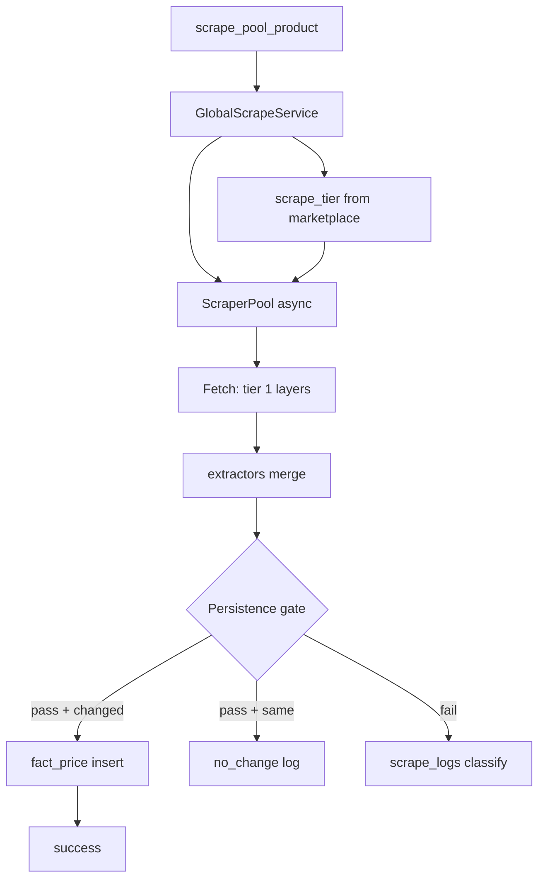
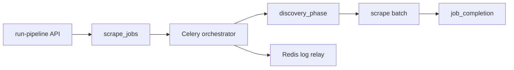
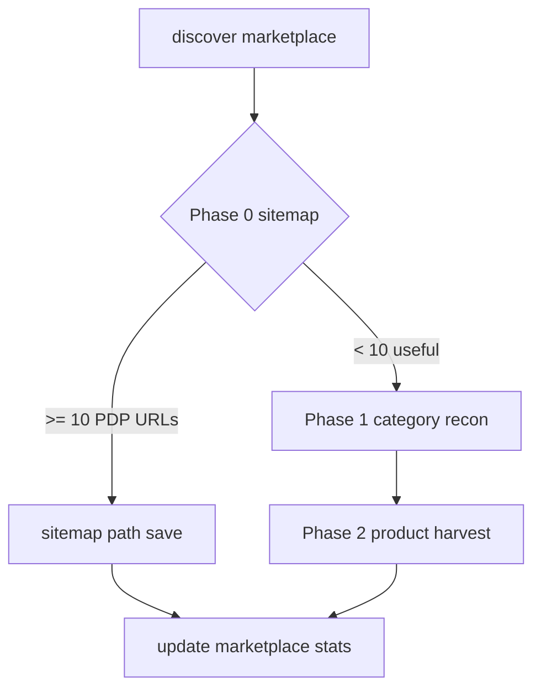

# Imperecta — Backend

**Актуально на:** 2026-06-14 (head `ff781a9`)  
**Стек:** Python 3.12, FastAPI 0.1.x API, SQLAlchemy 2 async/sync, Alembic, Celery, Redis, structlog.

> Архитектурные принципы — см. `ARCHITECTURE_PRINCIPLES.md` (immutable). Этот файл описывает реализацию backend; принципы не дублирует.

---

## 1. Архитектурные правила

1. Домены в `backend/app/modules/<domain>/`.
2. `api.py` — тонкий слой; `service.py` — бизнес-логика без FastAPI.
3. HTTP → `AsyncSession` (`get_db`); Celery → `sync_session_factory`.
4. Async scrape в воркере → `_run_coro_in_worker()` (при активном loop — `ThreadPoolExecutor` + `asyncio.run`).
5. ORM только в `backend/app/models/`.
6. Structured logging; без `print()`.

---

## 2. `main.py`

### Lifespan (порядок)

| # | Действие |
|---|----------|
| 1 | `alembic upgrade head` — subprocess, env `DATABASE_URL`, timeout 600s |
| 2 | `ensure_superuser` — до 10 попыток, sleep 2s |
| 3 | `create_all` safety net |
| 4 | `create_task(_setup_telegram_webhook)` |

### Роутеры (`prefix="/api"`)

Все роутеры собираются в один список и монтируются под единым `prefix="/api"` (`main.py:147-161`):

| Router (модуль) | Mount path |
|--------|--------|
| `core.api_admin.router` | `/admin` |
| `admin.api_parsing.router` | `/admin/parsing` |
| `auth.api.router` | `/auth` |
| `users.api.self_router` | `/users` |
| `users.api.admin_router` | `/admin/users` (admin-side user CRUD) |
| `telegram.api.router` | `/telegram` |
| `marketplaces.api.router` | (внутренний prefix модуля) |
| `product_pool.api.router` | `/pool` |
| `product_pool.api.markets_overview_router` | `/markets` (overview/aggregate) |
| `market_data.api.router` | `/markets` (forex/crypto/commodities/fuel) |
| `entitlements.api.router` | `/entitlements` |
| `ai_analyst.api.router` | (внутренний prefix модуля) |

**Удалены / отсутствуют:** `dashboard/`, `analytics/`, `digests/`, `alerts/`, `user_products/api_*` — модули или пустые, или удалены полностью. Frontend pages для `/competitors`, `/alerts`, `/digests` сохранены без backend.

**Не подключены в main.py:** `scraper/api.py` (admin-internal diagnostics), `classifier`, `ingestion` (внутренние Tier-1 контракты, без HTTP-surface).

### Health

- `GET /health` — liveness для Railway.
- `GET /api/health` — `db`, `redis`, `db_pool` (size, checked_out, overflow).

---

## 3. `config.py` — Settings

| Группа | Поля |
|--------|------|
| Core | `database_url`, `redis_url`, `jwt_secret`, `jwt_algorithm`, expiration minutes/days |
| AI / email | `claude_api_key`, `claude_model`, `resend_api_key`, `email_from` |
| Market data | forex/crypto/commodities/fuel URLs, `goldapi_key`, `alpha_vantage_key`, timeout, retries |
| Telegram | `telegram_bot_token`, `telegram_webhook_secret` (**обязателен** с token), `app_url` |
| Proxy / Decodo | `proxy_list`, sticky, country routing, `decodo_*`, `decodo_enabled` |
| Deploy | `sentry_dsn`, `allowed_origins`, `app_env`, `port`, `debug` |
| Scraper | `discovery_max_pages_per_run` (5000), `discovery_no_quota_limit` (200000), `scrape_pool_batch_size` (1000), `scrape_pool_max_listings_per_run` (200000) |
| Bootstrap | `bootstrap_admin_email/password` (пара) |

**URL:** `postgresql://` → `postgresql+asyncpg://`.

---

## 4. Модули

### 4.1 `core` + `auth`

- **Auth (`modules/auth/`):** register, login, refresh, me, change-password — отдельный Tier-1 модуль, не подпакет `core/`.
- **JWT decode (Tier-0):** `app/common/security.py` → `decode_token()`. Используется `common/deps.py` без зависимости вверх в Tier-1; `modules/auth/service.py` реэкспортирует для обратной совместимости (commit `50a93e3`).
- **Admin (`core/api_admin`):** `/admin/stats`, claude-status, clear-pool.
- **Telegram (`core/api_telegram`):** webhook с проверкой secret header.
- **Plans:** entitlements (`app/entitlements/plan.py`).

### 4.2 `admin` — parsing control plane

**Файлы:** `api_parsing.py`, `parsing_admin.py` (`ParsingAdminService`).

**Auth:** все маршруты — `get_current_superuser`.

#### Endpoints `/api/admin/parsing`

| Method | Path | Назначение |
|--------|------|------------|
| GET | `/test-marketplaces` | Карточки для UI |
| POST | `/run-pipeline` | Создать job + enqueue Celery |
| POST | `/run-full-test` | Deprecated alias |
| GET | `/pipeline-runs` | История (limit query) |
| GET | `/test-runs` | Deprecated alias |
| POST | `/cancel-active-job` | Отмена + revoke Celery |
| GET | `/job-status/{job_id}` | Polling статуса |
| GET | `/worker-log-relay` | Redis log tail (`after`, `limit`≤200, `job_id`) |
| GET | `/users-detailed` | Список users (`limit`≤2000) |
| POST | `/users` | Создание user |
| PATCH | `/users/{id}` | Профиль, plan, language |
| PATCH | `/users/{id}/status` | activate/deactivate |
| PATCH | `/users/{id}/role` | superuser on/off |
| POST | `/users/{id}/reset-password` | Сброс пароля |
| DELETE | `/users/{id}` | Удаление |
| GET | `/marketplaces-detailed` | Пагинация `page`, `page_size`≤100 |
| GET | `/job-live-feed/{job_id}` | Steps из `scrape_logs` |
| GET | `/active-job` | Текущий running pipeline |
| GET | `/pipeline-status` | Running → latest → idle (`PipelineStatusPanel`) |

#### Stale job handling

`ParsingAdminService` при чтении active/status/runs:

- `STALE_PIPELINE_TIMEOUT_MINUTES = 30` — idle running → failed  
- `STALE_QUEUED_TIMEOUT_MINUTES = 5`  
- `STALE_DISPATCH_TIMEOUT_MINUTES = 10`  
- Metadata error: `stale_pipeline_timeout: idle_for_seconds=…`

#### Metadata contract (JSONB в `scrape_jobs.config`)

Рекомендуемая форма (backward-compatible):

```json
{
  "timings": { "discovery_ms", "scrape_ms", "persist_ms", "total_ms" },
  "summary": { "listings_created", "prices_saved", "errors_count" },
  "per_marketplace": [{ "marketplace_id", "domain", "status", ... }],
  "current_stage": "discovery|scrape|...",
  "last_activity_at": "ISO8601",
  "celery_task_id": "..."
}
```

### 4.3 `scraper`

См. **Часть II** (ниже).

**Discovery (`discovery.py`):**

- `DiscoveryCrawler.discover(deadline_monotonic?)` — cooperative 900s budget, inner job type `discovery`.
- **Phase 0:** sitemap (300s budget) + content-aware filter.
- **Phase 1:** category recon (BFS, schema-aware classifier).
- **Phase 2:** product harvest + `CATEGORY_CONVERGENCE_STREAK=3`.
- **Resumable save:** `sitemap_resume_offset` (`016`), `recon_frontier_state` (`017`), `category_resume_index` (`018`); batch 500; inner job `partial` (`019`).
- **Phase 2 cooperative deadline:** `_headroom_deadline`, `_phase2_product_harvest` → `exhausted_budget`; `partial_budget` на category path.
- **Tick mode:** `parent_job_id`, `inner_job`; `discover_one_marketplace` + `orchestrator_tick`.
- Timeouts: `SITEMAP_PHASE_BUDGET_SECONDS=300`, `DISCOVERY_PER_MARKETPLACE_BUDGET_SECONDS=900`, `SITEMAP_TIMEOUT_COOLDOWN_HOURS=24`.

**Page analysis (`scraper_pool.py`):**

- `scrape_page_for_analysis(url, static_fetch=True)` — HTML + BeautifulSoup для discovery.
- `fetch_sitemap_candidates(base_url)` — robots.txt, nested sitemaps, XML validation, Playwright fallback.

**Classification (`extractors.py`):**

| Function | Used by | Strategy |
|----------|---------|----------|
| `classify_page_role_for_discovery` | `discovery.py`; **`merge_and_finalize`** (scrape) | Layer 1: `og:type`; Layer 2: JSON-LD `@type`; Layer 2.5: microdata top-level `itemtype`; Layer 3: structural fallback |
| `classify_page_role` | Layer 3 fallback only | JSON-LD + DOM repetition + price density |

**`merge_and_finalize`:** если role `listing`/`hub` → `merge_skipped_non_pdp_page`, пустой extract (раньше structural classifier давал false listing на PDP с блоками «похожие товары»).

Тесты: `test_schema_aware_discovery.py`, `test_pipeline_scoped_marketplaces.py`.

**Pipeline scrape scope (`tick_orchestrator.py` + `tasks.py`):**

```text
metadata.marketplace_codes → mp_queue snapshot (на первом тике)
                          → discover_one_marketplace (per MP, до MAX_PARALLEL_DISCOVERY=2)
                          → scrape_one_marketplace   (per MP, до MAX_PARALLEL_SCRAPE=2)
                          → JOIN dim_marketplace WHERE marketplace_code IN (...)
```

Monolith-путь (`run_full_pipeline_test`, `FullPipelineOrchestrator`, `_run_scrape_all_pool`) удалён в `868251a` (O4c). Tick — единственный dispatch. Standalone `scrape_all_pool_products` (батч-задача без pipeline-контекста) сохранён.

**Pipeline package:**

| Файл | Роль |
|------|------|
| `tick_orchestrator.py` | `run_tick` — единственная state-machine pipeline-а; serialized per-parent через session-level `pg_advisory_lock` (O5b, `a82fa48`/`ff781a9`) |
| `discovery_phase.py` | Single-MP discovery worker для `discover_one_marketplace`; `deadline_monotonic`; Z1 reap safety net |
| `job_completion.py` | Финализация parent job; `partial`-aware rollup из children (O5a, `09f1dc2`) |
| `metadata_store.py` | Read/write `scrape_jobs.config["metadata"]`, `touch(stage=…)`, `marketplace_codes_filter` |
| `cancellation.py` | Cancel checks, revoke task |
| `activity_pulse.py` | Heartbeat в metadata |
| `worker_log_relay.py` | Redis relay + logging handler |
| `child_aggregation.py` | `aggregate_discovery_children` — seed для `complete_pipeline_job` на complete-фазе |

### 4.4 Остальные модули

- **marketplaces** — CRUD, `requires_js`, discovery config JSONB.
- **product_pool** — search, stats, MV health; `display_currency` query → `CurrencyConverter`.
- **user_products** — products + import; competitors API не в main.
- **market_data** — providers + `ingest_market_data`.
- **dashboard / analytics** — read aggregations.
- **ai_analyst** — sessions, Claude, api_logs.
- **alerts / digests** — tasks mostly stubs; alerts router не в main.

---

## 5. Celery

### `celery_app.py`

- Broker: `redis_url`; `rediss://` → `broker_use_ssl` CERT_NONE.
- **backend=None** — без result backend (Upstash limits).
- `broker_pool_limit=5`, retry policy.
- Includes: scraper, alerts, digests, market_data, cleanup, maintenance.

### `scheduler.py`

Beat включает reaper + infra (см. `scheduler.py`); **не** включает discovery/scrape cron.

### Задачи

| name | Модуль |
|------|--------|
| `discover_all_marketplaces` | scraper |
| `discover_single_marketplace` | scraper |
| `discover_one_marketplace` | scraper — child discovery per MP |
| `scrape_one_marketplace` | scraper — child scrape per MP (`job_type='scrape'`, миграция `022`) |
| `orchestrator_tick` | scraper — единственный pipeline dispatch (после O4c) |
| `reap_orphan_jobs` | `workers/reaper_tasks.py` (Beat 300s) |
| `scrape_all_pool_products` | scraper |
| `scrape_pool_product` | scraper (soft 120s / hard 150s) |
| `check_pool_completeness` | scraper |
| `ingest_market_data` | market_data |
| `ingest_commodities` | market_data |
| `cleanup_old_data` | workers |
| `refresh_materialized_views` | workers |
| `ensure_fact_price_partitions` | workers — rolling +3 months (`fact_price_YYYYMM`); дополняет Alembic `015` |
| alert/digest tasks | stubs |

---

## 6. Display currency (`app/common/currency.py`, `app/common/marketplace_locale.py`)

| Компонент | Роль |
|-----------|------|
| `CurrencyConverter.load_latest` | Курсы из `fact_currency_rate` (max `date_id`); fallback — live `fetch_forex_rates("EUR")` |
| `normalize_display_currency` | `local` \| `EUR` \| `USD` |
| `apply_display_price_fields` | `(display_price, display_currency, conversion_available)` + **`local_currency_resolution`** |
| `resolve_local_currency` / `resolve_local_currency_from_parts` | TLD → country (`TLD_TO_COUNTRY`) → currency (`COUNTRY_TO_CURRENCY`); fallback `country_code`, then parsed listing currency |

**Режим `local` (`0fb6ac2`):**

- Предпочитает TLD домена над `dim_marketplace.country_code` (storefront country vs registration).
- Ответ включает `local_currency_resolution: { currency, source }` где `source` ∈ `tld`, `country_code`, `parse_currency`, `unknown`.
- При невозможности resolve → `local_currency_unavailable=true` (UI отключает local toggle).

**Принцип:** нет mock/fallback курсов — при отсутствии rate `conversion_available=false`.

**API с `display_currency` query:**

- `GET /api/products` (`user_products/api_products.py`)
- `GET /api/pool/*` (`product_pool/api.py`, `service._apply_display_currency`)
- `GET /api/dashboard/...` / markets overview (`dashboard/api.py`, `markets` API)

---

## 7. Tiered scrape (`scraper_pool.py` + `service.py`)

**Migration 014:** `dim_marketplace.scrape_tier INTEGER NOT NULL DEFAULT 1`, CHECK `(1,2,3)`, index `idx_marketplace_scrape_tier`.

**Runtime:**

```text
GlobalScrapeService.scrape_product(listing_id)
  → mp = DimMarketplace
  → scrape_tier = int(mp.scrape_tier)  # default 1
  → ScraperPool.scrape_product(..., requires_js=mp.requires_js, scrape_tier=scrape_tier)
  → _layer_order(requires_js, scrape_tier)
```

| Constant | Value |
|----------|-------|
| `_SUPPORTED_SCRAPE_TIERS` | `{1}` — только tier 1 в проде |
| `_KNOWN_SCRAPE_TIERS` | `{1, 2, 3}` — контракт БД |

**Tier 1 layer order — policy B (`1de44f1`):**

- `requires_js=False` (server-rendered): **httpx** → decodo (if configured) → playwright — httpx-first экономит Decodo quota на SSR-магазинах.
- `requires_js=True` (JS-only): **decodo** (if configured) → playwright → httpx — httpx не исполняет JS, потому ведёт JS-capable транспорт; httpx остаётся последним fallback'ом, т.к. часть «JS» страниц всё же отдаёт SSR-фрагмент.
- Decodo не сконфигурирован: `decodo` исключается из последовательности.

Источник `requires_js` сегодня — статическая колонка `dim_marketplace.requires_js`; replacement на структурный детектор по результату первого fetch — registry-item Z-JSDETECT (вне scope текущей фазы).

`scrape_tier` читается из `dim_marketplace` через `int(mp.scrape_tier) if mp and mp.scrape_tier is not None else 1` — защита от транзиентного `None` на свежесозданных строках до flush (`9b7d012`).

**Tier 2/3:** `NotImplementedError` с явным сообщением (misconfiguration не маскируется).

**Тесты:** `test_tiered_scrape_strategy.py`.

Параметр `scrape_tier` также на `_fetch_raw`, `_fetch_static`, `scrape_page_for_analysis` (discovery static fetch).

---

## 8. `GlobalScrapeService` (ключевые константы)

| Константа | Значение |
|-----------|----------|
| `LISTING_DEACTIVATE_AFTER_ERRORS` | 15 → `is_active=false` |
| `MAX_CURRENCY_RAW_LEN` | 50 |
| `_MAX_ABS_PRICE_CHANGE_PCT` | 9_999.9999 |

**Runtime DB repair** (legacy drift): при ошибке constraint/column — auto `ALTER` scrape_logs status VARCHAR(50) и CHECK.

**Persistence gate** (все условия для `fact_price`):

1. `product_name` или `title`  
2. `price > 0`  
3. `currency` non-empty  
4. `len(currency_raw) < 50`  
5. currency ∈ marketplace whitelist  

Логи: `EXTRACTED_DATA`, `PERSISTENCE_GATE`, `PRICE_UNCHANGED`, `LISTING_DEACTIVATED`, `pool_scrape_done`.

---

## 9. Entitlements API surface

`UserPlan`: trial, starter, business, pro, enterprise.  
`Feature.AI_ANALYST` — только PAID_FULL tier.  
Проверки в API guards и на фронте (`useEntitlements`, `AIAnalystRoute`).

---

## 10. Исключения и ошибки

- `app/common/exceptions.py` — доменные типы.
- Scrape: статусы `scrape_logs` — см. Parsing doc.
- API: HTTPException из parsing admin (`404` job not found).

---

## 11. Maintenance: `fact_price` partitions

**Проблема (prod, 2026-06-02):** migration `009` создала RANGE `fact_price`, но не все месяцы 2026 были покрыты → scrape INSERT падал.

**Migration `015`:** `fact_price_202606` … `fact_price_202612` + `fact_price_default` (DEFAULT partition — safety net).  
**Migration `016`–`018`:** resumable discovery columns on `dim_marketplace`.  
**Migration `019`:** `partial` in `scrape_jobs.status`.  
**Migration `020`:** `parent_job_id` self-FK on `scrape_jobs` (head).

**Celery `ensure_fact_price_partitions`:** создаёт партиции на **следующие 3 календарных месяца** (`CREATE TABLE IF NOT EXISTS`). Beat: daily 00:00 (`scheduler.py`).

---

## 12. Тесты

`backend/tests/` — API contract, scraper unit/integration, parsing admin.  
Конфиг: `backend/pyproject.toml` (`asyncio_mode=auto`, marker `integration`).

### Локальный запуск pytest

1. `pip install -r requirements.txt pytest pytest-asyncio httpx`
2. Postgres `imperecta_test` + Redis (например `docker compose up -d postgres redis`)
3. **`backend/.env`** с полным набором `Settings` (см. `app/config.py`) — корневой `.env` не подхватывается автоматически
4. `alembic upgrade head` на test DB
5. `cd backend && pytest tests -v` или `pytest -m "not integration"` для unit-only

**Блокер без env:** `conftest.py` импортирует `app.main` → `Settings()`; пустые `setdefault("", …)` дают ValidationError. CI использует GitHub Secrets `TEST_*` (см. `.github/workflows/ci.yml`).

**Не использовать Supabase prod** как test DB.

---

## 14. Детальная логика элементов

### 14.1 `main.py` — lifespan и routing

| Шаг | Логика |
|-----|--------|
| Alembic | Subprocess `alembic upgrade head`, env `DATABASE_URL`, timeout 600s; warn on fail, не блокирует навсегда |
| Superuser | `ensure_superuser` до 10× retry, sleep 2s — bootstrap admin из Settings |
| create_all | Safety net если migration пропустила таблицу |
| Telegram | Background `setWebhook` с secret header |
| Routers | 12 domain routers под `/api`; scraper/alerts routers **не** mounted |

**Health:** `/health` liveness; `/api/health` — ping DB, Redis, pool stats.

---

### 14.2 `auth` + `core` — auth, admin stats, Telegram

| Компонент | Логика |
|-----------|--------|
| **Auth API (`modules/auth/api.py`)** | Register → hash password; Login → JWT access+refresh; Refresh → rotate; Me → current user |
| **JWT decode (Tier-0)** | `app/common/security.py` → `decode_token()`. `common/deps.py` импортирует напрямую; `modules/auth/service.py` re-exports as `noqa: F401` для обратной совместимости |
| **Admin stats** | Aggregates для Market Overview cards |
| **Telegram webhook** | Verify `X-Telegram-Bot-Api-Secret-Token`; reject if secret missing when bot token set |
| **Entitlements** | `plan.py`: `UserPlan` → `ServiceTier` → feature flags (AI only PAID_FULL) |

---

### 14.3 `admin/parsing_admin.py` — ParsingAdminService

| Метод | Логика |
|-------|--------|
| `trigger_full_pipeline_test` | `_fail_stale` → reject if active running → create `ScrapeJob(full_pipeline_test, running)` + metadata dispatching + optional `marketplace_codes` → commit (auto-repair job_type CHECK on IntegrityError) |
| `get_active_pipeline_job` | Latest running full_pipeline_test |
| `get_job_status` | `_fail_stale` → merge runtime activity → discovery progress helper |
| `cancel_active_pipeline_job` | Revoke Celery + parent failed + error `pipeline_cancelled_by_admin` |
| `_fail_stale_running_pipeline_jobs` | См. Parsing §18.12 — idle thresholds 5/10/30 min |
| `get_worker_log_relay` | Delegate to `fetch_relay_lines` |
| User CRUD | Standard CRUD on `users` with plan/language/role validation |

**Constants:** `TEST_PIPELINE_JOB_TYPE = 'full_pipeline_test'`, stale timeouts in minutes.

---

### 14.4 `admin/api_parsing.py`

Thin FastAPI layer: superuser guard → delegate to `ParsingAdminService`; map `ValueError` → HTTP 400/404; enqueue Celery on run-pipeline.

---

### 14.5 Pipeline package (детали — Часть II §18)

| Файл | Ответственность |
|------|-----------------|
| `orchestrator.py` | End-to-end async+sync flow |
| `discovery_phase.py` | Per-MP discovery + **Z1 reap** |
| `job_completion.py` | Parent job finalize (не Z1) |
| `cancellation.py` | Cancel detection + Celery revoke (не Z1) |
| `metadata_store.py` | JSONB read/write/touch |
| `activity_pulse.py` | Heartbeat 15s throttle |
| `worker_log_relay.py` | Redis 500-line buffer |

---

### 14.6 `scraper/tasks.py`

| Task | Логика |
|------|--------|
| `orchestrator_tick` | Single tick state-machine; `_run_async(run_tick(...))`; единственный dispatch pipeline-а |
| `discover_one_marketplace` | Owns child `ScrapeJob` (`job_type='discovery'`); запускает `DiscoveryCrawler.discover` со scoped session |
| `scrape_one_marketplace` | Owns child `ScrapeJob` (`job_type='scrape'`); идемпотентен (терминальные skip; `running` re-owned); внутри — sync `_run_scrape_marketplace_pool` scoped по `marketplace_code` |
| `discover_all_marketplaces` | Async loop all active MP, no per-MP 900s wrapper (standalone, **не** часть pipeline) |
| `discover_single_marketplace` | One UUID (standalone) |
| `scrape_pool_product` | Single listing, soft 120s / hard 150s |
| `scrape_all_pool_products` | Standalone full pool (no scope), **не** часть pipeline |
| `check_pool_completeness` | Listings missing price/image |

**Async in worker:** `_run_async` / `_run_coro_in_worker` pattern.

---

### 14.7 `scraper/service.py` — GlobalScrapeService

| Этап | Логика |
|------|--------|
| Load | `FactListing` + `DimMarketplace` + product |
| Fetch | `ScraperPool.scrape_product(url, requires_js, scrape_tier)` |
| Extract | `merge_and_finalize` → PDP gate |
| Gate | name, price>0, currency, currency_raw len, whitelist |
| Persist | delete same-day price if changed → insert `fact_price` (+ `discount_pct`, + `scrape_job_id` when called from pipeline); else `no_change` |
| Failure | this-run `consecutive_errors`/`last_error` уже сброшены pre-flight; `failure_streak++`; at 15 → `is_active=false` |
| Logs | `_determine_log_status` → `scrape_logs` row |
| Drift repair | Auto ALTER scrape_logs on constraint mismatch |

---

### 14.8 `scraper/scraper_pool.py`

| Функция | Логика |
|---------|--------|
| `_layer_order` | Tier 1 policy B: SSR → `httpx,decodo,playwright`; JS-only → `decodo,playwright,httpx`; tier 2/3 → NotImplementedError |
| `scrape_product` | Iterate layers until success or exhaust |
| `scrape_page_for_analysis` | Static HTML for discovery classify |
| `fetch_sitemap_candidates` | robots.txt → nested XML → Playwright fallback |

---

### 14.9 `scraper/discovery.py`

| Компонент | Логика |
|-----------|--------|
| `_headroom_deadline` | 85% of remaining MP budget for phase work; 15% for finalize |
| `discover(...)` | `deadline_monotonic`, `parent_job_id`, `inner_job` (O2); cooperative budget; `partial` job status |
| `discover_one_marketplace` | Celery O2 — runs discover on pre-created child job |
| `_save_product_urls` | Batch 500; `(new_count, next_offset, exhausted)`; resume offset |
| `_filter_urls_by_role` | Sample/trust/reject sitemap filter |
| `_phase2_product_harvest` | Pagination + convergence + cooperative deadline → `exhausted_budget` |
| `_should_run_sitemap_harvest` | True if `sitemap_resume_offset > 0` or stale harvest |

---

### 14.10 `common/currency.py` + `marketplace_locale.py`

| Функция | Логика |
|---------|--------|
| `CurrencyConverter.load_latest` | Latest `date_id` from `fact_currency_rate`; empty → live forex |
| `normalize_display_currency` | Validate local/EUR/USD |
| `apply_display_price_fields` | Convert price; emit `local_currency_resolution` / `local_currency_unavailable` |
| `resolve_local_currency_from_parts` | TLD → country → ISO currency; sources: `tld`, `country_code`, `parse_currency`, `unknown` |

---

### 14.11 Остальные модули (кратко)

| Модуль | Логика |
|--------|--------|
| **marketplaces** | CRUD `dim_marketplace`; exposes requires_js, scraper_config |
| **product_pool** | Search/listings MV; applies display currency |
| **user_products** | User catalog CRUD + CSV import |
| **market_data** | Provider fetch → fact_* tables; ingest tasks |
| **dashboard/analytics** | Read-only aggregations for UI |
| **ai_analyst** | Claude sessions, api_logs, entitlement gate |
| **workers/maintenance** | `ensure_fact_price_partitions`, MV refresh, cleanup retention |

---

## 15. Источники истины

| Область | Путь |
|---------|------|
| Entry | `backend/app/main.py` |
| Settings | `backend/app/config.py` |
| Parsing API | `backend/app/modules/admin/api_parsing.py` |
| Parsing service | `backend/app/modules/admin/parsing_admin.py` |
| Persist | `backend/app/modules/scraper/service.py` |
| Tiered layers | `backend/app/modules/scraper/scraper_pool.py` (`_layer_order`) |
| Pipeline | `backend/app/modules/scraper/pipeline/` |
| Celery | `backend/app/workers/celery_app.py` |
| Partitions task | `backend/app/workers/maintenance_tasks.py` |
| Migrations 015–020 | `backend/alembic/versions/015_*.py` … `020_*.py` |
| Reaper | `backend/app/workers/reaper_tasks.py` |
| Pipeline status | `parsing_admin.get_pipeline_status`, `api_parsing` GET `/pipeline-status` |
| Display currency | `backend/app/common/currency.py`, `marketplace_locale.py` |
| Entitlements | `backend/app/entitlements/plan.py` |

Связанные документы: `Imperecta_Architecture.md`, `Imperecta_Database.md`, `Imperecta_Frontend.md`.

> **Часть II** ниже — discovery, scrape, pipeline (бывш. `Imperecta_Parsing.md`).

---

# Часть II. Парсинг и сбор данных

**Область:** discovery, scrape, extraction, pipeline, admin control plane, persistence. Ранее — отдельный `Imperecta_Parsing.md`.

---

## 1. Канонический runtime path

```text
Celery tasks.py
    → discovery.py / GlobalScrapeService (service.py)
        → ScraperPool (scraper_pool.py)
            → extractors.py
```

**Нет `engine.py`.** Все fetch+extract только через `ScraperPool`.

---

## 2. Файловая карта

```
backend/app/modules/scraper/
├── tasks.py
├── discovery.py
├── service.py              # GlobalScrapeService + quality gates
├── scraper_pool.py
├── extractors.py
├── proxy_manager.py
├── api.py                  # NOT in main.py
└── pipeline/
    ├── orchestrator.py
    ├── discovery_phase.py
    ├── job_completion.py
    ├── metadata_store.py
    ├── cancellation.py
    ├── activity_pulse.py
    ├── worker_log_relay.py
    ├── child_aggregation.py      # aggregate child discovery jobs
    └── tick_orchestrator.py      # run_tick state machine

backend/app/modules/admin/
├── api_parsing.py
└── parsing_admin.py
```

---

## 3. Celery tasks

| Task | Purpose |
|------|---------|
| `discover_all_marketplaces` | All active MP |
| `discover_single_marketplace` | One UUID (standalone) |
| `discover_one_marketplace` | One child `ScrapeJob` per MP (`job_type='discovery'`); `acks_late`, soft 900s / hard 960s |
| `scrape_one_marketplace` | Per-MP scrape child (`job_type='scrape'`, миграция `022`); `acks_late`, soft 900s / hard 960s; идемпотентен под `acks_late` (терминальные skip; `running` re-owned, listing-level resilient) — O4a/O4b (`82a92d4`, `a003d60`) |
| `orchestrator_tick` | Один tick state-machine'а; soft 120s / hard 150s; adaptive re-enqueue. **Единственный** dispatch pipeline-а после O4c (`868251a`) |
| `scrape_all_pool_products` | Batch stale listings (полный pool, без `marketplace_codes`) — отдельная батч-задача, **не** часть pipeline |
| `scrape_pool_product` | Single listing (120s/150s limits) |
| `check_pool_completeness` | Missing price/image |
| `reap_orphan_jobs` | Beat: fail stuck `running` scrape_jobs (SIGTERM/deploy) |

**Beat** (`scheduler.py`): `orphan-job-reaper` (300s), partitions daily, MV refresh hourly, cleanup 03:00. **Discovery/scrape cron off** — manual via admin API.

**Pool query:** respects `is_active=true`; deactivated listings skipped.

---

## 4. Full pipeline orchestrator (tick-only)

**Module:** `tick_orchestrator.run_tick` | **Entry:** `orchestrator_tick` (soft 120s / hard 150s per tick) | **Enqueue:** `api_parsing._enqueue_pipeline_run` создаёт parent `ScrapeJob` (`job_type='full_pipeline_test'`, `parent_job_id IS NULL`) и кладёт первый тик в очередь.

Monolith-режим (`FullPipelineOrchestrator`, `run_full_pipeline_test`, `_run_scrape_all_pool`, `Settings.orchestrator_mode`) полностью удалён в O4c (`868151a`/`868251a`). Tick — единственный путь.

### 4.1 Phase machine

| `metadata.phase` | Работа |
|------------------|--------|
| `discovery` | Fan-out до `MAX_PARALLEL_DISCOVERY=2` через `discover_one_marketplace` (по одному child `ScrapeJob` на MP; `mp_queue` — snapshot активных MP с применённым `marketplace_codes` filter) |
| `scrape` | Fan-out до `MAX_PARALLEL_SCRAPE=2` через `scrape_one_marketplace` (по одному child `ScrapeJob` на MP, `job_type='scrape'`, миграция `022`); O4b (`a003d60`) — параллелизация фазы scrape по MP |
| `complete` | `aggregate_discovery_children` → `complete_pipeline_job`; status rollup из children с учётом `partial` (O5a, `09f1dc2`) |

**Scoped run:** `marketplace_codes` из metadata фильтрует `mp_queue` на первом тике (через `PipelineMetadataStore.marketplace_codes_filter` + `_load_active_marketplace_codes`). Standalone `scrape_all_pool_products` — без scope, весь active pool, и **не** часть pipeline.

### 4.2 Per-parent advisory lock (O5b)

`run_tick` сериализуется per-parent через session-level Postgres advisory lock (a82fa48 → ff781a9):

```sql
SELECT pg_try_advisory_lock(hashtextextended('orchestrator_tick:' || <parent_uuid>, 0))
```

- **Single-key bigint форма** (`pg_try_advisory_lock(bigint)`). Двух-аргументная форма `(int4, int4)` отвергнута: `hashtextextended → bigint`, не помещается в `int4`. Прежняя SQL `pg_try_advisory_lock(:ns, hashtextextended(:pid, 0))` падала с `function pg_try_advisory_lock(unknown, bigint) does not exist` и роняла tick — фикс в `ff781a9`.
- **Префикс `orchestrator_tick:`** изолирует пространство ключей от любых других пользователей advisory-locks в 64-bit single-key namespace.
- **Session-level (НЕ `_xact_lock`)** — у `run_tick` четыре `db.commit()` + commits внутри `store.touch()`; xact-lock освободился бы на первом коммите задолго до dispatch loop.
- **Recovery on acquire failure** (ff781a9): захват lock'а обёрнут в `try/except`; при транзиентной ошибке коннекта/asyncpg → `_reenqueue(parent, TICK_MIN_SECONDS)` с возвратом `{"status":"lock_error"}`. Tick **не** молча умирает в ожидании `reap_orphan_jobs` (600s heartbeat).
- **Concurrent tick → `{"status":"locked"}`** — re-enqueue **не** делается, потому что держатель locka сам себя re-enqueue в конце своего тика.
- **Unlock в `finally`**: `pg_advisory_unlock(...)`; ошибка unlock'а логируется и **не** маскирует результат тика (session-level lock автоматом освобождается на закрытии коннекта).

### 4.3 Tick re-enqueue / адаптивный backoff

| Возврат `run_tick` | Re-enqueue |
|--------------------|------------|
| `dispatched` (есть работа) | `TICK_MIN_SECONDS` |
| `idle` (нет работы, есть active children) | `metadata.backoff_s` (адаптивный) |
| `locked` (соседний tick держит lock) | **не делается** (держатель re-enqueue сам) |
| `lock_error` (acquire упал) | `TICK_MIN_SECONDS` |
| `complete` / `not_found` / `stopped` / `unknown_phase` | **не делается** |

### 4.4 Reap & reconcile (per-tick)

Перед dispatch loop: каждый тик прогоняет inline reap stale running children (per-MP cutoff'ы; для scrape — `SCRAPE_CHILD_RUNNING_REAP_SECONDS`) и reconcile pending children (`CHILD_PENDING_RECONCILE_SECONDS=120` — re-`apply_async` потерянных pending без вставки дубликатов).

### Metadata (`PipelineMetadataStore`)

Stored in `scrape_jobs.config["metadata"]`:

- `current_stage`, `last_activity_at`, `celery_task_id`
- `marketplace_codes` optional filter
- `discovery_errors` (max 20)
- `timings`, `summary`, `per_marketplace[]`

`activity_pulse` updates heartbeat during long phases.

### Cancellation

- `is_pipeline_job_cancelled` between phases
- Admin `POST /cancel-active-job` + Celery revoke
- Error token `pipeline_job_cancelled` in discovery_errors

### Stale detection (admin service)

On API read: jobs idle >30 min (running), >5 min (queued), >10 min (dispatch) → auto-failed with `stale_pipeline_timeout` in metadata.

### Orphan job reaper (`reaper_tasks.py`, `e2369b8`)

Внешний reaper (Celery Beat, 300s) — complement Z1 in-process reap:

| Job type | Порог |
|----------|--------|
| `discovery` | 900s budget + 300s grace |
| `full_pipeline_test` | heartbeat stale 600s |
| прочие | 3600s max runtime |

Помечает `status=failed` зависшие `running` после Railway SIGTERM / worker loss.

### Distributed dispatch (parent / child граф)

| Компонент | Суть |
|-----------|------|
| migration `020` | `parent_job_id` self-FK + `idx_scrape_jobs_parent_status` |
| migration `022` | `ck_scrape_jobs_job_type` расширен на `'scrape'` (O4a, `82a92d4`) |
| `discover_one_marketplace` | Celery child per MP, `job_type='discovery'` |
| `scrape_one_marketplace` | Celery child per MP, `job_type='scrape'`, идемпотентен под `acks_late` (O4a/O4b) |
| `orchestrator_tick` + `run_tick` | Dispatch, reap, reconcile, advisory-lock, phase machine |
| `aggregate_discovery_children` | Seed для `complete_pipeline_job` |
| Parent rollup | `complete_pipeline_job` агрегирует child-статусы с учётом `partial` (O5a) |

### Admin pipeline status API

`GET /api/admin/parsing/pipeline-status` — running → latest terminal → idle; `partial` → frontend `completed` (`_to_frontend_status`). UI: `PipelineStatusPanel` + `usePipelineStatus` (5s).

---

## 5. Worker log relay

| Constant | Value |
|----------|-------|
| Redis key | `pipeline:worker_deploy_log` |
| Max lines | 500 |
| Loggers | `app.modules.scraper`, `celery.*` |
| Line max len | 480 chars |

**API:** `GET /worker-log-relay?after=&limit=&job_id=`  
- Filters lines by `job_id` when provided  
- Response `visible_lines: 3`  

**Frontend:** `WorkerLogRelayPanel` — 2s poll, cursor buffer 120 lines.

---

## 6. Discovery (`discovery.py`)

### 6.1 Общий поток `discover()`

**Сигнатура:** `discover(marketplace, *, deadline_monotonic=None, parent_job_id=None, inner_job=None)` — cooperative deadline (Level 3).

1. Inner `scrape_jobs` (`job_type=discovery`): insert `running` (legacy) или promote `inner_job` из `pending` (γ-orchestrator, `parent_job_id`).
2. Quota: `product_quota` / `discovery_no_quota_limit`.
3. **Phase 0** sitemap (budget 300 s) → если ≥10 PDP URLs → **sitemap path** с resumable save.
4. Иначе **category path**: Phase 1 recon + Phase 2 harvest (convergence streak).
5. Статусы: `completed`, `partial`, `partial_budget`, `error`, `no_categories`.
6. Обновляет `last_discovery_*`, `products_in_pool`, `sitemap_resume_offset`, inner job.

### 6.1a Universal timeout policy (три уровня)

| Level | Константа | Значение | Действие |
|-------|-----------|----------|----------|
| 1 | `SITEMAP_PHASE_BUDGET_SECONDS` | 300 s (5 min) | `wait_for` на Phase 0 → fall through к category path, cooldown 24 h |
| 2 | `SAVE_BUDGET_HEADROOM_FRACTION` | 0.85 | `_headroom_deadline()` — 85% оставшегося MP-budget на Phase 2 / sitemap save; 15% — finalize |
| 3 | `DISCOVERY_PER_MARKETPLACE_BUDGET_SECONDS` | 900 s (15 min) | `deadline_monotonic` в `discover()`; cooperative exit → `partial_budget` |

**Cooldown sitemap timeout:** `SITEMAP_TIMEOUT_COOLDOWN_HOURS = 24` (дольше bad-harvest 1 h).

### 6.1b Resumable sitemap save (`4bad080`, migration `016`)

Большие sitemap (49k+ URL) не укладываются в 15 min. Механизм:

1. `dim_marketplace.sitemap_resume_offset` (INTEGER, default 0) — абсолютный индекс в списке PDP URLs.
2. `_save_product_urls(urls, start_offset, deadline_monotonic)` → `(new_count, next_offset, exhausted_budget)`.
3. Commit каждые `SAVE_PRODUCT_URLS_BATCH_SIZE` (500); deadline проверяется **после** commit, не mid-flush.
4. При `exhausted_budget` и `next_offset < len(batch)` → `sitemap_resume_offset = next_offset`, status `partial_budget`.
5. При полном проходе → `sitemap_resume_offset = 0`.
6. `_should_run_sitemap_harvest`: `True` если offset > 0 (продолжить даже при fresh harvest timestamp).

Следующий pipeline run продолжает с offset; dedup через `url_hash` / `existing_hashes`.

### 6.1c Phase 2 cooperative deadline (`4d42623`)

Category crawl получил тот же cooperative budget, что и sitemap save:

1. **`_headroom_deadline(deadline_monotonic)`** — статический helper; уменьшает hard deadline на `SAVE_BUDGET_HEADROOM_FRACTION` (0.85). Вызывается в `discover()` **один раз** перед Phase 2 / sitemap save; внутри фаз deadline **не** сжимается повторно.
2. **`_phase2_product_harvest(..., deadline_monotonic)`** → `(total_saved, exhausted_budget)`.
3. Проверки deadline: перед каждой category URL; перед каждой pagination page; после `_save_product_urls` если `save_exhausted`.
4. При `exhausted=True` → `discover()` ставит `partial_budget` (как при незавершённом sitemap offset).
5. Логи: `discovery_phase2_budget_exhausted`, `discovery_phase2_converged` (convergence — отдельный early exit).

**Итог:** `partial_budget` возможен и на **sitemap path** (offset), и на **category path** (Phase 2 не дошёл до конца). Следующий pipeline run продолжает с того же marketplace (offset или category crawl).

### 6.2 Phase 0 — content-aware sitemap (`_phase0_sitemap_harvest`)

```text
fetch_sitemap_candidates(base_url)     # ScraperPool: robots, XML, nested index
        ↓
_filter_urls_by_role(raw_urls)        # classify_page_role_for_discovery per URL (or sample)
        ↓
only role == 'product' → save path
```

**Константы:**

| Constant | Value | Role |
|----------|-------|------|
| `SITEMAP_STALE_DAYS` | 3 | Cooldown между harvest |
| `SITEMAP_MIN_USEFUL_URLS` | 10 | Порог «успешного» sitemap |
| `SITEMAP_FULL_CLASSIFY_LIMIT` | 100 | Полная классификация всех URL |
| `SITEMAP_SAMPLE_SIZE` | 50 | Размер sample для больших sitemap |
| `SITEMAP_TRUST_THRESHOLD` | 0.80 | ≥80% sample = product → trust all URLs |
| `SITEMAP_REJECT_THRESHOLD` | 0.20 | <20% sample = product → reject bulk |
| `SITEMAP_CLASSIFY_CONCURRENCY` | 8 | Semaphore на HTTP classify |
| `SITEMAP_BAD_HARVEST_RETRY_HOURS` | 1 | Повтор при плохом harvest вместо 3d cooldown |

**Bad harvest:** `last_sitemap_harvest_at` сдвигается так, чтобы retry через ~1h; `sitemap_url` не обновляется.

**Fetch sitemap XML** (`scraper_pool.fetch_sitemap_candidates`):

- `robots.txt` → `Sitemap:` lines  
- Fallback paths: `/sitemap.xml`, `/sitemap_index.xml`, …  
- Static fetch + `_looks_like_sitemap_xml`; Playwright render fallback  
- Caps: `SITEMAP_MAX_SUBFILES`, `SITEMAP_MAX_URLS` (extractors)

### 6.3 Schema-aware classifier (`classify_page_role_for_discovery`)

**Используется в discovery** (sitemap, BFS) **и в scrape** (`merge_and_finalize` — gate перед merge extractors). Отдельная функция от structural `classify_page_role`.

**Четыре слоя (по убыванию надёжности):**

| Layer | Signal | Mapping |
|-------|--------|---------|
| 1 | Open Graph `og:type` | `product` / `product.group` / `product.item` → **product**; `website` → **hub**; `article` / `blog` / `news` → **listing**; иное → layer 2 |
| 2 | JSON-LD root `@type` only | `Product`, `IndividualProduct`, `ProductModel` → **product** (побеждает Breadcrumb на PDP); `CollectionPage`, `ItemList`, `SearchResultsPage`, `Article`, … → **listing**; `WebPage`, `AboutPage`, … → **hub** |
| 2.5 | HTML5 Microdata top-level `itemtype` (`5d6d4fa`) | `_get_microdata_toplevel_types` — только itemscope без внешнего itemscope-родителя; Product → **product**; ItemList/OfferCatalog → **listing** |
| 3 | Fallback | `classify_page_role()` — DOM repetition + price density |

**Зачем отдельная функция:** на реальном PDP блок «похожие товары» даёт repeated-DOM сигнал listing; structural classifier ошибочно отбрасывал PDP. Слои 1–2 опираются на явную разметку автора сайта, не на grid.

**Helpers:** `_get_og_type`, `_get_jsonld_root_types` (только top-level `@type`, не nested offers/rating).

### 6.3b `merge_and_finalize` и PDP gate

Перед merge результатов extractors вызывается `classify_page_role_for_discovery(soup, page_url)`:

- `listing` / `hub` → log `merge_skipped_non_pdp_page`, возврат пустого `ExtractedProduct` (цена не пишется).
- `product` / `unknown` → обычный merge JSON-LD / meta / selectors.

**Проблема, которую решает:** structural `classify_page_role` на PDP с 6+ карточками «похожие товары» давал `listing` → 0% `prices_saved`.

### 6.3c `classify_page_role` (structural fallback only)

| Role | Сигналы |
|------|---------|
| `product` | JSON-LD Product; 1–5 prices, нет product grid |
| `listing` | ItemList/OfferCatalog; repeated DOM + prices |
| `hub` | Нет цен, нет grid |
| `unknown` | Inconclusive |

Только Layer 3 внутри `classify_page_role_for_discovery` (после Layer 2.5 microdata).

**Тесты:** `test_schema_aware_discovery.py` — og:product, og:website, og:article, JSON-LD Product + Breadcrumb, microdata Product, plain fallback.

### 6.4 Phase 1 — category recon (`_phase1_category_recon`)

- BFS depth ≤ `RECON_BFS_MAX_DEPTH` (3) от `base_url`.
- Каждая страница: `classify_page_role_for_discovery` (не structural-only).
- Hub/unknown → follow internal links; `listing` → save category URL.
- Fallback seeds: `/catalog`, `/categories`, `/shop`, …
- Пишет `discovered_category_urls`, `last_category_recon_at`.
- Stale: `CATEGORY_RECON_STALE_DAYS` = 7.

### 6.5 Phase 2 — product harvest (`_phase2_product_harvest`)

- Сигнатура: `(marketplace, category_urls, *, deadline_monotonic=None) → (total_saved, exhausted_budget)`.
- До `MAX_CATEGORY_URLS_PER_RUN` (60) category URLs.
- До `MAX_PAGES_PER_CATEGORY` (50) pagination (`detect_next_page`).
- Links: `extract_links_from_repeated_structure` → fallback `extract_product_links`.
- PDP links сохраняются через `_save_product_urls` с тем же cooperative deadline.
- **Cooperative budget (`4d42623`):** deadline проверяется между category/page; `exhausted_budget=True` → parent `partial_budget`.
- **Convergence (`3309259`):** `CATEGORY_CONVERGENCE_STREAK = 3` — после 3 подряд category без новых PDP → early exit (`discovery_phase2_converged`).

### 6.6 Persistence

- `DimProduct` + `FactListing` per new `url_hash`.
- `_save_product_urls`: batch commit 500; resumable offset + cooperative deadline (§6.1b).
- Updates `dim_marketplace.last_discovery_*`, `products_in_pool`, `sitemap_resume_offset`.

### 6.7 Limits (Settings)

- `discovery_max_pages_per_run` (5000)  
- `discovery_no_quota_limit` (200000)

---

## 7. Универсальность (no store-specific code)

- Нет hardcoded extractors под отдельные домены (Kaspi, Allegro, …).
- `fact_search_trend.source` — только `google_trends`, `amazon_trends`, `custom` (migration 013).
- Тесты: `test_pipeline_scoped_marketplaces` вместо named-store focus tests.
- Discovery/scrape опираются на `scraper_config` JSONB и schema-aware / structural heuristics.
- Unit tests: `test_schema_aware_discovery.py`, `test_discovery_unit.py`.

---

## 8. Fetch layer и tiered strategy (`scraper_pool.py`)

### 8.1 Политика `scrape_tier`

Порядок fetch-слоёв задаёт **`_layer_order(requires_js, scrape_tier)`**, не хардкод по `marketplace.code`.

| Tier | Layers (planned) | Runtime |
|------|------------------|---------|
| **1** | SSR: **httpx → decodo → playwright** · JS-only: **decodo → playwright → httpx** (policy B, `1de44f1`) | Active |
| **2** | + network interception, basic stealth | `NotImplementedError` |
| **3** | + full stealth, residential sticky, LLM fallback | `NotImplementedError` |

- `_SUPPORTED_SCRAPE_TIERS = {1}` — единственный рабочий tier.  
- Tier ∉ `{1,2,3}` → `ValueError`.  
- Tier 2 или 3 → `NotImplementedError` (fail loud, no silent tier-1 fallback).

**Прокидывание tier:** `GlobalScrapeService` читает `DimMarketplace.scrape_tier` → `scrape_product(..., scrape_tier=...)`. Discovery static fetch тоже принимает `scrape_tier` (default 1).

**Миграция:** `014_marketplace_scrape_tier` — column + CHECK + index на `dim_marketplace`.

### 8.2 Tier 1 layer order — policy B (`1de44f1`)

| `requires_js` | Decodo configured | Order | Rationale |
|---------------|--------------------|-------|-----------|
| false | yes | `httpx → decodo → playwright` | httpx-first экономит Decodo quota на SSR-магазинах |
| false | no | `httpx → playwright` | httpx-first; decodo исключается |
| true | yes | `decodo → playwright → httpx` | JS-capable транспорт первым; httpx — fallback на гибридные SSR-фрагменты |
| true | no | `playwright → httpx` | playwright-first без decodo |

Источник `requires_js` — статическая `dim_marketplace.requires_js`.

**Observe-only JS shell escalation detector (`731d789`):** `_should_escalate_to_js(html, url)` в `scraper_pool.py` — структурная эвристика «SSR вернул JS-shell без полезного контента» (минимальный `<body>`/`<main>`, отсутствие price/product micro-разметки и т.п.). На текущем этапе **только логируется** (`scrape_layer_js_shell_detected`); эскалация транспорта и пере-fetch — registry item Z-JSDETECT (вне текущего scope).

### 8.3 Guards

- Derived flags: `is_partial`, `is_empty`, `fields_extracted`, `fields_missing`
- Прежний `MAX_VALID_PRICE = 9_999_999_999.99` константа и ветка `price_overflow` удалены в `36fb81a` как dead code: persistence gate в `IngestionService` уже отбраковывает мусорные числа через `_MAX_ABS_PRICE_CHANGE_PCT` и type-coercion при `Decimal` cast'е (числа вне диапазона `Numeric(12,2)` не доезжают до записи).

---

## 9. Extraction (`extractors.py`)

**Universal only** — no per-marketplace hardcoded parsers.

| Priority | Source |
|----------|--------|
| 0 | PDP gate — `classify_page_role_for_discovery` in `merge_and_finalize` |
| 1 | JSON-LD Product/Offer |
| 2 | HTML5 Microdata (`itemscope`/`itemtype="…/Product"`/`Offer`) — структурная extraction (`a52499e`) |
| 3 | Meta / OpenGraph |
| 4 | Config selectors |
| 5 | Heuristics |
| 6 | Merge fill gaps |

`parse_price_text` — EU/US decimal separators.

**Microdata layer (`a52499e`, EXTRACTOR-MICRODATA):** добавлен в той же логике универсальности, что и JSON-LD. Парсит `itemtype` URI (`schema.org/Product`, `schema.org/Offer`) с поддержкой вложенных `itemprop` (price, priceCurrency, availability, image, name); приоритет ниже JSON-LD (более авторитетен), но выше OG/meta.

---

## 10. Persistence — `GlobalScrapeService`

**Sync Session** in Celery. Async pool via `_run_coro_in_worker` (ThreadPoolExecutor if loop already running).

### Constants

| Name | Value |
|------|-------|
| `LISTING_DEACTIVATE_AFTER_ERRORS` | 15 |
| `MAX_CURRENCY_RAW_LEN` | 50 |
| `_MAX_ABS_PRICE_CHANGE_PCT` | 9_999.9999 |

### Pre-flight reset (`4bdecec`)

Перед сетевой попыткой `scrape_product` сбрасывает this-run state, чтобы свежий attempt не наследовал ошибку прошлого запуска:

```text
listing.consecutive_errors = 0
listing.last_error = None
```

`failure_streak` (deactivation counter, миграция `021`) **не сбрасывается** pre-flight — это persistent счётчик через запуски, инкрементируемый только на `failure path` и обнуляемый только на успехе.

### Success path

1. Pre-flight reset уже выполнен; `failure_streak = 0` дополнительно (success ломает streak)  
2. Enrich `dim_product.name` from title if placeholder (внутри `IngestionService`)  
3. Evaluate **persistence gate** (`evaluate_gate` в `ingestion/gate.py`)  
4. If gate pass + values changed → delete same-day `fact_price`, insert new row (+ `discount_pct` через `_calculate_discount_pct`, + `scrape_job_id` при пайплайн-вызове, `1acd749`), update `last_price_changed_at`  
5. If gate pass + unchanged → `no_change`, update `last_checked_at` only  
6. Write `scrape_logs` (`scrape_job_id` уже стэмпится сюда из `GlobalScrapeService.scrape_job_id`)

### Failure path

- This-run `consecutive_errors`/`last_error` уже обнулены pre-flight → инкрементируем заново для текущей попытки.  
- `failure_streak += 1`; при `failure_streak >= LISTING_DEACTIVATE_AFTER_ERRORS` (15) → `is_active=false`, log `LISTING_DEACTIVATED`.  
- `scrape_logs` with classified status (без `fact_price` записи).

### `scrape_job_id` threading (`1acd749`)

`GlobalScrapeService(db, pool, scrape_job_id=...)` принимает job-id из Celery (`tasks.py:382`); он уже использовался для `ScrapeLog`, теперь также прокидывается в `IngestionService.persist_extracted(..., scrape_job_id=...)` → `_write_fact_price(..., scrape_job_id=...)` → `FactPrice(..., scrape_job_id=...)`. API-путь (`scraper/api.py:235` — ad-hoc single-listing scrape без job-контекста) оставляет `scrape_job_id=None` — это легитимный NULL.

### Persistence gate (all required for `fact_price`)

```
product_name_ok  := product_name OR title
price_ok         := price > 0
currency_ok      := currency non-empty
currency_raw_sane:= len(currency_raw) < 50
currency_country := currency in marketplace whitelist
```

Whitelist sources:

- `dim_country.currency_code` for MP country  
- Always `EUR`, `USD`  
- `dim_marketplace.currency_code`  
- `scraper_config.allowed_currencies[]`

**On gate fail:**

- `currency_raw` too long → skip price, log `parse_error`  
- currency not in whitelist → skip price, log `parse_error`  
- missing name/currency → skip, log `missing_critical_data` / warnings  

Structured logs: `EXTRACTED_DATA`, `PERSISTENCE_GATE`, `PRICE_UNCHANGED`, `fact_price write`, `pool_scrape_done`.

**Partition prerequisite:** `date_id` for today must fall into an existing `fact_price_YYYYMM` partition (or `fact_price_default`) — see migration `015` and `ensure_fact_price_partitions`.

### `no_change` logic

`_should_skip_price_record`: compares price (±0.001), currency (case-insensitive), stock to `listing.last_*`.  
If skip: no `fact_price` insert; status `no_change`.

### Log status mapping (`_determine_log_status`)

Maps errors to: `technical_error`, `parse_error`, `price_not_found`, `not_found`, `captcha`, `blocked`, `timeout`, `missing_critical_data`, `success`.

Special: price parsed without currency → `missing_critical_data` + `price_parsed_no_currency` warning.

### DB drift repair

On insert failure:

- Widens `scrape_logs.status` to VARCHAR(50)  
- Recreates CHECK with full status tuple  

---

## 11. `scrape_logs` statuses

| Status | When |
|--------|------|
| `success` | Price snapshot written |
| `no_change` | Scrape OK, values unchanged |
| `missing_critical_data` | Empty/partial extract |
| `price_not_found` | Title OK, no price |
| `parse_error` | Gate fail (currency_raw / whitelist) |
| `technical_error` | Unhandled exception / overflow |
| `blocked`, `captcha`, `timeout`, `not_found`, `error` | Fetch/classify |

---

## 12. Admin API summary

Base: `/api/admin/parsing` (superuser)

| Action | Endpoint |
|--------|----------|
| Start | `POST /run-pipeline` `{ marketplace_codes?: string[] }` |
| Cancel | `POST /cancel-active-job` |
| Monitor | `GET /active-job`, `/job-status/{id}`, `/job-live-feed/{id}` |
| Logs | `GET /worker-log-relay` |
| History | `GET /pipeline-runs?limit=` |
| MP picker | `GET /marketplaces-detailed?page&page_size` |

---

## 13. Frontend monitoring

**`DataCollectionTab`:**

- `RUNS_LIMIT = 10` history  
- `STALE_ACTIVITY_SECONDS = 300` UI warning  
- Poll: active 4s, status 2s, feed 3s  
- Recharts: scrape status pie, per-MP bar, throughput timeline  
- Scoped run via marketplace checkboxes + clear selection  

**`AdminPage` Users tab** — not parsing engine, but same admin surface for ops.

---

## 14. DB migrations (parsing-related)

| Rev | Change |
|-----|--------|
| 005 | `technical_error` column |
| 006 | status VARCHAR(50) |
| 010 | discovery universal columns |
| 011 | `is_active`, `last_price_changed_at`, `no_change` |
| 012 | RLS (security, not scrape logic) |
| 013 | `fact_search_trend.source` generic |
| 014 | `dim_marketplace.scrape_tier` 1–3 |
| 015 | `fact_price` monthly 2026-06…12 + DEFAULT partition |
| 016 | `dim_marketplace.sitemap_resume_offset` |
| 017 | `recon_frontier_state` JSONB — resumable Phase 1 BFS |
| 018 | `category_resume_index` — resumable Phase 2 |
| 019 | `scrape_jobs.status` + `'partial'` (**head tracked**) |
| 020 | `scrape_jobs.parent_job_id` — tick child jobs (**head**) |

---

## 15. Diagrams

### Single listing scrape



### Full pipeline



---

### Discovery phases



---

## 16. Contracts

| Type | Fields (key) |
|------|----------------|
| `PoolScrapeResult` | success, data, scraper_layer, duration_ms, error, is_partial, is_empty, missing_fields |
| `DiscoveryResult` | marketplace_id, status, counters, errors, method |
| `ExtractedProduct` | title, price, currency, currency_raw, price_raw_text, image_url, … |

---

## 17. Operations checklist

1. Beat уже включает **reaper + infra only** — не добавлять discovery/scrape cron без approval.  
2. Full pipeline on prod — confirm marketplace scope.  
3. Watch `consecutive_errors` and deactivated listings.  
4. After deploy: `alembic upgrade head` (includes `020`) **and** verify Beat runs `ensure_fact_price_partitions`.  
5. If `fact_price` INSERT fails with `no partition found` — missing monthly partition or need `fact_price_default` from `015`.  
6. If scrape_logs INSERT fails on old DB — first scrape may trigger auto-repair ALTER.  
7. Monitor Redis relay size (500 lines cap) during long runs.  
8. Do not set `scrape_tier` to 2 or 3 until `_SUPPORTED_SCRAPE_TIERS` includes them — listings will fail with `NotImplementedError`.

---

## 18. Детальная логика элементов

Формат описания: **где живёт** → **назначение** → **триггеры** → **входы/выходы** → **алгоритм** → **связи** → **edge cases**.

> **Важно про Z1:** логика **Z1 reap** (очистка zombie inner discovery jobs) — **`discovery_phase.py`**, блок `except asyncio.TimeoutError`. **Не** в `cancellation.py` / `job_completion.py`. С `4bad080` основной budget — **cooperative** `deadline_monotonic` внутри `discover()`; Z1 остаётся **defense-in-depth** для внешних отмен (SIGTERM, OOM, worker shutdown).

### 18.1 Z1 reap — zombie inner discovery jobs

| | |
|---|---|
| **Где живёт** | `backend/app/modules/scraper/pipeline/discovery_phase.py` → `run_discovery_phase()`, блок `except asyncio.TimeoutError` |
| **Назначение** | Пометить «осиротевшие» inner `scrape_jobs` (`job_type='discovery'`, `status='running'`) как `failed`, когда `discover()` прерван внешне до финализации |
| **Триггер (редкий)** | `asyncio.TimeoutError` — внешний cancel / edge case; нормальный budget → cooperative `partial_budget` + finalize inner job |

**Проблема без Z1:** при жёсткой отмене mid-flight финальный блок `discover()` не выполняется → inner job остаётся `running`.

**Алгоритм (reap):**

1. Лог `discovery_marketplace_skipped` с `reason=timeout_budget`.
2. `errors.append(f"marketplace_{id}_timeout")`.
3. **SQL UPDATE** (raw `text()`):
   - `scrape_jobs` WHERE `job_type='discovery' AND marketplace_id=:mp_id AND status='running'`
   - SET `status='failed'`, `completed_at=now`, `duration_ms` от `started_at`.
4. Обновить `dim_marketplace`: `last_discovery_status='timeout_skipped'`, `last_discovery_at=now`.
5. Сдвинуть `last_sitemap_harvest_at` на `now - (SITEMAP_STALE_DAYS - SITEMAP_TIMEOUT_COOLDOWN_HOURS)` → retry sitemap через 24 h (не 3 d).
6. `db.commit()` (rollback + log при ошибке commit).
7. Записать seed в `per_marketplace` со `status='timeout_skipped'`, `errors_count=1`.
8. **Продолжить** следующий marketplace (не abort всего pipeline).

**Связи:** `discover_one_marketplace` (Celery child) → `discovery_phase.run_for_marketplace(...)` (бывший `run_discovery_phase`). Дополняет **batch save** + **`sitemap_resume_offset`** (`016`) — прогресс переживает budget и cancel.

**Edge cases:** committed batches + offset durable; `partial_budget` status в per_marketplace; parent pipeline продолжает следующие MP.

---

### 18.2 `cancellation.py` — проверка отмены parent job

| | |
|---|---|
| **Где живёт** | `backend/app/modules/scraper/pipeline/cancellation.py` |
| **Функции** | `is_pipeline_job_cancelled(db, job_id)`, `revoke_celery_task(celery_task_id)` |

**`is_pipeline_job_cancelled`:**

- Загружает `ScrapeJob` по `job_id`.
- Job отсутствует → `True` (abort).
- `job_type != full_pipeline_test` → `False` (не admin pipeline).
- Иначе: `ParsingAdminService._normalize_job_status(job.status) != "running"` → `True`.

**Использование:** `discovery_phase` проверяет **перед каждым marketplace**; при cancel → `errors.append("pipeline_job_cancelled")`, `break`.

**`revoke_celery_task`:** best-effort `celery_app.control.revoke(..., terminate=True, SIGTERM)`. Вызывается из `ParsingAdminService.cancel_active_pipeline_job` и `_fail_stale_running_pipeline_jobs`.

**Не делает:** не reap inner jobs, не финализирует metadata — это другие модули.

---

### 18.3 `job_completion.py` — финализация parent pipeline job

| | |
|---|---|
| **Где живёт** | `backend/app/modules/scraper/pipeline/job_completion.py` → `complete_pipeline_job()` |
| **Вызывается из** | `orchestrator.py` (success, cancel, exception paths) |

**Входы:** `discovery_ms`, `scrape_ms`, `persist_ms`, `per_marketplace_seed` (dict из discovery), опционально `hard_error`.

**Алгоритм:**

1. Агрегировать `scrape_logs` по `marketplace_id` для `scrape_job_id == job.id`: `prices_saved` (status=success), `errors_count` (status≠success).
2. Merge seed + log stats в `per_marketplace[]`; если `errors_count > 0` и status≠running → status MP = `failed`.
3. Добавить MP из logs, отсутствующие в seed (orphan stats).
4. Sum `listings_created`, `prices_saved`, `errors_count`; `total_ms = discovery + scrape + persist`.
5. Обновить metadata: `current_stage` = `completed` или `failed`, `timings`, `summary`, `per_marketplace`, опционально `error` (truncate 2000).
6. Parent rollup (O5a, `09f1dc2`): `job.status` = `completed` если все children `completed`, `partial` если есть `failed`/`partial` среди успехов, `failed` если все `failed`.
7. Записать `job.completed_at`, `duration_ms`, counters, `job.status`, `job.config = {"metadata": ...}`, commit.

**Edge cases:** при `hard_error="pipeline_job_cancelled"` scrape_ms=0; при exception в `run_tick` complete-фазе — traceback в `error`.

---

### 18.4 `tick_orchestrator.py` — `run_tick` (single dispatch)

| | |
|---|---|
| **Где живёт** | `backend/app/modules/scraper/pipeline/tick_orchestrator.py` |
| **Entry** | Celery `orchestrator_tick(parent_job_id)` → `_run_async(run_tick(db, parent_job_id))` |

**Алгоритм:**

1. **Acquire session-level advisory lock** (O5b/ff781a9): `pg_try_advisory_lock(hashtextextended('orchestrator_tick:'||uuid, 0))`. Acquire failure обёрнут в `try/except` → `_reenqueue` + `lock_error`. Concurrent tick → `locked` (без re-enqueue).
2. Load parent (`PipelineMetadataStore.load`); терминальный статус → `stopped` без re-enqueue.
3. **Lazy init** на первом тике: `_load_active_marketplace_codes(filter)` снапшотит `mp_queue`; `phase=discovery`.
4. **Reap & reconcile**: per-tick inline reap stale running children (per-MP cutoff'ы) + `CHILD_PENDING_RECONCILE_SECONDS=120` re-`apply_async` потерянных pending.
5. **Phase machine**:
   - `discovery` → fan-out `discover_one_marketplace` до `MAX_PARALLEL_DISCOVERY=2`; когда очередь пуста и нет активных → `phase=scrape`.
   - `scrape` → fan-out `scrape_one_marketplace` до `MAX_PARALLEL_SCRAPE=2` (O4b); когда очередь пуста и нет активных → `phase=complete`.
   - `complete` → `aggregate_discovery_children` → `complete_pipeline_job` → возврат `complete`.
6. **Adaptive backoff**: `metadata.backoff_s` растёт при idle тиках; `_reenqueue(parent, backoff)` (или `TICK_MIN_SECONDS` если есть прогресс).
7. **Finally**: `pg_advisory_unlock(...)` (best-effort; ошибка unlock'а логируется, session-level lock auto-release on close).

**Сессии:** orchestrator_tick — async; child tasks (`discover_one_marketplace`, `scrape_one_marketplace`) владеют собственными session factories.

---

### 18.5 `metadata_store.py` — `PipelineMetadataStore`

| | |
|---|---|
| **Где живёт** | `backend/app/modules/scraper/pipeline/metadata_store.py` |

| Метод | Логика |
|-------|--------|
| `extract(config)` | `config["metadata"]` или `_build_initial_metadata()` |
| `load()` | `(ScrapeJob, metadata)` |
| `save(job, metadata, status?)` | `job.config = {"metadata": deepcopy}`, `flag_modified`, commit |
| `touch(job, metadata, stage?, extra?)` | `last_activity_at`, optional `current_stage`, merge `extra`, save |
| `marketplace_codes_filter(metadata)` | list[str] или None |

**Контракт JSONB:** единственный источник progress для admin UI polling.

---

### 18.6 `activity_pulse.py` — heartbeat во время long stages

| | |
|---|---|
| **Где живёт** | `backend/app/modules/scraper/pipeline/activity_pulse.py` |

| Функция | Контекст |
|---------|----------|
| `pulse_job_activity_sync` | Scrape loop внутри `scrape_one_marketplace` (per-MP) и legacy `scrape_all_pool_products` |
| `pulse_job_activity_async` | Discovery / orchestrator async |
| `discovery_activity_callback` | Hook `DiscoveryCrawler.on_activity` |

**Логика:** всегда `push_relay_line` в Redis; Postgres update только если `should_pulse_db` (≥15 s с прошлого pulse, или `force_db=True`). Обновляет `last_activity_at`, `current_stage`, append `worker_log_tail` (max 20 строк).

**Зачем:** предотвращает false-positive `stale_pipeline_timeout` при длинном scrape без SQL writes.

---

### 18.7 `worker_log_relay.py` — Redis log buffer

| | |
|---|---|
| **Где живёт** | `backend/app/modules/scraper/pipeline/worker_log_relay.py` |
| **Redis key** | `pipeline:worker_deploy_log` (+ `:seq` counter) |

| Функция | Логика |
|---------|--------|
| `pipeline_worker_log_relay(job_id)` | Context manager: bind `_active_job_id`, attach `PipelineWorkerLogHandler` к loggers `app.modules.scraper`, `celery.*` |
| `push_relay_line` | JSON `{seq, at, line, job_id}`, rpush + ltrim 500 |
| `fetch_relay_lines(after, limit)` | Filter seq > after, sort, return cursor |
| `should_pulse_db` | Rate-limit DB heartbeats 15 s |

**Admin read:** `ParsingAdminService.get_worker_log_relay` → API `GET /worker-log-relay`.

---

### 18.8 `discovery_phase.py` — обёртка discovery для pipeline

Помимо Z1 reap (§18.1):

1. SELECT active `dim_marketplace` (optional `marketplace_code IN (...)`), order by code.
2. Init metadata counters: `discovery_marketplace_total/done`, `discovery_current_domain`.
3. Loop: cancel check → touch → `discover(mp, deadline_monotonic=now+900s)` → `_map_discovery_status` (вкл. `partial_budget`).
4. После каждого MP: update `per_marketplace` + summary в metadata.
5. Return `(per_marketplace dict, errors list)`.

**Отличие от standalone `discover_all_marketplaces`:** cooperative deadline, parent metadata, cancel checks, Z1 safety net.

---

### 18.9 `DiscoveryCrawler.discover()` — inner discovery job

| | |
|---|---|
| **Где живёт** | `backend/app/modules/scraper/discovery.py` → `discover()` |

**Алгоритм:**

1. Inner job: legacy path — insert `ScrapeJob(discovery, running)`; γ-orchestrator — reuse `inner_job` (`pending`→`running`) with `parent_job_id` (`020` WIP).
2. Quota: `remaining = quota - pool_count` или `discovery_no_quota_limit` если quota=0.
3. **Phase 0** (if stale sitemap): `_phase0_sitemap_harvest` с budget `SITEMAP_PHASE_BUDGET_SECONDS`; timeout → cooldown 24h, fall through.
4. Если ≥ `SITEMAP_MIN_USEFUL_URLS` (10) PDP → **sitemap path**: `_save_product_urls(batch, deadline=_headroom_deadline(...))`; offset / `partial_budget`.
5. Иначе **category path**: Phase 1 recon (if stale) → Phase 2 harvest с `_headroom_deadline` + convergence + `exhausted_budget`.
6. Finalize inner job status, `dim_marketplace.last_discovery_*`, `products_in_pool`, commit.

**При hard cancel mid-flight (Z1):** шаг 6 **не выполняется** → reap в `discovery_phase`.

---

### 18.10 `_save_product_urls` — batched + resumable persistence

| | |
|---|---|
| **Где живёт** | `discovery.py` → `_save_product_urls()` |
| **Константы** | `SAVE_PRODUCT_URLS_BATCH_SIZE = 500`; `SAVE_BUDGET_HEADROOM_FRACTION = 0.85` |

**Сигнатура:** `(urls, *, start_offset=0, deadline_monotonic=None) → (new_count, next_offset, exhausted_budget)`.

**Алгоритм:** slice `urls[start_offset:]` → dedup `url_hash` → batch commit 500 → после commit проверить deadline → при exhausted вернуть absolute index для resume.

**Зачем:** large sitemap + 15 min budget; offset в `dim_marketplace.sitemap_resume_offset` (migration `016`).

**Trade-off:** intermediate commits flush pending session state (documented in code).

---

### 18.11 `scrape_one_marketplace` — per-MP child scrape (O4a/O4b)

| | |
|---|---|
| **Где живёт** | `backend/app/modules/scraper/tasks.py` |
| **Owns** | child `ScrapeJob` (`job_type='scrape'`, миграция `022`); `parent_job_id` указывает на pipeline parent |
| **Лимиты** | `acks_late=True`, `reject_on_worker_lost=True`, soft 900s / hard 960s |

**Idempotency** (`acks_late`): терминальный child (`completed`/`failed`/`partial`/`cancelled`) → skip; `running` row (предыдущий worker умер mid-flight) — re-owned, underlying scrape листинг-уровневый и re-entrant.

**Selection (внутри MP):** `is_active=true` AND (`last_checked_at IS NULL` OR `< now-6h`) AND `marketplace_code = <code>`.

**Loop:** batches до `scrape_pool_max_listings_per_run` (200k), batch size `scrape_pool_batch_size` (1000). Каждый listing → `GlobalScrapeService.scrape_product(lid)` sync (с `scrape_job_id=child.id` для стэмпинга `fact_price.scrape_job_id`, `1acd749`). Pulse каждые 10 listings.

**Return:** `{queued, scraped_ok, scraped_failed, error?}`. Финализация: `successful`/`failed` counters → `status` = `completed` или `failed` (legacy `partial`-like rollup в parent через `complete_pipeline_job`).

> Прежняя monolith-функция `_run_scrape_all_pool` (single-shot scrape всего pool в одном task'е) удалена в O4c (`868251a`); standalone `scrape_all_pool_products` остаётся как батч-задача вне pipeline.

---

### 18.12 `ParsingAdminService._fail_stale_running_pipeline_jobs`

| | |
|---|---|
| **Где живёт** | `backend/app/modules/admin/parsing_admin.py` |
| **Вызывается** | На каждом read: active job, status, runs, trigger, cancel |

**Idle detection:** max(`metadata.last_activity_at`, last `scrape_logs.created_at`, `started_at`).

**Timeouts:**

| Stage / condition | Minutes |
|-------------------|---------|
| running + discovery/scrape/persist or celery_task_id | 30 |
| queued, no celery id | 5 |
| dispatching, no celery id | 10 |
| else | 10 |

При превышении: `revoke_celery_task`, `status=failed`, metadata `error=stale_pipeline_timeout: idle_for_seconds=…`.

**Отличие от Z1:** stale — **parent** `full_pipeline_test`; Z1 — **inner** `discovery` jobs.

---

### 18.13 Admin cancel flow

1. `POST /cancel-active-job` → `_fail_stale` → SELECT latest running `full_pipeline_test`.
2. `revoke_celery_task(metadata.celery_task_id)`.
3. Parent job → `status=failed`, metadata `current_stage=failed`, error `pipeline_cancelled_by_admin`.
4. Discovery loop видит `is_pipeline_job_cancelled` → abort с token `pipeline_job_cancelled`.
5. Orchestrator → `complete_pipeline_job(hard_error=...)`.

---

### 18.14 `GlobalScrapeService.scrape_product` (краткая логика)

См. §10; ключевые шаги: load listing+MP → `ScraperPool.scrape_product(scrape_tier, requires_js)` → `merge_and_finalize` (PDP gate) → persistence gate → `fact_price` / `no_change` / deactivate @15 errors → `scrape_logs`.

---

### 18.15 `classify_page_role_for_discovery` (краткая логика)

См. §6.3; Layer 1 og:type → Layer 2 JSON-LD → Layer 2.5 microdata → Layer 3 structural. Используется в sitemap filter, BFS recon, **`merge_and_finalize`** при scrape.

---

### 18.16 `reap_orphan_jobs` — внешний reaper (`e2369b8`)

| | |
|---|---|
| **Где живёт** | `backend/app/workers/reaper_tasks.py` |
| **Расписание** | Celery Beat `orphan-job-reaper`, каждые 300 s |
| **Назначение** | Пометить `failed` зависшие `scrape_jobs` со `status='running'` после deploy SIGTERM / потери воркера |

**Пороги:** `discovery` — 900s budget + 300s grace; `full_pipeline_test` — heartbeat stale 600s; прочие — 3600s max runtime.

**Отличие от Z1:** Z1 — inner `discovery` jobs при `TimeoutError` в `discovery_phase`; reaper — любые типы job'ов, внешний periodic scan.

---

## 19. Источники

| Component | Path |
|-----------|------|
| JWT decode (Tier-0) | `backend/app/common/security.py` |
| Auth service (Tier-1) | `backend/app/modules/auth/service.py` |
| Tasks | `backend/app/modules/scraper/tasks.py` |
| Service / gates | `backend/app/modules/scraper/service.py` |
| Pool | `backend/app/modules/scraper/scraper_pool.py` |
| Extractors + classifier | `backend/app/modules/scraper/extractors.py` |
| Schema-aware tests | `backend/tests/test_scraper_unit/test_schema_aware_discovery.py` |
| Tiered scrape tests | `backend/tests/test_scraper_unit/test_tiered_scrape_strategy.py` |
| Discovery phase + Z1 | `backend/app/modules/scraper/pipeline/discovery_phase.py` |
| Child aggregation (O3) | `backend/app/modules/scraper/pipeline/child_aggregation.py` |
| Reaper | `backend/app/workers/reaper_tasks.py` |
| Relay | `backend/app/modules/scraper/pipeline/worker_log_relay.py` |
| Admin | `backend/app/modules/admin/api_parsing.py`, `parsing_admin.get_pipeline_status` |
| UI | `DataCollectionTab.tsx`, `PipelineStatusPanel.tsx`, `usePipelineStatus` |

Связанные документы: `Imperecta_Architecture.md`, `Imperecta_Backend.md`, `Imperecta_Database.md`, `.cursor/rules/scraper.mdc`.