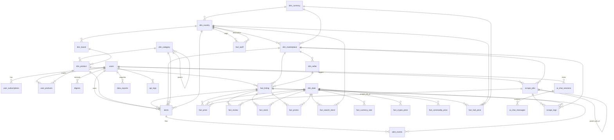

# Imperecta — База данных (Supabase PostgreSQL)

**Актуально на:** 2026-06-14 (alembic head `022`; app `ff781a9`)  
**Источники:** `backend/app/models/`, `backend/alembic/versions/`, runtime rules в `scraper/service.py`.

> Архитектурные принципы — см. `ARCHITECTURE_PRINCIPLES.md` (immutable). Этот файл описывает реализацию схемы; принципы не дублирует.

---

## 1. Обзор

| Аспект | Значение |
|--------|----------|
| СУБД | PostgreSQL (Supabase) |
| Паттерн | Star schema + operational tables |
| Backend access | Direct URL, table owner — **RLS bypass** |
| Supabase REST | RLS enabled (migration 012) |
| Alembic version | Schema `alembic_meta.alembic_version` |
| Head revision | `022_scrape_jobs_job_type_allow_scrape` |

При старте API: `alembic upgrade head` (subprocess).

---

## 2. Цепочка миграций

| # | Revision | Суть |
|---|----------|------|
| 001 | `v2_schema` | Base v2 + seeds |
| 002 | `v2_additions` | Additions |
| 003 | `fix_users_columns` | users columns |
| 004 | `fix_real_state` | Production repair |
| 005 | `scrape_logs_technical_error` | Status `technical_error` |
| 006 | `scrape_logs_status_length` | VARCHAR(50) |
| 007 | `fix_migration_deadlock_and_meta` | `alembic_meta` schema |
| 008 | `fix_alembic_version_length` | Wider `version_num` |
| 009 | `full_v2_schema_rebuild` | Idempotent full v2 DDL |
| 010 | `discovery_universal_columns` | Universal discovery on marketplace |
| 011 | `dedup_and_listing_lifecycle` | `is_active`, `last_price_changed_at`, `no_change` |
| 012 | `enable_rls_public_tables` | RLS policies |
| 013 | `search_trend_source_generic` | Generic `fact_search_trend.source` CHECK |
| 014 | `marketplace_scrape_tier` | `dim_marketplace.scrape_tier` 1–3 |
| 015 | `fact_price_default_partition` | `fact_price_202606`–`202612` + `fact_price_default` |
| 016 | `dim_marketplace_sitemap_resume_offset` | `sitemap_resume_offset INTEGER DEFAULT 0` |
| 017 | `dim_marketplace_recon_frontier_state` | JSONB BFS queue/visited/listing_urls — resumable Phase 1 |
| 018 | `dim_marketplace_category_resume_index` | INTEGER — resumable Phase 2 category loop |
| 019 | `scrape_jobs_status_allow_partial` | CHECK + `'partial'` for inner discovery jobs |
| 020 | `scrape_jobs_parent_job_id` | Self-FK `parent_job_id` + index `(parent_job_id, status)` — tick child jobs |
| 021 | `fact_listing_failure_streak` | `failure_streak INTEGER NOT NULL DEFAULT 0` — persistent deactivation counter; backfill `UPDATE fact_listing SET failure_streak = consecutive_errors` |
| 022 | `scrape_jobs_job_type_allow_scrape` | `ck_scrape_jobs_job_type` расширен на `'scrape'` — per-MP scrape children (`scrape_one_marketplace`, O4a/O4b); downgrade сначала помечает существующие `job_type='scrape'` строки `cancelled` перед сужением CHECK (**head**) |

**Правила:** не редактировать старые revisions; один statement per `op.execute()` для asyncpg; `IF NOT EXISTS` для repair.

---

## 3. Таблицы

**Всего 31 таблица** в `public` (без `mv_*` materialized views и без партиций `fact_price_*`):

| Группа | Файл | Кол-во | Таблицы |
|--------|------|--------|---------|
| Core | `models/core.py` | 3 | `users`, `user_subscriptions`, `user_products` |
| Dimensions (`dim_*`) | `models/dimensions.py` | 8 | `dim_date`, `dim_currency`, `dim_country`, `dim_marketplace`, `dim_category`, `dim_brand`, `dim_product`, `dim_seller` |
| Facts e-commerce | `models/facts.py` | 5 | `fact_listing`, `fact_price`, `fact_review`, `fact_stock`, `fact_promo` |
| Facts market data | `models/facts.py` | 6 | `fact_search_trend`, `fact_currency_rate`, `fact_tariff`, `fact_crypto_price`, `fact_commodity_price`, `fact_fuel_price` |
| Application / operational | `models/app_tables.py` | 9 | `alerts`, `alert_events`, `digests`, `ai_chat_sessions`, `ai_chat_messages`, `scrape_jobs`, `scrape_logs`, `api_logs`, `data_exports` |

Полные определения колонок и FK — см. **Часть II** (`§§ 3–7`).

### 3.1 Core (`models/core.py`)

| Table | ORM | Назначение |
|-------|-----|------------|
| `users` | User | Auth, plan, superuser, language |
| `user_subscriptions` | UserSubscription | Billing period |
| `user_products` | UserProduct | User catalog links |

**Plan CHECK:** `trial`, `starter`, `business`, `pro`, `enterprise` (см. entitlements).

### 3.2 Dimensions (`models/dimensions.py`)

| Table | ORM |
|-------|-----|
| `dim_date` | DimDate |
| `dim_currency` | DimCurrency |
| `dim_country` | DimCountry |
| `dim_marketplace` | DimMarketplace |
| `dim_category` | DimCategory |
| `dim_brand` | DimBrand |
| `dim_product` | DimProduct |
| `dim_seller` | DimSeller |

**`dim_marketplace` (parsing + scrape):** **`marketplace_code`** (unique, scoped pipeline filter), `code`, `base_url`, `is_active`, `requires_js`, **`scrape_tier`** (1–3, default 1), `scraper_config` JSONB, `product_quota`, `products_in_pool`, `last_discovery_*`, `discovered_category_urls` (JSONB), `last_category_recon_at`, `sitemap_url`, `last_sitemap_harvest_at`, **`sitemap_resume_offset`** (`016`), **`recon_frontier_state`** JSONB (`017`), **`category_resume_index`** (`018`).

**Scoped pipeline:** `POST run-pipeline { marketplace_codes }` → orchestrator фильтрует listings через `dim_marketplace.marketplace_code IN (...)`.

**`scrape_tier` semantics:**

| Value | Intended use | App support |
|-------|--------------|-------------|
| 1 | SSR shops: Decodo + httpx + Playwright | Implemented |
| 2 | SPA + network intercept + stealth | DB only → `NotImplementedError` |
| 3 | Hostile + residential + LLM fallback | DB only → `NotImplementedError` |

Existing rows get `DEFAULT 1` — behavior unchanged until tier is raised and layers implemented.

**Seeds в миграциях:** dates 2024–2030, ~30 currencies, ~44 countries — `ON CONFLICT DO NOTHING`.

### 3.3 Facts (`models/facts.py`)

E-commerce facts (5):

| Table | ORM | Notes |
|-------|-----|-------|
| `fact_listing` | FactListing | URL identity, denormalized `last_*`, scrape health (`consecutive_errors` this-run, `failure_streak` persistent — `021`) |
| `fact_price` | FactPrice | **Partitioned** by `date_id` (RANGE). `scrape_job_id` UUID FK → `scrape_jobs` (`SET NULL`); populated на pipeline-пути, NULL на ad-hoc API |
| `fact_review` | FactReview | Review aggregates per listing × date (rating histogram, sentiment) |
| `fact_stock` | FactStock | Stock availability snapshots per listing × date |
| `fact_promo` | FactPromo | Promotional campaigns / discount events |

Market-data facts (6):

| Table | ORM | Notes |
|-------|-----|-------|
| `fact_search_trend` | FactSearchTrend | `source`: google_trends, amazon_trends, custom (013) |
| `fact_currency_rate` | FactCurrencyRate | Forex rates; **display currency** (`rate_to_eur`, `rate_to_usd` per unit) |
| `fact_tariff` | FactTariff | HS tariffs (duty / VAT / excise) per origin × destination |
| `fact_crypto_price` | FactCryptoPrice | Crypto market data — Binance primary, CoinGecko backup |
| `fact_commodity_price` | FactCommodityPrice | Commodities: metals (GoldAPI) + energy (Alpha Vantage) |
| `fact_fuel_price` | FactFuelPrice | Retail fuel prices by country, daily |

#### `fact_listing`

| Column | Role |
|--------|------|
| `external_url` | Canonical URL |
| `url_hash` | SHA256, **UNIQUE** dedup |
| `last_price`, `last_currency_code`, `last_in_stock` | Current snapshot |
| `consecutive_errors`, `last_error` | Scrape health (this-run; **reset pre-flight** at start of every `scrape_product`) |
| `failure_streak` | Persistent failure counter across runs (migration `021`); incremented on fail, reset only on success — drives deactivation |
| `is_active` | Lifecycle; false after `failure_streak >= LISTING_DEACTIVATE_AFTER_ERRORS` (app logic, default 15) |
| `last_price_changed_at` | Last real price change |
| `scrape_interval_minutes` | Reschedule hint |

Indexes: `idx_listing_url_hash` UNIQUE, `idx_listing_active` partial, marketplace/product FK indexes.

#### `fact_price`

- PK includes `listing_id`, `date_id` (YYYYMMDD int).
- **Parent table** `fact_price` — RANGE partition by `date_id` (from migration `009`).
- **Monthly children:** `fact_price_YYYYMM` — bounds `FROM (YYYYMM01) TO (next month 01)`.
- **DEFAULT child:** `fact_price_default` — catch-all если месячной партиции нет (migration `015`); строки следует периодически переносить в явные месячные партиции.
- **015 (2026-06-03):** добавлены `fact_price_202606` … `fact_price_202612` (idempotent `IF NOT EXISTS`).
- **Rolling maintenance:** Celery `ensure_fact_price_partitions` — создаёт партиции на +1…+3 месяца вперёд.
- **One snapshot per listing per day:** app deletes existing row for `(listing_id, date_id)` before insert.
- `price_change_pct` capped at ±9_999.9999% in app logic.
- `discount_pct` NUMERIC(5,2) — computed at insert from original vs current price (`_calculate_discount_pct`); NULL if no discount or price increase.

**Операционная ошибка без партиции:** `no partition of relation "fact_price" found for row` — лечится `alembic upgrade head` и/или `ensure_fact_price_partitions`.

### 3.4 App tables (`models/app_tables.py`)

| Table | ORM | Назначение |
|-------|-----|------------|
| `alerts` | Alert | User-defined alert rule (price/stock/rating thresholds) |
| `alert_events` | AlertEvent | Alert firing log (one row per trigger) |
| `digests` | Digest | Scheduled / on-demand digest content |
| `ai_chat_sessions` | AIChatSession | AI analyst chat sessions |
| `ai_chat_messages` | AIChatMessage | Single message in an AI chat session |
| `scrape_jobs` | ScrapeJob | Background scrape job (pipeline parent + discovery children via `parent_job_id`, `020`) |
| `scrape_logs` | ScrapeLog | Single scrape attempt log (`scrape_job_id` FK; `listing_id`, status taxonomy + `technical_error`) |
| `api_logs` | ApiLog | External API call audit (Claude / market data / Decodo) |
| `data_exports` | DataExport | User-requested data export job |

#### `scrape_jobs`

- `job_type`: `full_pipeline_test`, `discovery`, `scheduled`, `manual`, `retry`, `backfill`
- `status`: `pending`, `running`, `completed`, `failed`, `cancelled`, **`partial`** (`019`)
- `parent_job_id` (UUID, nullable, self-FK — **`020` WIP**): child discovery job → parent pipeline job
- `config` JSONB: metadata (stage, timings, per_marketplace, celery_task_id)
- Index `idx_scrape_jobs_parent_status` on `(parent_job_id, status)` (`020`)

#### `scrape_logs`

| Column | Notes |
|--------|-------|
| `status` | VARCHAR(50) + CHECK |
| `technical_error` | TEXT (005) |
| `duration_ms`, `scraper_layer` | Diagnostics |
| `listing_id`, `scrape_job_id` | FK |

**Statuses:** `success`, `no_change`, `error`, `timeout`, `blocked`, `captcha`, `not_found`, `price_not_found`, `parse_error`, `missing_critical_data`, `technical_error`.

**Runtime repair:** если БД на старом CHECK/VARCHAR(20) — `GlobalScrapeService` может выполнить `ALTER` при первой ошибке вставки.

---

## 4. Materialized views

| View | Purpose |
|------|---------|
| `mv_daily_price_summary` | Daily aggregates |
| `mv_marketplace_health` | Marketplace health for admin |

Refresh: Celery `refresh_materialized_views` (concurrent where supported).

---

## 5. Integrity rules (application layer)

### 5.1 `fact_price` write gate

Все условия одновременно:

1. `product_name` OR non-empty `title`
2. `price > 0`
3. `currency` non-empty
4. `len(currency_raw) < 50`
5. `currency.upper()` ∈ marketplace whitelist (country currency + EUR + USD + `scraper_config.allowed_currencies`)

Иначе: skip insert; `scrape_logs` → `parse_error` или `missing_critical_data`.

### 5.2 `no_change`

Если price/currency/stock совпадают с `listing.last_*` (tolerance 0.001 on price):

- No new `fact_price` row
- Update `last_checked_at`
- `scrape_logs.status = no_change`

### 5.3 Listing deactivation

`failure_streak >= LISTING_DEACTIVATE_AFTER_ERRORS` (default 15) on failed scrape → `is_active = false` (excluded from pool batch). `failure_streak` (migration `021`) is the **persistent** counter; `consecutive_errors` is reset pre-flight on every attempt and reflects only the current run, so it is unsuitable as a circuit breaker.

### 5.4 No fake defaults

- No USD fallback
- No `price = 0` substitute
- `last_in_stock` chain ends at `False`, not NULL

### 5.5 `dim_date`

Deadlock-safe: SELECT → INSERT ON CONFLICT DO NOTHING → SELECT.

### 5.6 URL dedup

`FactListing.compute_url_hash(normalized_url)` — unique index.

---

## 6. RLS (012)

**Цель:** restrict PostgREST if keys leak.

- `ENABLE ROW LEVEL SECURITY` on public business tables.
- Backend service role bypasses as owner.
- Policies defined in `012_enable_rls_public_tables.py`.

---

## 7. Retention

`cleanup_old_data` (Celery): aged `scrape_logs`, `api_logs`, chat messages, `alert_events` — см. `workers/cleanup_tasks.py`.

---

## 8. Stale pipeline jobs (DB effect)

`ParsingAdminService._fail_stale_running_pipeline_jobs`:

- Updates `scrape_jobs.status` → failed
- Sets metadata `error = stale_pipeline_timeout: …`
- Invoked on admin reads (active job, status, runs)

---

## 9. Verification SQL

```sql
SELECT version_num FROM alembic_meta.alembic_version;

SELECT COUNT(*) FROM fact_listing WHERE is_active = true;
SELECT COUNT(*) FROM fact_price;
SELECT status, COUNT(*) FROM scrape_logs GROUP BY 1 ORDER BY 2 DESC;

SELECT tablename, rowsecurity
FROM pg_tables
WHERE schemaname = 'public' AND rowsecurity
ORDER BY 1;
```

```sql
SELECT inhrelid::regclass AS partition
FROM pg_inherits
JOIN pg_class parent ON inhparent = parent.oid
WHERE parent.relname = 'fact_price';
```

---

## 10. Connection strings

| Consumer | Driver |
|----------|--------|
| FastAPI | `postgresql+asyncpg://` |
| Celery / sync scrape | psycopg2 via `sync_session_factory` |

Normalizer in `Settings.validate_database_url`.

---

## 11. ORM metadata note

**Migration 013:** перенос legacy `kaspi_trends`, `allegro_trends` → `custom`; CHECK только `google_trends`, `amazon_trends`, `custom`.

**Migration 014:** `scrape_tier` on `dim_marketplace`.  
**Migration 015:** monthly partitions Jun–Dec 2026 + `fact_price_default`.  
**Migrations 016–018:** resumable discovery columns on `dim_marketplace`.  
**Migration 019:** `partial` in `scrape_jobs.status`.  
**Migration 020 (WIP):** `parent_job_id` on `scrape_jobs`.

**Display currency (runtime, no migration):** `CurrencyConverter` + `marketplace_locale.py` — local mode resolves currency from domain TLD (preferred) or `country_code`; API fields `local_currency_resolution`, `local_currency_unavailable`.

`models/__init__.py` docstring may reference older head — **trust migration files** (`019_*` tracked) over comments.

---

## 13. Детальная логика элементов (по таблицам и правилам)

### 13.1 `users` / `user_subscriptions`

| Поле / правило | Логика |
|----------------|--------|
| `plan` | CHECK: trial, starter, business, pro, enterprise → entitlements |
| `is_superuser` | Gates `/api/admin/*` |
| `language` | 8 codes; ru restricted to superuser on frontend |
| `user_subscriptions` | Billing period tracking (future billing integration) |

---

### 13.2 `user_products`

Связь user ↔ `dim_product` / own catalog. Import CSV/XLS создаёт записи через `user_products` module; не пишет напрямую в `fact_listing`.

---

### 13.3 `dim_marketplace`

| Column group | Runtime logic |
|--------------|---------------|
| Identity | `marketplace_code` UNIQUE — **scoped pipeline filter**; `domain`, `base_url` |
| Scrape | `requires_js`, `scrape_tier` (1–3), `scraper_config` JSONB selectors + `allowed_currencies` |
| Discovery state | `last_discovery_*`, `products_in_pool`, `discovered_category_urls`, sitemap timestamps |
| Resumable discovery | `sitemap_resume_offset` (`016`), `recon_frontier_state` (`017`), `category_resume_index` (`018`) |
| Quota | `product_quota` — 0 = use `discovery_no_quota_limit` |
| Active | `is_active=false` excludes from discovery SELECT |

**Discovery side effects:** `last_discovery_status` may be `partial_budget` (cooperative deadline); `timeout_skipped` on Z1 hard cancel; `sitemap_resume_offset` > 0 until sitemap fully saved.

---

### 13.4 `dim_product` / `dim_*` dimensions

| Table | Логика |
|-------|--------|
| `dim_product` | Created on discovery save; `name_normalized` for search |
| `dim_date` | YYYYMMDD int PK; deadlock-safe get-or-create in service |
| `dim_currency` / `dim_country` | Seeds; country currency feeds persistence whitelist |
| `dim_category`, `dim_brand`, `dim_seller` | Optional enrichment dimensions |

---

### 13.5 `fact_listing`

| Column | Write path | Read path |
|--------|------------|-----------|
| `url_hash` | `compute_url_hash(url)` on insert | UNIQUE dedup |
| `last_price`, `last_currency_code`, `last_in_stock` | Updated on successful scrape / no_change check | Pool UI, dashboard |
| `last_checked_at` | Every scrape attempt | Stale selector: NULL or >6h |
| `consecutive_errors`, `last_error` | **Reset pre-flight** every scrape; set on this-run failure; cleared on success | Admin health (current attempt) |
| `failure_streak` | Incremented on fail; reset only on success; **NOT** reset pre-flight (021) | Deactivation circuit breaker |
| `is_active` | false after `failure_streak >= LISTING_DEACTIVATE_AFTER_ERRORS` (app) | Scrape batch WHERE is_active |
| `last_price_changed_at` | Only when price actually changes | Analytics |

---

### 13.6 `fact_price` (partitioned)

| Rule | Логика |
|------|--------|
| Partition key | `date_id` YYYYMMDD — monthly RANGE child `fact_price_YYYYMM` |
| DEFAULT | `fact_price_default` catches rows without monthly partition (015) |
| One/day/listing | App DELETE existing `(listing_id, date_id)` before INSERT |
| `price_change_pct` | Capped ±9_999.9999% in service |
| Maintenance | Celery `ensure_fact_price_partitions` + Alembic 015 |

**Failure mode:** INSERT without partition → `no partition found for row`.

---

### 13.7 `fact_currency_rate`

Columns: `currency_code`, `rate_to_eur`, `rate_to_usd`, `date_id`.  
`CurrencyConverter.load_latest` picks max `date_id`. Empty table → live forex API (no hardcoded rates).

---

### 13.8 `fact_search_trend` (013)

`source` CHECK: `google_trends`, `amazon_trends`, `custom` only. Legacy store-specific sources migrated to `custom`.

---

### 13.9 Market fact tables

`fact_crypto_price`, `fact_commodity_price`, `fact_fuel_price`, `fact_tariff`, `fact_promo`, `fact_review`, `fact_stock` — written by `market_data` ingest and scrape adjunct paths; read by dashboard/markets API.

---

### 13.10 `scrape_jobs`

| job_type | Логика |
|----------|--------|
| `full_pipeline_test` | Parent admin pipeline; metadata in `config` |
| `discovery` | Inner per-MP job from `discover()` or γ-orchestrator child (`parent_job_id`); **Z1 reap** + **reaper** fix stuck `running` |
| `scheduled`, `manual`, … | Legacy/other flows |

| status | Transitions |
|--------|-------------|
| `pending` | Pre-dispatched child job (γ-orchestrator O2) |
| `running` | Active work |
| `completed` / `failed` / `partial` | Terminal; `partial` = cooperative budget exhausted with durable progress |
| `cancelled` | CHECK allows; admin cancel uses `failed` + error message |

| `parent_job_id` | NULL = parent (`full_pipeline_test` или standalone); non-NULL = child of pipeline parent (`020`) — `discovery` (per MP) или `scrape` (per MP, миграция `022`) |

**Metadata JSONB:** `current_stage`, `last_activity_at`, `celery_task_id`, `timings`, `summary`, `per_marketplace[]`, `discovery_*` progress fields.

---

### 13.11 `scrape_logs`

One row per listing scrape attempt. FK `scrape_job_id` links to parent or inner job.  
Status taxonomy — см. Parsing §11. `technical_error` TEXT for stack traces (005).

**Aggregation in job_completion:** GROUP BY marketplace_id for pipeline summary.

---

### 13.12 `ai_chat_*`, `api_logs`, `alerts`, `digests`

| Table | Логика |
|-------|--------|
| `ai_chat_sessions/messages` | Claude conversation persistence |
| `api_logs` | External API call audit |
| `alerts/alert_events` | Stub Celery tasks; schema present |
| `digests` | Stub digest generation |

Retention: `cleanup_old_data` prunes aged rows.

---

### 13.13 Materialized views

| View | Refresh | Use |
|------|---------|-----|
| `mv_daily_price_summary` | Celery concurrent refresh | Analytics |
| `mv_marketplace_health` | Celery | Admin pool health |

---

### 13.14 RLS (012)

ENABLE RLS on public business tables. Policies deny anonymous PostgREST access. Backend connects as table owner — bypasses RLS for application queries.

---

### 13.15 Application integrity (cross-table)

```text
discovery save → dim_product + fact_listing (url_hash unique)
scrape success → fact_listing.last_* + optional fact_price (partitioned, stamped with scrape_job_id when called from pipeline)
scrape fail (failure_streak ×15) → fact_listing.is_active=false (021)
pipeline complete → scrape_jobs counters from scrape_logs + discovery seed
stale parent → scrape_jobs.failed via parsing_admin (not Z1)
Z1 hard cancel → inner discovery jobs.failed via discovery_phase SQL
reaper (Beat 300s) → stuck running jobs.failed via reaper_tasks (external SIGTERM/OOM)
partial_budget / partial status → resume columns preserved; cooperative deadline exit
child jobs → parent_job_id links discovery children to pipeline parent (020)
```

---

## 14. Источники

| Area | Path |
|------|------|
| Models | `backend/app/models/*.py` |
| Migrations | `backend/alembic/versions/` |
| Persist rules | `backend/app/modules/scraper/service.py` |
| Partitions | `backend/app/workers/maintenance_tasks.py`, `015_fact_price_default_partition.py` |
| Admin stale | `backend/app/modules/admin/parsing_admin.py` |

Связанные документы: `Imperecta_Architecture.md`, `Imperecta_Backend.md` (§ Parsing), `.cursor/rules/database.mdc`.

> **Часть II** ниже — полный справочник всех таблиц, колонок и FK (бывш. `Imperecta_Database_Schema.md`).

---

# Часть II. Полная схема базы данных

**Head migration:** `022_scrape_jobs_job_type_allow_scrape` · **Источник:** `backend/app/models/` + migrations `001`–`022`

Полный справочник всех таблиц, колонок, FK и CHECK. Ранее — отдельный `Imperecta_Database_Schema.md`.

---

## 1. Обзор связей (ER)



**Звезда (star schema):** `dim_*` → `fact_listing` / market facts → `dim_date`.  
**Операционные:** `users`, `scrape_jobs`, `scrape_logs`, AI, alerts.

---

## 2. Служебные объекты

### 2.1 `alembic_meta.alembic_version`

| Колонка | Тип | Описание |
|---------|-----|----------|
| `version_num` | VARCHAR | Текущая revision Alembic |

### 2.2 Партиционирование `fact_price`

| Объект | Тип | Описание |
|--------|-----|----------|
| `fact_price` | TABLE | Родитель, `PARTITION BY RANGE (date_id)` |
| `fact_price_YYYYMM` | PARTITION | Месячные дочерние таблицы (migration `015` + Celery maintenance) |
| `fact_price_default` | PARTITION | DEFAULT catch-all (migration `015`) |

**PK:** `(id, date_id)` — `id` BIGINT IDENTITY, `date_id` FK → `dim_date`.

### 2.3 Materialized views

#### `mv_daily_price_summary`

| Колонка | Тип |
|---------|-----|
| `date_id` | INTEGER |
| `product_id` | UUID |
| `marketplace_id` | UUID |
| `category_id` | UUID |
| `brand_id` | UUID |
| `country_code` | VARCHAR(2) |
| `listing_count` | BIGINT |
| `min_price_eur` | NUMERIC |
| `max_price_eur` | NUMERIC |
| `avg_price_eur` | NUMERIC(12,2) |
| `median_price_eur` | NUMERIC |
| `in_stock_count` | BIGINT |
| `out_of_stock_count` | BIGINT |
| `promoted_count` | BIGINT |
| `avg_discount_pct` | NUMERIC |

**Unique index:** `(date_id, product_id, marketplace_id)`

#### `mv_marketplace_health`

| Колонка | Тип |
|---------|-----|
| `marketplace_id` | UUID (PK index) |
| `marketplace_code` | VARCHAR |
| `name` | VARCHAR |
| `country_code` | VARCHAR(2) |
| `active_listings` | BIGINT |
| `scrapes_24h` | BIGINT |
| `success_24h` | BIGINT |
| `errors_24h` | BIGINT |
| `success_rate_24h` | NUMERIC |
| `avg_duration_ms_24h` | NUMERIC |

---

## 3. Core — пользователи

### 3.1 `users`

| Колонка | Тип | NULL | Default | Описание |
|---------|-----|------|---------|----------|
| `id` | UUID | NO | `gen_random_uuid()` | **PK** |
| `email` | VARCHAR(255) | NO | — | UNIQUE, indexed |
| `password_hash` | VARCHAR(255) | NO | — | |
| `name` | VARCHAR(100) | YES | — | |
| `company_name` | VARCHAR(200) | YES | — | |
| `plan` | VARCHAR(20) | NO | `trial` | CHECK: trial, starter, business, pro, enterprise |
| `trial_ends_at` | TIMESTAMPTZ | YES | — | |
| `language` | VARCHAR(5) | NO | `en` | |
| `timezone` | VARCHAR(50) | NO | `UTC` | |
| `ai_tone` | VARCHAR(20) | NO | `balanced` | CHECK: concise, balanced, detailed |
| `default_currency` | VARCHAR(3) | NO | `EUR` | |
| `telegram_chat_id` | BIGINT | YES | — | |
| `telegram_link_code` | VARCHAR(20) | YES | — | |
| `telegram_username` | VARCHAR(100) | YES | — | |
| `is_superuser` | BOOLEAN | NO | `false` | |
| `force_password_change` | BOOLEAN | NO | `false` | |
| `is_active` | BOOLEAN | NO | `true` | |
| `avatar_url` | TEXT | YES | — | |
| `last_login_at` | TIMESTAMPTZ | YES | — | |
| `last_login_ip` | INET | YES | — | |
| `login_count` | INTEGER | NO | `0` | |
| `preferences` | JSONB | NO | `{}` | Dashboard prefs |
| `created_at` | TIMESTAMPTZ | NO | `now()` | |
| `updated_at` | TIMESTAMPTZ | NO | `now()` | on update |

**Индексы:** `idx_users_plan`, `idx_users_telegram` (partial: telegram_chat_id NOT NULL)

**Исходящие FK (логические):** `user_subscriptions`, `user_products`, `alerts`, `digests`, `ai_chat_sessions`, `scrape_jobs.triggered_by`, `data_exports`, `api_logs`

---

### 3.2 `user_subscriptions`

| Колонка | Тип | NULL | Default | Описание |
|---------|-----|------|---------|----------|
| `id` | UUID | NO | `gen_random_uuid()` | **PK** |
| `user_id` | UUID | NO | — | **FK** → `users.id` ON DELETE CASCADE |
| `plan` | VARCHAR(20) | NO | — | CHECK: trial…enterprise |
| `status` | VARCHAR(20) | NO | `active` | CHECK: active, cancelled, expired, past_due |
| `started_at` | TIMESTAMPTZ | NO | `now()` | |
| `expires_at` | TIMESTAMPTZ | YES | — | |
| `cancelled_at` | TIMESTAMPTZ | YES | — | |
| `payment_provider` | VARCHAR(30) | YES | — | |
| `external_id` | VARCHAR(255) | YES | — | |
| `amount_cents` | INTEGER | YES | — | |
| `currency_code` | VARCHAR(3) | YES | `EUR` | |
| `created_at` | TIMESTAMPTZ | NO | `now()` | |

**Индексы:** `idx_user_subs_user`, `idx_user_subs_status`

---

### 3.3 `user_products`

| Колонка | Тип | NULL | Default | Описание |
|---------|-----|------|---------|----------|
| `id` | UUID | NO | `gen_random_uuid()` | **PK** |
| `user_id` | UUID | NO | — | **FK** → `users.id` CASCADE |
| `product_id` | UUID | NO | — | **FK** → `dim_product.id` CASCADE |
| `custom_name` | VARCHAR(500) | YES | — | |
| `custom_sku` | VARCHAR(100) | YES | — | |
| `target_price` | NUMERIC(12,2) | YES | — | |
| `cost_price` | NUMERIC(12,2) | YES | — | |
| `currency_code` | VARCHAR(3) | YES | `EUR` | |
| `notes` | TEXT | YES | — | |
| `is_active` | BOOLEAN | NO | `true` | |
| `created_at` | TIMESTAMPTZ | NO | `now()` | |
| `updated_at` | TIMESTAMPTZ | NO | `now()` | |

**UNIQUE:** `(user_id, product_id)`  
**Индексы:** `idx_user_products_user`, `idx_user_products_product`

---

## 4. Dimensions (`dim_*`)

### 4.1 `dim_date`

| Колонка | Тип | NULL | Описание |
|---------|-----|------|----------|
| `date_id` | INTEGER | NO | **PK** — YYYYMMDD |
| `full_date` | DATE | NO | UNIQUE |
| `year` | INTEGER | NO | |
| `quarter` | INTEGER | NO | CHECK 1–4 |
| `month` | INTEGER | NO | CHECK 1–12 |
| `month_name` | VARCHAR(20) | NO | |
| `week_iso` | INTEGER | NO | |
| `day_of_month` | INTEGER | NO | |
| `day_of_week` | INTEGER | NO | |
| `day_name` | VARCHAR(15) | NO | |
| `is_weekend` | BOOLEAN | NO | |
| `is_last_day_of_month` | BOOLEAN | NO | |
| `fiscal_year` | INTEGER | YES | |
| `fiscal_quarter` | INTEGER | YES | |

**Индекс:** `idx_dim_date_full_date`

---

### 4.2 `dim_currency`

| Колонка | Тип | NULL | Default | Описание |
|---------|-----|------|---------|----------|
| `currency_code` | VARCHAR(3) | NO | — | **PK** ISO 4217 |
| `name` | VARCHAR(50) | NO | — | |
| `symbol` | VARCHAR(5) | NO | — | |
| `decimal_places` | INTEGER | YES | `2` | |
| `is_active` | BOOLEAN | NO | `true` | |

---

### 4.3 `dim_country`

| Колонка | Тип | NULL | Описание |
|---------|-----|------|----------|
| `country_code` | VARCHAR(2) | NO | **PK** ISO 3166-1 alpha-2 |
| `name` | VARCHAR(100) | NO | |
| `name_local` | VARCHAR(100) | YES | |
| `region` | VARCHAR(30) | NO | CHECK: CIS, EU, EFTA, … |
| `subregion` | VARCHAR(50) | YES | |
| `currency_code` | VARCHAR(3) | NO | **FK** → `dim_currency` RESTRICT |
| `vat_rate_std` | NUMERIC(5,2) | YES | |
| `vat_rate_reduced` | NUMERIC(5,2) | YES | |
| `ecommerce_market_size_eur` | INTEGER | YES | |
| `population` | INTEGER | YES | |
| `is_active` | BOOLEAN | NO | default true |

---

### 4.4 `dim_marketplace`

| Колонка | Тип | NULL | Default | Описание |
|---------|-----|------|---------|----------|
| `id` | UUID | NO | `gen_random_uuid()` | **PK** |
| `marketplace_code` | VARCHAR(50) | NO | — | UNIQUE — scoped pipeline filter |
| `name` | VARCHAR(200) | NO | — | |
| `source_type` | VARCHAR(30) | NO | — | CHECK: marketplace, price_aggregator, … |
| `country_code` | VARCHAR(2) | NO | — | **FK** → `dim_country` RESTRICT |
| `operates_in` | VARCHAR(2)[] | NO | `[]` | |
| `domain` | VARCHAR(255) | NO | — | |
| `base_url` | TEXT | NO | — | |
| `api_available` | BOOLEAN | NO | `false` | |
| `api_type` | VARCHAR(30) | YES | — | |
| `scraper_type` | VARCHAR(30) | NO | `web_api` | CHECK: web_api, playwright, … |
| `currency_code` | VARCHAR(3) | NO | — | **FK** → `dim_currency` RESTRICT |
| `locale` | VARCHAR(10) | YES | — | |
| `is_active` | BOOLEAN | NO | `true` | |
| `reliability_score` | NUMERIC(3,2) | YES | `0.00` | |
| `avg_response_ms` | INTEGER | YES | — | |
| `last_scrape_at` | TIMESTAMPTZ | YES | — | |
| `last_scrape_status` | VARCHAR(20) | YES | — | |
| `logo_url` | TEXT | YES | — | |
| `monthly_visits` | INTEGER | YES | — | |
| `product_quota` | INTEGER | NO | `0` | |
| `products_in_pool` | INTEGER | NO | `0` | |
| `requires_js` | BOOLEAN | NO | `false` | |
| `scrape_tier` | INTEGER | NO | `1` | 1–3 (migration `014`) |
| `rate_limit_delay` | NUMERIC(4,1) | NO | `2.0` | |
| `custom_product_link_selector` | TEXT | YES | — | |
| `custom_next_page_selector` | TEXT | YES | — | |
| `custom_price_selector` | TEXT | YES | — | |
| `custom_title_selector` | TEXT | YES | — | |
| `last_discovery_at` | TIMESTAMPTZ | YES | — | |
| `last_discovery_status` | VARCHAR(20) | YES | — | incl. partial_budget |
| `last_discovery_products_found` | INTEGER | NO | `0` | |
| `discovery_error_count` | INTEGER | NO | `0` | |
| `discovered_category_urls` | JSONB | NO | `[]` | migration `010` |
| `last_category_recon_at` | TIMESTAMPTZ | YES | — | |
| `recon_frontier_state` | JSONB | YES | — | migration `017` — BFS resume |
| `sitemap_url` | VARCHAR(2048) | YES | — | |
| `last_sitemap_harvest_at` | TIMESTAMPTZ | YES | — | |
| `sitemap_resume_offset` | INTEGER | NO | `0` | migration `016` |
| `category_resume_index` | INTEGER | NO | `0` | migration `018` |
| `created_at` | TIMESTAMPTZ | NO | `now()` | |
| `updated_at` | TIMESTAMPTZ | NO | `now()` | |

**Индексы:** `idx_marketplace_country`, `idx_marketplace_type`, `idx_marketplace_code`

---

### 4.5 `dim_category`

| Колонка | Тип | NULL | Default | Описание |
|---------|-----|------|---------|----------|
| `id` | UUID | NO | `gen_random_uuid()` | **PK** |
| `name` | VARCHAR(200) | NO | — | |
| `name_en` | VARCHAR(200) | YES | — | |
| `slug` | VARCHAR(200) | NO | — | UNIQUE |
| `parent_id` | UUID | YES | — | **FK** → `dim_category.id` SET NULL (self) |
| `level` | INTEGER | NO | `1` | |
| `path` | TEXT | NO | — | GIN trgm index |
| `hs_code_prefix` | VARCHAR(10) | YES | — | |
| `icon` | VARCHAR(50) | YES | — | |
| `is_active` | BOOLEAN | NO | `true` | |
| `product_count` | INTEGER | NO | `0` | |
| `created_at` | TIMESTAMPTZ | NO | `now()` | |

**Индексы:** `idx_category_parent`, `idx_category_path` (GIN), `idx_category_slug`

---

### 4.6 `dim_brand`

| Колонка | Тип | NULL | Описание |
|---------|-----|------|----------|
| `id` | UUID | NO | **PK** |
| `name` | VARCHAR(200) | NO | |
| `slug` | VARCHAR(200) | NO | UNIQUE |
| `name_normalized` | VARCHAR(200) | NO | UNIQUE index |
| `country_code` | VARCHAR(2) | YES | **FK** → `dim_country` SET NULL |
| `website_url` | TEXT | YES | |
| `logo_url` | TEXT | YES | |
| `is_active` | BOOLEAN | NO | |
| `created_at` | TIMESTAMPTZ | NO | |

**Индексы:** `idx_brand_slug`, `idx_brand_normalized` (UNIQUE)

---

### 4.7 `dim_product`

| Колонка | Тип | NULL | Default | Описание |
|---------|-----|------|---------|----------|
| `id` | UUID | NO | `gen_random_uuid()` | **PK** |
| `name` | VARCHAR(500) | NO | — | |
| `name_normalized` | VARCHAR(500) | NO | — | GIN trgm |
| `sku_universal` | VARCHAR(100) | YES | — | partial index |
| `mpn` | VARCHAR(100) | YES | — | |
| `category_id` | UUID | YES | — | **FK** → `dim_category` SET NULL |
| `brand_id` | UUID | YES | — | **FK** → `dim_brand` SET NULL |
| `attributes` | JSONB | NO | `{}` | GIN |
| `image_url` | TEXT | YES | — | |
| `image_urls` | TEXT[] | NO | `[]` | |
| `hs_code` | VARCHAR(12) | YES | — | |
| `weight_kg` | NUMERIC(10,3) | YES | — | |
| `is_active` | BOOLEAN | NO | `true` | |
| `created_at` | TIMESTAMPTZ | NO | `now()` | |
| `updated_at` | TIMESTAMPTZ | NO | `now()` | |

**Индексы:** `idx_product_category`, `idx_product_brand`, `idx_product_name` (GIN), `idx_product_sku`, `idx_product_attributes` (GIN)

---

### 4.8 `dim_seller`

| Колонка | Тип | NULL | Default | Описание |
|---------|-----|------|---------|----------|
| `id` | UUID | NO | `gen_random_uuid()` | **PK** |
| `name` | VARCHAR(300) | NO | — | |
| `name_normalized` | VARCHAR(300) | NO | — | GIN trgm |
| `marketplace_id` | UUID | NO | — | **FK** → `dim_marketplace` CASCADE |
| `external_seller_id` | VARCHAR(200) | YES | — | |
| `seller_type` | VARCHAR(30) | NO | `third_party` | CHECK: first_party, third_party, … |
| `store_url` | TEXT | YES | — | |
| `rating` | NUMERIC(3,2) | YES | — | |
| `review_count` | INTEGER | YES | — | |
| `is_active` | BOOLEAN | NO | `true` | |
| `created_at` | TIMESTAMPTZ | NO | `now()` | |
| `updated_at` | TIMESTAMPTZ | NO | `now()` | |

**Индексы:** `idx_seller_marketplace`, `idx_seller_external`, `idx_seller_name` (GIN)

---

## 5. Facts — e-commerce

### 5.1 `fact_listing`

| Колонка | Тип | NULL | Default | Описание |
|---------|-----|------|---------|----------|
| `id` | UUID | NO | `gen_random_uuid()` | **PK** |
| `product_id` | UUID | NO | — | **FK** → `dim_product` CASCADE |
| `marketplace_id` | UUID | NO | — | **FK** → `dim_marketplace` CASCADE |
| `seller_id` | UUID | YES | — | **FK** → `dim_seller` SET NULL |
| `external_url` | TEXT | NO | — | |
| `url_hash` | VARCHAR(64) | YES | — | UNIQUE — SHA256 dedup |
| `external_id` | VARCHAR(200) | YES | — | |
| `external_name` | VARCHAR(500) | YES | — | |
| `last_price` | NUMERIC(12,2) | YES | — | snapshot |
| `last_price_eur` | NUMERIC(12,2) | YES | — | |
| `last_original_price` | NUMERIC(12,2) | YES | — | |
| `last_currency_code` | VARCHAR(3) | YES | — | |
| `last_in_stock` | BOOLEAN | YES | — | |
| `last_rating` | NUMERIC(3,2) | YES | — | |
| `last_review_count` | INTEGER | YES | — | |
| `last_checked_at` | TIMESTAMPTZ | YES | — | |
| `scraper_type` | VARCHAR(30) | NO | `web_api` | |
| `scraper_config` | JSONB | NO | `{}` | per-listing selectors |
| `scrape_interval_minutes` | INTEGER | NO | `360` | |
| `consecutive_errors` | INTEGER | NO | `0` | this-run scrape errors; **reset pre-flight** every attempt |
| `failure_streak` | INTEGER | NO | `0` | persistent across runs (migration `021`); deactivate when `>= LISTING_DEACTIVATE_AFTER_ERRORS` (default 15) |
| `is_active` | BOOLEAN | NO | `true` | migration `011`; flipped to `false` by `failure_streak` breaker |
| `last_price_changed_at` | TIMESTAMPTZ | YES | — | migration `011` |
| `last_error` | TEXT | YES | — | |
| `created_at` | TIMESTAMPTZ | NO | `now()` | |
| `updated_at` | TIMESTAMPTZ | NO | `now()` | |

**UNIQUE:** `(product_id, marketplace_id, seller_id, external_url)`  
**Индексы:** `idx_listing_product`, `idx_listing_marketplace`, `idx_listing_seller`, `idx_listing_active` (partial), `idx_listing_last_checked`, `idx_listing_url_hash` (UNIQUE)

---

### 5.2 `fact_price` (partitioned)

| Колонка | Тип | NULL | Default | Описание |
|---------|-----|------|---------|----------|
| `id` | BIGINT | NO | IDENTITY | **PK** (with date_id) |
| `listing_id` | UUID | NO | — | **FK** → `fact_listing` CASCADE |
| `date_id` | INTEGER | NO | — | **PK**, **FK** → `dim_date` RESTRICT |
| `price` | NUMERIC(12,2) | NO | — | |
| `original_price` | NUMERIC(12,2) | YES | — | |
| `currency_code` | VARCHAR(3) | NO | — | |
| `price_eur` | NUMERIC(12,2) | YES | — | |
| `discount_pct` | NUMERIC(5,2) | YES | — | |
| `price_change_pct` | NUMERIC(8,4) | YES | — | cap ±9999.9999% |
| `in_stock` | BOOLEAN | YES | — | |
| `delivery_days` | INTEGER | YES | — | |
| `delivery_cost` | NUMERIC(8,2) | YES | — | |
| `seller_name` | VARCHAR(300) | YES | — | |
| `promo_label` | VARCHAR(300) | YES | — | |
| `is_promoted` | BOOLEAN | YES | `false` | |
| `promo_type` | VARCHAR(30) | YES | — | |
| `scraped_at` | TIMESTAMPTZ | NO | `now()` | |
| `scrape_job_id` | UUID | YES | — | **FK** → `scrape_jobs` SET NULL; populated when called from the pipeline (Celery `tasks.py`); `NULL` for the API ad-hoc path (`scraper/api.py`) |

**Индексы:** `idx_fact_price_listing`, `idx_fact_price_date`, `idx_fact_price_scraped`, `idx_fact_price_listing_date`

---

### 5.3 `fact_review`

| Колонка | Тип | NULL | Default |
|---------|-----|------|---------|
| `id` | BIGINT | NO | IDENTITY **PK** |
| `listing_id` | UUID | NO | **FK** → `fact_listing` CASCADE |
| `date_id` | INTEGER | NO | **FK** → `dim_date` RESTRICT |
| `rating_avg` | NUMERIC(3,2) | YES | — |
| `review_count` | INTEGER | NO | `0` |
| `rating_1_count` … `rating_5_count` | INTEGER | NO | `0` |
| `sentiment_score` | NUMERIC(4,3) | YES | — |
| `sentiment_summary` | TEXT | YES | — |
| `new_reviews_24h` | INTEGER | NO | `0` |
| `scraped_at` | TIMESTAMPTZ | NO | `now()` |

---

### 5.4 `fact_stock`

| Колонка | Тип | NULL | Default |
|---------|-----|------|---------|
| `id` | BIGINT | NO | IDENTITY **PK** |
| `listing_id` | UUID | NO | **FK** → `fact_listing` CASCADE |
| `date_id` | INTEGER | NO | **FK** → `dim_date` RESTRICT |
| `in_stock` | BOOLEAN | NO | — |
| `stock_quantity` | INTEGER | YES | — |
| `stock_status` | VARCHAR(30) | YES | — |
| `delivery_days_min` | INTEGER | YES | — |
| `delivery_days_max` | INTEGER | YES | — |
| `delivery_cost` | NUMERIC(8,2) | YES | — |
| `delivery_type` | VARCHAR(30) | YES | — |
| `scraped_at` | TIMESTAMPTZ | NO | `now()` |

**Partial index:** `idx_fact_stock_oos` WHERE `in_stock = false`

---

### 5.5 `fact_search_trend`

| Колонка | Тип | NULL | Описание |
|---------|-----|------|----------|
| `id` | BIGINT | NO | **PK** IDENTITY |
| `date_id` | INTEGER | NO | **FK** → `dim_date` |
| `country_code` | VARCHAR(2) | NO | **FK** → `dim_country` |
| `keyword` | VARCHAR(300) | NO | |
| `keyword_normalized` | VARCHAR(300) | NO | GIN trgm |
| `trend_index` | INTEGER | NO | |
| `search_volume` | INTEGER | YES | |
| `source` | VARCHAR(30) | NO | CHECK: google_trends, amazon_trends, custom (`013`) |
| `category_id` | UUID | YES | **FK** → `dim_category` SET NULL |
| `related_product_id` | UUID | YES | **FK** → `dim_product` SET NULL |
| `scraped_at` | TIMESTAMPTZ | NO | |

---

### 5.6 `fact_promo`

| Колонка | Тип | NULL | Описание |
|---------|-----|------|----------|
| `id` | UUID | NO | **PK** |
| `listing_id` | UUID | YES | **FK** → `fact_listing` SET NULL |
| `marketplace_id` | UUID | NO | **FK** → `dim_marketplace` CASCADE |
| `start_date_id` | INTEGER | NO | **FK** → `dim_date` |
| `end_date_id` | INTEGER | YES | **FK** → `dim_date` SET NULL |
| `promo_type` | VARCHAR(30) | NO | CHECK: flash_sale, seasonal, … |
| `promo_name` | VARCHAR(300) | YES | |
| `discount_pct` | NUMERIC(5,2) | YES | |
| `discount_amount` | NUMERIC(12,2) | YES | |
| `currency_code` | VARCHAR(3) | YES | |
| `is_marketplace_wide` | BOOLEAN | NO | `false` |
| `category_id` | UUID | YES | **FK** → `dim_category` SET NULL |
| `detected_at` | TIMESTAMPTZ | NO | |
| `created_at` | TIMESTAMPTZ | NO | |

---

### 5.7 `fact_tariff`

| Колонка | Тип | NULL | Описание |
|---------|-----|------|----------|
| `id` | UUID | NO | **PK** |
| `hs_code` | VARCHAR(12) | NO | |
| `origin_country` | VARCHAR(2) | NO | **FK** → `dim_country` |
| `destination_country` | VARCHAR(2) | NO | **FK** → `dim_country` |
| `duty_pct` | NUMERIC(6,3) | NO | |
| `vat_pct` | NUMERIC(5,2) | YES | |
| `excise_pct` | NUMERIC(5,2) | YES | |
| `trade_agreement` | VARCHAR(100) | YES | |
| `effective_from` | DATE | NO | |
| `effective_to` | DATE | YES | |
| `source` | VARCHAR(100) | YES | |
| `source_url` | TEXT | YES | |
| `created_at` | TIMESTAMPTZ | NO | |
| `updated_at` | TIMESTAMPTZ | NO | |

---

## 6. Facts — market data

### 6.1 `fact_currency_rate`

| Колонка | Тип | NULL | Описание |
|---------|-----|------|----------|
| `id` | BIGINT | NO | **PK** IDENTITY |
| `date_id` | INTEGER | NO | **FK** → `dim_date` |
| `currency_code` | VARCHAR(3) | NO | **FK** → `dim_currency` |
| `rate_to_eur` | NUMERIC(18,8) | NO | |
| `rate_to_usd` | NUMERIC(18,8) | NO | |
| `source` | VARCHAR(30) | NO | CHECK: ecb, cbr, openexchangerates, … |
| `fetched_at` | TIMESTAMPTZ | NO | |

**UNIQUE:** `(date_id, currency_code, source)`

---

### 6.2 `fact_crypto_price`

| Колонка | Тип | NULL |
|---------|-----|------|
| `id` | BIGINT | NO | **PK** |
| `date_id` | INTEGER | NO | **FK** → `dim_date` |
| `symbol` | VARCHAR(20) | NO |
| `name` | VARCHAR(100) | YES |
| `price_usd` | NUMERIC(18,8) | NO |
| `price_eur` | NUMERIC(18,8) | YES |
| `market_cap_usd` | NUMERIC(20,2) | YES |
| `volume_24h_usd` | NUMERIC(20,2) | YES |
| `change_1h_pct` | NUMERIC(8,4) | YES |
| `change_24h_pct` | NUMERIC(8,4) | YES |
| `change_7d_pct` | NUMERIC(8,4) | YES |
| `high_24h_usd` | NUMERIC(18,8) | YES |
| `low_24h_usd` | NUMERIC(18,8) | YES |
| `circulating_supply` | NUMERIC(20,2) | YES |
| `total_supply` | NUMERIC(20,2) | YES |
| `source` | VARCHAR(30) | NO | CHECK: binance, coingecko, … |
| `rank` | SMALLINT | YES |
| `fetched_at` | TIMESTAMPTZ | NO |

**UNIQUE:** `(date_id, symbol, source)`

---

### 6.3 `fact_commodity_price`

| Колонка | Тип | NULL |
|---------|-----|------|
| `id` | BIGINT | NO | **PK** |
| `date_id` | INTEGER | NO | **FK** → `dim_date` |
| `symbol` | VARCHAR(20) | NO |
| `name` | VARCHAR(100) | NO |
| `commodity_type` | VARCHAR(20) | NO | CHECK: metal, energy, agricultural |
| `price_usd` | NUMERIC(12,4) | NO |
| `price_eur` | NUMERIC(12,4) | YES |
| `change_24h_pct` | NUMERIC(8,4) | YES |
| `change_7d_pct` | NUMERIC(8,4) | YES |
| `unit` | VARCHAR(20) | NO |
| `source` | VARCHAR(30) | NO | CHECK: goldapi, alpha_vantage, … |
| `fetched_at` | TIMESTAMPTZ | NO |

**UNIQUE:** `(date_id, symbol, source)`

---

### 6.4 `fact_fuel_price`

| Колонка | Тип | NULL |
|---------|-----|------|
| `id` | BIGINT | NO | **PK** |
| `date_id` | INTEGER | NO | **FK** → `dim_date` |
| `country_code` | VARCHAR(2) | NO | **FK** → `dim_country` |
| `fuel_type` | VARCHAR(20) | NO | CHECK: gasoline_95, diesel, … |
| `price_local` | NUMERIC(8,4) | NO |
| `currency_code` | VARCHAR(3) | NO | **FK** → `dim_currency` |
| `price_eur` | NUMERIC(8,4) | YES |
| `change_week_pct` | NUMERIC(8,4) | YES |
| `change_month_pct` | NUMERIC(8,4) | YES |
| `source` | VARCHAR(50) | NO |
| `fetched_at` | TIMESTAMPTZ | NO |

**UNIQUE:** `(date_id, country_code, fuel_type, source)`

---

## 7. Application tables

### 7.1 `alerts`

| Колонка | Тип | NULL | Default | Описание |
|---------|-----|------|---------|----------|
| `id` | UUID | NO | `gen_random_uuid()` | **PK** |
| `user_id` | UUID | NO | — | **FK** → `users` CASCADE |
| `product_id` | UUID | YES | — | **FK** → `dim_product` SET NULL |
| `listing_id` | UUID | YES | — | **FK** → `fact_listing` SET NULL |
| `marketplace_id` | UUID | YES | — | **FK** → `dim_marketplace` SET NULL |
| `category_id` | UUID | YES | — | **FK** → `dim_category` SET NULL |
| `country_code` | VARCHAR(2) | YES | — | **FK** → `dim_country` SET NULL |
| `alert_type` | VARCHAR(30) | NO | — | CHECK: price_drop, out_of_stock, … |
| `threshold_pct` | NUMERIC(5,2) | YES | — | |
| `threshold_value` | NUMERIC(12,2) | YES | — | |
| `channel` | VARCHAR(20) | NO | `email` | CHECK: email, telegram, … |
| `webhook_url` | TEXT | YES | — | |
| `cooldown_minutes` | INTEGER | NO | `60` | |
| `last_triggered_at` | TIMESTAMPTZ | YES | — | |
| `trigger_count` | INTEGER | NO | `0` | |
| `is_active` | BOOLEAN | NO | `true` | |
| `created_at` | TIMESTAMPTZ | NO | `now()` | |
| `updated_at` | TIMESTAMPTZ | NO | `now()` | |

---

### 7.2 `alert_events`

| Колонка | Тип | NULL | Default |
|---------|-----|------|---------|
| `id` | BIGINT | NO | **PK** autoincrement |
| `alert_id` | UUID | NO | **FK** → `alerts` CASCADE |
| `listing_id` | UUID | YES | **FK** → `fact_listing` SET NULL |
| `fact_price_id` | BIGINT | YES | — (no FK) |
| `old_value` | NUMERIC(12,2) | YES | |
| `new_value` | NUMERIC(12,2) | YES | |
| `change_pct` | NUMERIC(8,4) | YES | |
| `message` | TEXT | NO | |
| `severity` | VARCHAR(10) | NO | `medium` — CHECK: low…critical |
| `ai_explanation` | TEXT | YES | |
| `ai_recommendation` | TEXT | YES | |
| `ai_recommended_price` | NUMERIC(12,2) | YES | |
| `ai_confidence` | NUMERIC(3,2) | YES | |
| `sent_via` | VARCHAR(20) | YES | |
| `delivered_at` | TIMESTAMPTZ | YES | |
| `read_at` | TIMESTAMPTZ | YES | |
| `triggered_at` | TIMESTAMPTZ | NO | `now()` |

---

### 7.3 `digests`

| Колонка | Тип | NULL | Default |
|---------|-----|------|---------|
| `id` | UUID | NO | **PK** |
| `user_id` | UUID | NO | **FK** → `users` CASCADE |
| `period_type` | VARCHAR(10) | NO | CHECK: daily, weekly, … |
| `digest_type` | VARCHAR(30) | NO | `market_overview` |
| `period_start` | TIMESTAMPTZ | NO | |
| `period_end` | TIMESTAMPTZ | NO | |
| `title` | VARCHAR(300) | YES | |
| `content_md` | TEXT | YES | |
| `summary_json` | JSONB | YES | |
| `product_ids` | UUID[] | YES | |
| `marketplace_ids` | UUID[] | YES | |
| `country_codes` | VARCHAR(2)[] | YES | |
| `sent_at` | TIMESTAMPTZ | YES | |
| `sent_via` | VARCHAR(20) | YES | |
| `tokens_used` | INTEGER | YES | |
| `model_used` | VARCHAR(50) | YES | |
| `generation_ms` | INTEGER | YES | |
| `created_at` | TIMESTAMPTZ | NO | `now()` |

---

### 7.4 `ai_chat_sessions`

| Колонка | Тип | NULL | Default |
|---------|-----|------|---------|
| `id` | UUID | NO | **PK** |
| `user_id` | UUID | NO | **FK** → `users` CASCADE |
| `title` | VARCHAR(300) | YES | |
| `context_type` | VARCHAR(30) | NO | `general` |
| `context_id` | UUID | YES | polymorphic ref |
| `message_count` | INTEGER | NO | `0` |
| `total_tokens` | INTEGER | NO | `0` |
| `is_archived` | BOOLEAN | NO | `false` |
| `last_message_at` | TIMESTAMPTZ | YES | |
| `created_at` | TIMESTAMPTZ | NO | |
| `updated_at` | TIMESTAMPTZ | NO | |

---

### 7.5 `ai_chat_messages`

| Колонка | Тип | NULL | Default |
|---------|-----|------|---------|
| `id` | BIGINT | NO | **PK** autoincrement |
| `session_id` | UUID | NO | **FK** → `ai_chat_sessions` CASCADE |
| `role` | VARCHAR(10) | NO | CHECK: user, assistant, system, tool |
| `content` | TEXT | NO | |
| `tokens_used` | INTEGER | YES | |
| `model_used` | VARCHAR(50) | YES | |
| `duration_ms` | INTEGER | YES | |
| `tool_calls` | JSONB | YES | |
| `user_rating` | SMALLINT | YES | CHECK 1–5 or NULL |
| `created_at` | TIMESTAMPTZ | NO | `now()` |

---

### 7.6 `scrape_jobs`

| Колонка | Тип | NULL | Default | Описание |
|---------|-----|------|---------|----------|
| `id` | UUID | NO | `gen_random_uuid()` | **PK** |
| `job_type` | VARCHAR(30) | NO | — | CHECK: scheduled, manual, retry, backfill, discovery, full_pipeline_test |
| `marketplace_id` | UUID | YES | — | **FK** → `dim_marketplace` SET NULL |
| `parent_job_id` | UUID | YES | — | **FK** → `scrape_jobs.id` SET NULL (self, migration `020`) |
| `status` | VARCHAR(20) | NO | `pending` | CHECK: pending, running, completed, failed, cancelled, **partial** (`019`) |
| `started_at` | TIMESTAMPTZ | YES | — | |
| `completed_at` | TIMESTAMPTZ | YES | — | |
| `duration_ms` | INTEGER | YES | — | |
| `total_listings` | INTEGER | NO | `0` | |
| `successful` | INTEGER | NO | `0` | |
| `failed` | INTEGER | NO | `0` | |
| `skipped` | INTEGER | NO | `0` | |
| `config` | JSONB | NO | `{}` | metadata: stage, timings, mp_queue, … |
| `triggered_by` | UUID | YES | — | **FK** → `users` SET NULL |
| `created_at` | TIMESTAMPTZ | NO | `now()` | |

**Индексы:** `idx_scrape_jobs_status`, `idx_scrape_jobs_marketplace`, `idx_scrape_jobs_created`, `idx_scrape_jobs_parent_status` (`parent_job_id`, `status`)

---

### 7.7 `scrape_logs`

| Колонка | Тип | NULL | Default |
|---------|-----|------|---------|
| `id` | BIGINT | NO | **PK** autoincrement |
| `scrape_job_id` | UUID | YES | **FK** → `scrape_jobs` SET NULL |
| `listing_id` | UUID | NO | **FK** → `fact_listing` CASCADE |
| `marketplace_id` | UUID | NO | **FK** → `dim_marketplace` CASCADE |
| `status` | VARCHAR(50) | NO | см. CHECK ниже |
| `url` | TEXT | NO | |
| `price_found` | NUMERIC(12,2) | YES | |
| `in_stock_found` | BOOLEAN | YES | |
| `duration_ms` | INTEGER | YES | |
| `response_code` | INTEGER | YES | |
| `proxy_used` | VARCHAR(100) | YES | |
| `scraper_type` | VARCHAR(30) | YES | |
| `error_message` | TEXT | YES | |
| `error_category` | VARCHAR(30) | YES | |
| `retry_count` | INTEGER | NO | `0` |
| `created_at` | TIMESTAMPTZ | NO | `now()` |

**`status` CHECK (migration `011`, production):**  
`success`, `no_change`, `error`, `timeout`, `blocked`, `captcha`, `not_found`, `price_not_found`, `parse_error`, `missing_critical_data`, `technical_error`, `fetch_failed`, `parse_failed`, `quota_exceeded`, `persist_failed`

> ORM-модель перечисляет подмножество; при расхождении ориентируйтесь на миграцию `011`.

---

### 7.8 `api_logs`

| Колонка | Тип | NULL | Default |
|---------|-----|------|---------|
| `id` | BIGINT | NO | **PK** |
| `service` | VARCHAR(50) | NO | indexed |
| `endpoint` | VARCHAR(500) | YES | |
| `method` | VARCHAR(10) | NO | `GET` |
| `status` | VARCHAR(20) | NO | CHECK: success, error, timeout, rate_limited |
| `status_code` | INTEGER | YES | |
| `duration_ms` | INTEGER | YES | |
| `tokens_used` | INTEGER | YES | |
| `request_size_bytes` | INTEGER | YES | |
| `response_size_bytes` | INTEGER | YES | |
| `error_message` | TEXT | YES | |
| `user_id` | UUID | YES | **FK** → `users` SET NULL |
| `created_at` | TIMESTAMPTZ | NO | `now()` |

---

### 7.9 `data_exports`

| Колонка | Тип | NULL | Default |
|---------|-----|------|---------|
| `id` | UUID | NO | **PK** |
| `user_id` | UUID | NO | **FK** → `users` CASCADE |
| `export_type` | VARCHAR(30) | NO | CHECK: csv, xlsx, json, … |
| `tables_included` | VARCHAR(50)[] | NO | |
| `filters` | JSONB | YES | |
| `row_count` | INTEGER | YES | |
| `file_size_bytes` | BIGINT | YES | |
| `file_url` | TEXT | YES | |
| `expires_at` | TIMESTAMPTZ | YES | |
| `status` | VARCHAR(20) | NO | `pending` — CHECK: pending…error |
| `created_at` | TIMESTAMPTZ | NO | `now()` |
| `completed_at` | TIMESTAMPTZ | YES | |

---

## 8. Карта внешних ключей (сводка)

| Дочерняя таблица | Колонка | Родитель | ON DELETE |
|------------------|---------|----------|-----------|
| `user_subscriptions` | `user_id` | `users` | CASCADE |
| `user_products` | `user_id` | `users` | CASCADE |
| `user_products` | `product_id` | `dim_product` | CASCADE |
| `dim_country` | `currency_code` | `dim_currency` | RESTRICT |
| `dim_marketplace` | `country_code` | `dim_country` | RESTRICT |
| `dim_marketplace` | `currency_code` | `dim_currency` | RESTRICT |
| `dim_category` | `parent_id` | `dim_category` | SET NULL |
| `dim_brand` | `country_code` | `dim_country` | SET NULL |
| `dim_product` | `category_id` | `dim_category` | SET NULL |
| `dim_product` | `brand_id` | `dim_brand` | SET NULL |
| `dim_seller` | `marketplace_id` | `dim_marketplace` | CASCADE |
| `fact_listing` | `product_id` | `dim_product` | CASCADE |
| `fact_listing` | `marketplace_id` | `dim_marketplace` | CASCADE |
| `fact_listing` | `seller_id` | `dim_seller` | SET NULL |
| `fact_price` | `listing_id` | `fact_listing` | CASCADE |
| `fact_price` | `date_id` | `dim_date` | RESTRICT |
| `fact_price` | `scrape_job_id` | `scrape_jobs` | SET NULL |
| `fact_review` | `listing_id` | `fact_listing` | CASCADE |
| `fact_stock` | `listing_id` | `fact_listing` | CASCADE |
| `fact_promo` | `listing_id` | `fact_listing` | SET NULL |
| `fact_promo` | `marketplace_id` | `dim_marketplace` | CASCADE |
| `fact_search_trend` | `country_code` | `dim_country` | RESTRICT |
| `fact_currency_rate` | `currency_code` | `dim_currency` | RESTRICT |
| `fact_fuel_price` | `country_code` | `dim_country` | RESTRICT |
| `fact_fuel_price` | `currency_code` | `dim_currency` | RESTRICT |
| `fact_tariff` | `origin_country`, `destination_country` | `dim_country` | RESTRICT |
| `alerts` | `user_id` | `users` | CASCADE |
| `alert_events` | `alert_id` | `alerts` | CASCADE |
| `digests` | `user_id` | `users` | CASCADE |
| `ai_chat_sessions` | `user_id` | `users` | CASCADE |
| `ai_chat_messages` | `session_id` | `ai_chat_sessions` | CASCADE |
| `scrape_jobs` | `marketplace_id` | `dim_marketplace` | SET NULL |
| `scrape_jobs` | `parent_job_id` | `scrape_jobs` | SET NULL |
| `scrape_jobs` | `triggered_by` | `users` | SET NULL |
| `scrape_logs` | `scrape_job_id` | `scrape_jobs` | SET NULL |
| `scrape_logs` | `listing_id` | `fact_listing` | CASCADE |
| `scrape_logs` | `marketplace_id` | `dim_marketplace` | CASCADE |
| `api_logs` | `user_id` | `users` | SET NULL |
| `data_exports` | `user_id` | `users` | CASCADE |

---

## 9. RLS

Migration `012`: `ENABLE ROW LEVEL SECURITY` на public business tables для PostgREST. Backend подключается как owner — **RLS bypass**.

---

## 10. Источники

| Область | Путь |
|---------|------|
| ORM | `backend/app/models/*.py` |
| Migrations | `backend/alembic/versions/001`–`020` |
| Обзор | `Imperecta_Database.md` |