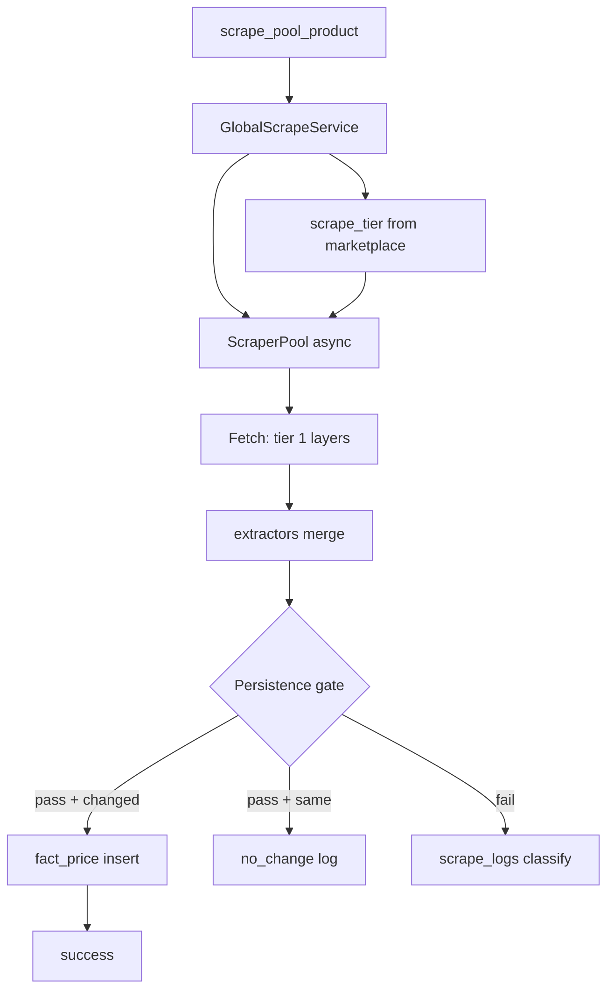
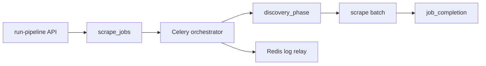
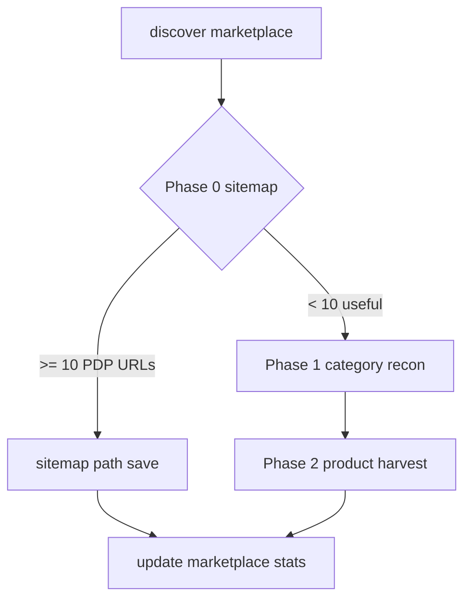

# Imperecta — Парсинг и сбор данных

**Актуально на:** 2026-06-07 (head `e2369b8`; WIP: `020`, γ-orchestrator O1–O3)  
**Область:** discovery, scrape, extraction, pipeline, admin control plane, persistence.

---

## 1. Канонический runtime path

```text
Celery tasks.py
    → discovery.py / GlobalScrapeService (service.py)
        → ScraperPool (scraper_pool.py)
            → extractors.py
```

**Нет `engine.py`.** Все fetch+extract только через `ScraperPool`.

---

## 2. Файловая карта

```
backend/app/modules/scraper/
├── tasks.py
├── discovery.py
├── service.py              # GlobalScrapeService + quality gates
├── scraper_pool.py
├── extractors.py
├── proxy_manager.py
├── api.py                  # NOT in main.py
└── pipeline/
    ├── orchestrator.py
    ├── discovery_phase.py
    ├── job_completion.py
    ├── metadata_store.py
    ├── cancellation.py
    ├── activity_pulse.py
    ├── worker_log_relay.py
    └── child_aggregation.py      # O3: aggregate child discovery jobs

backend/app/modules/admin/
├── api_parsing.py
└── parsing_admin.py
```

---

## 3. Celery tasks

| Task | Purpose |
|------|---------|
| `discover_all_marketplaces` | All active MP |
| `discover_single_marketplace` | One UUID (standalone) |
| `discover_one_marketplace` | **O2 (WIP):** one child `ScrapeJob` per MP; `acks_late`, 900s budget |
| `run_full_pipeline_test` | Admin full pipeline (monolithic orchestrator today) |
| `scrape_all_pool_products` | Batch stale listings (full pool, no `marketplace_codes`) |
| `scrape_pool_product` | Single listing (120s/150s limits) |
| `check_pool_completeness` | Missing price/image |
| `reap_orphan_jobs` | Beat: fail stuck `running` scrape_jobs (SIGTERM/deploy) |

**Beat** (`scheduler.py`): `orphan-job-reaper` (300s), partitions daily, MV refresh hourly, cleanup 03:00. **Discovery/scrape cron off** — manual via admin API.

**Pool query:** respects `is_active=true`; deactivated listings skipped.

---

## 4. Full pipeline orchestrator

**Class:** `FullPipelineOrchestrator`  
**Entry:** `run_full_pipeline_test` Celery task  
**Context:** `pipeline_worker_log_relay(parent_job_id)` wraps run

### Stages

| Stage | Work |
|-------|------|
| dispatching | Job queued, Celery accepted |
| discovery | `run_discovery_phase(marketplace_codes?)` |
| scrape | `_run_scrape_all_pool(marketplace_codes?)` → `GlobalScrapeService` per listing |
| persist / complete | `complete_pipeline_job` |

**Scoped run:** `marketplace_codes` из metadata ограничивает и discovery, и scrape (`JOIN dim_marketplace.marketplace_code`). Standalone `scrape_all_pool_products` — без scope, весь active pool.

### Metadata (`PipelineMetadataStore`)

Stored in `scrape_jobs.config["metadata"]`:

- `current_stage`, `last_activity_at`, `celery_task_id`
- `marketplace_codes` optional filter
- `discovery_errors` (max 20)
- `timings`, `summary`, `per_marketplace[]`

`activity_pulse` updates heartbeat during long phases.

### Cancellation

- `is_pipeline_job_cancelled` between phases
- Admin `POST /cancel-active-job` + Celery revoke
- Error token `pipeline_job_cancelled` in discovery_errors

### Stale detection (admin service)

On API read: jobs idle >30 min (running), >5 min (queued), >10 min (dispatch) → auto-failed with `stale_pipeline_timeout` in metadata.

### Orphan job reaper (`reaper_tasks.py`, `e2369b8`)

Внешний reaper (Celery Beat, 300s) — complement Z1 in-process reap:

| Job type | Порог |
|----------|--------|
| `discovery` | 900s budget + 300s grace |
| `full_pipeline_test` | heartbeat stale 600s |
| прочие | 3600s max runtime |

Помечает `status=failed` зависшие `running` после Railway SIGTERM / worker loss.

### γ-orchestrator foundation (WIP, не в `e2369b8`)

| Шаг | Компонент | Суть |
|-----|-----------|------|
| O1 | migration `020`, `ScrapeJob.parent_job_id` | Self-FK + index `(parent_job_id, status)` |
| O1 | `discover(..., parent_job_id?, inner_job?)` | Child job pre-created as `pending` or legacy insert |
| O2 | `discover_one_marketplace(child_job_id)` | Celery child; idempotent skip terminal; resume `running` |
| O3 | `aggregate_discovery_children(parent_id)` | `{mp_id: per_marketplace}` для `complete_pipeline_job` |

Monolithic `FullPipelineOrchestrator` + `run_discovery_phase` **пока** основной prod path; tick-dispatch в orchestrator — следующий шаг.

### Admin pipeline status API

`GET /api/admin/parsing/pipeline-status` — running → latest terminal → idle; `partial` → frontend `completed` (`_to_frontend_status`). UI: `PipelineStatusPanel` + `usePipelineStatus` (5s).

---

## 5. Worker log relay

| Constant | Value |
|----------|-------|
| Redis key | `pipeline:worker_deploy_log` |
| Max lines | 500 |
| Loggers | `app.modules.scraper`, `celery.*` |
| Line max len | 480 chars |

**API:** `GET /worker-log-relay?after=&limit=&job_id=`  
- Filters lines by `job_id` when provided  
- Response `visible_lines: 3`  

**Frontend:** `WorkerLogRelayPanel` — 2s poll, cursor buffer 120 lines.

---

## 6. Discovery (`discovery.py`)

### 6.1 Общий поток `discover()`

**Сигнатура:** `discover(marketplace, *, deadline_monotonic=None, parent_job_id=None, inner_job=None)` — cooperative deadline (Level 3).

1. Inner `scrape_jobs` (`job_type=discovery`): insert `running` (legacy) или promote `inner_job` из `pending` (γ-orchestrator, `parent_job_id`).
2. Quota: `product_quota` / `discovery_no_quota_limit`.
3. **Phase 0** sitemap (budget 300 s) → если ≥10 PDP URLs → **sitemap path** с resumable save.
4. Иначе **category path**: Phase 1 recon + Phase 2 harvest (convergence streak).
5. Статусы: `completed`, `partial`, `partial_budget`, `error`, `no_categories`.
6. Обновляет `last_discovery_*`, `products_in_pool`, `sitemap_resume_offset`, inner job.

### 6.1a Universal timeout policy (три уровня)

| Level | Константа | Значение | Действие |
|-------|-----------|----------|----------|
| 1 | `SITEMAP_PHASE_BUDGET_SECONDS` | 300 s (5 min) | `wait_for` на Phase 0 → fall through к category path, cooldown 24 h |
| 2 | `SAVE_BUDGET_HEADROOM_FRACTION` | 0.85 | `_headroom_deadline()` — 85% оставшегося MP-budget на Phase 2 / sitemap save; 15% — finalize |
| 3 | `DISCOVERY_PER_MARKETPLACE_BUDGET_SECONDS` | 900 s (15 min) | `deadline_monotonic` в `discover()`; cooperative exit → `partial_budget` |

**Cooldown sitemap timeout:** `SITEMAP_TIMEOUT_COOLDOWN_HOURS = 24` (дольше bad-harvest 1 h).

### 6.1b Resumable sitemap save (`4bad080`, migration `016`)

Большие sitemap (49k+ URL) не укладываются в 15 min. Механизм:

1. `dim_marketplace.sitemap_resume_offset` (INTEGER, default 0) — абсолютный индекс в списке PDP URLs.
2. `_save_product_urls(urls, start_offset, deadline_monotonic)` → `(new_count, next_offset, exhausted_budget)`.
3. Commit каждые `SAVE_PRODUCT_URLS_BATCH_SIZE` (500); deadline проверяется **после** commit, не mid-flush.
4. При `exhausted_budget` и `next_offset < len(batch)` → `sitemap_resume_offset = next_offset`, status `partial_budget`.
5. При полном проходе → `sitemap_resume_offset = 0`.
6. `_should_run_sitemap_harvest`: `True` если offset > 0 (продолжить даже при fresh harvest timestamp).

Следующий pipeline run продолжает с offset; dedup через `url_hash` / `existing_hashes`.

### 6.1c Phase 2 cooperative deadline (`4d42623`)

Category crawl получил тот же cooperative budget, что и sitemap save:

1. **`_headroom_deadline(deadline_monotonic)`** — статический helper; уменьшает hard deadline на `SAVE_BUDGET_HEADROOM_FRACTION` (0.85). Вызывается в `discover()` **один раз** перед Phase 2 / sitemap save; внутри фаз deadline **не** сжимается повторно.
2. **`_phase2_product_harvest(..., deadline_monotonic)`** → `(total_saved, exhausted_budget)`.
3. Проверки deadline: перед каждой category URL; перед каждой pagination page; после `_save_product_urls` если `save_exhausted`.
4. При `exhausted=True` → `discover()` ставит `partial_budget` (как при незавершённом sitemap offset).
5. Логи: `discovery_phase2_budget_exhausted`, `discovery_phase2_converged` (convergence — отдельный early exit).

**Итог:** `partial_budget` возможен и на **sitemap path** (offset), и на **category path** (Phase 2 не дошёл до конца). Следующий pipeline run продолжает с того же marketplace (offset или category crawl).

### 6.2 Phase 0 — content-aware sitemap (`_phase0_sitemap_harvest`)

```text
fetch_sitemap_candidates(base_url)     # ScraperPool: robots, XML, nested index
        ↓
_filter_urls_by_role(raw_urls)        # classify_page_role_for_discovery per URL (or sample)
        ↓
only role == 'product' → save path
```

**Константы:**

| Constant | Value | Role |
|----------|-------|------|
| `SITEMAP_STALE_DAYS` | 3 | Cooldown между harvest |
| `SITEMAP_MIN_USEFUL_URLS` | 10 | Порог «успешного» sitemap |
| `SITEMAP_FULL_CLASSIFY_LIMIT` | 100 | Полная классификация всех URL |
| `SITEMAP_SAMPLE_SIZE` | 50 | Размер sample для больших sitemap |
| `SITEMAP_TRUST_THRESHOLD` | 0.80 | ≥80% sample = product → trust all URLs |
| `SITEMAP_REJECT_THRESHOLD` | 0.20 | <20% sample = product → reject bulk |
| `SITEMAP_CLASSIFY_CONCURRENCY` | 8 | Semaphore на HTTP classify |
| `SITEMAP_BAD_HARVEST_RETRY_HOURS` | 1 | Повтор при плохом harvest вместо 3d cooldown |

**Bad harvest:** `last_sitemap_harvest_at` сдвигается так, чтобы retry через ~1h; `sitemap_url` не обновляется.

**Fetch sitemap XML** (`scraper_pool.fetch_sitemap_candidates`):

- `robots.txt` → `Sitemap:` lines  
- Fallback paths: `/sitemap.xml`, `/sitemap_index.xml`, …  
- Static fetch + `_looks_like_sitemap_xml`; Playwright render fallback  
- Caps: `SITEMAP_MAX_SUBFILES`, `SITEMAP_MAX_URLS` (extractors)

### 6.3 Schema-aware classifier (`classify_page_role_for_discovery`)

**Используется в discovery** (sitemap, BFS) **и в scrape** (`merge_and_finalize` — gate перед merge extractors). Отдельная функция от structural `classify_page_role`.

**Четыре слоя (по убыванию надёжности):**

| Layer | Signal | Mapping |
|-------|--------|---------|
| 1 | Open Graph `og:type` | `product` / `product.group` / `product.item` → **product**; `website` → **hub**; `article` / `blog` / `news` → **listing**; иное → layer 2 |
| 2 | JSON-LD root `@type` only | `Product`, `IndividualProduct`, `ProductModel` → **product** (побеждает Breadcrumb на PDP); `CollectionPage`, `ItemList`, `SearchResultsPage`, `Article`, … → **listing**; `WebPage`, `AboutPage`, … → **hub** |
| 2.5 | HTML5 Microdata top-level `itemtype` (`5d6d4fa`) | `_get_microdata_toplevel_types` — только itemscope без внешнего itemscope-родителя; Product → **product**; ItemList/OfferCatalog → **listing** |
| 3 | Fallback | `classify_page_role()` — DOM repetition + price density |

**Зачем отдельная функция:** на реальном PDP блок «похожие товары» даёт repeated-DOM сигнал listing; structural classifier ошибочно отбрасывал PDP. Слои 1–2 опираются на явную разметку автора сайта, не на grid.

**Helpers:** `_get_og_type`, `_get_jsonld_root_types` (только top-level `@type`, не nested offers/rating).

### 6.3b `merge_and_finalize` и PDP gate

Перед merge результатов extractors вызывается `classify_page_role_for_discovery(soup, page_url)`:

- `listing` / `hub` → log `merge_skipped_non_pdp_page`, возврат пустого `ExtractedProduct` (цена не пишется).
- `product` / `unknown` → обычный merge JSON-LD / meta / selectors.

**Проблема, которую решает:** structural `classify_page_role` на PDP с 6+ карточками «похожие товары» давал `listing` → 0% `prices_saved`.

### 6.3c `classify_page_role` (structural fallback only)

| Role | Сигналы |
|------|---------|
| `product` | JSON-LD Product; 1–5 prices, нет product grid |
| `listing` | ItemList/OfferCatalog; repeated DOM + prices |
| `hub` | Нет цен, нет grid |
| `unknown` | Inconclusive |

Только Layer 3 внутри `classify_page_role_for_discovery` (после Layer 2.5 microdata).

**Тесты:** `test_schema_aware_discovery.py` — og:product, og:website, og:article, JSON-LD Product + Breadcrumb, microdata Product, plain fallback.

### 6.4 Phase 1 — category recon (`_phase1_category_recon`)

- BFS depth ≤ `RECON_BFS_MAX_DEPTH` (3) от `base_url`.
- Каждая страница: `classify_page_role_for_discovery` (не structural-only).
- Hub/unknown → follow internal links; `listing` → save category URL.
- Fallback seeds: `/catalog`, `/categories`, `/shop`, …
- Пишет `discovered_category_urls`, `last_category_recon_at`.
- Stale: `CATEGORY_RECON_STALE_DAYS` = 7.

### 6.5 Phase 2 — product harvest (`_phase2_product_harvest`)

- Сигнатура: `(marketplace, category_urls, *, deadline_monotonic=None) → (total_saved, exhausted_budget)`.
- До `MAX_CATEGORY_URLS_PER_RUN` (60) category URLs.
- До `MAX_PAGES_PER_CATEGORY` (50) pagination (`detect_next_page`).
- Links: `extract_links_from_repeated_structure` → fallback `extract_product_links`.
- PDP links сохраняются через `_save_product_urls` с тем же cooperative deadline.
- **Cooperative budget (`4d42623`):** deadline проверяется между category/page; `exhausted_budget=True` → parent `partial_budget`.
- **Convergence (`3309259`):** `CATEGORY_CONVERGENCE_STREAK = 3` — после 3 подряд category без новых PDP → early exit (`discovery_phase2_converged`).

### 6.6 Persistence

- `DimProduct` + `FactListing` per new `url_hash`.
- `_save_product_urls`: batch commit 500; resumable offset + cooperative deadline (§6.1b).
- Updates `dim_marketplace.last_discovery_*`, `products_in_pool`, `sitemap_resume_offset`.

### 6.7 Limits (Settings)

- `discovery_max_pages_per_run` (5000)  
- `discovery_no_quota_limit` (200000)

---

## 7. Универсальность (no store-specific code)

- Нет hardcoded extractors под отдельные домены (Kaspi, Allegro, …).
- `fact_search_trend.source` — только `google_trends`, `amazon_trends`, `custom` (migration 013).
- Тесты: `test_pipeline_scoped_marketplaces` вместо named-store focus tests.
- Discovery/scrape опираются на `scraper_config` JSONB и schema-aware / structural heuristics.
- Unit tests: `test_schema_aware_discovery.py`, `test_discovery_unit.py`.

---

## 8. Fetch layer и tiered strategy (`scraper_pool.py`)

### 8.1 Политика `scrape_tier`

Порядок fetch-слоёв задаёт **`_layer_order(requires_js, scrape_tier)`**, не хардкод по `marketplace.code`.

| Tier | Layers (planned) | Runtime |
|------|------------------|---------|
| **1** | **httpx → decodo → playwright** (`requires_js`: httpx → playwright → decodo) | Active |
| **2** | + network interception, basic stealth | `NotImplementedError` |
| **3** | + full stealth, residential sticky, LLM fallback | `NotImplementedError` |

- `_SUPPORTED_SCRAPE_TIERS = {1}` — единственный рабочий tier.  
- Tier ∉ `{1,2,3}` → `ValueError`.  
- Tier 2 или 3 → `NotImplementedError` (fail loud, no silent tier-1 fallback).

**Прокидывание tier:** `GlobalScrapeService` читает `DimMarketplace.scrape_tier` → `scrape_product(..., scrape_tier=...)`. Discovery static fetch тоже принимает `scrape_tier` (default 1).

**Миграция:** `014_marketplace_scrape_tier` — column + CHECK + index на `dim_marketplace`.

### 8.2 Tier 1 layer order (httpx-first, `b6610ea`)

| `requires_js` | Order |
|---------------|-------|
| false | httpx → decodo → playwright |
| true | httpx → playwright → decodo |

httpx-first снижает расход Decodo на SSR-страницах; Decodo — после неудачи httpx.

### 8.3 Guards

- `MAX_VALID_PRICE = 9_999_999_999.99`  
- Derived flags: `is_partial`, `is_empty`, `fields_extracted`, `fields_missing`

---

## 9. Extraction (`extractors.py`)

**Universal only** — no per-marketplace hardcoded parsers.

| Priority | Source |
|----------|--------|
| 0 | PDP gate — `classify_page_role_for_discovery` in `merge_and_finalize` |
| 1 | JSON-LD Product/Offer |
| 2 | Meta / OpenGraph |
| 3 | Config selectors |
| 4 | Heuristics |
| 5 | Merge fill gaps |

`parse_price_text` — EU/US decimal separators.

---

## 10. Persistence — `GlobalScrapeService`

**Sync Session** in Celery. Async pool via `_run_coro_in_worker` (ThreadPoolExecutor if loop already running).

### Constants

| Name | Value |
|------|-------|
| `LISTING_DEACTIVATE_AFTER_ERRORS` | 15 |
| `MAX_CURRENCY_RAW_LEN` | 50 |
| `_MAX_ABS_PRICE_CHANGE_PCT` | 9_999.9999 |

### Success path

1. Clear `last_error`, `consecutive_errors=0`  
2. Enrich `dim_product.name` from title if placeholder  
3. Evaluate **persistence gate** (below)  
4. If gate pass + values changed → delete same-day `fact_price`, insert new row (+ `discount_pct` via `_calculate_discount_pct` from original vs current price, `4338e5c`), update `last_price_changed_at`  
5. If gate pass + unchanged → `no_change`, update `last_checked_at` only  
6. Write `scrape_logs`

### Failure path

- Increment `consecutive_errors`, set `last_error`  
- At 15 errors → `is_active=false`, log `LISTING_DEACTIVATED`  
- `scrape_logs` with classified status

### Persistence gate (all required for `fact_price`)

```
product_name_ok  := product_name OR title
price_ok         := price > 0
currency_ok      := currency non-empty
currency_raw_sane:= len(currency_raw) < 50
currency_country := currency in marketplace whitelist
```

Whitelist sources:

- `dim_country.currency_code` for MP country  
- Always `EUR`, `USD`  
- `dim_marketplace.currency_code`  
- `scraper_config.allowed_currencies[]`

**On gate fail:**

- `currency_raw` too long → skip price, log `parse_error`  
- currency not in whitelist → skip price, log `parse_error`  
- missing name/currency → skip, log `missing_critical_data` / warnings  

Structured logs: `EXTRACTED_DATA`, `PERSISTENCE_GATE`, `PRICE_UNCHANGED`, `fact_price write`, `pool_scrape_done`.

**Partition prerequisite:** `date_id` for today must fall into an existing `fact_price_YYYYMM` partition (or `fact_price_default`) — see migration `015` and `ensure_fact_price_partitions`.

### `no_change` logic

`_should_skip_price_record`: compares price (±0.001), currency (case-insensitive), stock to `listing.last_*`.  
If skip: no `fact_price` insert; status `no_change`.

### Log status mapping (`_determine_log_status`)

Maps errors to: `technical_error`, `parse_error`, `price_not_found`, `not_found`, `captcha`, `blocked`, `timeout`, `missing_critical_data`, `success`.

Special: price parsed without currency → `missing_critical_data` + `price_parsed_no_currency` warning.

### DB drift repair

On insert failure:

- Widens `scrape_logs.status` to VARCHAR(50)  
- Recreates CHECK with full status tuple  

---

## 11. `scrape_logs` statuses

| Status | When |
|--------|------|
| `success` | Price snapshot written |
| `no_change` | Scrape OK, values unchanged |
| `missing_critical_data` | Empty/partial extract |
| `price_not_found` | Title OK, no price |
| `parse_error` | Gate fail (currency_raw / whitelist) |
| `technical_error` | Unhandled exception / overflow |
| `blocked`, `captcha`, `timeout`, `not_found`, `error` | Fetch/classify |

---

## 12. Admin API summary

Base: `/api/admin/parsing` (superuser)

| Action | Endpoint |
|--------|----------|
| Start | `POST /run-pipeline` `{ marketplace_codes?: string[] }` |
| Cancel | `POST /cancel-active-job` |
| Monitor | `GET /active-job`, `/job-status/{id}`, `/job-live-feed/{id}` |
| Logs | `GET /worker-log-relay` |
| History | `GET /pipeline-runs?limit=` |
| MP picker | `GET /marketplaces-detailed?page&page_size` |

---

## 13. Frontend monitoring

**`DataCollectionTab`:**

- `RUNS_LIMIT = 10` history  
- `STALE_ACTIVITY_SECONDS = 300` UI warning  
- Poll: active 4s, status 2s, feed 3s  
- Recharts: scrape status pie, per-MP bar, throughput timeline  
- Scoped run via marketplace checkboxes + clear selection  

**`AdminPage` Users tab** — not parsing engine, but same admin surface for ops.

---

## 14. DB migrations (parsing-related)

| Rev | Change |
|-----|--------|
| 005 | `technical_error` column |
| 006 | status VARCHAR(50) |
| 010 | discovery universal columns |
| 011 | `is_active`, `last_price_changed_at`, `no_change` |
| 012 | RLS (security, not scrape logic) |
| 013 | `fact_search_trend.source` generic |
| 014 | `dim_marketplace.scrape_tier` 1–3 |
| 015 | `fact_price` monthly 2026-06…12 + DEFAULT partition |
| 016 | `dim_marketplace.sitemap_resume_offset` |
| 017 | `recon_frontier_state` JSONB — resumable Phase 1 BFS |
| 018 | `category_resume_index` — resumable Phase 2 |
| 019 | `scrape_jobs.status` + `'partial'` (**head tracked**) |
| 020 | `scrape_jobs.parent_job_id` — γ-orchestrator (**WIP**, не в Git) |

---

## 15. Diagrams

### Single listing scrape



### Full pipeline



---

### Discovery phases



---

## 16. Contracts

| Type | Fields (key) |
|------|----------------|
| `PoolScrapeResult` | success, data, scraper_layer, duration_ms, error, is_partial, is_empty, missing_fields |
| `DiscoveryResult` | marketplace_id, status, counters, errors, method |
| `ExtractedProduct` | title, price, currency, currency_raw, price_raw_text, image_url, … |

---

## 17. Operations checklist

1. Beat уже включает **reaper + infra only** — не добавлять discovery/scrape cron без approval.  
2. Full pipeline on prod — confirm marketplace scope.  
3. Watch `consecutive_errors` and deactivated listings.  
4. After deploy: `alembic upgrade head` (tracked `019`; WIP `020` после коммита) **and** verify Beat runs `ensure_fact_price_partitions`.  
5. If `fact_price` INSERT fails with `no partition found` — missing monthly partition or need `fact_price_default` from `015`.  
6. If scrape_logs INSERT fails on old DB — first scrape may trigger auto-repair ALTER.  
7. Monitor Redis relay size (500 lines cap) during long runs.  
8. Do not set `scrape_tier` to 2 or 3 until `_SUPPORTED_SCRAPE_TIERS` includes them — listings will fail with `NotImplementedError`.

---

## 18. Детальная логика элементов

Формат описания: **где живёт** → **назначение** → **триггеры** → **входы/выходы** → **алгоритм** → **связи** → **edge cases**.

> **Важно про Z1:** логика **Z1 reap** (очистка zombie inner discovery jobs) — **`discovery_phase.py`**, блок `except asyncio.TimeoutError`. **Не** в `cancellation.py` / `job_completion.py`. С `4bad080` основной budget — **cooperative** `deadline_monotonic` внутри `discover()`; Z1 остаётся **defense-in-depth** для внешних отмен (SIGTERM, OOM, worker shutdown).

### 18.1 Z1 reap — zombie inner discovery jobs

| | |
|---|---|
| **Где живёт** | `backend/app/modules/scraper/pipeline/discovery_phase.py` → `run_discovery_phase()`, блок `except asyncio.TimeoutError` |
| **Назначение** | Пометить «осиротевшие» inner `scrape_jobs` (`job_type='discovery'`, `status='running'`) как `failed`, когда `discover()` прерван внешне до финализации |
| **Триггер (редкий)** | `asyncio.TimeoutError` — внешний cancel / edge case; нормальный budget → cooperative `partial_budget` + finalize inner job |

**Проблема без Z1:** при жёсткой отмене mid-flight финальный блок `discover()` не выполняется → inner job остаётся `running`.

**Алгоритм (reap):**

1. Лог `discovery_marketplace_skipped` с `reason=timeout_budget`.
2. `errors.append(f"marketplace_{id}_timeout")`.
3. **SQL UPDATE** (raw `text()`):
   - `scrape_jobs` WHERE `job_type='discovery' AND marketplace_id=:mp_id AND status='running'`
   - SET `status='failed'`, `completed_at=now`, `duration_ms` от `started_at`.
4. Обновить `dim_marketplace`: `last_discovery_status='timeout_skipped'`, `last_discovery_at=now`.
5. Сдвинуть `last_sitemap_harvest_at` на `now - (SITEMAP_STALE_DAYS - SITEMAP_TIMEOUT_COOLDOWN_HOURS)` → retry sitemap через 24 h (не 3 d).
6. `db.commit()` (rollback + log при ошибке commit).
7. Записать seed в `per_marketplace` со `status='timeout_skipped'`, `errors_count=1`.
8. **Продолжить** следующий marketplace (не abort всего pipeline).

**Связи:** `FullPipelineOrchestrator` → `run_discovery_phase()`. Дополняет **batch save** + **`sitemap_resume_offset`** (`016`) — прогресс переживает budget и cancel.

**Edge cases:** committed batches + offset durable; `partial_budget` status в per_marketplace; parent pipeline продолжает следующие MP.

---

### 18.2 `cancellation.py` — проверка отмены parent job

| | |
|---|---|
| **Где живёт** | `backend/app/modules/scraper/pipeline/cancellation.py` |
| **Функции** | `is_pipeline_job_cancelled(db, job_id)`, `revoke_celery_task(celery_task_id)` |

**`is_pipeline_job_cancelled`:**

- Загружает `ScrapeJob` по `job_id`.
- Job отсутствует → `True` (abort).
- `job_type != full_pipeline_test` → `False` (не admin pipeline).
- Иначе: `ParsingAdminService._normalize_job_status(job.status) != "running"` → `True`.

**Использование:** `discovery_phase` проверяет **перед каждым marketplace**; при cancel → `errors.append("pipeline_job_cancelled")`, `break`.

**`revoke_celery_task`:** best-effort `celery_app.control.revoke(..., terminate=True, SIGTERM)`. Вызывается из `ParsingAdminService.cancel_active_pipeline_job` и `_fail_stale_running_pipeline_jobs`.

**Не делает:** не reap inner jobs, не финализирует metadata — это другие модули.

---

### 18.3 `job_completion.py` — финализация parent pipeline job

| | |
|---|---|
| **Где живёт** | `backend/app/modules/scraper/pipeline/job_completion.py` → `complete_pipeline_job()` |
| **Вызывается из** | `orchestrator.py` (success, cancel, exception paths) |

**Входы:** `discovery_ms`, `scrape_ms`, `persist_ms`, `per_marketplace_seed` (dict из discovery), опционально `hard_error`.

**Алгоритм:**

1. Агрегировать `scrape_logs` по `marketplace_id` для `scrape_job_id == job.id`: `prices_saved` (status=success), `errors_count` (status≠success).
2. Merge seed + log stats в `per_marketplace[]`; если `errors_count > 0` и status≠running → status MP = `failed`.
3. Добавить MP из logs, отсутствующие в seed (orphan stats).
4. Sum `listings_created`, `prices_saved`, `errors_count`; `total_ms = discovery + scrape + persist`.
5. Обновить metadata: `current_stage` = `completed` или `failed`, `timings`, `summary`, `per_marketplace`, опционально `error` (truncate 2000).
6. Записать `job.completed_at`, `duration_ms`, counters, `job.status`, `job.config = {"metadata": ...}`, commit.

**Edge cases:** при `hard_error="pipeline_job_cancelled"` scrape_ms=0; при exception в orchestrator — traceback в `error`.

---

### 18.4 `orchestrator.py` — `FullPipelineOrchestrator`

| | |
|---|---|
| **Где живёт** | `backend/app/modules/scraper/pipeline/orchestrator.py` |
| **Entry** | Celery `run_full_pipeline_test` → `runner.run(parent_job_id)` |

**Алгоритм:**

1. Context `pipeline_worker_log_relay(parent_job_id)` — Redis relay + log handlers.
2. Async session: load job, записать `celery_task_id`, `marketplace_codes` filter, `touch(stage=discovery)`.
3. `run_discovery_phase(...)` → seed + errors; если `pipeline_job_cancelled` в errors → `hard_error`, skip scrape.
4. Иначе sync `_run_scrape_all_pool(scrape_job_id, marketplace_codes)` (отдельный sync session в worker).
5. `touch(stage=persist)` → `complete_pipeline_job(...)`.
6. Exception → log + `complete_pipeline_job` с traceback.

**Сессии:** discovery — async; scrape — sync (greenlet-safe); completion — async again.

---

### 18.5 `metadata_store.py` — `PipelineMetadataStore`

| | |
|---|---|
| **Где живёт** | `backend/app/modules/scraper/pipeline/metadata_store.py` |

| Метод | Логика |
|-------|--------|
| `extract(config)` | `config["metadata"]` или `_build_initial_metadata()` |
| `load()` | `(ScrapeJob, metadata)` |
| `save(job, metadata, status?)` | `job.config = {"metadata": deepcopy}`, `flag_modified`, commit |
| `touch(job, metadata, stage?, extra?)` | `last_activity_at`, optional `current_stage`, merge `extra`, save |
| `marketplace_codes_filter(metadata)` | list[str] или None |

**Контракт JSONB:** единственный источник progress для admin UI polling.

---

### 18.6 `activity_pulse.py` — heartbeat во время long stages

| | |
|---|---|
| **Где живёт** | `backend/app/modules/scraper/pipeline/activity_pulse.py` |

| Функция | Контекст |
|---------|----------|
| `pulse_job_activity_sync` | Scrape loop в `_run_scrape_all_pool_impl` |
| `pulse_job_activity_async` | Discovery / orchestrator async |
| `discovery_activity_callback` | Hook `DiscoveryCrawler.on_activity` |

**Логика:** всегда `push_relay_line` в Redis; Postgres update только если `should_pulse_db` (≥15 s с прошлого pulse, или `force_db=True`). Обновляет `last_activity_at`, `current_stage`, append `worker_log_tail` (max 20 строк).

**Зачем:** предотвращает false-positive `stale_pipeline_timeout` при длинном scrape без SQL writes.

---

### 18.7 `worker_log_relay.py` — Redis log buffer

| | |
|---|---|
| **Где живёт** | `backend/app/modules/scraper/pipeline/worker_log_relay.py` |
| **Redis key** | `pipeline:worker_deploy_log` (+ `:seq` counter) |

| Функция | Логика |
|---------|--------|
| `pipeline_worker_log_relay(job_id)` | Context manager: bind `_active_job_id`, attach `PipelineWorkerLogHandler` к loggers `app.modules.scraper`, `celery.*` |
| `push_relay_line` | JSON `{seq, at, line, job_id}`, rpush + ltrim 500 |
| `fetch_relay_lines(after, limit)` | Filter seq > after, sort, return cursor |
| `should_pulse_db` | Rate-limit DB heartbeats 15 s |

**Admin read:** `ParsingAdminService.get_worker_log_relay` → API `GET /worker-log-relay`.

---

### 18.8 `discovery_phase.py` — обёртка discovery для pipeline

Помимо Z1 reap (§18.1):

1. SELECT active `dim_marketplace` (optional `marketplace_code IN (...)`), order by code.
2. Init metadata counters: `discovery_marketplace_total/done`, `discovery_current_domain`.
3. Loop: cancel check → touch → `discover(mp, deadline_monotonic=now+900s)` → `_map_discovery_status` (вкл. `partial_budget`).
4. После каждого MP: update `per_marketplace` + summary в metadata.
5. Return `(per_marketplace dict, errors list)`.

**Отличие от standalone `discover_all_marketplaces`:** cooperative deadline, parent metadata, cancel checks, Z1 safety net.

---

### 18.9 `DiscoveryCrawler.discover()` — inner discovery job

| | |
|---|---|
| **Где живёт** | `backend/app/modules/scraper/discovery.py` → `discover()` |

**Алгоритм:**

1. Inner job: legacy path — insert `ScrapeJob(discovery, running)`; γ-orchestrator — reuse `inner_job` (`pending`→`running`) with `parent_job_id` (`020` WIP).
2. Quota: `remaining = quota - pool_count` или `discovery_no_quota_limit` если quota=0.
3. **Phase 0** (if stale sitemap): `_phase0_sitemap_harvest` с budget `SITEMAP_PHASE_BUDGET_SECONDS`; timeout → cooldown 24h, fall through.
4. Если ≥ `SITEMAP_MIN_USEFUL_URLS` (10) PDP → **sitemap path**: `_save_product_urls(batch, deadline=_headroom_deadline(...))`; offset / `partial_budget`.
5. Иначе **category path**: Phase 1 recon (if stale) → Phase 2 harvest с `_headroom_deadline` + convergence + `exhausted_budget`.
6. Finalize inner job status, `dim_marketplace.last_discovery_*`, `products_in_pool`, commit.

**При hard cancel mid-flight (Z1):** шаг 6 **не выполняется** → reap в `discovery_phase`.

---

### 18.10 `_save_product_urls` — batched + resumable persistence

| | |
|---|---|
| **Где живёт** | `discovery.py` → `_save_product_urls()` |
| **Константы** | `SAVE_PRODUCT_URLS_BATCH_SIZE = 500`; `SAVE_BUDGET_HEADROOM_FRACTION = 0.85` |

**Сигнатура:** `(urls, *, start_offset=0, deadline_monotonic=None) → (new_count, next_offset, exhausted_budget)`.

**Алгоритм:** slice `urls[start_offset:]` → dedup `url_hash` → batch commit 500 → после commit проверить deadline → при exhausted вернуть absolute index для resume.

**Зачем:** large sitemap + 15 min budget; offset в `dim_marketplace.sitemap_resume_offset` (migration `016`).

**Trade-off:** intermediate commits flush pending session state (documented in code).

---

### 18.11 `_run_scrape_all_pool` — batch scrape

| | |
|---|---|
| **Где живёт** | `backend/app/modules/scraper/tasks.py` |

**Selection:** `is_active=true` AND (`last_checked_at IS NULL` OR `< now-6h`); optional JOIN `marketplace_code IN (...)`.

**Loop:** batches до `scrape_pool_max_listings_per_run` (200k), batch size `scrape_pool_batch_size` (1000). Каждый listing → `GlobalScrapeService.scrape_product(lid)` sync. Pulse каждые 10 listings + force на batch start/end/errors.

**Return:** `{queued, scraped_ok, scraped_failed, error?}`.

---

### 18.12 `ParsingAdminService._fail_stale_running_pipeline_jobs`

| | |
|---|---|
| **Где живёт** | `backend/app/modules/admin/parsing_admin.py` |
| **Вызывается** | На каждом read: active job, status, runs, trigger, cancel |

**Idle detection:** max(`metadata.last_activity_at`, last `scrape_logs.created_at`, `started_at`).

**Timeouts:**

| Stage / condition | Minutes |
|-------------------|---------|
| running + discovery/scrape/persist or celery_task_id | 30 |
| queued, no celery id | 5 |
| dispatching, no celery id | 10 |
| else | 10 |

При превышении: `revoke_celery_task`, `status=failed`, metadata `error=stale_pipeline_timeout: idle_for_seconds=…`.

**Отличие от Z1:** stale — **parent** `full_pipeline_test`; Z1 — **inner** `discovery` jobs.

---

### 18.13 Admin cancel flow

1. `POST /cancel-active-job` → `_fail_stale` → SELECT latest running `full_pipeline_test`.
2. `revoke_celery_task(metadata.celery_task_id)`.
3. Parent job → `status=failed`, metadata `current_stage=failed`, error `pipeline_cancelled_by_admin`.
4. Discovery loop видит `is_pipeline_job_cancelled` → abort с token `pipeline_job_cancelled`.
5. Orchestrator → `complete_pipeline_job(hard_error=...)`.

---

### 18.14 `GlobalScrapeService.scrape_product` (краткая логика)

См. §10; ключевые шаги: load listing+MP → `ScraperPool.scrape_product(scrape_tier, requires_js)` → `merge_and_finalize` (PDP gate) → persistence gate → `fact_price` / `no_change` / deactivate @15 errors → `scrape_logs`.

---

### 18.15 `classify_page_role_for_discovery` (краткая логика)

См. §6.3; Layer 1 og:type → Layer 2 JSON-LD → Layer 2.5 microdata → Layer 3 structural. Используется в sitemap filter, BFS recon, **`merge_and_finalize`** при scrape.

---

### 18.16 `reap_orphan_jobs` — внешний reaper (`e2369b8`)

| | |
|---|---|
| **Где живёт** | `backend/app/workers/reaper_tasks.py` |
| **Расписание** | Celery Beat `orphan-job-reaper`, каждые 300 s |
| **Назначение** | Пометить `failed` зависшие `scrape_jobs` со `status='running'` после deploy SIGTERM / потери воркера |

**Пороги:** `discovery` — 900s budget + 300s grace; `full_pipeline_test` — heartbeat stale 600s; прочие — 3600s max runtime.

**Отличие от Z1:** Z1 — inner `discovery` jobs при `TimeoutError` в `discovery_phase`; reaper — любые типы job'ов, внешний periodic scan.

---

## 19. Источники

| Component | Path |
|-----------|------|
| Tasks | `backend/app/modules/scraper/tasks.py` |
| Service / gates | `backend/app/modules/scraper/service.py` |
| Pool | `backend/app/modules/scraper/scraper_pool.py` |
| Extractors + classifier | `backend/app/modules/scraper/extractors.py` |
| Schema-aware tests | `backend/tests/test_scraper_unit/test_schema_aware_discovery.py` |
| Tiered scrape tests | `backend/tests/test_scraper_unit/test_tiered_scrape_strategy.py` |
| Discovery phase + Z1 | `backend/app/modules/scraper/pipeline/discovery_phase.py` |
| Child aggregation (O3) | `backend/app/modules/scraper/pipeline/child_aggregation.py` |
| Reaper | `backend/app/workers/reaper_tasks.py` |
| Relay | `backend/app/modules/scraper/pipeline/worker_log_relay.py` |
| Admin | `backend/app/modules/admin/api_parsing.py`, `parsing_admin.get_pipeline_status` |
| UI | `DataCollectionTab.tsx`, `PipelineStatusPanel.tsx`, `usePipelineStatus` |

Связанные документы: `Imperecta_Architecture.md`, `Imperecta_Backend.md`, `Imperecta_Database.md`, `.cursor/rules/scraper.mdc`.
