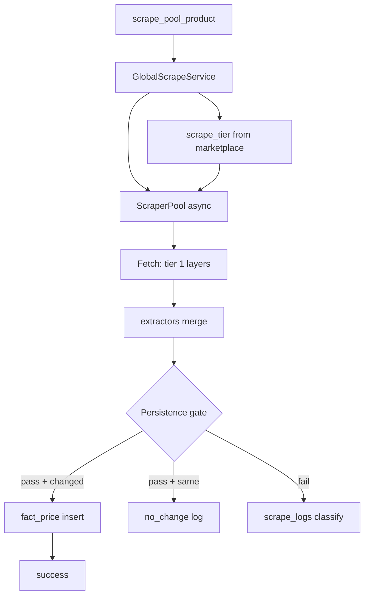
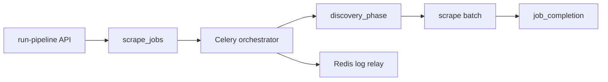
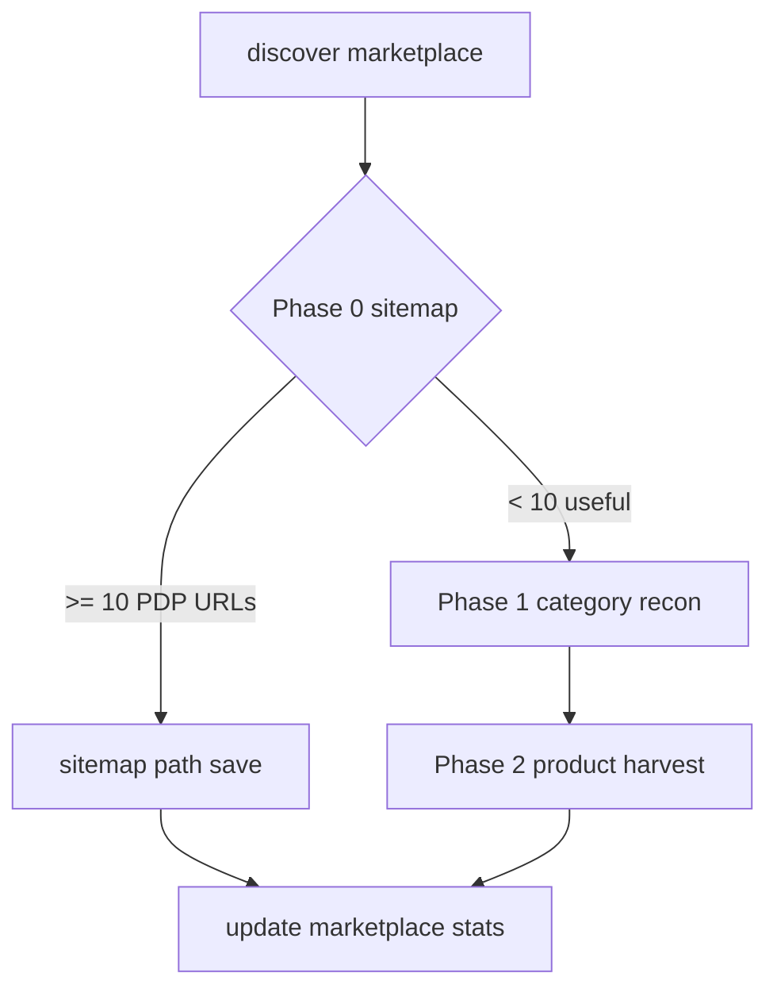

# Imperecta — Парсинг и сбор данных

**Актуально на:** 2026-06-05 (head `3d1eb66`)  
**Область:** discovery, scrape, extraction, pipeline, admin control plane, persistence.

---

## 1. Канонический runtime path

```text
Celery tasks.py
    → discovery.py / GlobalScrapeService (service.py)
        → ScraperPool (scraper_pool.py)
            → extractors.py
```

**Нет `engine.py`.** Все fetch+extract только через `ScraperPool`.

---

## 2. Файловая карта

```
backend/app/modules/scraper/
├── tasks.py
├── discovery.py
├── service.py              # GlobalScrapeService + quality gates
├── scraper_pool.py
├── extractors.py
├── proxy_manager.py
├── api.py                  # NOT in main.py
└── pipeline/
    ├── orchestrator.py
    ├── discovery_phase.py
    ├── job_completion.py
    ├── metadata_store.py
    ├── cancellation.py
    ├── activity_pulse.py
    └── worker_log_relay.py

backend/app/modules/admin/
├── api_parsing.py
└── parsing_admin.py
```

---

## 3. Celery tasks

| Task | Purpose |
|------|---------|
| `discover_all_marketplaces` | All active MP |
| `discover_single_marketplace` | One UUID |
| `run_full_pipeline_test` | Admin full pipeline |
| `scrape_all_pool_products` | Batch stale listings (full pool, no `marketplace_codes`) |
| `scrape_pool_product` | Single listing (120s/150s limits) |
| `check_pool_completeness` | Missing price/image |

**Beat:** `{}` — no scheduled scrape.

**Pool query:** respects `is_active=true`; deactivated listings skipped.

---

## 4. Full pipeline orchestrator

**Class:** `FullPipelineOrchestrator`  
**Entry:** `run_full_pipeline_test` Celery task  
**Context:** `pipeline_worker_log_relay(parent_job_id)` wraps run

### Stages

| Stage | Work |
|-------|------|
| dispatching | Job queued, Celery accepted |
| discovery | `run_discovery_phase(marketplace_codes?)` |
| scrape | `_run_scrape_all_pool(marketplace_codes?)` → `GlobalScrapeService` per listing |
| persist / complete | `complete_pipeline_job` |

**Scoped run:** `marketplace_codes` из metadata ограничивает и discovery, и scrape (`JOIN dim_marketplace.marketplace_code`). Standalone `scrape_all_pool_products` — без scope, весь active pool.

### Metadata (`PipelineMetadataStore`)

Stored in `scrape_jobs.config["metadata"]`:

- `current_stage`, `last_activity_at`, `celery_task_id`
- `marketplace_codes` optional filter
- `discovery_errors` (max 20)
- `timings`, `summary`, `per_marketplace[]`

`activity_pulse` updates heartbeat during long phases.

### Cancellation

- `is_pipeline_job_cancelled` between phases
- Admin `POST /cancel-active-job` + Celery revoke
- Error token `pipeline_job_cancelled` in discovery_errors

### Stale detection (admin service)

On API read: jobs idle >30 min (running), >5 min (queued), >10 min (dispatch) → auto-failed with `stale_pipeline_timeout` in metadata.

---

## 5. Worker log relay

| Constant | Value |
|----------|-------|
| Redis key | `pipeline:worker_deploy_log` |
| Max lines | 500 |
| Loggers | `app.modules.scraper`, `celery.*` |
| Line max len | 480 chars |

**API:** `GET /worker-log-relay?after=&limit=&job_id=`  
- Filters lines by `job_id` when provided  
- Response `visible_lines: 3`  

**Frontend:** `WorkerLogRelayPanel` — 2s poll, cursor buffer 120 lines.

---

## 6. Discovery (`discovery.py`)

### 6.1 Общий поток `discover()`

1. Создаётся `scrape_jobs` (`job_type=discovery`).
2. Учитывается **quota** (`product_quota`) и `discovery_no_quota_limit`.
3. **Sitemap path** — если Phase 0 вернул ≥ `SITEMAP_MIN_USEFUL_URLS` (10) PDP URLs.
4. Иначе **category path** — Phase 1 recon (при stale) + Phase 2 harvest.
5. Обновляет `last_discovery_*`, `products_in_pool`, статус job.

### 6.2 Phase 0 — content-aware sitemap (`_phase0_sitemap_harvest`)

```text
fetch_sitemap_candidates(base_url)     # ScraperPool: robots, XML, nested index
        ↓
_filter_urls_by_role(raw_urls)        # classify_page_role_for_discovery per URL (or sample)
        ↓
only role == 'product' → save path
```

**Константы:**

| Constant | Value | Role |
|----------|-------|------|
| `SITEMAP_STALE_DAYS` | 3 | Cooldown между harvest |
| `SITEMAP_MIN_USEFUL_URLS` | 10 | Порог «успешного» sitemap |
| `SITEMAP_FULL_CLASSIFY_LIMIT` | 100 | Полная классификация всех URL |
| `SITEMAP_SAMPLE_SIZE` | 50 | Размер sample для больших sitemap |
| `SITEMAP_TRUST_THRESHOLD` | 0.80 | ≥80% sample = product → trust all URLs |
| `SITEMAP_REJECT_THRESHOLD` | 0.20 | <20% sample = product → reject bulk |
| `SITEMAP_CLASSIFY_CONCURRENCY` | 8 | Semaphore на HTTP classify |
| `SITEMAP_BAD_HARVEST_RETRY_HOURS` | 1 | Повтор при плохом harvest вместо 3d cooldown |

**Bad harvest:** `last_sitemap_harvest_at` сдвигается так, чтобы retry через ~1h; `sitemap_url` не обновляется.

**Fetch sitemap XML** (`scraper_pool.fetch_sitemap_candidates`):

- `robots.txt` → `Sitemap:` lines  
- Fallback paths: `/sitemap.xml`, `/sitemap_index.xml`, …  
- Static fetch + `_looks_like_sitemap_xml`; Playwright render fallback  
- Caps: `SITEMAP_MAX_SUBFILES`, `SITEMAP_MAX_URLS` (extractors)

### 6.3 Schema-aware classifier (`classify_page_role_for_discovery`)

**Используется в discovery** (sitemap, BFS) **и в scrape** (`merge_and_finalize` — gate перед merge extractors). Отдельная функция от structural `classify_page_role`.

**Три слоя (по убыванию надёжности):**

| Layer | Signal | Mapping |
|-------|--------|---------|
| 1 | Open Graph `og:type` | `product` / `product.group` / `product.item` → **product**; `website` → **hub**; `article` / `blog` / `news` → **listing**; иное → layer 2 |
| 2 | JSON-LD root `@type` only | `Product`, `IndividualProduct`, `ProductModel` → **product** (побеждает Breadcrumb на PDP); `CollectionPage`, `ItemList`, `SearchResultsPage`, `Article`, … → **listing**; `WebPage`, `AboutPage`, … → **hub** |
| 3 | Fallback | `classify_page_role()` — DOM repetition + price density |

**Зачем отдельная функция:** на реальном PDP блок «похожие товары» даёт repeated-DOM сигнал listing; structural classifier ошибочно отбрасывал PDP. Слои 1–2 опираются на явную разметку автора сайта, не на grid.

**Helpers:** `_get_og_type`, `_get_jsonld_root_types` (только top-level `@type`, не nested offers/rating).

### 6.3b `merge_and_finalize` и PDP gate

Перед merge результатов extractors вызывается `classify_page_role_for_discovery(soup, page_url)`:

- `listing` / `hub` → log `merge_skipped_non_pdp_page`, возврат пустого `ExtractedProduct` (цена не пишется).
- `product` / `unknown` → обычный merge JSON-LD / meta / selectors.

**Проблема, которую решает:** structural `classify_page_role` на PDP с 6+ карточками «похожие товары» давал `listing` → 0% `prices_saved`.

### 6.3c `classify_page_role` (structural fallback only)

| Role | Сигналы |
|------|---------|
| `product` | JSON-LD Product; 1–5 prices, нет product grid |
| `listing` | ItemList/OfferCatalog; repeated DOM + prices |
| `hub` | Нет цен, нет grid |
| `unknown` | Inconclusive |

Только Layer 3 внутри `classify_page_role_for_discovery`.

**Тесты:** `test_schema_aware_discovery.py` — og:product, og:website, og:article, JSON-LD Product + Breadcrumb, plain fallback.

### 6.4 Phase 1 — category recon (`_phase1_category_recon`)

- BFS depth ≤ `RECON_BFS_MAX_DEPTH` (3) от `base_url`.
- Каждая страница: `classify_page_role_for_discovery` (не structural-only).
- Hub/unknown → follow internal links; `listing` → save category URL.
- Fallback seeds: `/catalog`, `/categories`, `/shop`, …
- Пишет `discovered_category_urls`, `last_category_recon_at`.
- Stale: `CATEGORY_RECON_STALE_DAYS` = 7.

### 6.5 Phase 2 — product harvest (`_phase2_product_harvest`)

- До `MAX_CATEGORY_URLS_PER_RUN` (60) category URLs.
- До `MAX_PAGES_PER_CATEGORY` (50) pagination (`detect_next_page`).
- Links: `extract_links_from_repeated_structure` → fallback `extract_product_links`.
- Excludes `/list/`, `/category/`, `/catalog/`, `/search` in product link extractor.

### 6.6 Persistence

- `DimProduct` + `FactListing` per new `url_hash`.
- Flush per URL batch in `_save_product_urls` (no 50-batch in current path — per-URL flush when new).
- Updates `dim_marketplace.last_discovery_*`, `products_in_pool`.

### 6.7 Limits (Settings)

- `discovery_max_pages_per_run` (5000)  
- `discovery_no_quota_limit` (200000)

---

## 7. Универсальность (no store-specific code)

- Нет hardcoded extractors под отдельные домены (Kaspi, Allegro, …).
- `fact_search_trend.source` — только `google_trends`, `amazon_trends`, `custom` (migration 013).
- Тесты: `test_pipeline_scoped_marketplaces` вместо named-store focus tests.
- Discovery/scrape опираются на `scraper_config` JSONB и schema-aware / structural heuristics.
- Unit tests: `test_schema_aware_discovery.py`, `test_discovery_unit.py`.

---

## 8. Fetch layer и tiered strategy (`scraper_pool.py`)

### 8.1 Политика `scrape_tier`

Порядок fetch-слоёв задаёт **`_layer_order(requires_js, scrape_tier)`**, не хардкод по `marketplace.code`.

| Tier | Layers (planned) | Runtime |
|------|------------------|---------|
| **1** | **httpx → decodo → playwright** (`requires_js`: httpx → playwright → decodo) | Active |
| **2** | + network interception, basic stealth | `NotImplementedError` |
| **3** | + full stealth, residential sticky, LLM fallback | `NotImplementedError` |

- `_SUPPORTED_SCRAPE_TIERS = {1}` — единственный рабочий tier.  
- Tier ∉ `{1,2,3}` → `ValueError`.  
- Tier 2 или 3 → `NotImplementedError` (fail loud, no silent tier-1 fallback).

**Прокидывание tier:** `GlobalScrapeService` читает `DimMarketplace.scrape_tier` → `scrape_product(..., scrape_tier=...)`. Discovery static fetch тоже принимает `scrape_tier` (default 1).

**Миграция:** `014_marketplace_scrape_tier` — column + CHECK + index на `dim_marketplace`.

### 8.2 Tier 1 layer order (httpx-first, `b6610ea`)

| `requires_js` | Order |
|---------------|-------|
| false | httpx → decodo → playwright |
| true | httpx → playwright → decodo |

httpx-first снижает расход Decodo на SSR-страницах; Decodo — после неудачи httpx.

### 8.3 Guards

- `MAX_VALID_PRICE = 9_999_999_999.99`  
- Derived flags: `is_partial`, `is_empty`, `fields_extracted`, `fields_missing`

---

## 9. Extraction (`extractors.py`)

**Universal only** — no per-marketplace hardcoded parsers.

| Priority | Source |
|----------|--------|
| 0 | PDP gate — `classify_page_role_for_discovery` in `merge_and_finalize` |
| 1 | JSON-LD Product/Offer |
| 2 | Meta / OpenGraph |
| 3 | Config selectors |
| 4 | Heuristics |
| 5 | Merge fill gaps |

`parse_price_text` — EU/US decimal separators.

---

## 10. Persistence — `GlobalScrapeService`

**Sync Session** in Celery. Async pool via `_run_coro_in_worker` (ThreadPoolExecutor if loop already running).

### Constants

| Name | Value |
|------|-------|
| `LISTING_DEACTIVATE_AFTER_ERRORS` | 15 |
| `MAX_CURRENCY_RAW_LEN` | 50 |
| `_MAX_ABS_PRICE_CHANGE_PCT` | 9_999.9999 |

### Success path

1. Clear `last_error`, `consecutive_errors=0`  
2. Enrich `dim_product.name` from title if placeholder  
3. Evaluate **persistence gate** (below)  
4. If gate pass + values changed → delete same-day `fact_price`, insert new row, update `last_price_changed_at`  
5. If gate pass + unchanged → `no_change`, update `last_checked_at` only  
6. Write `scrape_logs`

### Failure path

- Increment `consecutive_errors`, set `last_error`  
- At 15 errors → `is_active=false`, log `LISTING_DEACTIVATED`  
- `scrape_logs` with classified status

### Persistence gate (all required for `fact_price`)

```
product_name_ok  := product_name OR title
price_ok         := price > 0
currency_ok      := currency non-empty
currency_raw_sane:= len(currency_raw) < 50
currency_country := currency in marketplace whitelist
```

Whitelist sources:

- `dim_country.currency_code` for MP country  
- Always `EUR`, `USD`  
- `dim_marketplace.currency_code`  
- `scraper_config.allowed_currencies[]`

**On gate fail:**

- `currency_raw` too long → skip price, log `parse_error`  
- currency not in whitelist → skip price, log `parse_error`  
- missing name/currency → skip, log `missing_critical_data` / warnings  

Structured logs: `EXTRACTED_DATA`, `PERSISTENCE_GATE`, `PRICE_UNCHANGED`, `fact_price write`, `pool_scrape_done`.

**Partition prerequisite:** `date_id` for today must fall into an existing `fact_price_YYYYMM` partition (or `fact_price_default`) — see migration `015` and `ensure_fact_price_partitions`.

### `no_change` logic

`_should_skip_price_record`: compares price (±0.001), currency (case-insensitive), stock to `listing.last_*`.  
If skip: no `fact_price` insert; status `no_change`.

### Log status mapping (`_determine_log_status`)

Maps errors to: `technical_error`, `parse_error`, `price_not_found`, `not_found`, `captcha`, `blocked`, `timeout`, `missing_critical_data`, `success`.

Special: price parsed without currency → `missing_critical_data` + `price_parsed_no_currency` warning.

### DB drift repair

On insert failure:

- Widens `scrape_logs.status` to VARCHAR(50)  
- Recreates CHECK with full status tuple  

---

## 11. `scrape_logs` statuses

| Status | When |
|--------|------|
| `success` | Price snapshot written |
| `no_change` | Scrape OK, values unchanged |
| `missing_critical_data` | Empty/partial extract |
| `price_not_found` | Title OK, no price |
| `parse_error` | Gate fail (currency_raw / whitelist) |
| `technical_error` | Unhandled exception / overflow |
| `blocked`, `captcha`, `timeout`, `not_found`, `error` | Fetch/classify |

---

## 12. Admin API summary

Base: `/api/admin/parsing` (superuser)

| Action | Endpoint |
|--------|----------|
| Start | `POST /run-pipeline` `{ marketplace_codes?: string[] }` |
| Cancel | `POST /cancel-active-job` |
| Monitor | `GET /active-job`, `/job-status/{id}`, `/job-live-feed/{id}` |
| Logs | `GET /worker-log-relay` |
| History | `GET /pipeline-runs?limit=` |
| MP picker | `GET /marketplaces-detailed?page&page_size` |

---

## 13. Frontend monitoring

**`DataCollectionTab`:**

- `RUNS_LIMIT = 10` history  
- `STALE_ACTIVITY_SECONDS = 300` UI warning  
- Poll: active 4s, status 2s, feed 3s  
- Recharts: scrape status pie, per-MP bar, throughput timeline  
- Scoped run via marketplace checkboxes + clear selection  

**`AdminPage` Users tab** — not parsing engine, but same admin surface for ops.

---

## 14. DB migrations (parsing-related)

| Rev | Change |
|-----|--------|
| 005 | `technical_error` column |
| 006 | status VARCHAR(50) |
| 010 | discovery universal columns |
| 011 | `is_active`, `last_price_changed_at`, `no_change` |
| 012 | RLS (security, not scrape logic) |
| 013 | `fact_search_trend.source` generic |
| 014 | `dim_marketplace.scrape_tier` 1–3 |
| 015 | `fact_price` monthly 2026-06…12 + DEFAULT partition |

---

## 15. Diagrams

### Single listing scrape



### Full pipeline



---

### Discovery phases



---

## 16. Contracts

| Type | Fields (key) |
|------|----------------|
| `PoolScrapeResult` | success, data, scraper_layer, duration_ms, error, is_partial, is_empty, missing_fields |
| `DiscoveryResult` | marketplace_id, status, counters, errors, method |
| `ExtractedProduct` | title, price, currency, currency_raw, price_raw_text, image_url, … |

---

## 17. Operations checklist

1. Do not enable Celery beat without approval.  
2. Full pipeline on prod — confirm marketplace scope.  
3. Watch `consecutive_errors` and deactivated listings.  
4. After deploy: `alembic upgrade head` (includes `015`) **and** run or schedule `ensure_fact_price_partitions`.  
5. If `fact_price` INSERT fails with `no partition found` — missing monthly partition or need `fact_price_default` from `015`.  
6. If scrape_logs INSERT fails on old DB — first scrape may trigger auto-repair ALTER.  
7. Monitor Redis relay size (500 lines cap) during long runs.  
8. Do not set `scrape_tier` to 2 or 3 until `_SUPPORTED_SCRAPE_TIERS` includes them — listings will fail with `NotImplementedError`.

---

## 18. Источники

| Component | Path |
|-----------|------|
| Tasks | `backend/app/modules/scraper/tasks.py` |
| Service / gates | `backend/app/modules/scraper/service.py` |
| Pool | `backend/app/modules/scraper/scraper_pool.py` |
| Extractors + classifier | `backend/app/modules/scraper/extractors.py` |
| Schema-aware tests | `backend/tests/test_scraper_unit/test_schema_aware_discovery.py` |
| Tiered scrape tests | `backend/tests/test_scraper_unit/test_tiered_scrape_strategy.py` |
| Orchestrator | `backend/app/modules/scraper/pipeline/orchestrator.py` |
| Relay | `backend/app/modules/scraper/pipeline/worker_log_relay.py` |
| Admin | `backend/app/modules/admin/api_parsing.py` |
| UI | `frontend/src/components/admin/DataCollectionTab.tsx` |

Связанные документы: `Imperecta_Architecture.md`, `Imperecta_Backend.md`, `Imperecta_Database.md`, `.cursor/rules/scraper.mdc`.
