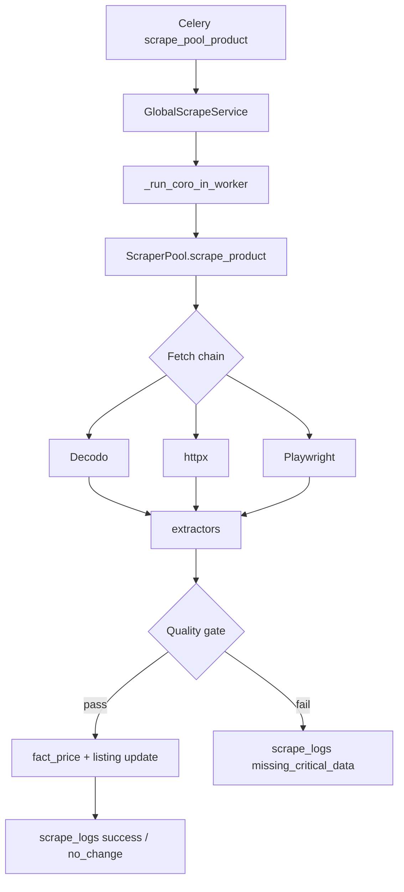
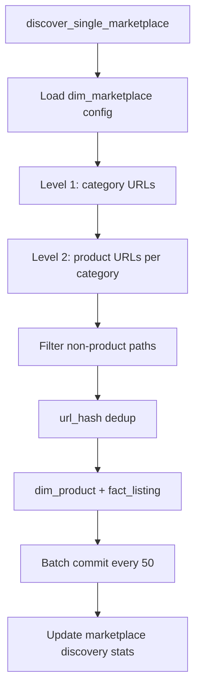

# Imperecta — Парсинг и сбор данных (Parsing)

**Актуально на:** 2026-05-28  
**Область:** discovery, scrape, extraction, pipeline orchestration, admin control plane, persistence.

---

## 1. Назначение

Подсистема parsing собирает товарные данные с e-commerce маркетплейсов:

1. **Discovery** — находит URL товаров, создаёт `dim_product` + `fact_listing`.
2. **Scrape** — загружает страницу, извлекает поля, обновляет listing и пишет историю в `fact_price`.
3. **Orchestration** — admin full pipeline: discovery → scrape → completion в одном parent job.
4. **Observability** — `scrape_logs`, metadata job, Redis worker log relay, live feed в UI.

**Канонический runtime path (нет `engine.py`):**

```text
tasks.py → discovery.py / service.py → scraper_pool.py → extractors.py
```

---

## 2. Карта файлов

```
backend/app/modules/scraper/
├── tasks.py                 # Celery entrypoints
├── discovery.py             # 2-level URL discovery
├── service.py               # GlobalScrapeService (sync persist)
├── scraper_pool.py          # Fetch + extract facade
├── extractors.py            # Universal extraction
├── proxy_manager.py         # Proxy rotation
├── api.py                   # Legacy admin scrape API (not in main.py)
└── pipeline/
    ├── orchestrator.py      # FullPipelineOrchestrator
    ├── discovery_phase.py   # run_discovery_phase
    ├── job_completion.py      # complete_pipeline_job
    ├── metadata_store.py      # PipelineMetadataStore (JSONB)
    ├── cancellation.py        # cancel checks, revoke celery
    ├── activity_pulse.py      # heartbeat → metadata
    └── worker_log_relay.py    # Redis relay for admin UI
```

**Admin API:** `backend/app/modules/admin/api_parsing.py`  
**Admin service:** `backend/app/modules/admin/parsing_admin.py`

---

## 3. Celery tasks

| Task | Trigger | Поведение |
|------|---------|-----------|
| `discover_all_marketplaces` | Manual / internal | Все `dim_marketplace.is_active` |
| `discover_single_marketplace` | UUID marketplace | Один marketplace |
| `run_full_pipeline_test` | `POST /admin/parsing/run-pipeline` | `FullPipelineOrchestrator.run(job_id)` |
| `scrape_all_pool_products` | Batch | Stale listings по `last_checked_at` / interval |
| `scrape_pool_product` | Single listing_id | soft 120s / hard 150s |
| `check_pool_completeness` | Maintenance | Listings без price/image |

**Beat:** `beat_schedule = {}` — автоматический cron **выключен**.

---

## 4. Full pipeline orchestrator

**Класс:** `FullPipelineOrchestrator` (`pipeline/orchestrator.py`)

### 4.1 Этапы

| Stage | Действие |
|-------|----------|
| `dispatching` | Job создан, Celery принят |
| `discovery` | `run_discovery_phase` — URLs → listings |
| `scrape` | Batch scrape listings (pool service) |
| `persist` | Финализация counters |
| `completed` / `failed` | `complete_pipeline_job` |

### 4.2 Metadata store

`PipelineMetadataStore` читает/пишет JSONB в `scrape_jobs.config`:

- `stage`, `celery_task_id`
- `marketplace_codes` filter (optional scoped run)
- `discovery_errors` (top 20)
- per-marketplace seed stats
- `last_activity_at` — для stale warning в UI (>300s)
- timings: discovery_ms, scrape_ms, persist_ms

`activity_pulse.pulse_job_activity_sync` — обновление heartbeat во время long operations.

### 4.3 Worker log relay

**Context manager:** `pipeline_worker_log_relay(parent_job_id)`

- Пишет tail deploy/worker logs в Redis: ключ семейства `pipeline:worker_deploy_log`
- Admin UI: `GET /api/admin/parsing/worker-log-relay?after=&job_id=&limit=`
- Frontend: `WorkerLogRelayPanel` — cursor pagination, 2s poll

### 4.4 Отмена

- `cancellation.is_pipeline_job_cancelled(job_id)` — проверки между фазами
- `POST /admin/parsing/cancel-active-job` — revoke Celery + job status
- Ошибка `pipeline_job_cancelled` в discovery_errors → early complete

---

## 5. Discovery

**Файл:** `discovery.py`

### 5.1 Двухуровневая модель

| Level | Действие |
|-------|----------|
| 1 | Category URLs: homepage links, sitemap, configured patterns |
| 2 | Product URLs из каждой category page |

### 5.2 Создание сущностей

Для каждого валидного product URL:

1. `DimProduct` — placeholder если новый
2. `FactListing` — `url_hash` dedup (`ON CONFLICT` / lookup by hash)
3. Batch commit каждые **50** записей с rollback recovery

### 5.3 Фильтрация URL

`extract_product_links` исключает:

- `/list/`, `/category/`, `/catalog/`, `/search`, pagination noise

### 5.4 Конфиг marketplace

Из `dim_marketplace` (migration `010` — universal columns):

- CSS/XPath selectors
- sitemap URL
- category URL patterns
- `requires_js` → влияет на fetch priority

### 5.5 Обновление marketplace stats

После run: `last_discovery_at`, `products_in_pool`, error counters.

### 5.6 Лимиты

Settings:

- `discovery_max_pages_per_run`
- `discovery_no_quota_limit` — bypass quota для admin test

---

## 6. Scrape: ScraperPool

**Файл:** `scraper_pool.py`  
**Единственный facade** fetch + extract. Все scrape paths идут через `ScraperPool.scrape_product`.

### 6.1 Fetch priority

| Order | Layer | Когда |
|-------|-------|-------|
| 1 | Decodo API | По умолчанию |
| 2 | httpx | Static HTML |
| 3 | Playwright | JS-heavy |

Если `requires_js=True` на marketplace → **Playwright выше httpx**.

`proxy_manager.py` — sticky sessions, country routing из Settings.

### 6.2 Результат: `PoolScrapeResult`

Поля: `success`, `url`, `data`, `scraper_layer`, `duration_ms`, `error`, `is_partial`, `is_empty`, `fields_extracted`, `fields_missing`.

---

## 7. Extraction

**Файл:** `extractors.py`  
**Принцип:** universal — без hardcode под конкретный marketplace.

### 7.1 Priority merge

1. JSON-LD (`Product`, `Offer`)
2. OpenGraph / meta tags
3. Custom selectors из `scraper_config`
4. Auto-detect heuristics (price blocks, title h1, etc.)
5. Merge strategy — заполнение пропусков из следующего слоя

### 7.2 Price parsing

`parse_price_text` — locale-aware `,` и `.` (EU/US formats).

### 7.3 Guards

- `MAX_VALID_PRICE = 9_999_999_999.99`
- price ≤ 0 или > max → discarded (None)

### 7.4 Extracted fields

`ExtractedProduct`: `title`, `price`, `currency`, images, rating, etc.  
**Нет** поля `in_stock` на dataclass — используется `getattr` safe chain в service.

---

## 8. Persistence: GlobalScrapeService

**Файл:** `service.py`  
**Сессия:** sync (`sync_session_factory`) — вызывается из Celery.

### 8.1 Async bridge

```text
scrape_product(listing_id):
  sync session open
  result = _run_coro_in_worker(ScraperPool.scrape_product(url, config))
  persist result
  commit
```

### 8.2 On success

- Clear `listing.last_error`, `consecutive_errors = 0`
- Update denormalized `last_*` на `fact_listing`
- **fact_price insert** только при quality gate (name, price>0, currency)
- Update `dim_product.name` from title if product_name empty
- `last_price_changed_at` если цена изменилась
- `scrape_logs.status = success` или `no_change`

### 8.3 On failure

- `consecutive_errors += 1`
- `last_error` = message
- `scrape_logs` с соответствующим status (`blocked`, `captcha`, `parse_error`, …)

### 8.4 Technical errors

Unhandled exception в task → `_persist_technical_error_log` → status `technical_error`, поле `technical_error` TEXT.

### 8.5 Logging markers

| Log prefix | Момент |
|------------|--------|
| `EXTRACTED →` | Raw extractor output |
| `FINAL PERSIST` | Values before commit |
| `SCRAPE COMPLETE listing_id=…` | After commit |
| `pool_scrape done` | Task end |

---

## 9. scrape_logs statuses

| Status | Смысл |
|--------|-------|
| `success` | Данные извлечены и persisted |
| `no_change` | Scrape OK, цена/ключевые поля без изменений |
| `error` | Generic failure |
| `timeout` | Fetch timeout |
| `blocked` | HTTP block / 403 pattern |
| `captcha` | Captcha detected |
| `not_found` | 404 / gone |
| `price_not_found` | Page OK, price missing |
| `parse_error` | HTML parse failure |
| `missing_critical_data` | Gate failed (no name/price/currency) |
| `technical_error` | Unhandled exception |

Column: `VARCHAR(50)` + CHECK (migrations 005–006, 011).

---

## 10. Admin control plane

**Base:** `/api/admin/parsing` (superuser only)

| Endpoint | UI usage |
|----------|----------|
| `POST /run-pipeline` | Start full/scoped test |
| `GET /active-job` | Block UI when running |
| `GET /job-status/{id}` | Progress bar, stage |
| `GET /job-live-feed/{id}` | Discovery/Scrape charts |
| `GET /worker-log-relay` | Terminal panel |
| `POST /cancel-active-job` | Stop |
| `GET /pipeline-runs` | History table |
| `GET /test-marketplaces` | Marketplace cards |
| `GET /marketplaces-detailed` | Scoped checkboxes |

**Job type:** `full_pipeline_test`  
**Parent table:** `scrape_jobs`  
**Child diagnostics:** `scrape_logs` linked by listing attempts during scrape phase.

---

## 11. Frontend monitoring

**`DataCollectionTab.tsx`:**

- Poll: active job 4s, status 2s, live feed 3s (during scrape)
- Tabs: Discovery | Scrape | Summary
- Stale activity badge: >300s without pulse
- `WorkerLogRelayPanel` only when running

**`WorkerLogRelayPanel.tsx`:**

- Cursor `after` / `next_cursor`, buffer 120 lines, show 3
- `aria-live="polite"`

---

## 12. DB migrations (parsing-critical)

| Migration | Impact |
|-----------|--------|
| 005 | `technical_error` column |
| 006 | status VARCHAR length |
| 010 | discovery universal columns on marketplace |
| 011 | `is_active`, `last_price_changed_at`, `no_change` status |
| 012 | RLS (operational security, not parsing logic) |

---

## 13. Диаграмма: single listing scrape



---

## 14. Диаграмма: discovery



---

## 15. Контракты и типы

- `DiscoveryResult` — marketplace_id, status, timing, counters, errors, method
- `PoolScrapeResult` — см. §6.2
- `ExtractedProduct` — extractor output model

Тесты контрактов: `backend/tests/` (scraper module).

---

## 16. Операционные рекомендации

1. **Не включать beat** без явного решения — массовый scrape/load на prod.
2. Запуск full pipeline — только через admin с пониманием scope (full vs marketplace_codes).
3. Мониторить `consecutive_errors` на listings — маркер блокировок.
4. При блокировках — проверить Decodo/proxy settings, `requires_js` flag.
5. Partition maintenance — убедиться что `ensure_fact_price_partitions` выполнялась (или manual SQL).

---

## 17. Файлы-источники

| Компонент | Путь |
|-----------|------|
| Tasks | `backend/app/modules/scraper/tasks.py` |
| Discovery | `backend/app/modules/scraper/discovery.py` |
| Pool | `backend/app/modules/scraper/scraper_pool.py` |
| Extractors | `backend/app/modules/scraper/extractors.py` |
| Persist | `backend/app/modules/scraper/service.py` |
| Orchestrator | `backend/app/modules/scraper/pipeline/orchestrator.py` |
| Admin API | `backend/app/modules/admin/api_parsing.py` |
| UI | `frontend/src/components/admin/DataCollectionTab.tsx` |
| Cursor rules | `.cursor/rules/scraper.mdc` |

Связанные документы: `Imperecta_Architecture.md`, `Imperecta_Backend.md`, `Imperecta_Database.md`.
