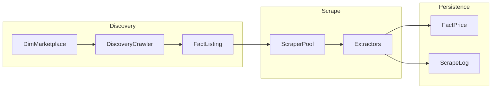

# Imperecta

SaaS competitive intelligence: marketplaces, listings, price history, and scrape observability.

## Data Collection Pipeline

End-to-end flow from marketplace configuration to stored prices and audit logs:

1. **Discovery** — `DiscoveryCrawler` walks marketplace categories/seeds, persists new rows in `fact_listings` (and related dimensions). Configuration lives in `dim_marketplace` (no hardcoded marketplace list in code).
2. **Scrape** — `ScraperPool` fetches HTML with a fixed layer order (Decodo when enabled → httpx → Playwright), then runs universal extractors (JSON-LD → meta → custom selectors → auto-detect) merged in `merge_and_finalize`.
3. **Persistence** — `GlobalScrapeService.scrape_product` applies quality gates (title/name, positive price, currency), upserts `fact_price` for the snapshot date when allowed, updates listing denormalized fields, and **always** inserts `scrape_logs` with a normalized `status` (`success`, `price_not_found`, `missing_critical_data`, `technical_error`, etc.).

Operational entrypoints: Celery tasks `discover_all_marketplaces` / `scrape_all_pool_products`, and admin routes under `/admin` (superuser) for manual triggers.

Database migrations: `backend/alembic` — `alembic upgrade head` applies the full chain including `alembic_meta.alembic_version` (wide `version_num` for long revision ids).
